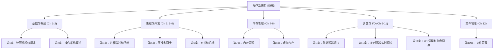

# 操作系统名词解释总览索引

本项目整理了《实用操作系统》课程的核心名词解释，涵盖从硬件基础到文件管理的全部重点知识。

## 知识体系地图

---

## 快速查阅面板

| 文件链接 | 对应教材章节 | 核心知识点 |
| :--- | :--- | :--- |
| [第一章.md](第一章.md) | 第1章：计算机系统概述 | CPU、寄存器、DMA、中断、存储层次 |
| [第二章.md](第二章.md) | 第2章：操作系统概述 | 批处理、多道程序、分时系统、虚存、SMP |
| [第三章.md](第三章.md) | 第3章：进程描述和控制 | 进程映像、PCB、五状态模型、执行模式、挂起 |
| [第四章.md](第四章.md) | **第5章**：并发性（互斥/同步） | 临界区、信号量、管程、生产者-消费者、读写者 |
| [第五章.md](第五章.md) | **第6章**：并发性（死锁/饥饿） | 死锁预防/避免/检测、哲学家就餐、银行家算法 |
| [第六章.md](第六章.md) | **第7章**：内存管理 | 分页、分段、分区、内部/外部碎片、重定位 |
| [第七章.md](第七章.md) | **第8章**：虚拟内存 | 置换算法（LRU, Clock）、工作集、驻留集、抖动 |
| [第八章.md](第八章.md) | **第9章**：单处理器调度 | FCFS、Round-Robin、SPN、Feedback、响应时间 |
| [第九章.md](第九章.md) | **第10章**：多处理器和实时调度 | 确定性、响应时限、硬/软实时、任务分配 |
| [第十章.md](第十章.md) | **第11章**：I/O 管理和磁盘调度 | 逻辑/物理 I/O、SSTF、SCAN、RAID、缓冲技术 |
| [第十一章.md](第十一章.md) | **第12章**：文件管理 | Inode、路径名、文件组织、记录、目录结构 |

> [!TIP]
> **注意：** 文件编号（第四章-第十一章）与实际教材章节（第5章-第12章）存在偏移，请根据上表查询。
