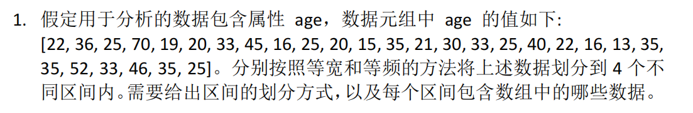
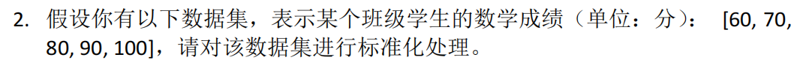
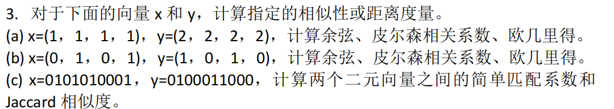
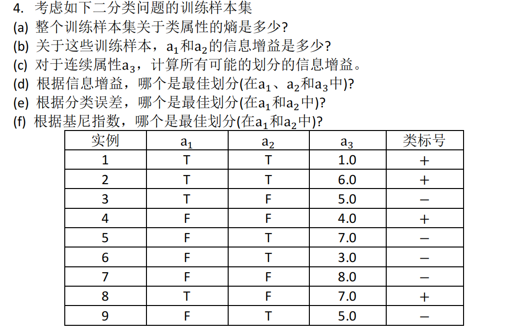
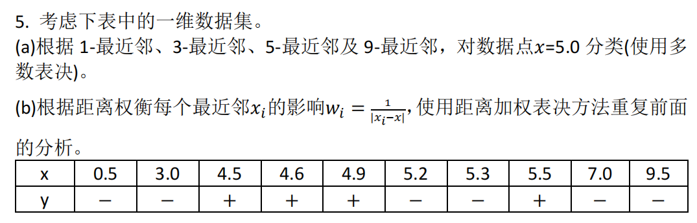

# 数据挖掘作业

## 题一 

### 基础统计
原始 age 样本共有 28 个值，排序后为 13, 15, 16, 16, 19, 20, 20, 21, 22, 22, 25, 25, 25, 25, 30, 33, 33, 33, 35, 35, 35, 35, 36, 40, 45, 46, 52, 70。最小值 13，最大值 70，总跨度 57。

### 等宽分箱
- 分箱数设为 4。
- 区间宽度 = 57 ÷ 4 = 14.25。
- 采用左闭右开，最后一个区间右端点包含最大值，保证所有数据入箱。

| 区间编号 | 范围描述 | 样本个数 | 数据列表 |
| --- | --- | --- | --- |
| 1 | 13 ≤ age < 27.25 | 14 | 13, 15, 16, 16, 19, 20, 20, 21, 22, 22, 25, 25, 25, 25 |
| 2 | 27.25 ≤ age < 41.5 | 10 | 30, 33, 33, 33, 35, 35, 35, 35, 36, 40 |
| 3 | 41.5 ≤ age < 55.75 | 3 | 45, 46, 52 |
| 4 | 55.75 ≤ age ≤ 70 | 1 | 70 |

前两个区间覆盖大部分年轻样本，第三个区间收集四十段数据，第四个区间只包含 70，显示该值是明显的高龄端点。

### 等频分箱
- 排序后，将 28 个值均分为 4 组，每组 7 个值。
- 如遇重复值跨边界，直接按顺序切分，说明该分箱在边界处共享相同取值。

| 区间编号 | 范围描述 | 数据列表 |
| --- | --- | --- |
| 1 | 第 1 至第 7 个值，范围 13 至 20 | 13, 15, 16, 16, 19, 20, 20 |
| 2 | 第 8 至第 14 个值，范围 21 至 25 | 21, 22, 22, 25, 25, 25, 25 |
| 3 | 第 15 至第 21 个值，范围 30 至 35 | 30, 33, 33, 33, 35, 35, 35 |
| 4 | 第 22 至第 28 个值，范围 35 至 70 | 35, 36, 40, 45, 46, 52, 70 |

等频策略保证每个区间拥有相同数量的样本，更易于后续比较累积分布。第四组的 35 与前一组取值相同。

## 题二 

原始数学成绩为 60, 70, 80, 90, 100。

1. 计算均值。总和 400，样本量 5，均值 400 ÷ 5 = 80。
2. 计算标准差。各值与均值差分别为 -20, -10, 0, 10, 20，平方后为 400, 100, 0, 100, 400，求和 1000。采用总体标准差，方差 1000 ÷ 5 = 200，标准差 = √200 ≈ 14.1421。
3. 计算 Z 值。将每个成绩减去 80 再除以 14.1421，结果保留四位小数。

| 原始成绩 | 标准化得分 |
| --- | --- |
| 60 | -1.4142 |
| 70 | -0.7071 |
| 80 | 0 |
| 90 | 0.7071 |
| 100 | 1.4142 |

## 题三 

### 小问 a
向量 x 的四个分量均为 1，向量 y 的四个分量均为 2。点积 8，x 的模长 2，y 的模长 4，因此余弦相似度 8 ÷ (2 × 4) = 1。两组分量没有任何波动，标准差为 0。欧几里得距离为四个差值 -1 的平方和再开方，即 √4 = 2。

### 小问 b
向量 x 为 0, 1, 0, 1，向量 y 为 1, 0, 1, 0。点积 0，两个向量模长都是 √2，余弦相似度 0。均值均为 0.5，差值序列一正一负，协方差 -1，两个方差均为 1，皮尔森相关系数 -1，显示完全负相关。欧几里得距离由四个差值 ±1 组成，平方和 4，距离 2。

### 小问 c
二元向量 x 为 0101010001，y 为 0100011000。逐位比较得到 a = 2（同时为 1），b = 2（x 为 1 y 为 0），c = 1（x 为 0 y 为 1），d = 5（同时为 0）。简单匹配系数 = (a + d) ÷ 10 = 0.7。Jaccard 相似度 = a ÷ (a + b + c) = 2 ÷ 5 = 0.4。

## 题四 

### 数据整理
训练集包含 9 条样本，其中正类 “+” 有 4 条，负类 “−” 有 5 条。为便于度量计算，将 a3 排序后得到取值序列 1.0, 3.0, 4.0, 5.0, 5.0, 6.0, 7.0, 7.0, 8.0，对中间相邻但类标不同的点取阈值。

### (a) 整体熵
\[H(S) = -\tfrac{4}{9}\log_2 \tfrac{4}{9} - \tfrac{5}{9}\log_2 \tfrac{5}{9} = 0.9911\text{ bit}\]

### (b) a1、a2 的信息增益
| 属性 | 分区 | 样本数 | + | − | 分区熵 |
| --- | --- | --- | --- | --- | --- |
| a1=T | 4 | 3 | 1 | 0.8113 |
| a1=F | 5 | 1 | 4 | 0.7219 |
| a2=T | 5 | 2 | 3 | 0.9709 |
| a2=F | 4 | 2 | 2 | 1.0000 |

\[IG(a1) = 0.9911 - \left(\tfrac{4}{9}·0.8113 + \tfrac{5}{9}·0.7219\right) = 0.2294\]
\[IG(a2) = 0.9911 - \left(\tfrac{5}{9}·0.9709 + \tfrac{4}{9}·1.0000\right) = 0.0072\]

### (c) 连续属性 a3 的所有可能划分
阈值取在相邻且类标不同的取值中点，得到 2.0, 3.5, 4.5, 5.5, 6.5, 7.5。逐一计算：

| 阈值 t | 左侧样本 | 左侧熵 | 右侧样本 | 右侧熵 | IG(S, a3≤t) |
| --- | --- | --- | --- | --- | --- |
| 2.0 | 1 个 + | 0 | 8 个(3+,5−) | 0.9544 | 0.1427 |
| 3.5 | 2 个 (+,−) | 1.0000 | 7 个(3+,4−) | 0.9852 | 0.0026 |
| 4.5 | 4 个(2+,2−) | 1.0000 | 5 个(2+,3−) | 0.9709 | 0.0728 |
| 5.5 | 6 个(3+,3−) | 1.0000 | 3 个(+ ,2−) | 0.9183 | 0.0072 |
| 6.5 | 7 个(3+,4−) | 0.9852 | 2 个(+ ,−) | 1.0000 | 0.0183 |
| 7.5 | 8 个(3+,5−) | 0.9544 | 1 个 + | 0 | 0.1022 |

信息增益最大的阈值为 t = 2.0，对应 IG = 0.1427。

### (d) 基于信息增益的最佳划分
比较 IG(a1)=0.2294、IG(a2)=0.0072、IG(a3, t=2.0)=0.1427，可知 a1 最高，故首选 a1。

### (e) 基于分类误差的最佳划分
分类误差率采用 1 − 主类比例。a1 的误差加权结果为 \(\tfrac{4}{9}·0.25 + \tfrac{5}{9}·0.2 = 0.2222\)，a2 为 \(\tfrac{5}{9}·0.4 + \tfrac{4}{9}·0.5 = 0.4444\)。误差更小的 a1 为最佳。

### (f) 基于基尼指数的最佳划分
a1 的加权基尼指数 = \(\tfrac{4}{9}·0.375 + \tfrac{5}{9}·0.32 = 0.3444\)，a2 的加权基尼指数 = \(\tfrac{5}{9}·0.48 + \tfrac{4}{9}·0.5 = 0.4889\)。因此仍由 a1 获得最低基尼值。

## 题五 

原始一维样本点及其类标如下表，测试点设为 x=5.0。

| 样本序号 | x_i | y_i |
| --- | --- | --- |
| 1 | 0.5 | − |
| 2 | 3.0 | − |
| 3 | 4.5 | + |
| 4 | 4.6 | + |
| 5 | 4.9 | + |
| 6 | 5.2 | − |
| 7 | 5.3 | − |
| 8 | 5.5 | + |
| 9 | 7.0 | − |
| 10 | 9.5 | − |

### (a) 多数表决结果
先计算每个点到 x=5.0 的距离并按从近到远排序，得到 4.9(+)、5.2(−)、5.3(−)、4.6(+)、4.5(+)、5.5(+)、3.0(−)、7.0(−)、0.5(−)、9.5(−)。据此得到：
- 1-近邻：由 4.9 提供，类别 +。
- 3-近邻：出现两个负类一个正类，分类结果 −。
- 5-近邻：五个邻居中正类三个，分类结果 +。
- 9-近邻：九个邻居中负类五个，分类结果 −。

### (b) 距离加权表决
使用权值公式 w_i = 1 / |x_i − 5.0|，近邻权重大、远邻权重小。前九个邻居的距离和权值如下。

| 排名 | x_i | y_i | 距离 | 权值 |
| --- | --- | --- | --- | --- |
| 1 | 4.9 | + | 0.1 | 10.000 |
| 2 | 5.2 | − | 0.2 | 5.000 |
| 3 | 5.3 | − | 0.3 | 3.333 |
| 4 | 4.6 | + | 0.4 | 2.500 |
| 5 | 4.5 | + | 0.5 | 2.000 |
| 6 | 5.5 | + | 0.5 | 2.000 |
| 7 | 3.0 | − | 2.0 | 0.500 |
| 8 | 7.0 | − | 2.0 | 0.500 |
| 9 | 0.5 | − | 4.5 | 0.222 |

据此加权投票：
- 1-近邻：仅含 4.9，正类权值 10，大于负类 0，判为 +。
- 3-近邻：正类权值 10，负类权值 8.333，判为 +。
- 5-近邻：正类权值 14.5，负类权值 8.333，判为 +。
- 9-近邻：正类权值 16.5，负类权值 9.555，判为 +。

可以看到距测试点最近的正类对加权结果起主导作用，随着 k 增大加权投票仍维持正类判断。