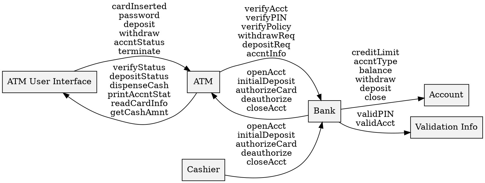

银行应用的类协作图：

### 1\. 结构化语言描述

这是一种基于组件及其交互的文本描述：

**组件：ATM User Interface (ATM 用户界面)**

  * **发送消息给 ATM:**
      * `cardInserted`
      * `password`
      * `deposit`
      * `withdraw`
      * `accntStatus`
      * `terminate`
  * **从 ATM 接收消息:**
      * `verifyStatus`
      * `depositStatus`
      * `dispenseCash`
      * `printAccntStat`
      * `readCardInfo`
      * `getCashAmnt`

**组件：ATM**

  * **从 ATM User Interface 接收消息:**
      * `cardInserted`
      * `password`
      * `deposit`
      * `withdraw`
      * `accntStatus`
      * `terminate`
  * **发送消息给 Bank:**
      * `verifyAcct`
      * `verifyPIN`
      * `verifyPolicy`
      * `withdrawReq`
      * `depositReq`
      * `accntInfo`
  * **从 Bank 接收消息:**
      * `openAcct`
      * `initialDeposit`
      * `authorizeCard`
      * `deauthorize`
      * `closeAcct`
  * **发送消息给 ATM User Interface:**
      * `verifyStatus`
      * `depositStatus`
      * `dispenseCash`
      * `printAccntStat`
      * `readCardInfo`
      * `getCashAmnt`

**组件：Bank (银行)**

  * **从 ATM 接收消息:**
      * `verifyAcct`
      * `verifyPIN`
      * `verifyPolicy`
      * `withdrawReq`
      * `depositReq`
      * `accntInfo`
  * **发送消息给 ATM:**
      * `openAcct`
      * `initialDeposit`
      * `authorizeCard`
      * `deauthorize`
      * `closeAcct`
  * **发送消息给 Account:**
      * `creditLimit`
      * `accntType`
      * `balance`
      * `withdraw`
      * `deposit`
      * `close`
  * **发送消息给 Validation Info:**
      * `validPIN`
      * `validAcct`

**组件：Cashier (出纳员)**

  * **从 Bank 接收消息:**
      * `openAcct`
      * `initialDeposit`
      * `authorizeCard`
      * `deauthorize`
      * `closeAcct`

**组件：Account (账户)**

  * **从 Bank 接收消息:**
      * `creditLimit`
      * `accntType`
      * `balance`
      * `withdraw`
      * `deposit`
      * `close`

**组件：Validation Info (验证信息)**

  * **从 Bank 接收消息:**
      * `validPIN`
      * `validAcct`

-----

### 2\. 代码描述 (Graphviz DOT 语言)

以下是使用 DOT 语言（一种图形描述语言）来表示该图的代码。您可以将此代码粘贴到任何 Graphviz 查看器中以重新生成该图表。

