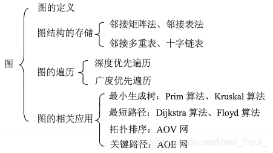
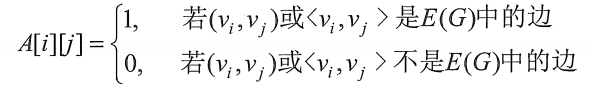

# 图

## 基本框架



## 图的基本概念

图（Graph）是由顶点和边组成的集合，其中顶点可以看做是图中的节点，边可以看做是图中的连接线。

## 图的分类

1. 无向图（Undirected Graph）

- 无向图是指图中任意两个顶点之间都有一条边相连，即边的方向没有限制。

2. 有向图（Directed Graph）

- 有向图是指图中任意两个顶点之间都有一条边相连，但是边的方向是有方向的，即从一个顶点到另一个顶点。

3. 带权图（Weighted Graph）

- 带权图是指图中任意两个顶点之间都有一条边相连，但是边的权重不同。

4. 带权有向图（Weighted Directed Graph）

- 带权有向图是指图中任意两个顶点之间都有一条边相连，但是边的方向是有方向的，边的权重不同。

## 图的术语

1. 顶点（Vertex）

图中的一个顶点，表示图中的一个节点。

2. 边（Edge）

图中的一条边，表示两个顶点之间的连接。

3. 度（Degree）

度是指一个顶点的邻接边的数目。

4. 路径（Path）

路径是指两点之间所有边的序列。

5. 简单路径（Simple Path）

简单路径是指路径中顶点不重复出现。

6. 回路（Cycle）

回路是指路径中第一个和最后一个顶点相同。

7. 连通性（Connectivity）

连通性是指图中任意两个顶点之间都存在路径。

8. 连通分量（Connected Component）

连通分量是指图中所有顶点都连通的子图。

9. 强连通性（Strong Connectivity）

强连通性是指图中任意两个顶点之间都存在路径，并且所有顶点都连通。

10. 割点（Cut Vertex）

割点是指图中删除该点后，图不再连通。

11. 顶点分量（Vertex Component）

顶点分量是指图中所有顶点都连通的子集。

12. 边分量（Edge Component）

边分量是指图中所有边都连通的子集。
13. 子图（Subgraph）

子图是指图中包含某些顶点和边的图。
14. 完全图（Complete Graph）

完全图是指图中任意两个顶点之间都有一条边相连。

15. 稀疏图（Sparse Graph）

稀疏图是指图中边的数目远小于顶点的数目。

16. 稠密图（Dense Graph）

稠密图是指图中边的数目远大于顶点的数目。

## 图的表示方法/存储结构

图的表示方法有两种：邻接矩阵和邻接表。

### 邻接矩阵



注意：
①在简单应用中，可直接用二维数组作为图的邻接矩阵(顶点信息等均可省略)。
②当邻接矩阵中的元素仅表示相应的边是否存在时，EdgeType可定义为值为0和1的枚举类型。
③无向图的邻接矩阵是对称矩阵，对规模特大的邻接矩阵可采用压缩存储。
④邻接矩阵表示法的空间复杂度为O ( n 2 ) O(n^2)O(n
2
)， 其中n为图的顶点数∣ V ∣ |V|∣V∣。
⑤ 用邻接矩阵法存储图，很容易确定图中任意两个顶点之间是否有边相连。但是，要确定图中有多少条边，则必须按行、按列对每个元素进行检测，所花费的时间代价很大。
⑥ 稠密图适合使用邻接矩阵的存储表示。

### 邻接表

```c
    #define MAXVEX 100 //图中顶点数目的最大值
    type char VertexType; //顶点类型应由用户定义
    typedef int EdgeType; //边上的权值类型应由用户定义
    /*边表结点*/
    typedef struct EdgeNode{
        int adjvex; //该弧所指向的顶点的下标或者位置
        EdgeType weight; //权值，对于非网图可以不需要
        struct EdgeNode *next; //指向下一个邻接点
    }EdgeNode;

    /*顶点表结点*/
    typedef struct VertexNode{
        Vertex data; //顶点域，存储顶点信息
        EdgeNode *firstedge //边表头指针
    }VertexNode, AdjList[MAXVEX];

    /*邻接表*/
    typedef struct{
        AdjList adjList;
        int numVertexes, numEdges; //图中当前顶点数和边数
    }
```

#### 图的邻接表存储方法具有以下特点

1. 若 $ G $ 为无向图，则所需的存储空间为 $ O(|V| + 2|E|) $；若 $ G $ 为有向图，则所需的存储空间为 $ O(|V| + |E|) $。前者的倍数2是由于无向图中，每条边在邻接表中出现了两次。

2. 对于稀疏图，采用邻接表能够大大节省存储空间。

3. 在邻接表中，给定一顶点，能够快速地找出它的所有邻边，因为只需读取该顶点的邻接表。在邻接表中，相同的操作只需遍历一遍，花费的时间为 $ O(n) $，而要确定给定的两个顶点是否存在边，则在邻接表中则需要在相应结点对应的边表中结束，效率较低。

4. 在有向图的邻接表表示中，要求一个给定顶点的出度则需要遍历全部的邻接表。因此，有人采用邻接表的存储方式来处理求解某顶点的入邻接点。当频繁，这实际上与邻接表存储方式是类似的。

5. 图的邻接表并非单一，因为每个顶点对应的链表中，各边的连接次序也可以是任意的，它取决于建立邻接表的算法及其输入顺序。

### 邻接多重表与十字链表

十字链表是一种特殊的邻接表表示方法，它将图中的边分为两类：正向边和反向边。正向边表示从顶点u到顶点v的边，反向边表示从顶点v到顶点u的边。

考试的要求只需要会画就好，可以根据这两个[视频1](【【考前补缺】图的冷门存储-邻接多重表与十字链表】https://www.bilibili.com/video/BV1XfqoYJEVc?vd_source=b783b218a754d5ce9e2737a645914917)[视频2](【三分钟理解十字链表！超简单！】https://www.bilibili.com/video/BV1mP411M7p7?vd_source=b783b218a754d5ce9e2737a645914917)进行学习

## 图的遍历

### 深度优先搜索（DFS）

深度优先搜索（Depth-First Search，DFS）是一种图遍历算法，它沿着图的深度遍历树的边界，从某一顶点开始，访问该顶点的所有邻接顶点，然后依次访问这些邻接顶点的邻接顶点，直到访问到没有邻接点的顶点为止。

```c
    bool visited[MAX_VERTEX_NUM];	//访问标记数组
    /*从顶点出发，深度优先遍历图G*/
    void DFS(Graph G, int v){
        int w;
        visit(v);	//访问顶点
        visited[v] = TRUE;	//设已访问标记
        //FirstNeighbor(G,v):求图G中顶点v的第一个邻接点，若有则返回顶点号，否则返回-1。
        //NextNeighbor(G,v,w):假设图G中顶点w是顶点v的一个邻接点，返回除w外顶点v
        for(w = FirstNeighbor(G, v); w>=0; w=NextNeighor(G, v, w)){
            if(!visited[w]){	//w为u的尚未访问的邻接顶点
                DFS(G, w);
            }
        }
    }
    /*对图进行深度优先遍历*/
    void DFSTraverse(MGraph G){
        int v; 
        for(v=0; v<G.vexnum; ++v){
            visited[v] = FALSE;	//初始化已访问标记数据
        }
        for(v=0; v<G.vexnum; ++v){	//从v=0开始遍历
            if(!visited[v]){
                DFS(G, v);
            }
        }
    }  

```

### 广度优先搜索（BFS）

广度优先搜索（Breadth-First Search，BFS）是一种图遍历算法，它沿着图的宽度遍历树的边界，从某一顶点开始，访问该顶点的所有邻接顶点，然后依次访问这些邻接顶点的邻接顶点，直到访问到没有邻接点的顶点为止。

```c
    /*邻接矩阵的广度遍历算法*/
    void BFSTraverse(MGraph G){
        int i, j;
        Queue Q;
        for(i = 0; i<G,numVertexes; i++){
            visited[i] = FALSE;
        }
        InitQueue(&Q);	//初始化一辅助用的队列
        for(i=0; i<G.numVertexes; i++){
            //若是未访问过就处理
            if(!visited[i]){
                vivited[i] = TRUE;	//设置当前访问过
                visit(i);	//访问顶点
                EnQueue(&Q, i);	//将此顶点入队列
                //若当前队列不为空
                while(!QueueEmpty(Q)){
                    DeQueue(&Q, &i);	//顶点i出队列
                    //FirstNeighbor(G,v):求图G中顶点v的第一个邻接点，若有则返回顶点号，否则返回-1。
                    //NextNeighbor(G,v,w):假设图G中顶点w是顶点v的一个邻接点，返回除w外顶点v
                    for(j=FirstNeighbor(G, i); j>=0; j=NextNeighbor(G, i, j)){
                        //检验i的所有邻接点
                        if(!visited[j]){
                            visit(j);	//访问顶点j
                            visited[j] = TRUE;	//访问标记
                            EnQueue(Q, j);	//顶点j入队列
                        }
                    }
                }
            }
        }
    }

```


## 图的联通性

这一块课程要求比较低，只要会用手算出来强联通分量和了解概念就好了。
其他的比如eDCC和vDCC不需要深入了解。
如果想要用代码来求需要用到tarjan算法，可以自行搜索学习。

## 图的最小生成树

最小生成树（Minimum Spanning Tree，MST）是指在一个连通的无向图中，找出权值和最小的生成树。

### 最小生成树的生成

最小生成树的生成有两种方法：

1. 贪心算法：每次选择一条权值最小的边加入生成树，直到生成树包含所有顶点。
```c
    /*Kruskar算法生成最小生成树*/
    void MiniSpanTree_Kruskal(MGraph G){
        int i, n, m;
        Edge edges[MAXEDGE];	//定义边集数组
        int parent[MAXVEX];	//定义一数组用来判断边与边是否形成环路
        /*此处省略将邻接矩阵G转化为边集数组edges并按照权由小到大排序的代码*/
        for(i=0; i<G.numVertexes; i++){
            parent[i] = 0;	//初始化数组为0
        }
        for(i=0; i<G.numVertexes; i++){
            n = Find(parent, edges[i].begin);
            m = Find(parent, edge[i],end);
            /*假如n与m不等，说明此边没有与现有生成树形成环路*/
            if(n != m){
            /*将此边的结尾顶点放入下标为起点的parent中
            表示此顶点已经在生成树集合中*/
            parent[n] = m;
            printf("(%d, %d, %d)", edges[i].begin, 
                            edges[i].end, edges[i].weight);
            }
        }
    }

    /*查找连线顶点的尾部下标*/
    int Find(int *parent, int f){
        while(parent[f] > 0){
            f = parent[f];
        }
        return f;
    }

```
2.  Prim算法：在图中选取一个顶点，然后每次选择一条连接到该顶点且权值最小的边，直到生成树包含所有顶点。

```c
    /*Prim算法生成最小生成树*/
    void MiniSpanTree_Prim(G){
        int min, i, j, k;
        int adjvex[MAXVEX];	//保存相关顶点下标
        int lowcost[MAXVEX];	//保存相关顶点间边的权值
        lowcost[0] = 0;	//初始化第一个权值为0，即v0加入生成树
        //lowcost的值为0，在这里就是此下标的顶点已经加入生成树
        adjvex[0] = 0;	//初始化第一个顶点下标为0
        for(i=1; i<G.numVertexes; i++){
            lowcost[i] = G.arc[0][i];	//将v0顶点与之组成边的权值存入数组
            adjvex[i] = 0;	//初始化都为v0的下标
        }
        for(i=1; i<G.numVertexes; i++){
            min = INFINITY;	//初始化最下权值为∞，通常设置一个不可能的很大的数字
            j = 1; k = 0;
            //循环全部顶点
            while(j < G.numVertexes){
                //如果权值不为0且权值小于min
                if(lowcost[j] != 0 && lowcost[j] < min){
                    min = lowcost[j];	//则让当前权值成为最小值
                    k = j;	//将当前最小值的下标存入k
                }
                j++;
            }
            print("(%d, %d)", adjvex[k], k);	//打印当前顶点边中权值的最小边
            for(j=1; j<G.numvertexes; j++){
                //若下标为k顶点各边权值小于此前这些顶点未被加入生成树权值
                if(lowcost[j] != 0 && G.arc[k][j] < lowcost[j]){
                    lowcost[j] = G.arc[k][j];	//将较小权值存入lowcost
                    adjvex[j] = k;	//将下标为k的顶点存入adjvex
                }
            }
        }
}

```
### 最小生成树的应用

最小生成树的应用有很多，如：

1. 最小支撑树：在一个带权无向图中，找出权值和最小的支撑树，即使得它连接了所有顶点，但不连接任何回路。

2. 最小割：在一个带权无向图中，找出权值和最小的割，即使得它将图分成两个互不相连的子集，且子集中任意顶点间的边权值和最小。

3. 最小权完全图：在一个带权无向图中，找出权值和最小的完全图，即使得它连接了所有顶点，且任意两个顶点间的边权值和最小。

4. 最小生成树的应用还有很多，如：最小生成树的最大权值、最小割的最大权值、最小权完全图的最大权值等。
   
## 最短路径
最短路径（Shortest Path）是指在一个连通的图中，从一个顶点到另一个顶点的最短路径。

### 单源最短路径Dijkstra/SPFA(不用掌握)

```c
    /*Dijkstra算法求单源最短路径*/
    void Dijkstra(MGraph G, int s){
        int i, j, k, min;
        int dist[MAXVEX];	//保存从源点s到各顶点的最短路径长度
        int visited[MAXVEX];	//保存是否已访问过
        for(i=0; i<G.numVertexes; i++){
            dist[i] = G.arc[s][i];	//初始化源点到各顶点的距离
            visited[i] = FALSE;	//初始化是否已访问过
        }
        dist[s] = 0;	//源点到源点的距离为0
        for(i=0; i<G.numVertexes-1; i++){
            min = INFINITY;	//初始化最小距离为∞
            for(j=0; j<G.numVertexes; j++){
                if(!visited[j] && dist[j] < min){
                    min = dist[j];	//找到距离源点s最近的顶点
                    k = j;	//将此顶点的下标存入k
                }
            }
            visited[k] = TRUE;	//将此顶点标记为已访问
            for(j=0; j<G.numVertexes; j++){
                if(!visited[j] && G.arc[k][j] != INFINITY && dist[k] + G.arc[k][j] < dist[j]){
                    dist[j] = dist[k] + G.arc[k][j];	//更新距离
                }
            }
        }
        for(i=0; i<G.numVertexes; i++){
            printf("(%d, %d, %d)", s, i, dist[i]);	//打印从源点s到各顶点的最短路径长度
        }
    }
    //还可以用堆优化遍历
    void Dijkstra_Heap(MGraph G, int s){
        int i, j, k, min;
        int dist[MAXVEX];	//保存从源点s到各顶点的最短路径长度
        int visited[MAXVEX];	//保存是否已访问过
        for(i=0; i<G.numVertexes; i++){
            dist[i] = G.arc[s][i];	//初始化源点到各顶点的距离
            visited[i] = FALSE;	//初始化是否已访问过
        }
        dist[s] = 0;	//源点到源点的距离为0
        MinHeap H;
        InitMinHeap(&H, G.numVertexes);	//初始化最小堆
        for(i=0; i<G.numVertexes; i++){
            InsertMinHeap(&H, i, dist[i]);	//将各顶点及其距离插入最小堆
        }
        while(!MinHeapEmpty(H)){
            DeQueueMinHeap(&H, &k, &min);	//取出距离源点s最近的顶点
            visited[k] = TRUE;	//将此顶点标记为已访问
            for(j=0; j<G.numVertexes; j++){
                if(!visited[j] && G.arc[k][j] != INFINITY && dist[k] + G.arc[k][j] < dist[j]){
                    dist[j] = dist[k] + G.arc[k][j];	//更新距离
                    UpdateMinHeap(&H, j, dist[j]);	//更新最小堆
                }
            }
        }
        for(i=0; i<G.numVertexes; i++){
            printf("(%d, %d, %d)", s, i, dist[i]);	//打印从源点s到各顶点的最短路径长度
        }
    }

```

### 多源最短路径Floyd

```c
    /*Floyd算法求多源最短路径*/
    void Floyd(MGraph G){
        int i, j, k;
        int dist[MAXVEX][MAXVEX];	//保存从源点s到各顶点的最短路径长度
        for(i=0; i<G.numVertexes; i++){
            for(j=0; j<G.numVertexes; j++){
                dist[i][j] = G.arc[i][j];	//初始化距离
            }
        }
        for(k=0; k<G.numVertexes; k++){
            for(i=0; i<G.numVertexes; i++){
                for(j=0; j<G.numVertexes; j++){
                    if(dist[i][k] != INFINITY && dist[k][j] != INFINITY && dist[i][k] + dist[k][j] < dist[i][j]){
                        dist[i][j] = dist[i][k] + dist[k][j];	//更新距离
                    }
                }
            }
        for(i=0; i<G.numVertexes; i++){
            for(j=0; j<G.numVertexes; j++){
                printf("(%d, %d, %d)", i, j, dist[i][j]);	//打印从源点s到各顶点的最短路径长度
            }
        }
    }

```

>- ps：以下代码不需要掌握,但需要学会手算。
>- 可以根据[视频](https://www.bilibili.com/video/BV1tyvDeBEE8?vd_source=b783b218a754d5ce9e2737a645914917)学习
## 拓扑排序(AOV网)

拓扑排序（Topological Sort）是指对一个有向无环图（DAG，Directed Acyclic Graph）进行排序，使得每条边的起点都在其终点之前。

### 拓扑排序的生成

拓扑排序的生成有两种方法：

1. 基于DFS的拓扑排序：

```c
    /*DFS算法生成拓扑排序*/
    void TopologicalSort_DFS(MGraph G){
        int i, j, k;
        int visited[MAXVEX];	//保存是否已访问过
        for(i=0; i<G.numVertexes; i++){
            visited[i] = FALSE;	//初始化是否已访问过
        }
        for(i=0; i<G.numVertexes; i++){
            if(!visited[i]){
                TopologicalSort_DFS_Visit(G, i, visited);	//访问顶点i
            }
        for(i=0; i<G.numVertexes; i++){
            printf("%d ", i);	//打印拓扑排序
        }
    }

    /*DFS访问函数*/
    void TopologicalSort_DFS_Visit(MGraph G, int v, int *visited){
        int i;
        visited[v] = TRUE;	//设置当前顶点已访问
        for(i=0; i<G.numVertexes; i++){
            if(G.arc[v][i] != INFINITY && !visited[i]){
                TopologicalSort_DFS_Visit(G, i, visited);	//访问顶点i
            }
        printf("%d ", v);	//打印当前顶点
    }

```

2. 基于BFS的拓扑排序：

```c
    /*BFS算法生成拓扑排序*/
    void TopologicalSort_BFS(MGraph G){
        int i, j, k;
        int visited[MAXVEX];	//保存是否已访问过
        int queue[MAXVEX];	//保存待访问的顶点
        int front, rear;
        for(i=0; i<G.numVertexes; i++){
            visited[i] = FALSE;	//初始化是否已访问过
        }
        front = rear = 0;	//初始化队列
        for(i=0; i<G.numVertexes; i++){
            if(!visited[i]){
                queue[rear++] = i;	//将顶点i入队列
                visited[i] = TRUE;	//设置当前顶点已访问
                while(front != rear){
                    k = queue[front++];	//取出队首顶点
                    for(j=0; j<G.numVertexes; j++){
                        if(G.arc[k][j] != INFINITY && !visited[j]){
                            queue[rear++] = j;	//将顶点j入队列
                            visited[j] = TRUE;	//设置当前顶点已访问
                        }
                    }
                }
            }
        }
        for(i=0; i<G.numVertexes; i++){
            printf("%d ", i);	//打印拓扑排序
        }
    }

```

## 关键路径(AOE网)

关键路径（Critical Path）是指在一个有向无环图（DAG，Directed Acyclic Graph）中，从开始顶点到结束顶点的最长路径。

### 关键路径的生成

关键路径的生成有两种方法：

1. 基于DFS的关键路径生成：

```c
    /*DFS算法生成关键路径*/
    void CriticalPath_DFS(MGraph G){
        int i, j, k;
        int visited[MAXVEX];	//保存是否已访问过
        int low[MAXVEX];	//保存各顶点的最早开始时间
        int pre[MAXVEX];	//保存各顶点的前驱顶点
        int cp[MAXVEX];	//保存各顶点的最长路径长度
        for(i=0; i<G.numVertexes; i++){
            visited[i] = FALSE;	//初始化是否已访问过
            low[i] = INFINITY;	//初始化最早开始时间
            pre[i] = -1;	//初始化前驱顶点
            cp[i] = 0;	//初始化最长路径长度
        }
        cp[G.start] = G.arc[G.start][G.end];	//初始化开始顶点到结束顶点的最长路径长度
        visited[G.start] = TRUE;	//设置开始顶点已访问
        for(i=0; i<G.numVertexes; i++){
            if(!visited[i]){
                CriticalPath_DFS_Visit(G, i, visited, low, pre, cp);	//访问顶点i
            }
        printf("Critical Path: ");
        for(i=G.end; i!=G.start; i=pre[i]){
            printf("%d ", i);	//打印关键路径
        }
        printf("%d", G.start);	//打印关键路径
        printf("\nCritical Path Length: %d", cp[G.end]);	//打印关键路径长度
    }

    /*DFS访问函数*/
    void CriticalPath_DFS_Visit(MGraph G, int v, int *visited, int *low, int *pre, int *cp){
        int i, w;
        visited[v] = TRUE;	//设置当前顶点已访问
        for(i=0; i<G.numVertexes; i++){
            if(G.arc[v][i] != INFINITY && !visited[i]){
                w = CriticalPath_DFS_Visit(G, i, visited, low, pre, cp);	//访问顶点i
                if(cp[v] + G.arc[v][i] > cp[i]){
                    cp[i] = cp[v] + G.arc[v][i];	//更新最长路径长度
                }
                if(low[v] > low[i]){
                    low[v] = low[i];	//更新最早开始时间
                }
            }
            if(G.arc[v][i] != INFINITY && i != pre[v]){
                if(low[i] < low[v]){
                    low[v] = low[i];	//更新最早开始时间
                }
            }
        }
        return low[v];	//返回最早开始时间
    }

```

2. 基于Bellman-Ford算法的关键路径生成：

```c
    /*Bellman-Ford算法生成关键路径*/
    void CriticalPath_BellmanFord(MGraph G){
        int i, j, k;
        int dist[MAXVEX];	//保存各顶点的最短路径长度
        int pre[MAXVEX];	//保存各顶点的前驱顶点
        int cp[MAXVEX];	//保存各顶点的最长路径长度
        for(i=0; i<G.numVertexes; i++){ 
            dist[i] = G.arc[G.start][i];	//初始化开始顶点到各顶点的最短路径长度
            pre[i] = -1;	//初始化前驱顶点
            cp[i] = 0;	//初始化最长路径长度
        }
        dist[G.start] = 0;	//初始化开始顶点到开始顶点的最短路径长度
        for(i=1; i<G.numVertexes; i++){
            for(j=0; j<G.numVertexes; j++){
                for(k=0; k<G.numVertexes; k++){
                    if(G.arc[j][k] != INFINITY && dist[j] + G.arc[j][k] < dist[k]){
                        dist[k] = dist[j] + G.arc[j][k];	//更新距离
                        pre[k] = j;	//更新前驱顶点
                    }
                }
            }
        }
        for(i=0; i<G.numVertexes; i++){
            for(j=0; j<G.numVertexes; j++){
                if(G.arc[i][j] != INFINITY && dist[i] + G.arc[i][j] > cp[j]){
                    cp[j] = dist[i] + G.arc[i][j];	//更新最长路径长度
                }
            }
        printf("Critical Path: ");
        for(i=G.end; i!=G.start; i=pre[i]){
            printf("%d ", i);	//打印关键路径
        }
        printf("%d", G.start);	//打印关键路径
        printf("\nCritical Path Length: %d", cp[G.end]);	//打印关键路径长度
    }

```
---
@title: 树
@date: 2025-01-08 19:00:00
@version: 1.0.0
@copyright: Copyright (c) 2025 数据结构期末复习
@author：软件工程宋浩元