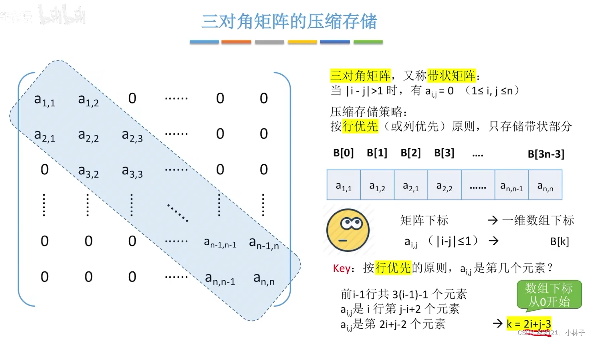
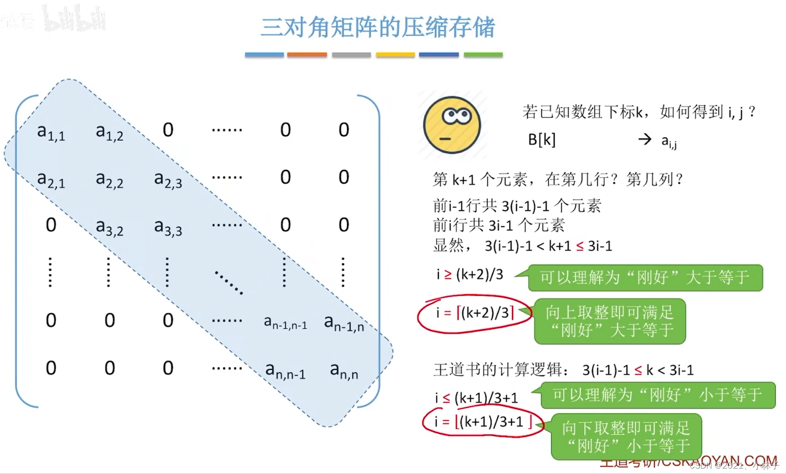
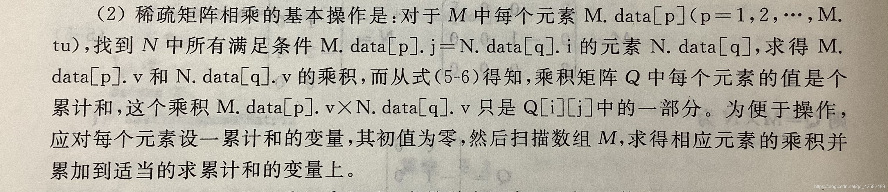

# 矩阵存储以及运算

## 特殊矩阵压缩存储

1. 对称矩阵，三角矩阵压缩存储，用一维数组压缩存储。
其中`M[i][j] = a[i * (i - 1) / 2 + j - 1] , (i >= j)`

2. 对角矩阵的压缩存储


ps：图片来源于网络，侵删。

## 稀疏矩阵存储和运算

### 三元组存储：行，列，值。

- 矩阵快速转置算法
  例子：矩阵 M 定义如下：
    $
    M =
    \begin{bmatrix}
    0 & 12 & 9 & 0 & 0 & 0 & 0 & 0 & 0 \\
    0 & 0 & 0 & 0 & 0 & 0 & 0 & 0 & 0 \\
    -3 & 0 & 0 & 0 & 0 & 0 & 14 & 0 & 0 \\
    0 & 0 & 24 & 0 & 0 & 0 & 0 & 0 & 0 \\
    0 & 18 & 0 & 0 & 0 & 0 & 0 & 0 & 0 \\
    15 & 0 & 0 & -7 & 0 & 0 & 0 & 0 & 0
    \end{bmatrix}
    $
    我们将要对其进行转置操作。
    1. 原理
    如果能够预先确定矩阵 $ M $ 的每一列（即每一行）的第一个非零元在 $ b.data $ 中的位置。则在 $ a.data $ 中的三维数组一次储存时，便可直接放到 $ b.data $ 的位置上去。

    2. 设定变量

- **num** 和 **cpot**

  - $ $num[col]$ $：表示矩阵 $ M $ 中第 $ col $ 列的非零元素数量。
  - $ $cpot[col]$ $：表示矩阵 $ M $ 中第 $ col $ 列的第一个非零元素在 $ a.data $ 中的索引位置。

   3. 公式

- $ $cpot[1]$ = 1 $
- $ $cpot[col]$ = $cpot[col-1]$ + $num[col-1]$ $ 其中 $ 2 \leq $col$ \leq a.nu $

   4. 表 5.1 矩阵 $ M $ 的向量 $ cpot $ 的值

   | col   | 1 | 2 | 3 | 4 | 5 | 6 | 7 |
   |-------|---|---|---|---|---|---|---|
   | num[col] | 2 | 2 | 2 | 1 | 0 | 1 | 0 |
   | cpot[col]| 1 | 3 | 5 | 7 | 8 | 8 | 9 |

   5. 代码

   ```c
    Status  FastTransposeSMatrix(TSMatrix M, TSMatrix &T) 
    { 
        // 采用三元组顺序表存储表示，求稀疏矩阵M的转置矩阵T
        int col, t, p, q;
        int num[20], cpot[20];
        T.mu = M.nu;  T.nu = M.mu;  T.tu = M.tu;
        if (T.tu) {
            for (col = 1; col <= M.nu; ++col) //对列数进行初始化
                num[col] = 0;
            for (t = 1; t <= M.tu; ++t) // 求 M 中每一列所含非零元的个数
                ++num[M.data[t].j];
            cpot[1] = 1;
            // 求 M 中每一列的第一个非零元在 b.data 中的序号
            for (col = 2; col <= M.nu; ++col) 
                cpot[col] = cpot[col - 1] + num[col - 1];
            for (p = 1; p <= M.tu; ++p) 
            {
                col = M.data[p].j;   
                q = cpot[col];
                T.data[q].i = M.data[p].j;  
                T.data[q].j = M.data[p].i;
                T.data[q].e = M.data[p].e;  
                ++cpot[col];
            }
        }
        return OK;
    }
   ```

- 稀疏矩阵乘法
  
  教材算法：
  
  

  ```c
    /* 行逻辑链接顺序表 */
    typedef struct {
        Triple data[1000];	//非零元三元组表
        int rpos[1000];		//各行第一个非零元的位置表
        int mu, nu, tu;		//矩阵的行数、列数和非零元个数
    }RLSMatrix;
  ```

  实现代码：

    ```c
        #include<cstdio>  
        #include<stack>  
        #include<cstring>   
        #include<cstdlib>   
        #include<iostream>  
        using namespace std;

        //定义三元组和顺序表
        typedef struct {
            int i, j;
            int e;
        }Triple;
        typedef struct {
            Triple data[1000];
            int rpos[1000];
            int mu, nu, tu;
        }RLSMatrix;
        int rpos[1000];
        int num[1000];

        int main()
        {
            int arow = 0, brow = 0, tp = 0;
            int col = 0, ccol = 0;
            int p = 0, t = 0, q = 0;
            RLSMatrix M, N, Q;

            //输入M、N矩阵数据
            scanf("%d%d%d", &M.mu, &M.nu, &M.tu);
            for (int i = 1; i <= M.tu; i++)
                scanf("%d%d%d", &M.data[i].i, &M.data[i].j, &M.data[i].e);
            scanf("%d%d%d", &N.mu, &N.nu, &N.tu);
            for (int i = 1; i <= N.tu; i++)
                scanf("%d%d%d", &N.data[i].i, &N.data[i].j, &N.data[i].e);
            
            for (col = 1; col <= M.mu; col++)
                num[col] = 0;
            for (int i = 1; i <= M.tu; i++)
                num[M.data[i].i]++;
            M.rpos[1] = 1;
            for (col = 2; col <= M.mu; col++)
                M.rpos[col] = M.rpos[col - 1] + num[col - 1];
            for (col = 1; col <= N.mu; col++)
                num[col] = 0;
            for (int i = 1; i <= N.tu; i++)
                num[N.data[i].i]++;
            N.rpos[1] = 1;
            for (col = 2; col <= N.mu; col++)
                N.rpos[col] = N.rpos[col - 1] + num[col - 1];
            
            /* 计算矩阵乘积 */
            Q.mu = M.mu;
            Q.nu = N.nu;
            Q.tu = 0;
            if (M.tu*N.tu != 0) 
            {
                for (arow = 1; arow <= M.mu; arow++) 
                {
                    memset(rpos, 0, sizeof(rpos));
                    Q.rpos[arow] = Q.tu + 1;
                    if (arow < M.mu)
                        tp = M.rpos[arow + 1];
                    else
                        tp = M.tu + 1;
                    for (p = M.rpos[arow]; p < tp; p++) 
                    {
                        brow = M.data[p].j;
                        if (brow < N.mu)
                            t = N.rpos[brow + 1];
                        else
                            t = N.tu + 1;
                        for (q = N.rpos[brow]; q < t; q++) 
                        {
                            ccol = N.data[q].j;
                            rpos[ccol] += M.data[p].e*N.data[q].e;
                        }
                    }
                    for (ccol = 1; ccol <= Q.nu; ccol++)
                    {
                        if (rpos[ccol]) {
                            Q.tu++;
                            Q.data[Q.tu].i = arow;
                            Q.data[Q.tu].j = ccol;
                            Q.data[Q.tu].e = rpos[ccol];
                        }
                    }
                }
            }

            //输出乘积矩阵Q
            printf("%d\n", Q.mu);
            printf("%d\n", Q.nu);
            printf("%d\n", Q.tu);
            for (int i = 1; i <= Q.tu; i++)
                printf("%d,%d,%d\n", Q.data[i].i, Q.data[i].j, Q.data[i].e);

            return 0;
        }
    ```
### 十字链表法(考得比较少或者比较简单)

- 十字链表法是一种稀疏矩阵的存储方法，它将稀疏矩阵的非零元素存储在一个链表中，每个元素包含三个域：行、列、值。

- 十字链表法的优点：

  - 十字链表法的存储结构简单，易于实现。
  - 十字链表法的运算速度快，稀疏矩阵的乘法运算可以用十字链表法的算法来实现。
  - 十字链表法的稀疏矩阵的存储空间利用率高，稀疏矩阵的元素个数与矩阵的非零元素个数成正比。

- 十字链表法的缺点：

  - 十字链表法的稀疏矩阵的元素个数与矩阵的非零元素个数成正比，因此，当稀疏矩阵的元素个数较多时，十字链表法的存储空间利用率低。
  - 十字链表法的稀疏矩阵的元素的存储顺序与稀疏矩阵的元素的添加顺序有关，因此，不能保证稀疏矩阵的元素的顺序。

- 十字链表法的实现：

  - 定义十字链表结构：

    ```c
    typedef struct {
        int i, j;
        int e;
        struct {
            int r, c;
            struct {
                int i, j, e;
            } next;
        } up, down;
    } Triple;
    ```

    - 其中，Triple 结构中包含三个域：行、列、值。
    - up 域和 down 域分别指向该元素的上一个和下一个元素。
    - up 域和 down 域的 next 域指向同一行的下一个元素。

  - 定义十字链表矩阵结构：

    ```c
    typedef struct {
        Triple data[1000];
        int mu, nu, tu;
    } RLSMatrix;
    ```

    - 其中，RLSMatrix 结构中包含三个域：data 域存储矩阵的非零元素，mu 域和 nu 域分别表示矩阵的行数和列数，tu 域表示矩阵的非零元素个数。

  - 矩阵的初始化：

    ```c
    void InitRLSMatrix(RLSMatrix &M) {
        M.mu = 0;
        M.nu = 0;
        M.tu = 0;
    }
    ```

  - 矩阵的添加元素：

    ```c
    void AddRLSMatrix(RLSMatrix &M, int i, int j, int e) {
        M.data[M.tu + 1].i = i;
        M.data[M.tu + 1].j = j;
        M.data[M.tu + 1].e = e;
        M.data[M.tu + 1].up.r = i;
        M.data[M.tu + 1].up.c = j - 1;
        M.data[M.tu + 1].up.next.i = i;
        M.data[M.tu + 1].up.next.j = j + 1;
        M.data[M.tu + 1].up.next.e = 0;
        M.data[M.tu + 1].down.r = i;
        M.data[M.tu + 1].down.c = j + 1;
        M.data[M.tu + 1].down.next.i = i;
        M.data[M.tu + 1].down.next.j = j - 1;
        M.data[M.tu + 1].down.next.e = 0;
        if (j > 1) {
            M.data[M.rpos[j - 1]].up.next.e = M.tu + 1;
        }
        if (j < M.nu) {
            M.data[M.rpos[j + 1]].down.next.e = M.tu + 1;
        }
        M.rpos[j]++;
        M.tu++;
    }
    ```

    - 矩阵的添加元素的过程：
      - 首先，将新元素添加到 data 域的最后一个位置。
      - 然后，设置 up 域和 down 域的 next 域，使得该元素的上一个和下一个元素的位置正确。
      - 最后，更新 rpos 数组，使得该元素的列位置的元素个数加 1。

  - 矩阵的输出：

    ```c
    void OutputRLSMatrix(RLSMatrix &M) {
        for (int i = 1; i <= M.tu; i++) {
            printf("%d %d %d\n", M.data[i].i, M.data[i].j, M.data[i].e);
        }
    }
    ```

  - 矩阵的转置：

    ```c
    void TransposeRLSMatrix(RLSMatrix &M, RLSMatrix &T) {
        T.InitRLSMatrix();
        for (int i = 1; i <= M.mu; i++) {
            for (int p = M.rpos[i]; p < M.rpos[i + 1]; p++) {
                T.AddRLSMatrix(M.data[p].j, M.data[p].i, M.data[p].e);
            }
        }
    }
    ```

    - 矩阵的转置的过程：
      - 首先，初始化 T 矩阵。
      - 然后，对 M 矩阵的每一行，将该行的元素添加到 T 矩阵的相应位置。

  - 矩阵的乘法：

    ```c
    void MulRLSMatrix(RLSMatrix &M, RLSMatrix &N, RLSMatrix &P) {
        P.InitRLSMatrix();
        for (int i = 1; i <= M.mu; i++) {
            for (int p = M.rpos[i]; p < M.rpos[i + 1]; p++) {
                for (int q = N.rpos[M.data[p].j]; q < N.rpos[M.data[p].j + 1]; q++) {
                    P.AddRLSMatrix(i, N.data[q].j, M.data[p].e * N.data[q].e);
                }
            }
        }
    }
    ```

    - 矩阵的乘法的过程：
      - 首先，初始化 P 矩阵。
      - 然后，对 M 矩阵的每一行，对 N 矩阵的相应列进行乘法，将结果添加到 P 矩阵的相应位置。 
---
@title: 矩阵存储与运算
@date: 2025-01-08 19:00:00
@version: 1.0
@copyright: Copyright (c) 2025 数据结构期末复习
@author：软件工程宋浩元