## 查找
>- ps:本pdf来源网络本人只做整理，侵删。
### 【知识框架】


* * *

## 查找概论

### 一、查找的基本概念

**查找(Searching)**：就是根据给定的某个值，在**查找表**中确定一个其**关键字**等于给定值的数据元素( 或记录)。

**查找表(Search Table)**：是由同一类型的数据元素(或记录)构成的集合。

**关键字(Key)**：数据元素中唯一标识该元素的某个数据项的值，使用基于关键字的查找，查找结果应该是唯一的。例如，在由一个学生元素构成的数据集合中，学生元素中“学号”这一数据项的值唯一地标识一名学生。

**静态查找表(Static Search Table)**：只作查找操作的查找表。

+   主要操作

1.  查询某个“特定的”数据元素是否在查找表中。
2.  检索某个“特定的”数据元素和各种属性。

**动态查找表(Dynamic Search Table)**： 在查找过程中同时插入查找表中不存在的数据元素，或者从查找表中删除已经存在的某个数据元素。

+   主要操作

1.  查找时插入不存在的数据元素。
2.  查找时删除已存在的数据元素。

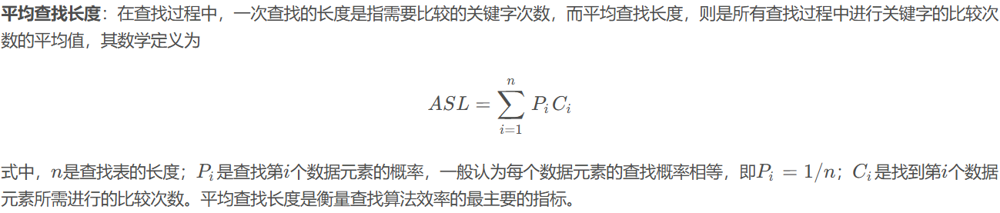

* * *

## 顺序表查找

### 一、定义

顺序查找(Sequential Search) 又叫线性查找，是最基本的查找技术，作为一种最直观的查找方法，其基本思想是从线性表的一端开始，逐个检查关键字是否满足给定的条件。若查找到某个元素的关键字满足给定条件，则查找成功，返回该元素在线性表中的位置；若已经查找到表的另一端，但还没有查找到符合给定条件的元素，则返回查找失败的信息。

### 二、算法

下面给出其算法：

```c
/*有哨兵顺序查找*/
int Sequential_Search(int *a, int n, int key){
	int i;
	a[0] = key;	//设置a[0]为关键字，称之为“哨兵”
	i = n;	//循环从数组尾部开始
	while(a[i] != key){
		i--;
	}
	return i;	//返回0则说明查找失败
}
```

这种在查找方向的尽头放置“哨兵”免去了在查找过程中每一次比较后都要判断查找位置是否越界的小技巧，看似与原先差别不大，但在总数据较多时，效率提高很大，是非常好的编码技巧。  
上述顺序表查找时间复杂度是 O ( n ) O(n) O(n)。

* * *

## 有序表查找

### 一、折半查找
推荐视频：[二分查找为何总是写错](【二分查找为什么总是写错？】https://www.bilibili.com/video/BV1d54y1q7k7?vd_source=b783b218a754d5ce9e2737a645914917)

折半查找(Binary Search)技术，又称为二分查找。它的前提是线性表中的记录必须是关键码有序(通常从小到大有序)，线性表必须采用顺序存储。折半查找的基本思想是：在有序表中，取中间记录作为比较对象，若给定值与中间记录的关键字相等，则查找成功；若给定值小于中间记录的关键字，则在中间记录的左半区继续查找；若给定值大于中间记录的关键字，则在中间记录的右半区继续查找。不断重复上述过程，直到查找成功，或所有查找区域无记录，查找失败为止。

算法如下：

```c
int Binary_Search(SeqList L, ElemType key){
	int low = 0, high = L.length - 1, mid;
	while(low <= high){
		mid = (low + hight)/2;	//取中间位置
		if(L.elem[mid] == key){
			return mid;	//查找成功返回所在位置
		}else if(L.elem[mid] > key){
			high = mid - 1;	//从前半部分继续查找
		}else{
			low = mid + 1;	//从后半部分继续查找
		}
	}
	return -1;	//查找失败，返回-1
}
```


### 二、插值查找

现在我们的新问题是，为什么一定要折半，而不是折四分之一或者折更多呢?  
比如要在取值范围0 ~ 10000之间100个元素从小到大均匀分布的数组中查找5，我们自然会考虑从数组下标较小的开始查找。  
所以，折半查找还是有改善空间的。  
上述折半查找代码的第4行，等式变换后可得到：


也就是`mid`等于最低下标 `low`加上最高下标`high` high与`low`的差的一半。大佬们考虑的就是将这个`1/2`进行改进，改进为下面的计算方案：
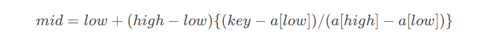
也就是说，我们把上述折半查找代码的第4行的代码改为：

```c
mid = low+(key-L.elem[low])/(L.elem[high] - L.elem[low]) * (high-low);	//插值
```

就得到了另一种有序表查找算法，插值查找法。插值查找(Interpolation Search) 是根据要查找的关键字key与查找表中最大最小记录的关键字比较后的查找方法，其核心就在于插值的计算公式。应该说，从时间复杂度来看，它也是 $O(log2​n)$，但对于表长较大，而关键字分布又比较均匀的查找表来说，插值查找算法的平均性能比折半查找要好得多。反之，数组中如果分布类似${0,1,2,2000,2001,......,999998, 99999}$这种极端不均匀的数据，用插值查找未必是很合适的选择。

### 三、斐波那契查找

斐波那契查找(Fibonacci Search)，它是利用了黄金分割原理来实现的。

[关于斐波那契数列，不了解的可点击这里做一个大致的了解](https://blog.csdn.net/Real_Fool_/article/details/113852222#2_236)

我们先定义一个斐波那契数组 F F F：  
  
算法实现如下：

```c
/*斐波那契查找*/
int Fibonacci_Search(int *a, int n, int key){
	int low, high, mid, i, k;
	low = 0;	//定义最低下标为记录首位
	high = n;	//定义最高下标为记录末尾
	k = 0;
	while(n > F[k] - 1){
		//计算n位于斐波那契数列的位置
		k++;
	}
	for(i=n; i<F[k]; i++){
		//在尾部补上F[k]-n-1个数，大小等于尾部最大值，否则会存在数组溢出
		a[i]=a[n];
	}
	while(low <= hight){
		mid = low + F[k-1]-1;	//计算当前分隔的下标
		if(key < a[mid]){
			//若查找记录小于当前分隔记录
			hight = mid - 1;	//最高下标调整到分隔下标mid-1处
			k = k - 1;	//斐波那契数列下标减一位
		}else if(key > a[mid]){
			//若查找记录大于当前分隔记录
			low = mid + 1;	//最低下标调整到分隔下标mid+1处
			k = k - 2;	//斐波那契数列下标减两位
		}else{
			if(mid <= n){
				return mid;	//若相等则说明mid即为查找的位置
			}else{
				return n;	//若mid>n说明是补全数值，返回n
			}
		}
	}
	return -1;
}
```

斐波那契查找算法的核心在于:

1.  当key=a[mid]时，查找就成功；
2.  当key<a[mid]时，新范围是第low个到第mid-1个，此时范围个数为F[k-1]-1个；
3.  当key>a[mid]时，新范围是第m+1个到第high个，此时范围个数为F[k-2]-1个。

也就是说，如果要查找的记录在右侧，则左侧的数据都不用再判断了，不断反复进行下去，对处于当中的大部分数据，其工作效率要高一些，而且斐波那契查找只是最简单加减法运算，所以尽管斐波那契查找的时间复杂也为 $O(logn)$，但就平均性能来说，斐波那契查找要优于折半查找。不过如果是最坏情况，比如这里key=1，那么始终都处于左侧长半区在查找，则查找效率要低于折半查找。

* * *

## 线性索引查找

现实生活中计算机要处理的数据量是极其庞大的，而数据结构的最终目的是提高数据的处理速度，**索引**是为了加快查找速度而设计的一种数据结构。索引就是把一个关键字与它对应的记录相关联的过程， 一个索引由若干个索引项构成，每个索引项至少应包含关键字和其对应的记录在存储器中的位置等信息。索引技术是组织大型数据库以及磁盘文件的一种重要技术。  
索引按照结构可以分为**线性索引、树形索引和多级索引**。  
这里主要介绍线性索引，所谓线性索引就是将索引项集合组织为线性结构，也称为**索引表**。我们重点介绍三种线性索引：**稠密索引、分块索引和倒排索引**。

### 一、稠密索引

稠密索引是很简单直白的一种索引结构。  
**稠密索引是指在线性索引中，将数据集中的每个记录对应一个索引项，而索引项一定是按照关键码有序的排列**。如下图所示：  
  
索引项有序也就意味着，我们要查找关键字时，可以用到折半、插值、斐波那契等有序查找算法，提高了效率。这是稠密索引优点，但是如果数据集非常大，比如上亿，那也就意味着索引也得同样的数据集长度规模，对于内存有限的计算机来说，可能就需要反复去访问磁盘，查找性能反而大大下降了。

### 二、分块索引

稠密索引因为索引项与数据集的记录个数相同，所以空间代价很大。为了减少索引项的个数，我们可以对数据集进行分块，使其分块有序，然后再对每一块建立一个索引项，从而减少索引项的个数。

分块有序，是把数据集的记录分成了若千块，并且这些块需要满足两个条件：

+   **块内无序**：即每一块内的记录不要求有序。
+   **块间有序**：例如，要求第二块所有记录的关键字均要大于第一块中所有记录的关键字，第三块的所有记录的关键字均要大于第二块的所有记录关键字…因为只有块间有序，才有可能在查找时带来效率。

对于分块有序的数据集，将每块对应一个索引项， 这种索引方法叫做分块索引。如下图所示，我们定义的分块索引的索引项结构分三个数据项：

+   **最大关键码**：它存储每一块中的最大关键字，这样的好处就是可以使得在它之后的下一块中的最小关键字也能比这一块最大的关键字要大；
+   **块长**：存储了块中的记录个数，以便于循环时使用；
+   **块首指针**：用于指向块首数据元素的指针，便于开始对这一块中记录进行遍历。  
    

在分块索引表中查找，就是分两步进行:

1.  在分块索引表中查找要查关键字所在的块。由于分块索引表是块间有序的，因此很容易利用折半、插值等算法得到结果。例如，在上图的数据集中查找 62 62 62，我们可以很快可以从左上角的索引表中由 57 < 62 < 96 57<62<96 57<62<96得到 62 62 62在第三个块中。
2.  根据块首指针找到相应的块，并在块中顺序查找关键码。

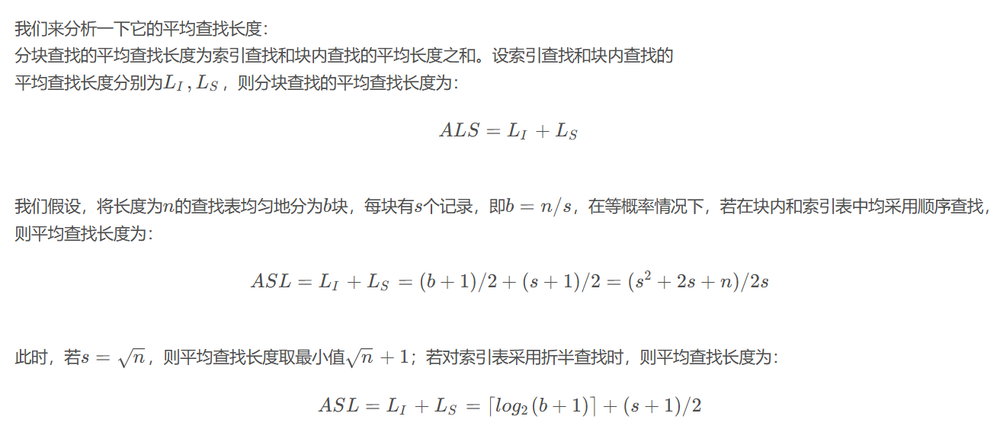

### 三、倒排索引

搜索引擎中涉及很多搜索技术，这里介绍一种最简单，也是最基础的搜索技术：**倒排索引**。

我们举个简单的例子：  
假如下面两篇极短的文章。

1.  Books and friends should be few but good.
2.  A good book is a good friend.

忽略字母大小写，我们统计出每个单词出现在哪篇文章之中：文章1、文章2、文章(1，2)，得到下面这个表，并对单词做了排序：  
  
有了这样一张单词表，我们要搜索文章，就非常方便了。如果你在搜索框中填写“book"关键字。系统就先在这张单词表中有序查找“book" ，找到后将它对应的文章编号1和2的文章地址返回。

在这里这张单词表就是索引表，索引项的通用结构是：

+   **次关键码**，例如上面的“英文单词”；
+   **记录号表**，例如上面的“文章编号"。

**其中记录号表存储具有相同次关键字的所有记录的记录号(可以是指向记录的指针或者是该记录的主关键字)。这样的索引方法就是倒排索引(inverted index) 。**

这名字为什么要叫做“倒排索引”呢？  
顾名思义，倒排索引源于实际应用中需要根据属性(或字段、次关键码)的值来查找记录（或主关键编码）。这种索引表中的每一项都包括一个属性值和具有该属性值的各记录的地址。**由于不是由记录来确定属性值，而是由属性值来确定记录的位置，因而称为倒排索引。**

当然，现实中的搜索技术是非常复杂的，要考虑诸多因素用到诸多技术，由于本文的侧重点并非搜索引擎，所以于此不再赘述。

* * *

## 二叉树排序与平衡二叉树

### 一、二叉排序树

#### 1、定义

二叉排序树(也称二叉查找树)或者是一棵空树，或者是具有下列特性的二叉树:

1.  若左子树非空，则左子树上所有结点的值均小于根结点的值。
2.  若右子树非空，则右子树上所有结点的值均大于根结点的值。
3.  左、右子树也分别是一棵二叉排序树。

根据二叉排序树的定义，左子树结点值<根结点值<右子树结点值，所以对二叉排序树进行中序遍历，可以得到一个递增的有序序列。例如，下图所示二叉排序树的中序遍历序列为123468。  


#### 2、二叉排序树的常见操作

构造一个二叉树的结构：

```c
/*二叉树的二叉链表结点结构定义*/
typedef struct BiTNode
{
	int data;	//结点数据
	struct BiTNode *lchild, *rchild;	//左右孩子指针
} BiTNode, *Bitree;
```

##### （1）查找操作

```c
/*
递归查找二叉排序树T中是否存在key
指针f指向T的双亲，其初始调用值为NULL
若查找成功，则指针p指向该数据元素结点，并返回TRUE
否则指针p指向查找路径上访问的最后一个结点并返回FALSE
*/
bool SearchBST(BiTree T, int key, BiTree f, BiTree *p){
	if(!T){
		*p = f;
		return FALSE;
	}else if(key == T->data){
		//查找成功
		*p = T;
		return TRUE;
	}else if(key < T->data){
		return SearchBST(T->lchild, key, T, p);	//在左子树继续查找
	}else{
		return SearchBST(T->rchild, key, T, p);	//在右子树继续查找
	}
}
```

##### （2）插入操作

有了二叉排序树的查找函数，那么所谓的二叉排序树的插入，其实也就是将关键字放到树中的合适位置而已。

```c
/*
当二叉排序树T中不存在关键字等于key的数据元素时
插入key并返回TRUE，否则返回FALSE
*/
bool InsertBST(BiTree *T, int key){
	BiTree p, s;
	if(!SearchBST(*T, key, NULL, &p)){
		//查找不成功
		s = (BiTree)malloc(sizeof(BiTNode));
		s->data = key;
		s->lchild = s->rchild = NULL;
		if(!p){
			*T = s;	//插入s为新的根节点
		}else if(key < p->data){
			p->lchild = s;	//插入s为左孩子
		}else{
			p->rchild = s;	//插入s为右孩子
		}
		return TRUE;
		}else{
			return FALSE;	//树种已有关键字相同的结点，不再插入
		}
}
```

有了二叉排序树的插入代码，我们要实现二叉排序树的构建就非常容易了，几个例子：

```c
int i;
int a[10] = {62, 88, 58, 47, 35, 73, 51, 99, 37, 93};
BiTree T = NULL;
for(i = 0; i<10; i++){
	InsertBST(&T, a[i]);
}
```

上面的代码就可以创建一棵下图这样的树。  


##### （3）删除操作

二叉排序树的查找和插入都很简单，但是删除操作就要复杂一些，此时要删除的结点有三种情况：

1.  叶子结点；
2.  仅有左或右子树的结点；
3.  左右子树都有的结点；

前两种情况都很简单，第一种只需删除该结点不需要做其他操作；第二种删除后需让被删除结点的直接后继接替它的位置；**复杂就复杂在第三种，此时我们需要遍历得到被删除结点的直接前驱或者直接后继来接替它的位置，然后再删除**。  
第三种情况如下图所示：  


代码如下：

```c
/*
若二叉排序树T中存在关键字等于key的数据元素时，则删除该数据元素结点，
并返回TRUE;否则返回FALSE
*/
bool DeleteBST(BiTree *T, int key){
	if(!T){
		return FALSE; 
	}else{
		if(key == T->data){
			//找到关键字等于key的数据元素
			return Delete(T);
		}else if(key < T -> data){
			return DeleteBST(T -> lchild, key);
		}else{
			return DeleteBST(T -> rchild, key);
		}
	}
}
```

下面是Delete()方法：

```c
/*从二叉排序树中删除结点p，并重接它的左或右子树。*/
bool Delete(BiTree *p){
	BiTree q, s;
	if(p->rchild == NULL){
		//右子树为空则只需重接它的左子树
		q = p;
		p = p->lchild;
		free(q);
	}else if(p->lchild == NULL){
		//左子树为空则只需重接它的右子树
		q = p;
		p = p->rchild;
		free(q);
	}else{
		//左右子树均不空
		q = p;
		s = p->lchild;	//先转左
		while(s->rchild){//然后向右到尽头，找待删结点的前驱
			q = s;
			s = s->rchild;
		}
		//此时s指向被删结点的直接前驱，p指向s的父母节点
		p->data = s->data;	//被删除结点的值替换成它的直接前驱的值
		if(q != p){
			q->rchild = s->lchild;	//重接q的右子树
		}else{
			q->lchild = s->lchild;	//重接q的左子树
		}
		pree(s);
	}
	return TRUE;
}
```

#### 3、性能分析

二叉排序树的优点明显，插入删除的时间性能比较好。而对于二叉排序树的查找，走的就是从根结点到要查找的结点的路径，其比较次数等于给定值的结点在二叉排序树的层数。极端情况，最少为1次，即根结点就是要找的结点，最多也不会超过树的深度。也就是说，**二叉排序树的查找性能取决于二叉排序树的形状**。可问题就在于，二叉排序树的形状是不确定的。  
例如 ${62,88,58,47,35,73,51,99,37,93}$这样的数组，我们可以构建如下左图的二叉排序树。但如果数组元素的次序是从小到大有序，如${35,37,47,51,58,62,73,88,93,99}$,则二叉排序树就成了极端的右斜树，如下面右图的二叉排序树：  
  
也就是说，我们希望二叉排序树是比较平衡的，即其深度与完全二叉树相同，那么查找的时间复杂也就为 $O(logn)$，近似于折半查找。  
不平衡的最坏情况就是像上面右图的斜树，查找时间复杂度为$O(n)$，这等同于顺序查找。  
因此，如果我们希望对一个集合按二叉排序树查找，最好是把它构建成一棵**平衡的二叉排序树**。

* * *

### 二、平衡二叉树

#### 1、定义

**平衡二叉树(Self-Balancing Binary Search Tree 或 Height-Balanced Binary Search Tree)是一种二叉排序树，其中每一个节点的左子树和右子树的高度差至多等于1。**  
它是一种高度平衡的二叉排序树。它要么是一棵空树， 要么它的左子树和右子树都是平衡二叉树，且左子树和右子树的深度之差的绝对值不超过1。我们**将二叉树上结点的左子树深度减去右子树深度的值称为平衡因子BF (Balance Factor)** ， 那么平衡二叉树上所有结点的平衡因子只可能是-1、0和1。只要二叉树上有一个结点的平衡因子的绝对值大于1，则该二叉树就是不平衡的。  


#### 2、平衡二叉树的查找

在平衡二叉树上进行查找的过程与二叉排序树的相同。因此，在查找过程中，与给定值进行比较的关键字个数不超过树的深度。假设以$n_h$​表示深度为$h$的平衡树中含有的最少结点数。显然，有 $n_0 = 0 , n_1 = 1 , n_2 = 2$ ，并且有$n_h​=n_h−1​+n_h−2​+1$。可以证明，含有 $n$个结点的平衡二叉树的最大深度为$O(log2n)$，因此平衡二叉树的平均查找长度为$ O(log2n)$ 如下图所示。  


#### 3、平衡二叉树的插入

二叉排序树保证平衡的基本思想如下：每当在二叉排序树中插入(或删除)一个结点时，首先检查其插入路径上的结点是否因为此次操作而导致了不平衡。若导致了不平衡，则先找到插入路径上离插入结点最近的平衡因子的绝对值大于1的结点A，再对以A为根的子树，在保持二叉排序树特性的前提下，调整各结点的位置关系，使之重新达到平衡。  
**注意:每次调整的对象都是最小不平衡子树，即以插入路径上离插入结点最近的平衡因子的绝对值大于1的结点作为根的子树。下图中的虚线框内为最小不平衡子树。**  
  
平衡二叉树的插入过程的前半部分与二叉排序树相同，但在新结点插入后，若造成查找路径上的某个结点不再平衡，则需要做出相应的调整。可将调整的规律归纳为下列4种情况：

1.  **LL平衡旋转(右单旋转)**。由于在结点A的左孩子(L)的左子树(L)上插入了新结点，A的平衡因子由1增至2，导致以A为根的子树失去平衡，需要一次向右的旋转操作。将A的左孩子B向右上旋转代替A成为根结点，将A结点向右下旋转成为B的右子树的根结点，而B的原右子树则作为A结点的左子树。  
    如下图所示，结点旁的数值代表结点的平衡因子，而用方块表示相应结点的子树，下方数值代表该子树的高度。  
    
2.  **RR平衡旋转(左单旋转)**。由于在结点A的右孩子®的右子树®上插入了 新结点，A的平衡因子由-1减至-2，导致以A为根的子树失去平衡，需要一次向左的旋转操作。将A的右孩子B向左上旋转代替A成为根结点，将A结点向左下旋转成为B的左子树的根结点，而B的原左子树则作为A结点的右子树。  
    
3.  **LR平衡旋转(先左后右双旋转)**。由于在A的左孩子(L)的右子树®上插入新结点，A的平衡因子由1增至2，导致以A为根的子树失去平衡，需要进行两次旋转操作，先左旋转后右旋转。先将A结点的左孩子B的右子树的根结点C向左上旋转提升到B结点的位置（即进行一次**RR平衡旋转(左单旋转)**），然后再把该C结点向右上旋转提升到A结点的位置（即进行一次**LL平衡旋转(右单旋转)**）。
4.  **RL平衡旋转(先右后左双旋转)**。由于在A的右孩子®的左子树(L)上插入新结点，A的平衡因子由-1减至-2，导致以A为根的子树失去平衡，需要进行两次旋转操作，先右旋转后左旋转。先将A结点的右孩子B的左子树的根结点C向右上旋转提升到B结点的位置（即进行一次**LL平衡旋转(右单旋转)**），然后再把该C结点向左上旋转提升到A结点的位置（即进行一次**RR平衡旋转(左单旋转)**）。  
    **注意: LR和RL旋转时，新结点究竟是插入C的左子树还是插入C的右子树不影响旋转过程，而上图中是以插入C的左子树中为例。**

举个例子：  
假设关键字序列为 ${15,3, 7, 10, 9, 8}$，通过该序列生成平衡二叉树的过程如下图所示。  


* * *

## 多路查找树

**多路查找树(muitl-way search tree)， 其每一个结点的孩子数可以多于两个，且每一个结点处可以存储多个元素**。由于它是查找树，所有元素之间存在某种特定的排序关系。  
在这里，每一个结点可以存储多少个元素，以及它的孩子数的多少是非常关键的。常见的有4种特殊形式：2-3树、2-3-4树、B树和B+树。这里主要介绍B树和B+树，因为2-3树、2-3-4树都是B树的特例。  
如下图所示是一颗2-3树：  


### 一、B树

#### 1、定义

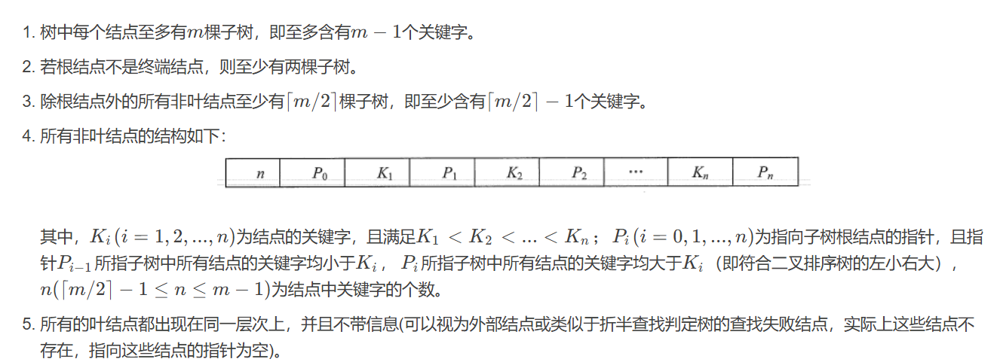
**B树是所有结点的平衡因子均等于0的多路平衡查找树。**  
下图所示的B树中所有结点的最大孩子数 $m = 5$，因此它是一棵5阶B树，在 $m$阶B树中结点最多可以有 $m$个孩子。可以借助该实例来分析上述性质：  


1.  结点的孩子个数等于该结点中关键字个数加1（每一个空隙都存在一个分支）。
2.  如果根结点没有关键字就没有子树，此时B树为空；如果根结点有关键字，则其子树必然大于等于两棵，因为子树个数等于关键字个数加1。
3.  除根结点外的所有非终端结点至少有$⌈m/2⌉=⌈5/2⌉=3$棵子树(即至少有个关键字)，至多有5棵子树(即至多有4个关键字)。
4.  结点中关键字从左到右递增有序，关键字两侧均有指向子树的指针，左边指针所指子树的所有关键字均小于该关键字，右边指针所指子树的所有关键字均大于该关键字。或者看成下层结点关键字总是落在由上层结点关键字所划分的区间内，如第二层最左结点的关键字划分成了3个区间：$(−∞,5),(5,11),(11,+∞)$，该结点3个指针所指子树的关键字均落在这3个区间内。
5.  所有叶结点均在第4层，代表查找失败的位置。

#### 2、B树与磁盘存取

**B树中的大部分操作所需的磁盘存取次数与B树的高度成正比。**

我们的外存，比如硬盘， 是将所有的信息分割成相等大小的页面，每次硬盘读写的都是一个或多个完整的页面，对于一个硬盘来说，一页的长度可能是211到214个字节。  
在一个典型的B树应用中，要处理的硬盘数据量很大，因此无法一次全部装入内存。因此我们会对B树进行调整，使得B树的阶数(或结点的元素)与硬盘存储的页面大小相匹配。比如说一棵B树的阶为1001 (即1个结点包含1000个关键字)，高度为2，它可以储存超过10亿个关键字，我们只要让根结点持久地保留在内存中，那么在这棵树上，寻找某一个关键字至多需要两次硬盘的读取即可。  
通过这种方式，在有限内存的情况下，每一次磁盘的访问我们都可以获得最大数量的数据。由于B树每结点可以具有比二叉树多得多的元素，所以与二叉树的操作不同，它们减少了必须访问结点和数据块的数量，从而提高了性能。可以说，B树的数据结构就是为内外存的数据交互准备的。

#### 3、B树的查找

在B树上进行查找与二叉查找树很相似，只是每个结点都是多个关键字的有序表，在每个结点上所做的不是两路分支决定，而是根据该结点的子树所做的多路分支决定。  
B树的查找包含两个基本操作：①在B树中找结点；②在结点内找关键字。由于B树常存储在磁盘上，因此前一个查找操作是在磁盘上进行的，而后一个查找操作是在内存中进行的，即在找到目标结点后，先将结点信息读入内存，然后在结点内采用顺序查找法或折半查找法。  
在B树上查找到某个结点后，先在有序表中进行查找，若找到则查找成功，否则按照对应的指针信息到所指的子树中去查找。  
  
例如，在上图中查找关键字$42$，首先从根结点开始，根结点只有一个关键字，且$42>22$，若存在，必在关键字$22$的右边子树上，右孩子结点有两个关键字，而 $36<42<45$，则若存在，必在$36$和$45$中间的子树上，在该子结点中查到关键字 42 42 42，查找成功。若查找到叶结点时（对应指针为空指针），则说明树中没有对应的关键字，查找失败。

#### 4、B树的插入

与二叉查找树的插入操作相比，B树的插入操作要复杂得多。在二叉査找树中，仅需査找到需插入的终端结点的位置。但是，在B树中找到插入的位置后，并不能简单地将其添加到终端结点中，因为此时可能会导致整棵树不再满足B树定义中的要求。将关键字key插入B树的过程如下：

1.  定位。利用前述的B树査找算法，找出插入该关键字的最低层中的某个非叶结点(在B树中查找key时,会找到表示查找失败的叶结点,这样就确定了最底层非叶结点的插入位置。注意：插入位置一定是最低层中的某个非叶结点)。
2.  插入。在B树中，每个非失败结点的关键字个数都在区间\[⌈m/2⌉−1,m−1\]内。插入后的结点关键字个数小于 $m$，可以直接插入；插入后检查被插入结点内关键字的个数，当插入后的结点关键字个数大于$m−1$时，必须对结点进行分裂。

分裂的方法是：取一个新结点，在插入key后的原结点，从中间位置$⌈m/2⌉$将其中的关键字分为两部分，左部分包含的关键字放在原结点中，右部分包含的关键字放到新结点中，中间位置$⌈m/2⌉$的结点插入原结点的父结点。若此时导致其父结点的关键字个数也超过了上限，则继续进行这种分裂操作，直至这个过程传到根结点为止,进而导致B树高度增1。  
对于 $m=3$的B树，所有结点中最多有$ m − 1 = 2 $个关键字，若某结点中已有两个关键字，则结点已满，如下图a所示。插入一个关键字 $60$后，结点内的关键字个数超过了 $m−1$，如图b所示，此时必须进行结点分裂，分裂的结果如图c所示。  

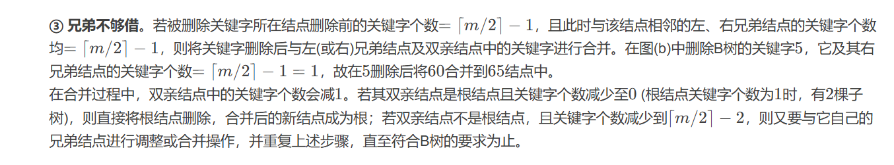
**通俗点讲，B树的插入，结点不溢出时好说，直接插入；如果结点溢出那就分裂，并把中间结点合并到父节点。**
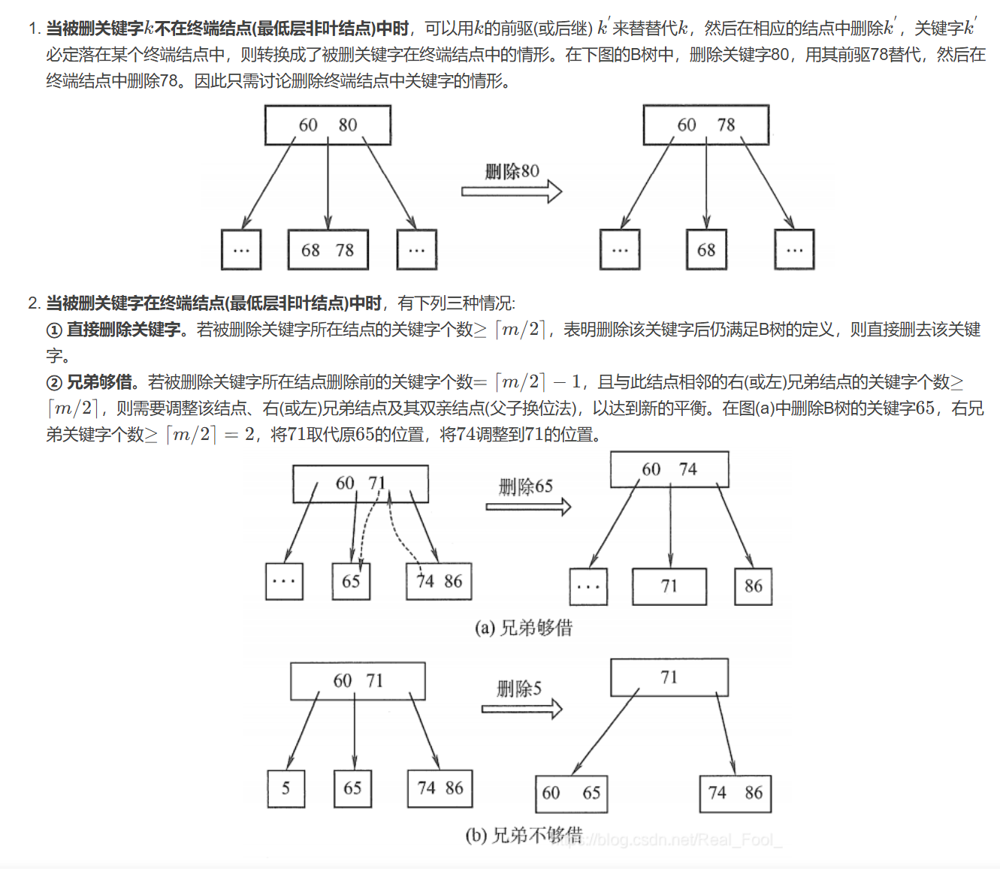
**其实通俗点讲，B树的删除，删除结点无非就是多留少补的情况，多留不必多说；少补复杂点：当兄弟够借时，就向左旋转一次（即往左挪一个位置，重构根节点关键字的前驱和后继）；当兄弟不够借时就拆根节点，合并到兄弟结点，合并拆分要始终保证B树平衡，理清了就很容易理解。**

### 二、B+树

尽管B树的诸多好处，但其实它还是有缺陷的。对于树结构来说，我们都可以通过中序遍历来顺序查找树中的元素，这一切都是在内存中进行。可是在B树结构中，我们往返于每个结点之间也就意味着，我们必须得在硬盘的页面之间进行多次访问。  
  
如上图所示。我们希望遍历这棵B树，假设每个结点都属于硬盘的不同页面，我们中序遍历所有的元素： 页面 2 → 页面 1 → 页面 3 → 页面 1 → 页面 4 → 页面 1 → 页面 5 页面2→页面1→页面3→页面1→页面4→页面1→页面5 页面2→页面1→页面3→页面1→页面4→页面1→页面5而且我们每次经过结点遍历时，都会对结点中的元素进行一次遍历，这就非常糟糕。有没有可能让遍历时每个元素只访问一次呢?  
B+树来了。

#### 1、定义

B+树是应文件系统（比如数据库）所需而出现的一种B树的变形树。

下图所示为一棵4阶B+树。  


B+树的结构特别适合带有范围的查找。比如查找我们学校18~22岁的学生人数，我们可以通过从根结点出发找到第一个18岁的学生，然后再在叶子结点按顺序查找到符合范围的所有记录。  
B+树的插入、删除过程也都与B树类似，只不过插入和删除的元素都是在叶子结点上进行而已。


* * *

## 散列表查找（哈希表）

### 一、散列表查找的基本概念

**散列表**是根据关键字而直接进行访问的数据结构。也就是说，散列表建立了关键字和存储地址之间的一种直接映射关系。我们只需要通过某个函数f，使得 存储位置 = f ( 关键字 ) 存储位置=f(关键字) 存储位置\=f(关键字)那样我们可以通过查找关键字不需要比较就可获得需要的记录的存储位置。

**散列技术**既是一种存储方法， 也是一种查找方法，散列技术是在记录的存储位置和它的关键字之间建立一个确定的对应关系f，使得每个关键字key对应一个存储位置 f ( k e y ) f(key) f(key)。查找时，根据这个确定的对应关系找到置上。  
这里我们把这种对应关系 f f f称为**散列函数**，又称为**哈希(Hash) 函数**。按这个思想，采用散列技术将记录存储在一块连续的存储空间中，这块连续存储空间称为**散列表**或**哈希表(Hash table)**。那么关键字对应的记录存储位置我们称为**散列地址**。

散列函数可能会把两个或两个以上的不同关键字映射到同一地址，称这种情况为**冲突**，这些发生碰撞的不同关键字称为**同义词**。一方面，设计得好的散列函数应尽量减少这样的冲突；另一方面，由于这样的冲突总是不可避免的，所以还要设计好处理冲突的方法。

理想情况下，对散列表进行查找的时间复杂度为 $O(1)$，即与表中元素的个数无关。

### 二、散列函数的构造方法

在构造散列函数时，必须注意以下几点：

1.  散列函数的定义域必须包含全部需要存储的关键字，而值域的范围则依赖于散列表的大小或地址范围。
2.  散列函数计算出来的地址应该能等概率、均匀地分布在整个地址空间中，从而减少冲突的发生。
3.  散列函数应尽量简单，能够在较短的时间内计算出任一关键字对应的散列地址。

下面介绍常用的散列函数。

#### 1、直接定址法

直接取关键字的某个线性函数值为散列地址，散列函数为

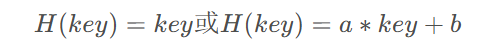

a和b是常数。这种方法计算最简单，且不会产生冲突。它适合关键字的分布基本连续的情况，若关键字分布不连续，空位较多，则会造成存储空间的浪费。  
举例：0~100岁的人口数字统计表，可以吧年龄数值直接当做散列地址。

#### 2、数字分析法

例如当手机号码为关键字时，其11位数字是有规则的，此时是无需把11位数值全部当做散列地址，这时我们给关键词抽取， 抽取方法是使用关键字的一部分来计算散列存储位置的方法，这在散列函数中是常常用到的手段。  
数字分析法通常适合处理关键字位数比较大的情况，如果事先知道关键字的分布且关键字的若干位分布较均匀，就可以考虑用这个方法。这种方法适合于已知的关键字集合，若更换了关键字，则需要重新构造新的散列函数。

#### 3、平方取中法

这个方法计算很简单，假设关键字是1234，那么它的平方就是1522756，再抽取中间的3位就是227，用做散列地址。再比如关键字是4321，那么它的平方就是18671041，抽取中间的3位就可以是671，也可以是710，用做散列地址。平方取中法比较适合于不知道关键字的分布，而位数又不是很大的情况。

#### 4、除留余数法

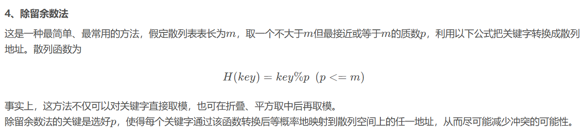

#### 5、随机数法

选择一个随机数，取关键字的随机函数值为它的散列地址。也就是

这里random是随机函数。当关键字的长度不等时，采用这个方法构造散列函数是比较合适的。

### 三、处理散列冲突


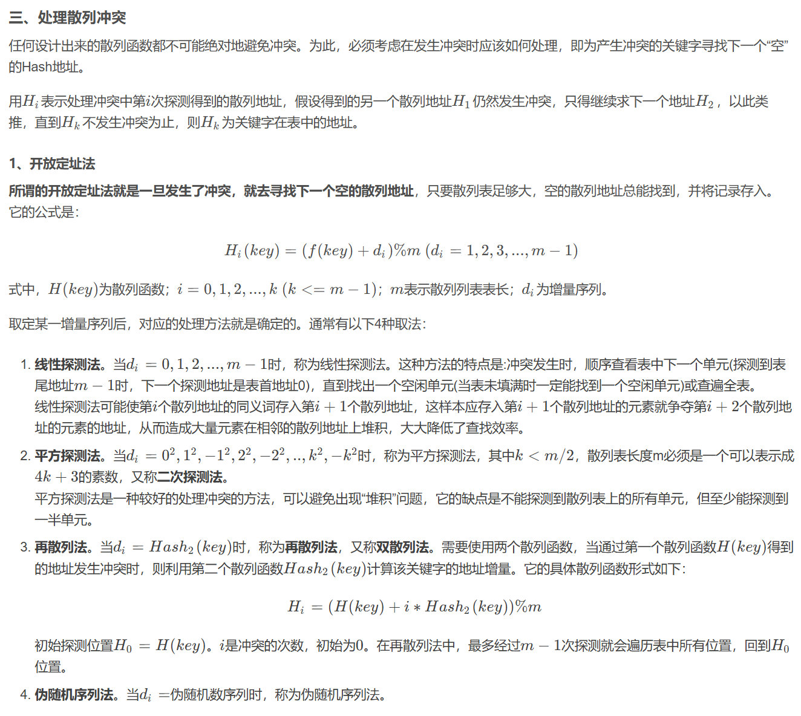

> 注意:在开放定址的情形下，不能随便物理删除表中的已有元素，因为若删除元素，则会截断其他具有相同散列地址的元素的查找地址。因此，要删除一个元素时，可给它做一个删除标记，进行逻辑删除。但这样做的副作用是：执行多次删除后，表面上看起来散列表很满，实际上有许多位置未利用，因此需要定期维护散列表，要把删除标记的元素物理删除。

#### 2、链地址法（拉链法）

**不换地方。**  
转换一下思路，为什么非得有冲突就要换地方呢，如果不换地方该怎么处理？于是我们就有了链地址法。

将所有关键字为同义词的记录存储在一个单链表中，我们称这种表为同义词子表，在散列表中只存储所有同义词子表的头指针。

例如，关键字序列为 ${ 12 , 67 , 56 , 16 , 25 , 37 , 22 , 29 , 15 , 47 , 48 , 34 }$ ，我们用除留余数法构造散列函数H(key)\=key%12，用拉链法处理冲突，建立的表如下图所示。  


#### 3、公共溢出区法

这个方法其实就更加好理解，就是把凡是冲突的家伙额外找个公共场所待着。我们**为所有冲突的关键字建立了一个公共的溢出区来存放**。

就前面的例子而言，我们共有三个关键字 37 , 48 , 34 {37,48,34} 37,48,34与之前的关键字位置有冲突，那么就将它们存储到溢出表中，如下图所示。  
  
如果相对于基本表而言，有冲突的数据很少的情况下，公共溢出区的结构对查找性能来说还是非常高的。

### 四、散列表查找实现

#### 1、算法

首先是需要定义一个散列表的结构以及一些相关的常数。其中HashTable就是散列表结构。结构当中的elem为一个动态数组。

```c
#define SUCCESS 1;
#define UNSUCCESS 0;
#define HASHSIZE 12;	//定义散列表表长为数组的长度
#define NULLKEY -32768;	//代表空地址
typedef struct{
	int *elem;	//数组元素存储基址，动态分配数组
	int count;	//当前数据元素个数
}HashTable;
int m=0;	//散列表表长，全局变量
```

有了结构的定义，我们可以对散列表进行初始化。

```c
/*初始化散列表*/
bool InitHashTable(HashTable *H){
	int i;
	m=HASHSIZE;
	H->count=m;
	H->elem=(int *)malloc(m*sizeof(int));
	for(i=0; i<m; i++){
		H->elem[i]=NULLKEY;
	}
	return TRUE;
}
```

为了插入时计算地址，我们需要定义散列函数，散列函数可以根据不同情况更改算法。

```c
/*散列函数*/
int Hash(int key){
	return key % m;	//除留余数法
}
```

初始化完成后，我们可以对散列表进行插入操作。假设我们插入的关键字集合就是前面的 ${ 12 , 67 , 56 , 16 , 25 , 37 , 22 , 29 , 15 , 47 , 48 , 34 }$ 

```c
/*插入关键字进散列表*/
void InsertHash(HashTable *H, int key){
	int addr = Hash(key);	//通过散列函数求散列地址
	//如果不为空。则冲突
	while (H->elem[addr] != NULLKEY){
		addr = (addr + 1) % m;	//开放定址法的线性探测
	}
	H->elem[addr] = key;	//直到有空位后插入关键字
}
```

代码中插入关键字时，首先算出散列地址，如果当前地址不为空关键字，则说明有冲突。此时我们应用开放定址法的线性探测进行重新寻址，此处也可更改为链地址法等其他解决冲突的办法。

散列表存在后，我们在需要时就可以通过散列表查找要的记录。

```c
/*
散列表查找关键字
找到后用addr保存地址
*/
bool SerachHash(HashTable H, int key, int *addr){
	*addr = Hash(key);	//通过散列函数求得散列地址
	//如果不为空，则有同义词冲突
	while(H.elem[*addr] != key){
		*addr = (*addr+1) % m;	//开放地址法的线性探测
		if(H.elem[*addr] == NULLKEY || *addr == Hash(key)){
			//如果循环到空址或回到原点
			return FALSE;	//则说明关键字不存在
		}
	}
	return TRUE;
}
```

查找的代码与插入的代码非常类似，只需做一个不存在关键字的判断而已。

#### 2、性能分析

从散列表的查找过程可见：

1.  虽然散列表在关键字与记录的存储位置之间建立了直接映像，但由于“冲突”的产生，使得散列表的查找过程仍然是一个给定值和关键字进行比较的过程。因此，仍需要以平均查找长度作为衡量散列表的查找效率的度量。
2.  散列表的查找效率取决于三个因素：散列函数、处理冲突的方法和装填因子。
3.  若用 $c_i$​表示每一个关键字查找的次数，则平均查找次数可表示为：
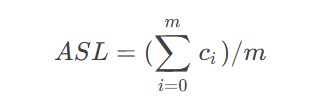

**装填因子**。散列表的装填因子一般记为 $α$，定义为一个表的装满程度，即
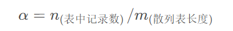
​散列表的平均查找长度依赖于散列表的装填因子 $α$，而不直接依赖于 $n$或 $m$。直观地看， $α$ 越大，表示装填的记录越“满”，发生冲突的可能性越大，反之发生冲突的可能性越小。

不管记录个数$n$有多大，我们总可以选择一个合适的装填因子以便将平均查找长度限定在一个范围之内，此时我们散列查找的时间复杂度就真的是 $O(1)$了。 为了做到这一点，通常我们都是将散列表的空间设置得比查找集合大，此时虽然是浪费了一定的空间，但换来的是查找效率的大大提升，总的来说，还是非常值得的。

---
@title: 查找
@date: 2025-01-08 17:00:00
@version: 1.0.0
@copyright: Copyright (c) 2023 软件工程宋浩元