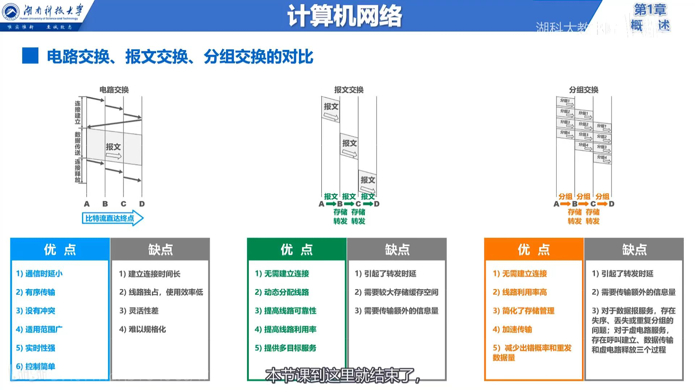
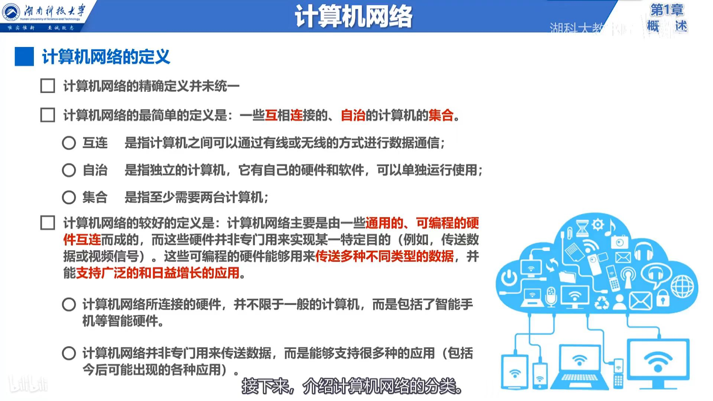
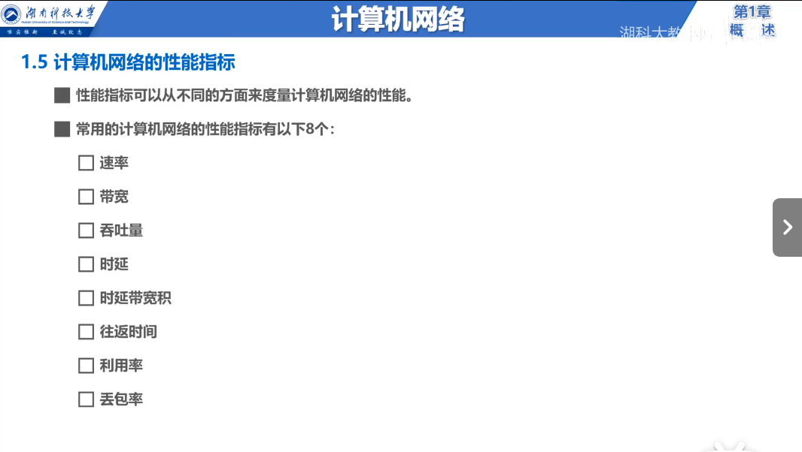

# 第一章 计算机网络概述

### 1.3 交换方式

### 1.4 计算机网络概念

### 1.5 性能指标

#### 1.5.1 速率
单位时间内传送的数据量，单位为bit/s。

#### 1.5.2 时延
数据从一点发送到另一点所需要的时间，单位为s。

#### 1.5.3 带宽
单位时间内通过信道传输的数据量，单位为bit/s。

#### 1.5.4 时延带宽积
时延乘以带宽，单位为s*bit/s。

#### 1.5.5 吞吐量
单位时间内通过信道传输的数据量，单位为bit/s。

#### 1.5.6 利用率
信道利用率，即信道上实际传输数据的比率，单位为百分比。

#### 1.5.7 丢包率
信道上丢失的数据包的比率，单位为百分比。

#### 1.5.8 往返时延RTT
两台计算机之间往返一次所需的时间，单位为s。