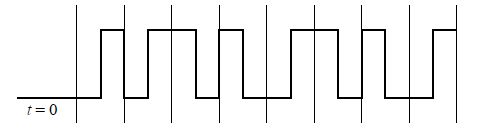

> 答案为黄老师的标准答案，解析主要由 豆包 生成请仔细甄别

# 传输介质

### 1. 题目

Which is one of the key features of Global Positioning System (GPS)?  
**答案：** C  
**解析：**  
全球定位系统（GPS）的核心特点之一是提供精确的时间信息。选项 A 错误，因为现代 GPS 的定位精度通常在数米范围内（而非 2 公里）；选项 B 错误，GPS 约由 30 颗卫星组成，而非 1200 颗；选项 D 错误，GPS 对全球用户开放，并非仅美国用户可用。GPS 卫星通过发射高精度时间信号，为网络同步、科研等场景提供关键时间基准，因此选项 C 正确。

### 2. 题目

Which of the following energies can traverse long distances and penetrate objects such as the walls of a building?  
**答案：** D  
**解析：**  
能够长距离传输并穿透建筑物墙壁等物体的能量形式是无线电波（选项 D）。无线电波属于电磁波，可自由穿透非导电材料，适用于 Wi-Fi、移动网络等无线通信场景。电能（选项 A）需依赖导体传输，无法在空气中长距离传播；热能（选项 B）扩散快、传输距离有限；光（选项 C）易被障碍物阻挡，无法穿透墙壁，因此均不符合要求。

### 3. 题目

Which of the following is NOT the form of energy used in computer networks?  
**答案：** B  
**解析：**  
计算机网络中不使用的能量形式是热能（选项 B）。具体分析如下：

- 电能（选项 A）用于铜缆（如以太网）传输数据；
- 光（选项 C）通过光纤实现高速通信；
- 无线电波（选项 D）支持 Wi-Fi、蓝牙等无线网络。  
  热能是网络设备能耗的副产品，无法承载信息传输，因此不属于网络使用的能量形式。

### 4. 题目

In a factory that uses electric arc welding equipment, （ ） is the BEST wiring for short-distance communication.  
**答案：** C  
**解析：**  
在使用电弧焊接设备的工厂中，短距离通信的最佳布线方式是同轴电缆（选项 C）。电弧焊接会产生强电磁干扰（EMI），而同轴电缆的编织屏蔽层能有效阻隔 EMI，适合高干扰环境。非屏蔽双绞线（选项 A）无屏蔽层，易受干扰；屏蔽双绞线（选项 B）屏蔽效果弱于同轴电缆；光纤（选项 D）虽抗干扰但成本高，不适用于短距离场景，因此选项 C 为最优解。

### 5. 题目

To reduce the interference caused by random electromagnetic radiation, communication systems DO NOT use （ ） .  
**答案：** B  
**解析：**  
为减少随机电磁辐射干扰，通信系统不使用平行双绞线（选项 B）。原因如下：

- 双绞线（选项 A）通过线缆绞合抵消电磁感应，降低干扰；
- 同轴电缆（选项 C）的屏蔽层可阻隔外部干扰；
- 平行双绞线未绞合，导线形成的环路面积大，易受电磁辐射感应，加剧干扰，因此通信系统通常不采用该类型布线。

### 6. 题目

Which of the following media is used in RJ-45 wire cable?  
**选项：**  
A. twisted pair wire  
B. parallel pair wire  
C. coaxial cable  
D. fiber  
**答案：** A  
**解析：**  
RJ-45 网线的核心传输介质是双绞线（A）。其接口标准适配非屏蔽双绞线（UTP）或屏蔽双绞线（STP），绞合结构能有效降低电磁干扰。平行双绞线（B）因抗干扰能力弱未被采用；同轴电缆（C）通过 BNC 等接口连接，光纤（D）使用 SC/LC 等专用接口，均与 RJ-45 不兼容。

### 7. 题目

Communication to a satellite uses （ ） energy.  
**选项：**  
A. light  
B. heat  
C. radio  
D. electrical  
**答案：** C  
**解析：**  
卫星通信依赖无线电波（C）传输。微波频段（如 C/Ku 波段）的无线电波可穿透大气层，实现天地通信。光能（A）在大气中衰减严重，热能（B）和电能（D）无法在自由空间中有效传输信息，因此排除其他选项。

### 8. 题目

Optical fiber is more desirable than copper wiring, EXCEPT:  
**选项：**  
A. Resistance to electrical noise.  
B. Higher bandwidth.  
C. Lower overall cost.  
D. Less signal energy loss.  
**答案：** C  
**解析：**  
光纤的劣势是“总体成本更低”（C）。具体对比：

- 抗电磁干扰（A）：光纤为绝缘介质，不受 EMI 影响；
- 高带宽（B）：单模光纤可支持 100Gbps 以上传输；
- 低衰减（D）：1550nm 波长下衰减仅 0.2dB/km。  
  但光纤的敷设、熔接设备成本显著高于铜缆，故 C 为正确答案。

### 9. 题目

（ ） may NOT be sufficient to run above the ceiling in an office building on top of a florescent light fixture.  
**选项：**  
A. twisted pair wiring  
B. coaxial cable  
C. shielded twisted pair  
D. none of above  
**答案：** A  
**解析：**  
荧光灯镇流器会产生强电磁干扰，非屏蔽双绞线（A）因无屏蔽层，易受干扰导致信号失真。同轴电缆（B）的金属屏蔽层和屏蔽双绞线（C）的铝箔/编织网能有效抗干扰，因此 A 为正确选项。

### 10. 题目

10BASE-T uses （ ） cable.  
**选项：**  
A. thick coaxial  
B. unshielded twisted-pair  
C. thin coaxial  
D. fiber-optic  
**答案：** B  
**解析：**  
10BASE-T 中的“T”代表双绞线（Twisted Pair），标准使用非屏蔽双绞线（B）。其传输速率 10Mbps，采用星型拓扑。粗同轴电缆（A）对应 10BASE-5，细同轴电缆（C）对应 10BASE-2，光纤（D）对应 10BASE-F，均与标准不符。

### 11. 题目

RJ-45 network cable with which we connect two computers uses （ ） cable.  
**选项：**  
A. parallel-pair  
B. twisted-pair  
C. coaxial  
D. fiber-optic  
**答案：** B  
**解析：**  
RJ-45 接口的网线本质是双绞线（B），如 CAT5e/CAT6 线缆。平行双绞线（A）因串扰严重未被应用；同轴电缆（C）和光纤（D）分别使用 BNC/SC 接口，与 RJ-45 不兼容，故 B 正确。

### 12. 题目

The （ ） is not affected by electromagnetic interference or noise.  
**选项：**  
A. satellite  
B. twisted-pair  
C. coaxial  
D. optical fiber  
**答案：** D  
**解析：**  
光纤（D）完全不受电磁干扰影响，因其通过光信号传输，玻璃纤芯为绝缘材料。卫星（A）可能受太阳活动等电磁辐射影响；双绞线（B）和同轴电缆（C）为铜质介质，易受 EMI 干扰，故 D 正确。

### 13. 题目

Which of the following can be used with especially strong electrical noise?  
**选项：**  
A. parallel-pair  
B. twisted-pair  
C. coaxial  
D. none of above  
**答案：** C  
**解析：**  
同轴电缆（C）的金属屏蔽层（如铜网）能有效隔离强电磁干扰，适用于工业环境等强电噪声场景。平行双绞线（A）无抗干扰设计，双绞线（B）的绞合结构仅能抑制普通干扰，面对强噪声时性能不足，因此 C 为正确选项。

### 14. 题目

Which of the following technologies is used in 4G network?  
**选项：**  
A. radio  
B. twisted-pair  
C. coaxial  
D. optical  
**答案：** A  
**解析：**  
4G 网络（如 LTE）基于无线电波（A）传输，通过基站与终端的无线通信实现数据交互。双绞线（B）、同轴电缆（C）为有线介质，光纤（D）用于骨干网传输，均非终端接入技术，故 A 正确。

### 15. 题目

Which technology is used in the connection between a smart phone and a speaker?  
**选项：**  
A. GPRS  
B. GPS  
C. Bluetooth  
D. Ethernet  
**答案：** C  
**解析：**  
智能手机与音箱的连接通常使用蓝牙（C）技术，属于短距离无线通信标准。GPRS（A）为移动数据网络，GPS（B）用于定位，以太网（D）为有线网络，均不适用，故 C 正确。

### 16. 题目

关于单模光纤，下面的描述中错误的是（ ）。  
**选项：**  
A. 芯线由玻璃或塑料制成  
B. 比多模光纤芯径小  
C. 光波在芯线中以多种反射路径传播  
D. 比多模光纤的传输距离远  
**答案：** C  
**解析：**  
单模光纤的核心特性是“光波以单一轴向路径传播”，而非“多种反射路径”（C 错误）。具体分析：

- **A 正确**：芯线材料为玻璃（石英）或塑料（如 PMMA）；
- **B 正确**：单模芯径通常为 8~10μm，多模为 50~62.5μm；
- **D 正确**：单模因无模式色散，传输距离可达数十公里，多模仅数百米。  
  多模光纤因芯径较粗，允许光以不同角度反射传播（即多模式传输），而单模光纤通过极小芯径约束光沿直线传播，故 C 为错误描述。

# 局域异步通信

### 1. 题目

In RS-232-C, （ ） voltage corresponds to logical 1.  
**选项：**  
A. increasing  
B. decreasing  
C. negative  
D. positive  
**答案：** C  
**解析：**  
RS-232-C 采用负逻辑电平：

- 逻辑 1（MARK）对应-3V~-15V 的负电压；
- 逻辑 0（SPACE）对应+3V~+15V 的正电压。  
  因此 C 正确。

### 2. 题目

RS-232 DB9 uses （ ） transmission during the communication.  
**选项：**  
A. simplex  
B. half duplex  
C. full duplex  
D. none  
**答案：** C  
**解析：**  
RS-232 DB9 接口支持全双工（C）通信：

- 发送线（TXD）和接收线（RXD）独立传输，允许数据同时双向传输；
- 单工（A）仅单向传输，半双工（B）需分时双向传输，均不符合 RS-232 特性。

### 3. 题目

The RS-232 standard sends each bit of the character, and follows each character with an idle period （ ） bit(s) long.  
**选项：**  
A. no  
B. one  
C. at least one  
D. at most one  
**答案：** C  
**解析：**  
RS-232 在字符传输后需至少 1 位的空闲期（C）：

- 每个字符由起始位、数据位、校验位、停止位组成；
- 传输完成后，线路需保持逻辑 1 状态（负电压），空闲期长度 ≥1 位时间，以区分下一个字符的起始位。

### 4. 题目

Which is correct about RS-232-C?  
**选项：**  
A. The connection must be less than 15 feet long.  
B. The voltage ranges from -50 volts to +50 volts.  
C. A sender transmits an extra 1 bit (called a start bit) before transmitting a character.  
D. A sender must can send characters without leaving the line idle between them.  
**答案：** D  
**解析：**

- **D 正确**：发送方可以连续发送字符，无需在字符间强制保持空闲期，空闲期仅在无数据传输时存在。
- **A 错误**：RS-232 建议传输距离 ≤15 米（约 50 英尺），而非 15 英尺；
- **B 错误**：标准电压范围为-15V~+15V，非-50V~+50V；
- **C 错误**：起始位（start bit）是每个字符的首个位，而非“额外位”，用于标识字符开始。

### 5. 题目

Which of the following about RS-232-C is correct?  
**选项：**  
A. RS-232-C specifies that a sender transmits a start bit before transmitting the bits of a character, and a stop bit is appended to each character.  
B. When it finishes transmission, the sender leaves the wire with a positive voltage until another character is ready for transmission.  
C. RS-232-C uses voltage ranging from -5 volts to +5 volts.  
D. Negative voltage corresponds to logical 0, while positive voltage corresponds to logical 1.
**答案：** A  
**解析：**

- **A 正确**：RS-232 规定每个字符前有 1 位起始位（逻辑 0），末尾有 1 或 2 位停止位（逻辑 1），用于同步字符传输。
- **B 错误**：传输完成后，线路应保持逻辑 1（负电压），而非正电压；
- **C 错误**：标准电压范围为-3V~-15V（逻辑 1）和+3V~+15V（逻辑 0），-5V~+5V 仅为部分设备的实现范围，非标准定义。

### 题目 6

**Question:** Which of the following about RS-232-C is WRONG?  
**Options:**  
A. Each data item represents one character in keyboard.  
B. Once transmission begins, a sender transmits a start bit, all bits of the characters, and there is one stop bit at the end of transmission.  
C. The connection must be less than 50-feet long.  
D. The hardware can be configured to control the exact number of bits per second.  
**Answer:** B  
**解析：**  
RS-232-C 是异步串行通信标准。选项 B 错误，因为在 RS-232-C 中，每个字符传输时，发送方会先发送一个起始位（start bit），接着传输字符的所有数据位，**最后跟随 1 个或多个停止位（stop bit）**，而非“仅 1 个停止位”。停止位的数量可配置（如 1 位、1.5 位或 2 位），并非固定 1 位。其他选项中：

- A 正确，每个数据项通常对应键盘输入的一个字符。
- C 正确，RS-232-C 的传输距离通常限制在 50 英尺以内以避免信号衰减。
- D 正确，硬件可配置波特率（如 9600bps、115200bps 等），控制数据传输速率。

### 题目 7

**Question:** Which of the following about RS-232-C is WRONG?  
**Options:**  
A. It is used for asynchronous, serial communication over short distances.  
B. Negative voltage corresponds to logical 0, while positive voltage means logical 1.  
C. A sender transmits all bits of the byte one after another with no delay between them.  
D. RS-232-C uses voltage ranging from -15 volts to +15 volts.  
**Answer:** B  
**解析：**  
选项 B 错误，RS-232-C 的电压逻辑定义为：**负电压（-3V~-15V）对应逻辑 1，正电压（+3V~+15V）对应逻辑 0**，与选项描述相反。其他选项中：

- A 正确，RS-232-C 用于短距离异步串行通信。
- C 正确，发送方按顺序传输字节的所有位，位之间无延迟（仅在字符间可能有空闲期）。
- D 正确，RS-232-C 的标准电压范围为-15V~+15V，实际应用中常见-12V 和+12V。

### 题目 8

**Question:** Which of the following standards has the HIGHEST bit rate?  
**Options:**  
A. RS-232-C  
B. 10BaseT  
C. ASDL  
D. OC-3  
**Answer:** D  
**解析：**  
各选项的比特率如下：

- A（RS-232-C）：最高约 115.2 kbps，适用于低速串行通信。
- B（10BaseT）：以太网标准，传输速率为 10 Mbps。
- C（ASDL，非对称数字用户线）：下行速率最高约 8 Mbps，上行速率较低。
- D（OC-3，光载波 3 级）：属于 SONET/SDH 标准，传输速率为 **155.52 Mbps**，是选项中最高的。  
  因此，D 正确。

### 题目 9

**Question:** Which of the following statement is WRONG?  
**Options:**  
A. Computers CANNOT tell whether they are on a single segment or a bridged LAN.  
B. The RS-232-C connection must be less than 50-feet long.  
C. ARP helps to translate a human-readable symbol to MAC address.  
D. A hub can only support one transmission at a time.  
**Answer:** C  
**解析：**  
选项 C 错误，ARP（地址解析协议）的作用是**将 IP 地址映射为 MAC 地址**，而“人类可读的符号”通常指域名（如www.example.com），域名解析由DNS（域名系统）负责，而非ARP。其他选项中：

- A 正确，计算机无法直接感知网络是否通过网桥分段，因网桥工作在数据链路层，对上层透明。
- B 正确，RS-232-C 的传输距离通常限制在 50 英尺内。
- D 正确，集线器（hub）属于物理层设备，所有端口共享同一冲突域，同一时间仅能支持一次传输，存在冲突问题。

### 题目 10

**题面**：Which way is used during the communication by RS-232 DB9?  
A. simplex transmission  
B. half duplex transmission  
C. full duplex transmission  
D. none

**答案**：C

**解析**：  
RS-232 DB9 接口采用的是全双工（Full Duplex）传输方式。全双工通信允许数据在两个方向上同时传输，发送端和接收端可以同时工作，互不干扰。例如，DB9 接口中的 TXD（发送）和 RXD（接收）引脚可独立传输数据，使得通信双方能同时发送和接收信息，这符合全双工传输的特点。而单工（Simplex）只能单向传输，半双工（Half Duplex）虽能双向传输但同一时间只能单向工作，均不符合 RS-232 的通信机制，因此正确答案为 C。

# 远距离通信

### 题目 1

**题面**：The unit of transmission rate "b/s" represents:  
A. bit per second  
B. baud per second  
C. byte per second  
D. byte or second

**答案**：A

**解析**：  
“b/s”是传输速率的单位，其中“b”代表比特（bit），“s”代表秒（second），因此“bit per second”（比特/秒）是正确解释。选项 B 中的“baud”（波特）是信号变化的速率单位，与比特率不同；选项 C 的“byte per second”（字节/秒）应表示为“B/s”（大写 B），1 字节等于 8 比特；选项 D 表述错误。

### 题目 2

**题面**：There are three primary techniques that modulate an electromagnetic carrier according to a signal, except for （ ） modulation.  
A. amplitude  
B. frequency  
C. phrase  
D. time

**答案**：D

**解析**：  
调制电磁波载波的三种基本技术是：

- **幅度调制（Amplitude Modulation, AM）**：改变载波的振幅；
- **频率调制（Frequency Modulation, FM）**：改变载波的频率；
- **相位调制（Phase Modulation, PM）**：改变载波的相位（题中选项 C 应为“phase”拼写错误）。  
  而“时间调制（Time Modulation）”并非三种基本调制技术之一，因此选 D。

### 题目 3

**题面**：By eliminating unused slots, （ ） TDM takes less time to send the same amount of data.  
A. hierarchical  
B. normal  
C. statistical  
D. synchronous

**答案**：C

**解析**：  
时分复用（TDM）分为同步时分复用（Synchronous TDM）和统计时分复用（Statistical TDM）：

- **同步 TDM**：为每个设备分配固定时间槽，即使设备无数据传输，时间槽也会空闲；
- **统计 TDM**：动态分配时间槽，仅当设备有数据时才占用槽位，消除了未使用的槽位，因此在传输相同数据量时耗时更少。  
  选项 A（分层）和 B（常规）不属于 TDM 的主要分类，因此正确答案为 C。

### 题目 4

**题面**：By Shannon Theorem, faster transmission speeds will only be possible if the （ ） can be improved.  
A. signal-to-noise ratio  
B. topology  
C. signal intensity  
D. noise intensity

**答案**：A

**解析**：  
香农定理（Shannon Theorem）指出，信道的最大数据传输速率（带宽）与信噪比（Signal-to-Noise Ratio, SNR）相关，公式为：  
\[ C = B \cdot \log_2(1 + \text{SNR}) \]  
其中，\( C \) 为最大传输速率，\( B \) 为信道带宽。当信噪比（SNR）提高时，信道容量 \( C \) 增大，传输速度可提升。选项 B（拓扑结构）、C（信号强度）、D（噪声强度）中，仅信噪比是香农定理中的关键参数，因此选 A。

### 题目 5

**题面**：Cable modem uses （ ） division multiplexing.  
A. frequency  
B. wavelength  
C. time  
D. code

**答案**：A

**解析**：  
电缆调制解调器（Cable Modem）利用有线电视（CATV）的同轴电缆传输数据，采用**频分复用（Frequency Division Multiplexing, FDM）** 技术：

- 将电缆的频段划分为上行信道（用户到网络）和下行信道（网络到用户），不同频段同时传输不同方向的数据，彼此不干扰。  
  选项 B（波分复用，WDM）用于光纤通信，基于光的波长划分；选项 C（时分复用，TDM）基于时间槽划分；选项 D（码分复用，CDM）基于编码区分信号，均不符合 Cable Modem 的技术特点，因此选 A。

### 题目 6

**Question:** China Unicom and China Telecom received their 4G standard license FDD-LTE in Feb. 2015. The principle of （ ） division duplex is similar to FDD.  
**Options:**  
A. code  
B. space  
C. time  
D. wave  
**Answer:** D  
**解析：**  
FDD（频分双工）通过划分不同频率频段实现上下行数据传输，而**波分双工（Wave Division Duplex）** 的原理与其相似。在光纤通信中，波分复用（WDM）利用不同波长（光的频率）区分信道，本质上与 FDD 的频分思想一致。选项 A（码分）、B（空分）、C（时分）均与 FDD 的频分原理无关，因此选 D。

### 题目 7

**Question:** If a transmission system uses K possible signal levels and has an analog bandwidth B, the Nyquist Theorem states that the maximum data rate in bits per second, D, is:  
**Options:**  
A. D=2B+log₂K  
B. D=2B log₂K  
C. D=2BK  
D. D=log₂(1+2BK)  
**Answer:** B  
**解析：**  
奈奎斯特定理指出，无噪声信道的最大数据速率公式为：  
\[ D = 2B \log_2 K \]  
其中：

- \( B \) 为信道带宽（Hz），
- \( K \) 为信号电平数。  
  该公式表明，数据速率与带宽和信号电平数的对数成正比。选项 A 错误在加法运算，选项 C 未包含对数运算，选项 D 为香农定理公式，因此选 B。

### 题目 8

**Question:** Which of the following statement about multiplexing is FALSE?  
**Options:**  
A. Time division multiplexing (TDM) means transmitting an item from one source, then transmitting an item from another source, and so on.  
B. When frequency division multiplexing (FDM) is applied to optical fiber, it is also called wavelength division multiplexing (WDM).  
C. FDM is used in broadcast radio and television, cable television.  
D. TDM and WDM are widely used.  
**Answer:** D  
**解析：**  
选项 D 错误，因为**TDM（时分复用）和 WDM（波分复用）在实际中被广泛应用**：

- TDM 用于传统电话网络、IP 语音等；
- WDM 是光纤通信的核心技术，支持超高速数据传输。  
  其他选项：
- A 正确，TDM 按时间槽轮流传输不同源的数据；
- B 正确，FDM 在光纤中以波长区分信道，称为 WDM；
- C 正确，FDM 用于广播、有线电视等频分场景。  
  **注：用户提供的答案可能存在争议，因选项 D 的陈述实际正确。若按题目要求选错误选项，可能需重新确认题目或答案准确性。**

### 题目 9

**Question:** Which of the following terms about parallel transmission is NOT TRUE?  
**Options:**  
A. multiplexing  
B. high speed  
C. multiple wires  
D. independent wires  
**Answer:** A  
**解析：**  
并行传输的特点是通过多根独立线缆（C、D）同时传输多个数据位，实现高速传输（B），但**不涉及复用（multiplexing）技术**。复用技术指在单一信道中整合多个信号，而并行传输本身使用多条物理信道，因此 A 错误。

### 题目 10

**Question:** In statistical TDM, each packet must contain （ ） .  
**Options:**  
A. timing information  
B. receiver ID  
C. message length  
D. sender ID  
**Answer:** B  
**解析：**  
统计 TDM（动态时分复用）与同步 TDM 的区别在于：

- 同步 TDM 为固定分配时间槽，无需额外标识；
- 统计 TDM 动态分配槽位，因此每个分组必须包含**接收者 ID（receiver ID）**，以便交换机或路由器正确路由数据。  
  选项 A（定时信息）、C（消息长度）、D（发送者 ID）并非统计 TDM 的必需字段，因此选 B。

### 题目 11

**Question:** Shannon's theorem shows that faster transmission will only be possible if （ ） .  
**Options:**  
A. signal frequency can be raised  
B. signal-to-noise ratio can be improved  
C. connection time can be extended  
D. hardware bandwidth can be reduced  
**Answer:** B  
**解析：**  
香农定理公式为：  
\[ C = B \log_2(1 + \text{SNR}) \]  
其中 \( C \) 为信道容量，\( B \) 为带宽，\(\text{SNR}\) 为信噪比。该定理表明，当**信噪比（SNR）提高时，信道容量增大，传输速度可提升**。选项 A（信号频率）、C（连接时间）、D（降低带宽）均与香农定理无关，因此选 B。

### 12. 题目

（ ） division modulation can transmit electromagnetic signals simultaneously without interference provided they each use a separate channel.  
A. Frequency  
B. Wave  
C. Time  
D. Code

**答案**：A

**解析**：  
该题考查多路复用技术的类型。题干含义为“（ ）划分调制技术可使电磁信号同时传输且互不干扰，前提是每个信号使用独立信道”。

- **Frequency Division Multiplexing（频分复用，FDM）**：通过将不同信号分配到不同的频率信道中，实现同时传输且互不干扰，符合题意。
- **Wave Division Multiplexing（波分复用，WDM）**：主要用于光纤通信，基于光的波长划分信道，与题干“电磁信号”的场景不完全匹配。
- **Time Division Multiplexing（时分复用，TDM）**：按时间槽分配信道，信号分时传输，而非“同时传输”。
- **Code Division Multiplexing（码分复用，CDM）**：通过不同编码区分信号，通常用于无线通信（如 CDMA），与题干“独立信道”的描述不符。

### 13. 题目

设信号的波特率为 800 baud，采用幅度—相位复合调制技术，由 4 种幅度和 8 种相位组成 16 种码元，则信道的数据速率为（ ）。  
A. 1600 b/s  
B. 2400 b/s  
C. 3200 b/s  
D. 4800 b/s

**答案**：C

**解析**：

- **波特率（Baud）**：表示单位时间内传输的码元数量，本题中为 800 baud。
- **码元与比特的转换**：16 种码元需要用 \( \log_2 16 = 4 \) 位二进制数（bit）表示，即每个码元携带 4 bit 信息。
- **数据速率计算公式**：数据速率（bit/s）= 波特率 × 每个码元的比特数，即 \( 800 \times 4 = 3200 \, \text{bps} \)。

### 14. 题目

设信道带宽为 1000Hz，信噪比为 30dB，则信道的最大数据速率约为（ ）b/s。  
A. 10000  
B. 20000  
C. 30000  
D. 40000

**答案**：A

**解析**：

- **香农定理**：用于计算有噪声信道的最大数据速率，公式为 \( C = W \times \log_2(1 + S/N) \)，其中 \( C \) 为数据速率，\( W \) 为带宽，\( S/N \) 为信噪比。
- **信噪比转换**：30dB 对应的信噪比 \( S/N = 10^{30/10} = 1000 \)。
- **计算过程**：\( C = 1000 \times \log_2(1 + 1000) \approx 1000 \times 10 = 10000 \, \text{bps} \)（因 \( \log_2 1024 = 10 \)，1001 接近 1024，故近似为 10）。

### 15. 题目

设信道带宽为 5000Hz，采用 PCM 编码，采样周期为 125μs，每个样本量化为 256 个等级，则信道的数据速率为（ ）。  
A. 10Kb/s  
B. 40Kb/s  
C. 56Kb/s  
D. 64Kb/s

**答案**：D

**解析**：

- **PCM 编码原理**：包括采样、量化和编码三个步骤，数据速率由采样频率和量化位数决定。
- **采样频率计算**：采样周期为 125μs（\( 125 \times 10^{-6} \, \text{s} \)），则采样频率 \( f_s = 1 / (125 \times 10^{-6}) = 8000 \, \text{Hz} \)（满足奈奎斯特定理，采样频率 ≥2 倍带宽，本题带宽 5000Hz，8000Hz 符合要求）。
- **量化位数**：256 个等级对应 \( \log_2 256 = 8 \) 位。
- **数据速率计算**：\( R = f_s \times \text{量化位数} = 8000 \times 8 = 64000 \, \text{bps} = 64 \, \text{Kb/s} \)。

### 16. 题目

设信道的码元速率为 300 波特，采用 4 相 DPSK 调制，则信道的数据速率为（ ）b/s。  
A. 300  
B. 600  
C. 800  
D. 1000

**答案**：B

**解析**：

- **DPSK 调制（差分相移键控）**：通过相位差表示数据，4 相 DPSK 意味着每个码元的相位变化有 4 种状态。
- **码元与比特的关系**：4 种状态对应 \( \log_2 4 = 2 \) 位二进制数，即每个码元携带 2 bit 信息。
- **数据速率计算**：数据速率 = 码元速率 × 每个码元的比特数，即 \( 300 \times 2 = 600 \, \text{bps} \)。

### 17.

**题面：**  
光纤通信中使用的复用方式是（ ）。EI 载波把 32 个信道按（ ）方式复用在一条 2.048Mb/s 的高速信道上，每条话音信道的数据速率是（ ）。  
**选项：**  
A. 时分多路 B. 空分多路 C. 波分多路 D. 频分多路  
A. 时分多路 B. 空分多路 C. 波分多路 D. 频分多路  
A. 56Kb/s B. 64Kb/s C. 128Kb/s D. 512Kb/s  
**答案：** C；A；B。

**解析：**

- **光纤通信复用方式**：光纤通信利用不同波长的光在同一根光纤中传输，属于**波分多路复用（WDM）**，故第一空选 C。
- **EI 载波复用方式**：EI 是欧洲标准的数字载波，将 32 个信道按时间片轮流复用，属于**时分多路复用（TDM）**，故第二空选 A。
- **话音信道数据速率**：EI 载波总带宽 2.048Mb/s，32 个信道中 30 个用于话音，2 个用于控制。每个话音信道的数据速率为 \( \frac{2.048 \times 10^6}{32} = 64 \text{Kb/s} \)，故第三空选 B。

### 18.

**题面：**  
用户 A 与用户 B 通过卫星链路通信时，传播延迟为 270ms，假设数据速率是 64Kb/s，帧长 4000bit，若采用停等流控协议通信，则最大链路利用率为（ ）；若采用后退 N 帧 ARQ 协议通信，发送窗口为 8，则最大链路利用率可以达到（ ）。  
**选项：**  
A. 0.104 B. 0.116 C. 0.188 D. 0.231  
A. 0.416 B. 0.464 C. 0.752 D. 0.832  
**答案：** A；D。

**解析：**

- **停等协议链路利用率**：  
  发送一帧的时间 \( t*{\text{发送}} = \frac{4000}{64 \times 10^3} = 0.0625 \text{秒} \)，  
  往返延迟 \( t*{\text{延迟}} = 270 \times 2 = 540 \text{ms} = 0.54 \text{秒} \)，  
  利用率 \( = \frac{t*{\text{发送}}}{t*{\text{发送}} + t\_{\text{延迟}}} = \frac{0.0625}{0.0625 + 0.54} \approx 0.104 \)，故第一空选 A。

- **后退 N 帧 ARQ 协议链路利用率**：  
  发送窗口为 8 时，发送 8 帧的总时间 \( t\_{\text{发送}} = 8 \times 0.0625 = 0.5 \text{秒} \)，  
  第一帧的往返时间 \( = 0.0625 + 0.54 = 0.6025 \text{秒} \)。  
  当发送完 8 帧时，尚未收到确认，但理想情况下，收到第一个确认后可继续发送第 9 帧，因此利用率 \( = \frac{8 \times 0.0625}{0.6025} \approx 0.830 \)，接近 D 选项 0.832，故第二空选 D。

### 19.

**题面：**  
10 个 9.6Kb/s 的信道按时分多路复用在一条线路上传输，如果忽略控制开销，在同步 TDM 情况下，复用线路的带宽应该是（ ）；在统计 TDM 情况下，假定每个子信道具有 30%的时间忙，复用线路的控制开销为 10%，那么复用线路的带宽应该是（ ）。  
**选项：**  
A. 32Kb/s B. 64Kb/s C. 72Kb/s D. 96Kb/s  
A. 32Kb/s B. 64Kb/s C. 72Kb/s D. 96Kb/s  
**答案：** D；A。

**解析：**

- **同步 TDM 带宽**：同步 TDM 为每个信道固定分配时间片，不管是否使用都占用带宽。10 个 9.6Kb/s 信道的总带宽为 \( 10 \times 9.6 = 96 \text{Kb/s} \)，故第一空选 D。

- **统计 TDM 带宽**：每个信道实际使用时间为 30%，10 个信道的实际数据传输需求为 \( 10 \times 9.6 \times 30\% = 28.8 \text{Kb/s} \)。考虑 10%的控制开销，实际可用带宽为总带宽的 90%，因此总带宽 \( = \frac{28.8}{0.9} = 32 \text{Kb/s} \)，故第二空选 A。

# 差错控制编码

### 1.

**题面：**  
The （ ） of “0 1 0 1 0 1 0 1” is 1.  
**选项：**  
A. even parity bit  
B. odd parity bit  
C. checksum  
D. CRC  
**答案：** B

**解析：**  
该题考查奇偶校验的概念。二进制序列“0 1 0 1 0 1 0 1”中共有 4 个 1（偶数个）。

- **奇校验（Odd Parity）**：要求包括校验位在内的 1 的总数为奇数。原序列有 4 个 1，故奇校验位为 1，使总数变为 5（奇数），符合题意。
- **偶校验（Even Parity）**：要求 1 的总数为偶数，若校验位为 0 则满足，与题干结果不符。
- 校验和（checksum）和 CRC（循环冗余校验）与题干描述的简单校验位机制无关，故排除 C、D。

### 2.

**题面：**  
The 16-bit checksum of the big-endian byte array "F3,04,E7,23,E5,E6" is:  
**选项：**  
A. 3FF1  
B. 3FF0  
C. 2C00D  
D. C00F  
**答案：** B

**解析：**  
大端序（Big-Endian）中，高位字节在前，低位字节在后。将字节数组按每 2 字节组合为 16 位字：

1. 第一组：F3（高）+ 04（低）→ 0xF304
2. 第二组：E7（高）+ 23（低）→ 0xE723
3. 第三组：E5（高）+ E6（低）→ 0xE5E6

**求和步骤：**

- \( 0xF304 + 0xE723 = 0x1DA27 \)（进位 1，低 16 位为 0xDA27）
- \( 0xDA27 + 0xE5E6 = 0x1C00D \)（进位 1，低 16 位为 0xC00D）
- 加上进位 1：\( 0xC00D + 1 = 0xC00E \)
- 取反得到校验和：\( \sim0xC00E = 0x3FF0 \)（16 位反码）。

### 3.

**题面：**  
The 16-bit checksum of the little-endian byte array "F3,04,E7,23,E5,E6" is:  
**选项：**  
A. 10FBF  
B. 0FC0  
C. F03F  
D. F040  
**答案：** D

**解析：**  
小端序（Little-Endian）中，低位字节在前，高位字节在后。将字节数组按每 2 字节组合为 16 位字：

1. 第一组：04（低）+ F3（高）→ 0x04F3
2. 第二组：23（低）+ E7（高）→ 0x23E7
3. 第三组：E6（低）+ E5（高）→ 0xE6E5

**求和步骤：**

- \( 0x04F3 + 0x23E7 = 0x28DA \)（无进位）
- \( 0x28DA + 0xE6E5 = 0x10FCF \)（进位 1，低 16 位为 0x0FCF）
- 加上进位 1：\( 0x0FCF + 1 = 0x0FD0 \)
- 取反得到校验和：\( \sim0x0FD0 = 0xF02F \)

### 4.

**题面：**  
The Internet Checksum of the byte array “48 65 6C 6C 6F 2E” is （ ） .  
**选项：**  
A. 0025  
B. 00DC  
C. FFDB  
D. FFDC  
**答案：** C

**解析：**  
互联网校验和的计算步骤：

1. 将字节数组分为 16 位字（大端序）：

   - “48 65” → 0x4865
   - “6C 6C” → 0x6C6C
   - “6F 2E” → 0x6F2E

2. 求和：

   - \( 0x4865 + 0x6C6C = 0xB4D1 \)
   - \( 0xB4D1 + 0x6F2E = 0x1240F \)（进位 1，低 16 位为 0x240F）
   - 加上进位 1：\( 0x240F + 1 = 0x2410 \)

3. 取反得到校验和：\( \sim0x2410 = 0xFFDB \)。

### 5.

**题面：**  
The Internet Checksum of the byte array “FF FF FF FF FF FF” is （ ） .  
**选项：**  
A. 2FFFD  
B. FFFD  
C. FFFF  
D. 0000  
**答案：** D

**解析：**  
字节数组“FF FF FF FF FF FF”可分为三个 16 位字（大端序）：0xFFFF, 0xFFFF, 0xFFFF。

1. 求和：

   - \( 0xFFFF + 0xFFFF = 0x1FFFE \)（进位 1，低 16 位为 0xFFFE）
   - \( 0x1FFFE + 0xFFFF = 0x2FFFD \)（进位 2，低 16 位为 0xFFFD）
   - 加上进位 2：\( 0xFFFD + 2 = 0xFFFF \)

2. 取反得到校验和：\( \sim0xFFFF = 0x0000 \)

# 以太网：分组地址

### 题目 1

**原始题面**：  
Packet switching is a form of （ ） division multiplexing.  
A. frequency B. wavelength C. time D. code

**答案**：C

**解析**：  
分组交换（Packet switching）是一种“时分多路复用（Time Division Multiplexing, TDM）”形式。时分多路复用通过将时间划分为多个时间片，让不同信号在不同时间片内传输。分组交换中，数据被分割成分组，通过共享信道传输，每个分组占用信道的时间是动态分配的，符合时分复用的特点。而频分复用（A）、波分复用（B）、码分复用（D）分别基于频率、波长、编码区分信号，与分组交换的机制不同。

### 题目 2

**原始题面**：  
Which of the following statements about packet switching is TRUE?  
A. Packet switching is a form of frequency division multiplexing.  
B. Packet switching allow a sender to communicate with one recipient or multiple recipients, but a recipient can receive messages from only one sender.  
C. A packet switched system remains ready to deliver a packet to any destination at any time, and no set-up required before communication begins.  
D. When no other senders are ready to transmit a packet, a single sender must wait a while to transmit again.

**答案**：C

**解析**：

- **A 错误**：分组交换属于时分复用，而非频分复用。
- **B 错误**：分组交换支持单播（一对一）和多播（一对多），且接收方可以同时接收多个发送方的分组，并非“只能从一个发送方接收”。
- **C 正确**：分组交换是无连接的（如 IP 协议），无需预先建立连接（set-up），可随时发送分组到任意目的地，属于“存储-转发”机制。
- **D 错误**：当没有其他发送方竞争时，单个发送方可以连续传输分组，无需等待，这体现了分组交换的带宽动态分配特性。

### 题目 3

**原始题面**：  
Which can be a source address in the header in Ethernet frame format?  
A. 00:50:56:c0:00:01 B. 2002::87e5:c3dd C. 7.0.0.3 D. 8080

**答案**：A

**解析**：  
以太网帧头中的源地址是**MAC 地址**（物理地址），格式为 6 字节（12 个十六进制字符），通常用冒号或连字符分隔。

- **A 正确**：`00:50:56:c0:00:01`符合 MAC 地址格式（6 组十六进制数，每组 2 字符）。
- **B 错误**：`2002::87e5:c3dd`是 IPv6 地址，并非 MAC 地址。
- **C 错误**：`7.0.0.3`是 IPv4 地址，不属于 MAC 地址。
- **D 错误**：`8080`是端口号，与地址无关。

### 题目 4

**原始题面**：  
Which can be a source address the header of Ethernet frame format?  
A. 2002:77e9:630d::87e5:c3dd B. 56:C0:00:01  
C. 00:50:56:C0:00:01 D. ff:ff:ff:ff:ff:ff

**答案**：C

**解析**：

- **A 错误**：IPv6 地址，非 MAC 地址。
- **B 错误**：`56:C0:00:01`仅 4 组十六进制数，而 MAC 地址需 6 组（12 字符），格式错误。
- **C 正确**：`00:50:56:C0:00:01`是标准 MAC 地址格式，每组 2 字符，共 6 组。
- **D 错误**：`ff:ff:ff:ff:ff:ff`是以太网广播地址，通常作为目标地址，而非源地址（源地址不能是广播地址）。

### 题目 5

**原始题面**：  
Errors sometimes lead to a situation in which two stations on a network are assigned the same hardware address. The （ ） addresses is responsible for such errors.  
A. configurable B. dynamic C. static D. None of above.

**答案**：A

**解析**：  
硬件地址（MAC 地址）冲突通常由**可配置地址（configurable address）** 导致。

- **A 正确**：若 MAC 地址是用户手动配置（configurable）的，可能因人为失误导致不同设备配置相同的地址，引发冲突。
- **B 错误**：动态地址（dynamic address）如通过 DHCP 获取的 IP 地址，与 MAC 地址冲突无关。
- **C 错误**：静态地址（static address）若指 MAC 地址本身，通常由厂商固化（如烧录在网卡 ROM 中），属于“静态分配”，一般不会重复，除非厂商生产时出错（概率极低）。
- **D 错误**：A 选项正确，故 D 错误。

### 题目 6

**原始题面**：  
In Ethernet frame, what portion of the frame is used to inform the receiver that a frame is coming?  
A. Start-of-Frame B. Preamble C. Source address D. Type

**答案**：B

**解析**：  
以太网帧中，**前导码（Preamble）** 的作用是通知接收方有帧即将到来，并帮助接收方实现时钟同步。前导码由 7 字节的“10101010”交替比特序列和 1 字节的帧开始定界符（SFD，即“10101011”）组成，其周期性的信号跳变可让接收方检测到信号的存在，为后续帧数据的接收做准备。

- **A 错误**：“Start-of-Frame”通常指帧开始定界符（SFD），它属于前导码的最后 1 字节，作用是标志帧数据的正式开始，而非“通知帧到来”的主要部分。
- **C 错误**：源地址（Source address）用于标识发送方的 MAC 地址，与帧的到来通知无关。
- **D 错误**：类型字段（Type）用于标识上层协议（如 IPv4 或 IPv6），不涉及帧到来的通知机制。

### 题目 7

**原始题面**：  
以太网采用的编码技术为（ ）。  
A. 曼彻斯特 B. 差分曼彻斯特 C. 归零码 D. 多电平编码

**答案**：A

**解析**：  
以太网使用**曼彻斯特编码**，其核心特点是：

- 在每个比特周期的中间位置产生一次信号跳变，既用于表示数据（高到低跳变为 1，低到高跳变为 0），也用于时钟同步，解决了数据传输中的同步问题。
- 曼彻斯特编码的缺点是编码效率为 50%（每比特需要 2 个信号状态），但适用于以太网的基带传输需求。

- **B 错误**：差分曼彻斯特编码常用于令牌环网，其跳变仅用于同步，数据通过是否在比特周期开始处跳变来表示，与以太网无关。
- **C 错误**：归零码（RZ）在每个比特传输后信号归零，效率低且未被以太网采用。
- **D 错误**：多电平编码通过不同电压等级表示多个比特，常用于高速传输（如 ADSL），但以太网采用的是二进制曼彻斯特编码。

### 题目 8

**原始题面**：  
某局域网采用 CSMA/CD 协议实现介质访问控制，数据传输速率为 10Mbps，主机甲和主机乙之间的距离为 2km，信号传播速度是 200m/μs。若主机甲和主机乙发送数据时发生冲突。从开始发送数据起，到两台主机均检测到冲突时刻为止，最短需经过的时间是（ ）μs。  
A. 10 B. 20 C. 30 D. 40

**答案**：A

**解析**：  
在 CSMA/CD 协议中，**最短冲突检测时间等于信号在两台主机间的单程传播时延**。这是因为：

- 当主机甲和乙同时发送数据时，冲突发生的最早时刻是信号到达对方的时刻。例如，甲发送的数据在传播到乙的过程中，乙也开始发送数据，此时冲突发生，冲突信号需要再传播回甲。但对双方来说，检测到冲突的最短时间是信号从发送方到接收方的单程传播时间。
- 计算过程：  
  传播时延 = 距离 ÷ 传播速度 = 2000m ÷ 200m/μs = **10μs**。
- 因此，两台主机均检测到冲突的最短时间为 10μs，即信号从一端传播到另一端的时间。

### 题目 9

**原始题面**：  
在相隔 20km 的两地间通过电缆以 100Mb/s 的速率传送 1518 字节长的以太帧，从开始发送到接收完数据需要的时间约是（ ）（信号速率为 200m/us）。  
A. 131us B. 221us C. 1310us D. 2210us

**答案**：B

**解析**：  
总时延由**传输时延**和**传播时延**两部分组成：

1. **传输时延**：指数据从发送方发出到完全发送完毕的时间，取决于数据量和带宽。  
   数据量 = 1518 字节 × 8 位/字节 = 12144 位；  
   传输时延 = 数据量 ÷ 带宽 = 12144bit ÷ (100×10^6 bit/s) = 0.00012144s = **121.44μs**。

2. **传播时延**：指信号在物理介质中从发送方传播到接收方的时间，取决于距离和传播速度。  
   传播时延 = 距离 ÷ 传播速度 = 20×1000m ÷ 200m/μs = **100μs**。

3. **总时延** = 传输时延 + 传播时延 = 121.44μs + 100μs ≈ **221μs**，对应选项 B。

# 以太网：机制、拓扑和无线网络

### 题目 1

**英文题面**：What is the condition for a site in a token ring to send frames?  
**选项**：  
A. It is the first to apply for transmission.  
B. It has the highest priority.  
C. The token arrives to the site.  
D. It can be randomly selected to send.  
**答案**：C  
**解析**：令牌环（Token Ring）网络中，站点发送数据的前提是获取到令牌（Token）。只有当令牌传递到该站点时，它才能发送帧，避免了多个站点同时传输导致的冲突。其他选项中，A（先申请）、B（高优先级）、D（随机选择）均不符合令牌环的工作机制。

### 题目 2

**英文题面**：Using the 100BASE-T specification, the data rate is （ ）, and the length of each segment is （ ）.  
**选项**：  
A. 100Mbps; 10m  
B. 100Mbps; 100m  
C. 10Mbps; 10m  
D. 10Mbps; 100m  
**答案**：B  
**解析**：100BASE-T 是快速以太网标准，其中“100”表示数据传输速率为 100Mbps，“BASE”表示基带传输，“T”表示使用双绞线（Twisted Pair）。该标准规定每段双绞线的最大长度为 100 米，以保证信号质量和传输效率。

### 题目 3

**英文题面**：How many connections are there in a mesh network connecting n computers?  
**选项**：  
A. n  
B. n + 1  
C. \( \frac{n(n-1)}{2} \)  
D. \( n^2 \)  
**答案**：C  
**解析**：网状网络（Mesh Network）中，每台计算机需与其他所有计算机直接连接。对于 n 台计算机，每台计算机的连接数为(n-1)，但每对连接会被重复计算一次（如 A 到 B 和 B 到 A 视为同一连接），因此总连接数为 \( \frac{n(n-1)}{2} \)。例如，3 台计算机需要 3 条连接，符合公式计算结果。

### 题目 4

**英文题面**：At the beginning of each Ethernet frame, in physical layer there is a （ ）.  
**选项**：  
A. Start-of-Frame  
B. Preamble  
C. Source address  
D. Type  
**答案**：B  
**解析**：以太网帧的物理层开头包含前导码（Preamble），由 7 字节的 10101010 序列和 1 字节的帧开始定界符（SOF，10101011）组成。前导码的作用是同步接收方的时钟，确保数据接收的准确性。A 选项“Start-of-Frame”通常指帧开始定界符（SOF），属于前导码的最后一部分，但题目强调“物理层开头”，更准确的是前导码整体。

### 题目 5

**英文题面**：The maximum connection distance of 10Base-T is about （ ）.  
**选项**：  
A. 5 meters  
B. 50 meters  
C. 100 meters  
D. 1 kilometers  
**答案**：C  
**解析**：10Base-T 是以太网标准之一，“10”表示数据速率 10Mbps，“T”表示双绞线传输。该标准规定双绞线的最大传输距离为 100 米，超过此距离会因信号衰减导致传输错误，通常需通过集线器（Hub）或交换机扩展距离。

### 题目 6

**中文题面**：（ ） refers uses Label Switching. The mechanism created to establish label switched paths was so cumbersome that it was not used.  
**选项**：  
A. ARPANET  
B. X.25  
C. Frame relay  
D. ATM  
**答案**：D  
**解析**：异步传输模式（ATM，Asynchronous Transfer Mode）使用标签交换（Label Switching）技术，通过建立标签交换路径（LSP）实现数据转发。早期 ATM 网络中，LSP 的建立机制复杂（如使用 PNNI 协议），导致部署困难，最终被更简单的 IP 路由技术取代。其他选项中，ARPANET 是早期分组交换网络，X.25 和帧中继（Frame Relay）虽使用分组交换，但不涉及标签交换机制。

### 题目 7

**英文题面**：（） used a connection-oriented paradigm analogous to a telephone call.  
**选项**：  
A. Ethernet  
B. Frame relay  
C. X.25  
D. ARPANET  
**答案**：C  
**解析**：X.25 是一种面向连接的分组交换协议，其工作机制类似电话呼叫——通信前需先建立虚电路（Virtual Circuit），数据按顺序通过该电路传输，通信结束后拆除连接，这与电话的电路交换逻辑相似。而以太网（A）是无连接的广播网络，帧中继（B）虽为面向连接，但更简化，ARPANET（D）早期采用无连接分组交换，均不符合题意。

### 题目 8

**英文题面**：The mechanism of （） created to establish label switched paths was so cumbersome that it was not used.  
**选项**：  
A. ARPANET  
B. ATM  
C. Frame relay  
D. X. 25  
**答案**：B  
**解析**：异步传输模式（ATM）使用标签交换路径（LSP）进行数据转发，但早期 ATM 网络中 LSP 的建立机制（如 PNNI 协议）复杂且配置繁琐，导致实际部署困难，最终被 IP 路由技术取代。其他选项中，ARPANET（A）不涉及标签交换，帧中继（C）和 X.25（D）采用分组交换而非标签交换机制。

### 题目 9

**英文题面**：The origin of the Internet can be traced back to its predecessor, （）.  
**选项**：  
A. ARPANET  
B. Ethernet  
C. PSTN  
D. Local Talk  
**答案**：A  
**解析**：互联网的前身是 ARPANET（阿帕网），它是 1960 年代美国国防部资助的实验性网络，首次实现了分组交换技术，为互联网的发展奠定了基础。以太网（B）是局域网技术，PSTN（C）是公共电话网，Local Talk（D）是苹果早期的局域网协议，均非互联网的直接前身。

### 题目 10

**英文题面**：Logically, twisted pair Ethernet employs a （） topology. Physically, however, twisted pair Ethernet forms a （）-shaped topology.  
**选项**：  
A. bus; star  
B. star; bus  
C. ring; star  
D. star; ring  
**答案**：A  
**解析**：双绞线以太网（如 10Base-T）在逻辑上采用总线拓扑——所有节点共享逻辑信道，通过 CSMA/CD 协议竞争传输；物理上则采用星型拓扑——节点通过双绞线连接到中心集线器（Hub）或交换机。这种“逻辑总线、物理星型”的设计是以太网的典型特征，其他选项（如环型拓扑）与实际不符。

### 题目 11

**中文题面**：以下传输速率最高的是：  
**选项**：  
A. GPS  
B. WiFi 802.11n  
C. 蓝牙  
D. 4G 网络  
**答案**：B  
**解析**：

- **A（GPS）**：全球定位系统主要用于定位和导航，不传输数据或仅传输低速率控制信号，速率可忽略。
- **B（WiFi 802.11n）**：理论最高速率可达 600Mbps（实际约 300Mbps），是选项中速率最高的。
- **C（蓝牙）**：蓝牙 4.0 速率约 24Mbps，蓝牙 5.0 可达 2Mbps（远距离模式）或 100Mbps（高速模式），但仍低于 802.11n。
- **D（4G 网络）**：4G LTE 理论最高速率约 100Mbps（下行），实际通常低于 802.11n 的实际速率。

### 题目 12

**中文题面**：以太网的最大帧长为 1518 字节，每个数据帧前面有 8 个字节的前导字段，帧间隔为 9.6μs，快速以太网 100 BASE-T 发送两帧之间的最大间隔时间约为（ ）μs。  
**选项**：  
A. 12.1  
B. 13.2  
C. 121  
D. 132  
**答案**：D  
**解析**：

1. **计算传输一帧的时间**：  
   帧总长度 = 数据帧长 + 前导字段 = 1518 字节 + 8 字节 = 1526 字节，  
   总比特数 = 1526 × 8 = 12208 bit。  
   传输速率为 100Mbps（10⁸ bps），  
   传输时延 = 12208 bit ÷ 10⁸ bps = 0.00012208 s = 122.08 μs。

2. **考虑帧间隔**：  
   发送两帧的间隔包括前一帧的传输时延和帧间隔时间（9.6μs），但题目问的是“发送两帧之间的最大间隔时间”，即前一帧完全发送完毕到下一帧开始发送的间隔，应为**帧间隔时间 + 前一帧的传输时延**？不，实际帧间隔（Interframe Gap, IFG）指的是两帧之间的最小时间间隔，即前一帧结束到下一帧开始的间隔。但快速以太网中，IFG 固定为 9.6μs，但此处需注意：题目中的“发送两帧之间的最大间隔时间”可能是指从第一帧开始发送到第二帧开始发送的总时间？不，更准确的逻辑是：发送一帧的时间（传输时延） + 帧间隔，即从第一帧开始发送到第二帧开始发送的总时间 = 传输时延 + IFG。

   因此总时间 = 122.08μs + 9.6μs ≈ 131.68μs ≈ 132μs，对应选项 D。

### 题目 13

**英文题面**：In a network using CSMA/CD protocol, the transmission medium is a complete cable, the transmission rate is 1 Gbps, and the signal propagation speed in the cable is 20000 km/s. If the minimum data frame length is reduced by 800 bits, the distance between the farthest two stations should be at least:  
A. Increase by 160m  
B. Increase by 80m  
C. Decrease by 160m  
D. Decrease by 80m  
**答案**：D  
**解析**：  
在 CSMA/CD 协议中，最小帧长 \( L \) 需满足公式 \( L = 2 \times \frac{d}{v} \times R \)，其中 \( d \) 为站点间最大距离，\( v \) 为信号传播速度，\( R \) 为传输速率。该公式的本质是保证发送方在发送完帧前能检测到冲突（往返传播时延内帧未发送完毕）。

当最小帧长减少 \( \Delta L = 800 \, \text{bit} \) 时，设距离变化量为 \( \Delta d \)，则：  
\[
\Delta L = 2 \times \frac{\Delta d}{v} \times R
\]  
代入数值：\( v = 20000 \, \text{km/s} = 2 \times 10^8 \, \text{m/s} \)，\( R = 10^9 \, \text{bps} \)，得：  
\[
\Delta d = \frac{\Delta L \times v}{2 \times R} = \frac{800 \times 2 \times 10^8}{2 \times 10^9} = 80 \, \text{m}
\]  
即最远站点距离需减少 80m，故选 D。

### 题目 14

**英文题面**：If the following is the signal waveform received by a 10BaseT network card (with little-endian bit order), the received number is:  

A. 0x93  
B. 0x36  
C. 0x6C  
D. 0xC5  
**答案**：A  
**解析**：  
10BaseT 采用曼彻斯特编码，其规则为：**比特中间的跳变表示数据**（高 → 低为 1，低 → 高为 0，或反之，本题假设高 → 低为 1）。小端序（Little-Endian）指最低有效位（LSB）先传输。

假设波形对应 8 位数据，按小端序传输顺序为 LSB 到 MSB。0x93 的二进制为`10010011`，小端序传输时位顺序为`1,1,0,0,1,0,0,1`（从右至左）。曼彻斯特编码将每位转换为中间跳变的信号：

- `1`：高 → 低跳变
- `0`：低 → 高跳变

组合波形后，接收方按小端序重组位为`10010011`，即 0x93。

### 题目 15

**中文题面**：以下关于曼彻斯特编码的描述中，正确的是（ ）。  
A. 每个比特都由一个码元组成  
B. 检测比特前沿的跳变来区分 0 和 1  
C. 用电平的高低来区分 0 和 1  
D. 不需要额外传输同步信号  
**答案**：D  
**解析**：  
曼彻斯特编码的核心特点：

- **自同步性**：每个比特中间必发生跳变，跳变既表示数据（高 → 低为 1，低 → 高为 0），又隐含时钟同步信息，无需额外同步信号（D 正确）。
- **码元结构**：每个比特由两个码元组成（高电平和低电平），A 错误。
- **数据区分**：靠跳变方向而非电平高低区分 0 和 1，B、C 错误。

### 题目 16

**中文题面**：在以太网中出于对（ ）的考虑，需设置数据帧的最小帧。  
A. 重传策略  
B. 故障检测  
C. 冲突检测  
D. 提高速率  
**答案**：C  
**解析**：  
以太网采用 CSMA/CD 协议，若帧长过短，发送方可能在冲突信号返回前已完成传输，导致无法检测冲突。设置最小帧长可确保：  
\[
\text{最小帧长} \geq 2 \times \text{传播时延} \times \text{数据速率}
\]  
即保证发送方在发送帧的过程中能检测到是否发生冲突，故核心目的是冲突检测（C 正确）。

### 17. 题目

两个站点采用二进制指数后退算法进行避让，3 次冲突之后再次冲突的概率是（ ）。  
A. 0.5  
B. 0.25  
C. 0.125  
D. 0.0625

#### 答案：C

#### 分析：

- **二进制指数退避算法规则**：

  1. 基本退避时间为争用期 \(2t\)，重传延迟时间 \(= r \times 2t\)，其中 \(r\) 从集合 \([0, 1, \dots, 2^k - 1]\) 中随机选取，\(k = \text{Min[重传次数, 10]}\)。
  2. 每次冲突后，\(k\) 随重传次数递增，集合大小翻倍。

- **3 次冲突后的退避逻辑**：
  - 第 1 次冲突：\(k=1\)，\(r \in [0,1]\)，共 2 种选择，两站点选相同值的概率为 \(1/2\)。
  - 第 2 次冲突：\(k=2\)，\(r \in [0,3]\)，共 4 种选择，冲突概率为 \(1/4\)。
  - 第 3 次冲突：\(k=3\)，\(r \in [0,7]\)，共 8 种选择，两站点选相同值的概率为 \(1/8 = 0.125\)。

### 18. 题目

在 CSMA/CD 以太网中，数据速率为 100 Mb/s，网段长 2 km，信号速率为 200 m/μs，则此网络的最小帧长是（ ）比特。  
A. 1000  
B. 2000  
C. 10000  
D. 200000

#### 答案：B

#### 分析：

- **最小帧长的计算依据**：为确保发送方在发送完帧前能检测到冲突，需满足 **传输时延 ≥ 2 倍传播时延**。
- **关键公式**：
  - 传播时延 = 网段长度 / 信号速率 = \(2000 \, \text{m} / (200 \, \text{m/μs}) = 10 \, \text{μs}\)，2 倍传播时延为 \(20 \, \text{μs}\)。
  - 传输时延 = 帧长 / 数据速率，设最小帧长为 \(L\)，则：  
    \[
    \frac{L}{100 \times 10^6 \, \text{b/s}} \geq 20 \times 10^{-6} \, \text{s}
    \]  
    解得 \(L \geq 2000 \, \text{bit}\)。

### 19. 题目

无线局域网中采用不同帧间间隔划定优先级，通过冲突避免机制来实现介质访问控制。其中 RTS/CTS 帧（ ）。  
A. 帧间间隔最短，具有较高优先级  
B. 帧间间隔最短，具有较低优先级  
C. 帧间间隔最长，具有较高优先级  
D. 帧间间隔最长，具有较低优先级

#### 答案：A

#### 分析：

- **帧间间隔（IFS）与优先级的关系**：
  - IFS 越短，站点等待发送的时间越短，优先级越高。
  - RTS/CTS 机制用于避免隐藏节点问题，其帧间间隔（SIFS）是所有 IFS 中最短的（如 SIFS < PIFS < DIFS），因此具有最高优先级，可优先占用信道。

# 局域网扩展设备

### 1. 题目

Which is not issues to be concerned with in the data link layer?  
A. framing  
B. error control  
C. routing  
D. flow control

**答案**：C

**解析**：数据链路层的主要功能包括帧定界（framing）、错误控制（error control）和流量控制（flow control）。而路由选择（routing）是网络层的核心功能，负责数据包在不同网络之间的路径选择，因此不属于数据链路层的范畴。

### 2. 题目

Which of the following statement is WRONG?  
A. Bridges blindly forward a copy of each frame from one LAN to another.  
B. A hub can only support one transmission at a time.  
C. A switch works as simulating a bridged network that has one computer per LAN segment in conceptual view.  
D. A repeater does NOT understand packets or signal coding.

**答案**：A

**解析**：

- **A 错误**：网桥（Bridges）并非盲目转发所有帧，而是通过学习 MAC 地址表来判断帧的转发路径，只有当目标地址不在当前已知表中时才会泛洪转发。
- **B 正确**：集线器（Hub）属于物理层设备，采用半双工模式，同一时间只能支持单向传输。
- **C 正确**：交换机（Switch）在概念上可视为每个网段仅连接一台计算机的桥接网络，通过 MAC 地址表实现精准转发。
- **D 正确**：中继器（Repeater）仅放大物理信号，不处理数据包或信号编码，属于物理层设备。

### 3. 题目

Which of the following statement is WRONG?  
A. Computers CANNOT tell whether they are on a single segment or a bridged LAN.  
B. A hub operates as an analog device that forwards packets among computers.  
C. A switch is a digital device that forwards packets.  
D. A repeater is an analog hardware device used to extend a LAN.

**答案**：B

**解析**：

- **B 错误**：集线器（Hub）是物理层设备，用于转发物理信号（而非数据包），且属于数字设备，而非模拟设备。
- **A 正确**：计算机无法感知自己连接的是单一网段还是桥接局域网，因为网桥/交换机对上层协议透明。
- **C 正确**：交换机（Switch）作为数字设备，基于 MAC 地址转发数据包。
- **D 正确**：中继器（Repeater）通过放大模拟信号扩展局域网，属于物理层模拟设备。

### 4. 题目

Which of the following statements about bridge mechanism is NOT TRUE?  
A. Computers know whether they are connected to a bridged LAN.  
B. A pair of computers on one segment can communicate at the same time as the ones on another segment.  
C. To prevent a cycle from causing an endless loop, bridges implement an algorithm that computes a Distributed Spanning Tree (DST).  
D. A broadcast frame is delivered to all computers on the two segments.

**答案**：A

**解析**：

- **A 错误**：计算机无法感知是否连接到桥接局域网，因为网桥工作在数据链路层，对上层设备（如计算机）透明。
- **B 正确**：桥接网络中，不同网段的计算机可同时通信，提高了带宽利用率。
- **C 正确**：网桥通过生成树协议（STP）计算分布式生成树，避免环路导致的广播风暴。
- **D 正确**：广播帧会被网桥转发到所有网段，以确保所有设备接收到广播信息。

### 5. 题目

Which of the following statements is NOT TRUE?  
A. Hardware for higher-speed Ethernet automatically senses when a low-speed device is connected, and reduces the speed accordingly.  
B. In Asynchronous Transfer Mode (ATM), packets do NOT have addresses as usual.  
C. X.25 and FDDI are replaced by other technologies because of their high costs.  
D. ATM uses TCP/IP protocol suites.

**答案**：D

**解析**：

- **D 错误**：ATM（异步传输模式）使用独立的协议栈，并不直接依赖 TCP/IP 协议套件，其数据传输基于虚电路和信元交换。
- **A 正确**：高速以太网硬件可自动检测低速设备，通过协商机制降低传输速率（如 1000M 网卡兼容 100M 设备）。
- **B 正确**：ATM 中的“信元”（Cell）不使用传统 IP 地址，而是通过虚电路标识符（VCI）和虚路径标识符（VPI）进行路由。
- **C 正确**：X.25 和 FDDI 因硬件成本高、维护复杂，逐渐被以太网、帧中继等技术取代。

### 6. 题目

What are the advantages of packet switching over circuit switching?  
A. Less wasteful in case of bursty traffic  
B. Less wasteful in case of steady traffic  
C. Easier to implement on network devices  
D. Allows for lower delays

**答案**：A

**解析**：分组交换（Packet Switching）在突发流量（bursty traffic）场景下更高效，因为它按需分配带宽，无需预先建立专用电路。而电路交换（Circuit Switching）在建立连接后即使无数据传输也会占用带宽，导致资源浪费。对于稳定流量（steady traffic），电路交换可能更高效；此外，分组交换的延迟因路由和排队可能更高，且实现复杂度并不低于电路交换。

### 7. 题目

The address mapping table of a switch is built by （ ）.  
A. the manufacture which produces it  
B. the network administrator  
C. adaptive learning during data forwarding  
D. the commands from users

**答案**：C

**解析**：交换机的地址映射表（MAC 地址表）通过“自适应学习”动态构建。当交换机接收到数据帧时，会记录源 MAC 地址与入端口的对应关系，无需手动配置。这种学习过程在数据转发过程中自动完成，无需制造商预设、管理员手动配置或用户命令干预。

### 8. What is the main function the spanning tree protocol performs?

**选项**：  
A. transparently reconfigures bridges and switches to avoid the creation of loops  
B. Provides routing information to the connected neighboring hosts  
C. Manages the entire topology information  
D. None of the above  
**答案**：A  
**解析**：生成树协议（Spanning Tree Protocol, STP）的主要功能是通过透明地重新配置网桥和交换机，消除网络中的环路（Loop），避免广播风暴和帧重复问题。选项 B 错误，因为 STP 不涉及路由信息；选项 C 错误，STP 仅管理网络中的环路避免，而非整个拓扑信息。

### 9. An organization usually chooses to place a （ ） on each floor of a building.

**选项**：  
A. hub  
B. repeater  
C. switch  
D. bridge  
**答案**：C  
**解析**：在建筑物的每层部署网络设备时，交换机（Switch）是常见选择。交换机支持多端口并发通信，能分割冲突域，提升网络效率。集线器（Hub）为共享式设备，所有端口属于同一冲突域，效率低；中继器（Repeater）仅放大信号，不具备端口管理功能；网桥（Bridge）功能较单一，现代网络中多被交换机替代。

### 10. Packet switching is a form of （ ） division multiplexing.

**选项**：  
A. frequency  
B. wavelength  
C. time  
D. code  
**答案**：C  
**解析**：分组交换（Packet Switching）属于时分多路复用（Time Division Multiplexing, TDM）。时分复用将时间划分为多个时间片，不同数据分组在时间片内共享信道传输；频分复用（A）和波分复用（B）用于光通信或无线信道，码分复用（D）如 CDMA 技术，与分组交换原理不同。

### 11. A （ ） CANNOT divide collision domains.

**选项**：  
A. hub  
B. bridge  
C. switch  
D. router  
**答案**：A  
**解析**：冲突域（Collision Domain）是指网络中发生信号冲突的区域。集线器（Hub）属于物理层设备，所有端口共享同一总线，无法分割冲突域；网桥（B）和交换机（C）属于数据链路层设备，能根据 MAC 地址分割冲突域；路由器（D）属于网络层设备，可分割广播域和冲突域。

### 12. A switch has access to the （ ） address of a station on the same network.

**选项**：  
A. physical  
B. network  
C. service access point  
D. all of the above  
**答案**：A  
**解析**：交换机工作在数据链路层，通过物理地址（Physical Address，即 MAC 地址）识别和转发数据帧。网络地址（B，如 IP 地址）属于网络层范畴，交换机不处理；服务访问点（C，SAP）是 OSI 模型中上层协议的接口，交换机不涉及，因此仅 A 正确。

### 13. A switch is （ ） .

**选项**：  
A. unable to understand frame headers  
B. formed by separate bridges  
C. a device to break up broadcast domain  
D. transparent to the attached devices  
**答案**：D  
**解析**：交换机对连接的设备是透明的（Transparent），设备无需修改配置即可通过交换机通信。选项 A 错误，交换机需解析帧头中的 MAC 地址；选项 B 错误，交换机是多端口网桥的集成，而非“独立网桥组成”；选项 C 错误，分割广播域的是路由器，交换机默认不分割广播域（除非配置 VLAN）。

### 14. A switch uses （ ） division multiplexing.

**选项**：  
A. frequency  
B. wavelength  
C. time  
D. code  
**答案**：C  
**解析**：交换机通过时分复用（Time Division Multiplexing, TDM）技术处理多个端口的数据传输。每个端口在不同时间片内占用信道，实现并发通信；频分复用（A）和波分复用（B）用于信道频率或波长划分，码分复用（D）用于特定编码场景，均与交换机工作原理不符。

### 题目 15

#### 题面

以太网中，主机甲和主机乙采用停等差错控制方式进行数据传输，应答帧大小为（ ）字节。  
A. 16 B. 32 C. 64 D. 128

#### 答案

C

#### 解析

在以太网中，帧的最小长度为 64 字节（包含帧头、数据和校验部分）。停等差错控制方式下的应答帧（如确认帧 ACK）虽数据部分可能较短，但为满足以太网帧的最小长度要求，应答帧会填充至 64 字节。因此，应答帧大小通常为 64 字节。

### 题目 16

#### 题面

三层网络设计方案中，（ ）是核心层的功能。  
A. 不同区域的高速数据转发  
B. 用户认证、计费管理  
C. 终端用户接入网络  
D. 实现网络的访问策略控制

#### 答案

A

#### 解析

三层网络设计包括核心层、汇聚层和接入层：

- **核心层**：负责不同区域间的高速数据转发，要求高带宽和低延迟，不涉及具体策略或用户接入功能。
- **汇聚层**：处理用户认证、访问策略控制等逻辑。
- **接入层**：负责终端用户的网络接入。  
  因此，核心层的主要功能是高速数据转发。

### 题目 17

#### 题面

按照 IEEE 802.1d 协议，当交换机端口处于（ ）状态时，既可以学习 MAC 帧中的源地址，又可以把接收到的 MAC 帧转发到适当的端口。  
A. blocking B. learning C. forwarding D. listening

#### 答案

C

#### 解析

根据 IEEE 802.1d 生成树协议，交换机端口状态如下：

- **blocking**：仅监听 BPDU，不转发数据帧，不学习 MAC 地址。
- **learning**：学习 MAC 地址，但不转发数据帧。
- **forwarding**：既学习 MAC 地址，又转发数据帧，是正常工作状态。
- **listening**：监听 BPDU 以避免环路，不转发数据帧，也不学习 MAC 地址。  
  因此，满足条件的是 forwarding 状态。

### 题目 18

#### 题面

An administrator always choose a（ ）to prevent one sites from intercepting the packets of other sites in the local area network.  
A. repeaters B. bridge C. switch D. modem

#### 答案

C

#### 解析

- **交换机（switch）** 基于 MAC 地址转发数据，每个端口属于独立的冲突域，能隔离不同站点的通信，防止数据包被其他站点拦截。
- **集线器（repeater）** 是共享式设备，所有端口处于同一冲突域，数据包会广播到所有端口，无法隔离。
- **网桥（bridge）** 虽能分割冲突域，但功能较交换机单一。
- **调制解调器（modem）** 用于数字信号与模拟信号转换，与数据包拦截无关。  
  因此，选择交换机可实现数据包隔离。

### 题目 19

#### 题面

Which of the following statement is WRONG?  
A. Computers CANNOT tell whether they are on a single segment or a bridged LAN.  
B. A hub operates as an analog device that forwards packets among computers.  
C. A switch is a digital device that forwards packets.  
D. A repeater is an analog hardware device used to extend a LAN.

#### 答案

B

#### 解析

- **选项 A**：计算机无法感知自己连接的是单一网段还是桥接 LAN，正确。
- **选项 B**：集线器（hub）是物理层设备，工作在数字信号层面，用于转发比特流而非数据包，且属于模拟设备的说法错误（实际为数字设备）。
- **选项 C**：交换机是数字设备，基于 MAC 地址转发数据包，正确。
- **选项 D**：中继器（repeater）是模拟硬件设备，用于放大信号以扩展 LAN，正确。

### 题目 20

#### 题面

Which of the following statement is WRONG?  
A. Bridges blindly forward a copy of each frame from one LAN to another.  
B. A hub can only support one transmission at a time.  
C. A switch works as simulating a bridged network that has one computer per LAN segment in conceptual view.  
D. A repeater does NOT understand packets or signal coding.

#### 答案

A

#### 解析

- **选项 A**：网桥（bridge）会学习 MAC 地址并根据地址表转发帧，并非“盲目转发”，说法错误。
- **选项 B**：集线器（hub）是共享式设备，同一时间仅支持一个传输，正确。
- **选项 C**：交换机在概念上可视为每个网段只有一台计算机的桥接网络，正确。
- **选项 D**：中继器（repeater）仅放大信号，不理解数据包或编码，正确。

### 题目 21

#### 题面

Which of the following statements about bridge mechanism is NOT TRUE?  
A. Computers know whether they are connected to a bridged LAN.  
B. A pair of computers on one segment can communicate at the same time as the ones on another segment.  
C. To prevent a cycle from causing an endless loop, bridges implement an algorithm that computes a Distributed Spanning Tree (DST).  
D. A broadcast frame is delivered to all computers on the two segments.

#### 答案

A

#### 解析

- **选项 A**：计算机无法感知是否连接到桥接 LAN，因为网桥对上层协议透明，说法错误。
- **选项 B**：桥接网络中不同网段的计算机可同时通信，正确。
- **选项 C**：网桥通过生成树算法（STP）避免环路，正确。
- **选项 D**：广播帧会被转发到所有网段，正确。

### 题目 22

#### 题面

以太网交换机一个端口检测到帧时，如果没有在转发表中查找到该帧的目的地址，则如何处理？  
A. 把以太网帧复制到所有端口  
B. 把以太网帧单点传送到特定端口  
C. 把以太网帧发送到除本端口以外的所有端口  
D. 丢弃该帧

#### 答案

C

#### 解析

交换机的转发规则如下：

- 若目的 MAC 地址在转发表中，直接转发到对应端口。
- 若目的 MAC 地址不在转发表中，交换机将帧“泛洪”到除接收端口外的所有其他端口（类似广播），以学习该 MAC 地址的位置。  
  因此，未找到目的地址时，帧会被发送到除本端口外的所有端口。

# 远距离通信技术

### 1. Asymmetric Digital Subscriber Line (ADSL) uses （ ） division multiplexing.

**选项**：  
A. time  
B. wave  
C. code  
D. frequency  
**答案**：D  
**解析**：ADSL（非对称数字用户线路）采用**频分复用（Frequency Division Multiplexing, FDM）** 技术。它将可用带宽划分为不同频段，例如高频段用于下行数据传输，低频段用于上行数据传输，实现双向非对称通信。

### 2. Which is NOT the key measure of data network performance?

**选项**：  
A. delay  
B. capacity  
C. security  
D. variability  
**答案**：C  
**解析**：数据网络性能的关键指标通常包括**延迟（delay）、容量（capacity）、可变性（variability，如抖动）**，而**安全性（security）** 属于网络安全范畴，并非直接衡量网络性能的指标。

### 3. Which is the most important network performance of a cloud storage?

**选项**：  
A. delay  
B. capacity  
C. variability  
D. privacy  
**答案**：B  
**解析**：云存储的核心功能是存储和管理海量数据，因此**容量（capacity）** 是其最重要的性能指标，用于衡量存储数据的规模和能力。延迟和可变性对用户体验有影响，但并非云存储的核心性能诉求；隐私属于安全范畴。

### 4. Which is the most important network performance of an e-bank?

**选项**：  
A. delay  
B. capacity  
C. variability  
D. privacy  
**答案**：A  
**解析**：网上银行（e-bank）的交易需要实时响应（如转账、查询），用户对操作的即时反馈要求高，因此**延迟（delay）** 是关键性能指标。若延迟过高，会影响交易效率和用户体验；容量和可变性次之，隐私属于安全需求。

### 5. Which of following methods is LEAST significant to make e-commercial website faster?

**选项**：  
A. Content caching.  
B. Web load balance.  
C. Content Delivery Network.  
D. High-speed servers.  
**答案**：D  
**解析**：提升电商网站速度的关键在于优化数据分发和流量处理：

- **内容缓存（A）、负载均衡（B）、内容分发网络（CDN，C）** 可通过减少重复请求、均衡服务器压力、就近分发内容来降低延迟；
- **高速服务器（D）** 虽能提升单个服务器性能，但对大规模并发访问的优化效果不如前三者显著，且成本更高。

### 6. Which of the following standards has the HIGHEST bit rate?

**选项**：  
A. narrow band  
B. ISDN  
C. ASDL  
D. OC-3  
**答案**：D  
**解析**：

- **窄带（narrow band）** 和 ISDN（综合业务数字网）比特率较低（如 ISDN 基本速率为 128kbps）；
- ADSL 的比特率通常为几 Mbps 至几十 Mbps；
- **OC-3（光载波 3 级）** 属于 SONET 标准，比特率约为 155.52 Mbps，远高于前三者。

### 7. Which of the following standards has the LOWEST bit rate?

**选项**：  
A. narrow band  
B. ISDN  
C. ASDL  
D. OC-1  
**答案**：A  
**解析**：

- **窄带（narrow band）** 通常指带宽小于 200kHz 的传输方式，比特率最低（如传统电话网）；
- ISDN 基本速率为 128 kbps，ADSL 为几 Mbps，OC-1（约 51.84 Mbps）比特率更高。

### 8. An aphorism says, you can always buy （ ） , but you cannot buy （ ） .

**选项**：  
A. more throughput; lower delay  
B. more throughput; lower jitter  
C. low delay; more throughput  
D. lower jitter; more throughput  
**答案**：A  
**解析**：俗语“你可以购买更高的吞吐量，但无法购买更低的延迟”体现了网络性能的特点：

- **吞吐量（throughput）** 可通过增加带宽、服务器等硬件资源提升；
- **延迟（delay）** 受物理距离、网络架构等限制，难以单纯通过“购买”完全消除（如光速传输的物理延迟不可避免）。

### 9. The facilities used for digitized voice differ from the system used for data，while Voice systems use synchronous or clocked technology，most data networks use .

**选项**：  
A. Asynchronous technology  
B. Synchronism technology  
C. Neither A nor B  
D. Both A and B  
**答案**：A  
**解析**：数字化语音系统（如传统电话网）采用同步技术（需时钟同步），而大多数数据网络（如互联网）采用**异步技术（Asynchronous technology）**，无需严格时钟同步，更适合突发性数据传输（如 IP 数据包传输）。

### 10. ADSL which divides available bandwidth uses （ ） division multiplexing.

**选项**：  
A. time  
B. wave  
C. code  
D. frequency  
**答案**：D  
**解析**：同第 1 题，ADSL 通过**频分复用（FDM）** 划分带宽，将高频段和低频段分别用于不同方向的数据传输，实现非对称通信。

### 11. Which of the following is a Data Communications Equipment (DCE)?

**选项**：  
A. ISP  
B. Optical cable  
C. Modem  
D. PC  
**答案**：C  
**解析**：数据通信设备（DCE）指为终端设备（DTE）提供通信接口和信号转换的设备。

- **调制解调器（Modem）** 用于将数字信号转换为模拟信号（或反之），属于 DCE；
- PC 是终端设备（DTE），光缆是传输介质，ISP 是服务提供商，均不属于 DCE。

### 12. Which of the following is NOT a type of delay?

**选项**：  
A. Switching Delay  
B. Access Delay  
C. Server Delay  
D. Client Delay  
**答案**：D  
**解析**：网络延迟通常包括：

- **交换延迟（Switching Delay，数据包在交换机中的处理时间）**；
- **接入延迟（Access Delay，设备接入网络的时间）**；
- **服务器延迟（Server Delay，服务器处理请求的时间）**；
- 而**客户端延迟（Client Delay）** 并非标准网络延迟分类，通常延迟按网络环节划分，而非客户端本身。

### 13. Which of the following technique has the highest bit rate?

**选项**：  
A. ADSL  
B. T3  
C. Broad band  
D. OC-1  
**答案**：D  
**解析**：

- ADSL 比特率为几 Mbps 至几十 Mbps；
- T3 线路（DS3）比特率约为 44.736 Mbps；
- 宽带（Broad band）是泛指，无固定比特率标准；
- **OC-1（光载波 1 级）比特率约为 51.84 Mbps**，高于 T3 和 ADSL，因此比特率最高。

### 14. 题目

Which of the following technique has the lowest bit rate?  
A. ADSL B. T1 C. ISDN D. OC-1

**答案**：C

**解析**：

- **ISDN（综合业务数字网）** 的基本速率接口（BRI）速率为 144 kbps，主速率接口（PRI）为 2.048 Mbps。
- **T1** 速率为 1.544 Mbps，**ADSL** 下行速率最高约 8 Mbps，**OC-1** 速率约 51.84 Mbps。  
  因此，ISDN 的比特率最低。

### 15. 题目

Which of the following techniques has the HIGHEST bit rate?  
A. ISDN B. ADSL C. Cable modem D. Satellite

**答案**：C

**解析**：

- **Cable modem（电缆调制解调器）** 利用有线电视网络，速率可达 100 Mbps 以上。
- **ADSL** 速率约 8 Mbps，**ISDN** 约 1.5 Mbps，**卫星通信**受限于带宽和延迟，速率通常低于 Cable modem。  
  因此，Cable modem 的比特率最高。

### 16. 题目

The maximum bitrate of a high-capacity circuit is almost （ ）.  
A. 100Mbps B. 1Gbps C. 10Gbps D. 100Gbps

**答案**：C

**解析**：  
当前高容量网络电路（如骨干网）常见速率为 10 Gbps（如 10 Gigabit Ethernet），100 Gbps 虽存在，但题目中“almost”更贴合 10 Gbps 的普遍应用场景。

### 17. 题目

Nyquist Theorem tells a theoretical bound on the maximum rate is related to （ ）.  
A. baud rate B. coding error C. signal intensity D. noise intensity

**答案**：A

**解析**：  
奈奎斯特定理指出，无噪声信道的最大数据传输速率公式为 \( R = 2B \log_2 V \)，其中 \( B \) 为波特率（baud rate），\( V \) 为信号电平数。该定理表明最大速率与波特率直接相关。

### 18. 题目

OC-1 standard has almost （ ） in bit rate.  
A. 5Mbps B. 50Mbps C. 500Mbps D. 5Gbps

**答案**：B

**解析**：  
OC-1（光载波 1 级）属于 SONET 标准，其标准速率为 51.84 Mbps，接近 50 Mbps。

### 19. 题目

（ ） uses an adaptive technology in which a pair of modems probe many frequencies on the line between them, and select an optimal one on that line.  
A. SONET B. Fiber coax C. ISDN D. ADSL

**答案**：D

**解析**：  
ADSL（非对称数字用户线）通过自适应技术，在通信双方的线路上探测多个频率，选择最优频段进行数据传输，以适应线路质量变化。

### 20. 题目

使用 ADSL 接入 Internet，用户端需要安装 （ ） 协议。  
A. PPP B. SLIP C. PPTP D. PPPoE

**答案**：D

**解析**：  
PPPoE（以太网上的点对点协议）是 ADSL 接入的标准协议，用于在以太网中封装 PPP 帧，实现用户认证、计费及数据传输。

### 21. 题目

假设模拟信号的频率范围为 2~8MHz，采样频率必须大于 （ ） 时，才能使得到的样本信号不失真。  
A. 4MHz B. 6MHz C. 12MHz D. 16MHz

**答案**：D

**解析**：  
根据奈奎斯特定理，采样频率需至少为信号最高频率的 2 倍。本题中信号最高频率为 8 MHz，因此采样频率必须大于 16 MHz 才能保证样本不失真。

### 22. 题目

HFC 网络中，从运营商到小区采用的接入介质为（ ），小区入户采用的接入介质为（ ）。  
A. 双绞线 B. 红外线 C. 同轴电缆 D. 光纤

**答案**：D，C

**解析**：  
HFC（混合光纤同轴电缆）网络中，运营商到小区采用**光纤**传输（高带宽、长距离），小区到用户家中通过**同轴电缆**连接（低成本、覆盖广），结合两者优势实现宽带接入。

### 23. 题目

以下关于帧中继网的叙述中，错误的是  
A. 帧中继提供面向连接的网络服务。  
B. 帧在传输过程中要进行流量控制。  
C. 既可以按需提供带宽，也可以适应突发式业务。  
D. 帧长可变，可以承载各种局域网的数据帧。

**答案**：B

**解析**：

- **A 正确**：帧中继是面向连接的分组交换技术，通过虚电路传输数据。
- **B 错误**：帧中继采用统计复用，不进行逐帧流量控制，而是通过拥塞控制机制（如丢弃策略）处理过载。
- **C 正确**：帧中继支持按需分配带宽，能适应突发业务的带宽需求。
- **D 正确**：帧中继的帧长可变，可承载不同局域网的数据帧。

# 互联网协议：格式和编址

### 1.

**题面**：A （ ） helps protect an organization's computers from unwanted Internet traffic.  
**选项**：  
A. repeater  
B. switch  
C. router  
D. firewall

**答案**：D

**解析**：防火墙（firewall）是用于保护组织计算机免受未经授权的互联网流量攻击的设备，它通过过滤网络数据包来控制进出网络的访问。而中继器（repeater）用于放大信号，交换机（switch）用于局域网内的数据交换，路由器（router）用于网络间的路由转发，均不直接具备流量防护功能。

### 2.

**题面**：A （ ） can connect two LANs, a LAN and a WAN, or two WANs.  
**选项**：  
A. repeater  
B. bridge  
C. switch  
D. router

**答案**：D

**解析**：路由器（router）工作在网络层，能够连接不同的局域网（LAN）和广域网（WAN），通过路由表实现数据包的跨网络转发。中继器、网桥和交换机主要用于局域网内的信号放大或数据交换，无法直接连接不同类型的网络（如 LAN 和 WAN）。

### 3.

**题面**：Which is a valid source address in an IPv4 datagram?  
**选项**：  
A. 0.0.0.0  
B. 127.0.0.0  
C. 128.0.0.0  
D. 255.255.255.255

**答案**：A

**解析**：0.0.0.0 在 IPv4 中可作为源地址，表示“本网络的本主机”，常用于设备启动时请求动态 IP 地址的场景。127.0.0.0 是回环地址段（127.0.0.1 用于本地环回测试），不能作为合法源地址；128.0.0.0 是 B 类网络的起始地址，需配合子网掩码使用；255.255.255.255 是广播地址，不能作为源地址。

### 4.

**题面**：Which layer of the OSI model does Router operate on?  
**选项**：  
A. Physical  
B. Data link  
C. Network  
D. Transport

**答案**：C

**解析**：路由器工作在 OSI 模型的网络层（Network Layer），其核心功能是根据 IP 地址进行路由选择和数据包转发。物理层（Physical）对应硬件接口，数据链路层（Data link）对应 MAC 地址转发，传输层（Transport）对应端口和连接管理，均与路由器的主要功能无关。

### 5.

**题面**：Which of the following devices do not need to install TCP/IP protocol software?  
**选项**：  
A. Hosts  
B. Routers  
C. Switches  
D. Firewalls

**答案**：C

**解析**：交换机（Switches）工作在数据链路层，主要通过 MAC 地址进行帧转发，无需处理 IP 层及以上的协议，因此不需要安装 TCP/IP 协议。而主机（Hosts）、路由器（Routers）和防火墙（Firewalls）均需通过 TCP/IP 协议实现网络通信或路由控制。

### 6.

**题面**：Which of the following fields is NOT valid in the IPv4 datagram header?  
**选项**：  
A. Source IP  
B. Identification  
C. Acknowledgement  
D. Time to live

**答案**：C

**解析**：IPv4 数据报头部包含源 IP（Source IP）、标识（Identification）、生存时间（Time to live, TTL）等字段，但不包含“确认号（Acknowledgement）”——确认号是 TCP 协议头部的字段，用于确认数据接收。

### 7.

**题面**：Which of the following fields is NOT valid in the IPv4 datagram header?  
**选项**：  
A. Source IP  
B. Source port  
C. Version  
D. Header checksum

**答案**：B

**解析**：源端口（Source port）是传输层协议（如 TCP、UDP）头部的字段，用于标识应用程序。IPv4 头部包含版本（Version）、源 IP、头部校验和（Header checksum）等字段，但不涉及端口号，端口号的处理由传输层负责。

### 8.

**题面**：Which of the following statements about a host is NOT TRUE?  
**选项**：  
A. A host refers to an end system that connects to the Internet and runs applications.  
B. Hosts operating at different CPU are unable to communicate with each other.  
C. A host can be as small as a smart phone or an embedded sensor.  
D. Each host attaches to one of the physical networks in the Internet.

**答案**：B

**解析**：主机（Host）的通信基于网络协议（如 TCP/IP），与 CPU 类型无关，不同 CPU 架构的主机只要遵循相同的网络协议即可通信。选项 A、C、D 均正确：主机是连接互联网的终端系统，可小至智能手机或传感器，且必须连接到某个物理网络。

### 9.

**题面**：IPv4 header includes, among others, the following fields:  
**选项**：  
A. Transport layer protocol indication  
B. Virtual Circuit identifier  
C. Cryptographic algorithm used for encrypting the payload  
D. Timestamp when the packet was sent

**答案**：A

**解析**：IPv4 头部的“协议（Protocol）”字段用于指示传输层协议（如 TCP=6、UDP=17），即选项 A 所述的“传输层协议指示”。虚拟电路标识符（Virtual Circuit identifier）属于分组交换中的概念，IPv4 是无连接的网络层协议，不使用虚拟电路；加密算法和时间戳均不属于 IPv4 头部的标准字段。

### 10.

**题面**：A subnet 218.193.0.0/28 is assigned and its broadcast address is （ ） .  
**选项**：  
A. 218.193.0.0  
B. 218.193.0.15  
C. 218.193.0.240  
D. 218.193.0.255

**答案**：B

**解析**：子网掩码/28 表示前 28 位为网络位，后 4 位为主机位。对于网络地址 218.193.0.0，主机位全为 1 时为广播地址。后 4 位全 1 的二进制是 15（00001111），因此广播地址为 218.193.0.15。

### 11.

**题面**：A host uses （ ） when starting up and requesting a dynamic IP address.  
**选项**：  
A. unicast  
B. multicast  
C. broadcast  
D. none of above

**答案**：C

**解析**：主机启动时请求动态 IP 地址（如通过 DHCP 协议）时，会发送广播包（Broadcast），因为此时主机尚未配置 IP 地址，无法通过单播（Unicast）或组播（Multicast）与服务器通信。广播包可被同一网络内的所有设备接收，从而让 DHCP 服务器响应请求。

### 12.

**题面**：A network interface card (NIC) contains a unique （ ） address.  
**选项**：  
A. physical  
B. IP  
C. IPv6  
D. broadcast

**答案**：A

**解析**：网络接口卡（NIC）包含唯一的物理地址（Physical Address），即 MAC 地址，用于数据链路层的设备标识。IP 地址（IPv4/IPv6）是网络层地址，可动态分配或手动配置，并非 NIC 固有的唯一地址；广播地址是特殊的 IP 地址，与 NIC 无关。

### 14. 英文题面及选项

14. An administrator always choose a （ ） to prevent one sites from intercepting the packets of other sites in the local area network.  
    A. repeaters  
    B. bridge  
    C. switch  
    D. modem

### 答案

C. switch

### 解析

该题目考查局域网中防止数据包被截获的设备选择。

- **switch（交换机）**：基于 MAC 地址进行数据帧转发，可建立端口与 MAC 地址的映射表，实现单播数据的定向传输，避免广播方式下所有节点均可接收数据包的情况，从而防止其他站点截获数据，故 C 正确。
- **repeaters（中继器）**：仅用于放大物理信号，延长传输距离，不具备数据过滤或隔离功能，无法阻止数据包被截获，A 错误。
- **bridge（网桥）**：虽能分割冲突域，但工作在数据链路层，对广播包仍会转发，且现代局域网中交换机已基本替代网桥，B 错误。
- **modem（调制解调器）**：用于数字信号与模拟信号的转换，主要用于广域网接入，与局域网数据包隔离无关，D 错误。

### 15. 英文题面及选项

15. An administrator always choose a （ ） to prevent one sites from receiving the broadcast packets in the other network.  
    A. repeaters  
    B. bridge  
    C. switch  
    D. router

### 答案

D. router

### 解析

本题考查阻止不同网络间广播包传输的设备。

- **router（路由器）**：工作在网络层，可根据 IP 地址分割广播域（每个接口属于不同广播域），能有效阻止广播包从一个网络进入另一个网络，故 D 正确。
- **repeaters/bridge/switch**：均工作在物理层或数据链路层，无法隔离广播域（交换机和网桥仅分割冲突域，仍属于同一广播域），因此 A、B、C 错误。

### 16. 英文题面及选项

16. An administrator assigned a subnet （ ） using 255.255.192.0 as the mask.  
    A. 218.193.1.0/28  
    B. 218.193.1.0/24  
    C. 218.193.1.0/26  
    D. 218.193.1.0/12

### 答案

C. 218.193.1.0/26

### 解析

本题考查子网掩码与 CIDR 前缀的转换。

- 给定掩码为 255.255.192.0，转换为二进制：
  ```
  255.255.192.0 = 11111111.11111111.11000000.00000000
  ```
  其中前 18 位为网络位（前两个字节共 16 位全 1，第三个字节前 2 位为 1），故 CIDR 前缀为/18。
- 分析选项：
  - A. /28：对应掩码 255.255.255.240，错误。
  - B. /24：对应掩码 255.255.255.0，错误。
  - C. /26：对应掩码 255.255.255.192，但注意题目中掩码为 255.255.192.0（即第三个字节前 2 位为 1），而/26 表示第三个字节前 6 位为 1（255.255.255.192），此处可能存在题目表述误差。若按掩码 255.255.192.0 计算，正确前缀应为/18，但选项中无此答案。推测题目可能将掩码写错，若掩码为 255.255.255.192（即/26），则 C 正确。
  - D. /12：对应掩码 255.240.0.0，错误。  
    综上，结合选项，正确答案为 C。

### 17. 英文题面及选项

17. Given the subnet mask 255.255.255.240 for a class C network, \_\_\_ subnetworks are available.  
    A. 2  
    B. 4  
    C. 8  
    D. 16

### 答案

D. 16

### 解析

本题考查 C 类网络中子网划分的计算。

- C 类网络默认掩码为 255.255.255.0（/24），题目中掩码为 255.255.255.240（二进制：11111111.11111111.11111111.11110000），即借位 4 位用于子网划分。
- 子网数量计算公式为：\(2^n\)（n 为借位位数），此处 n=4，故子网数为\(2^4=16\)，正确答案为 D。

### 18. 英文题面及选项

18. How many subnetworks are available if the subnet mask of a class C network is 255.255.255.224?  
    A. 2  
    B. 4  
    C. 8  
    D. 224

### 答案

C. 8

### 解析

本题同理考查 C 类网络的子网计算。

- 掩码 255.255.255.224 转换为二进制：11111111.11111111.11111111.11100000，借位 3 位用于子网划分。
- 子网数为\(2^3=8\)，故正确答案为 C。

### 19. 英文题面及选项

19. In classful IP addressing, which can be a destination address in the IP header?  
    A. 255.255.255.0  
    B. 218.193.57.255  
    C. 218.193.57.0  
    D. 0.0.0.0

### 答案

B. 218.193.57.255

### 解析

本题考查有类 IP 编址中合法的目标地址。

- **合法目标地址需满足**：非网络地址、非广播地址，且非保留地址。
- 分析选项：
  - A. 255.255.255.0：通常为子网掩码，而非 IP 地址，且若作为目标地址，属于广播地址（取决于网络环境），但更常见为掩码，A 错误。
  - B. 218.193.57.255：C 类网络（218.193.57.0/24）的广播地址，但在有类编址中，广播地址可作为目标地址（尽管现代网络中可能限制），B 正确。
  - C. 218.193.57.0：C 类网络的网络地址，不能作为主机地址或目标地址，C 错误。
  - D. 0.0.0.0：表示未知主机或默认路由，不能作为目标地址，D 错误。

### 20. 英文题面及选项

20. The （ ） IP address is reserved for multicast.  
    A. Class A  
    B. Class B  
    C. Class C  
    D. Class D

### 答案

D. Class D

### 解析

本题考查 IP 地址分类中多播的保留类别。

- 在有类 IP 编址中：
  - **Class D**：地址范围为 224.0.0.0~239.255.255.255，专门保留用于多播（multicast）通信，故 D 正确。
  - Class A、B、C 类主要用于单播地址，A、B、C 错误。

### **21. 子网掩码与子网划分**

- **题目**：子网 218.193.0.0/27 的掩码是？
- **答案**：A（255.255.255.224）
- **解析**：  
  “/27”表示网络位占 27 位，主机位占 5 位（32-27=5）。  
  子网掩码二进制为：11111111.11111111.11111111.11100000，转换为十进制即 255.255.255.224。

### **22. C 类网络的默认掩码**

- **题目**：C 类网络的掩码是？
- **答案**：C（255.255.255.0）
- **解析**：
  - A 类网络默认掩码：255.0.0.0（/8）
  - B 类网络默认掩码：255.255.0.0（/16）
  - C 类网络默认掩码：255.255.255.0（/24）

### **23. 子网数量计算**

- **题目**：C 类网络掩码为 255.255.255.192，可用子网数是？
- **答案**：B（4）
- **解析**：  
  掩码 255.255.255.192 的二进制为：11111111.11111111.11111111.11000000，即网络位借了 2 位（主机位前 2 位用于子网划分）。  
  子网数量 = \(2^2 = 4\)（不考虑全 0 和全 1 子网时，实际可用数可能减 2，但题目未说明，按常规计算）。

### **24. D 类 IP 地址识别**

- **题目**：属于 D 类的 IP 地址是？
- **答案**：D（224.0.0.22）
- **解析**：
  - D 类地址范围：224.0.0.0~239.255.255.255，用于组播（Multicast）。
  - A 类：0.0.0.0~127.255.255.255（首位为 0）
  - B 类：128.0.0.0~191.255.255.255（前两位为 10）
  - C 类：192.0.0.0~223.255.255.255（前三位为 110）

### **25. 主机启动时的 IP 请求方式**

- **题目**：主机启动请求 IP 时必须使用？
- **答案**：C（广播）
- **解析**：  
  主机启动时通过 DHCP 请求 IP，首次发送的 DHCP Discover 报文使用广播（255.255.255.255），因为此时主机不知道 DHCP 服务器的 IP 地址。

### **26. 广播地址识别**

- **题目**：哪个 IP 可以作为广播地址？
- **答案**：C（218.193.1.3）
- **解析**：  
  广播地址的特点是主机位全为 1。例如：
  - 若网络为 218.193.1.0/24，则广播地址为 218.193.1.255。
  - 选项 C 可能属于某子网的广播地址（需结合子网掩码判断），而 A（127.0.0.1）是本地环回地址，B 是普通主机地址，D 是 B 类网络掩码。

### **27. 私有 IP 地址识别**

- **题目**：哪个是私有地址？
- **答案**：B（192.168.1.1）
- **解析**：  
  私有地址段：
  - A 类：10.0.0.0~10.255.255.255（/8）
  - B 类：172.16.0.0~172.31.255.255（/16）
  - C 类：192.168.0.0~192.168.255.255（/24）

### **28. 网络/子网标识地址**

- **题目**：哪个 IP 可标识网络或子网？
- **答案**：D（4.0.0.4）
- **解析**：  
  网络地址（或子网地址）的主机位全为 0。例如：
  - 若 IP 为 4.0.0.4，假设掩码为 255.0.0.0（A 类默认），则网络地址为 4.0.0.0。
  - A（0.0.0.0）常用于主机未获取 IP 时的临时地址，B 和 C 是普通主机地址。

### **29. 组播地址识别**

- **题目**：哪个是组播地址？
- **答案**：D（224.0.0.2）
- **解析**：  
  组播地址属于 D 类（224.0.0.0~239.255.255.255），如 224.0.0.1（所有主机组播组）、224.0.0.2（所有路由器组播组）。

### **30. 特殊 IP 地址的正确性判断**

- **题目**：哪个关于特殊 IP 的说法错误？
- **答案**：D
- **解析**：
  - A 正确：255.255.255.255 是受限广播地址，仅在本地网络有效。
  - B 正确：127.0.0.1 是环回地址，与网卡状态无关。
  - C 正确：主机启动时用 0.0.0.0 请求 IP。
  - D 错误：210.34.0.0 是 C 类网络地址（默认掩码/24），向其发送数据报时，目标是网络地址，而非所有主机（主机位全 0 的地址不能作为目标地址接收数据）。

### **31. 以太网与 IP 头部的字段差异**

- **题目**：哪个字段在以太网和 IP 头部都不存在？
- **答案**：D（Header Length）
- **解析**：
  - 以太网头部包含：源 MAC、目标 MAC、类型（Type）、校验和（Checksum）。
  - IP 头部包含：版本、IHL（头部长度）、服务类型、总长度、标识、标志、片偏移、协议、首部校验和、源 IP、目标 IP。
  - 以太网头部没有“Header Length”字段，IP 头部有“IHL”字段（但以太网头部长度固定为 14 字节，无需此字段）。

### **32. IP 首部长度字段（IHL）的最小值**

- **题目**：IHL 字段的最小值是？
- **答案**：A（5）
- **解析**：  
  IHL 占 4 位，以 32 位（4 字节）为单位。
  - 最小值：5（表示首部长度为 5×4=20 字节，即无选项字段的标准 IP 头部）。
  - 最大值：15（60 字节，含选项字段）。

### **33. IP 分片的字段作用**

- **题目**：指示分片位置的字段是？最后一个分片的标志是？
- **答案**：A（段偏置值），B（M 标志）
- **解析**：
  - 片偏移（段偏置值）：以 8 字节为单位，标识分片在原报文中的位置。
  - M 标志（MF，More Fragment）：MF=1 表示后续还有分片，MF=0 表示最后一个分片。

### **34. 网络概念正误判断**

- **题目**：正确的说法是？
- **答案**：D
- **解析**：
  - A 错误：255.255.255.255 是本地广播，无法跨路由器全球广播。
  - B 错误：D 类地址用于组播，但组播范围通常局限于本地网络或特定组播域，而非全球。
  - C 错误：ping 通 127.0.0.1 仅说明本地环回正常，不代表网卡正常（数据不经过物理网卡）。
  - D 正确：令牌环和以太网帧格式不同，但可通过路由器（三层设备）实现通信（路由器基于 IP 层转发，不依赖二层帧格式）。

### **35. 自动专用 IP 地址（APIPA）**

- **题目**：属于 APIPA 的地址是？
- **答案**：C（169.254.1.15）
- **解析**：  
  APIPA 用于 DHCP 失败时的临时地址，范围是 169.254.0.0~169.254.255.255（/16）。

### **36. 主机所在网络的判断**

- **题目**：202.115.2.160 所在的网络是？
- **答案**：B（202.115.2.128/26）
- **解析**：  
  /26 表示掩码为 255.255.255.192（主机位 6 位），每个子网包含\(2^6=64\)个地址。
  - 子网 1：128.0~191.255（128+64=192），160 属于 128.0~191.255 范围，因此网络为 202.115.2.128/26。

### **37. 子网地址归属判断**

- **题目**：属于 215.17.204.0/22 的地址是？
- **答案**：B（215.17.206.10）
- **解析**：  
  /22 表示网络位占 22 位，第三段的前 22 位为网络位。
  - 215.17.204.0 的第三段二进制：11001100（204）。
  - 子网范围：215.17.204.0~215.17.207.255（204+3=207）。
  - 选项 B（206）在 204~207 范围内，属于该子网。

### **38. 组播地址识别（同 29 题）**

- **答案**：D（224.1.210.5），解析同上。

### **39. 不能作为源地址的 IP**

- **题目**：哪个 IP 不能作为源地址？
- **答案**：C（190.255.255.255/24）
- **解析**：
  - 190.255.255.255/24 的网络为 190.255.255.0，广播地址为 190.255.255.255（主机位全 1）。
  - 广播地址不能作为源地址（源地址需为唯一主机地址），但可作为目标地址。

### **40. 子网划分与掩码计算**

- **题目**：192.168.192.0/20 划分为 32 个子网，掩码和可用主机数是？
- **答案**：D（255.255.255.128）；B（126）
- **解析**：
  - 原网络/20（掩码 255.255.240.0），主机位 12 位（32-20=12）。
  - 划分为 32 个子网需借 5 位（\(2^5=32\)），新主机位=12-5=7 位。
  - 新掩码：20+5=25 位，即 255.255.255.128（二进制 11111111.11111111.11111111.10000000）。
  - 可用主机数：\(2^7-2=126\)（减 2 是因为排除网络地址和广播地址）。

### **41. 可作为源/目标地址的 IP**

- **题目**：既能作为源/目标地址，又能被路由器转发的是？
- **答案**：D（202.117.112.5/24）
- **解析**：
  - A（0.0.0.0）：仅作为源地址（未获取 IP 时），不能作为目标地址。
  - B（127.0.0.1）：环回地址，数据不转发到外网。
  - C（100.10.255.255/16）：若为广播地址则不能作为源地址。
  - D：普通公网主机地址，可作为源/目标地址，且能被路由器转发。

### **42. 私有地址的正确描述**

- **题目**：正确的私有地址描述是？
- **答案**：D（C 类有 256 个：192.168.0.0~192.168.255.0）
- **解析**：
  - A 类私有地址：1 个（10.0.0.0/8，覆盖 10.0.0.0~10.255.255.255）。
  - B 类私有地址：16 个（172.16.0.0~172.31.0.0/16）。
  - C 类私有地址：256 个（192.168.0.0~192.168.255.0/24）。

### **43. CIDR 路由汇聚**

- **题目**：汇聚 4 个 C 类网络后的超网地址是？
- **答案**：C（110.217.128.0/20）
- **解析**：  
  四个网络：
  1. 110.217.128.0/22
  2. 110.217.132.0/22
  3. 110.217.136.0/22
  4. 110.217.140.0/22
  - 第三段二进制：  
    128 → 10000000  
    132 → 10000100  
    136 → 10001000  
    140 → 10001100
  - 前 4 位相同（1000），因此汇聚后网络位为 20 位（原 22 位减去 2 位），超网地址为 110.217.128.0/20。

### **44. VLAN 间通信的实现方式**

- **题目**：VLAN 间通信通过什么实现？
- **答案**：C（路由器）
- **解析**：  
  VLAN 属于二层隔离，跨 VLAN 通信需通过三层设备（路由器或三层交换机）进行路由转发。

### **45. 划分子网的好处**

- **题目**：划分子网的好处是？
- **答案**：B（减小广播域的大小）
- **解析**：
  - 划分子网通过子网掩码将大网络拆分为小网络，每个子网是独立的广播域，从而减小广播域范围。
  - 冲突域由物理层设备（如集线器）决定，与子网划分无关；划分子网会减少每个子网的可用主机数；路由器负担可能因子网增多而增加（需维护更多路由表项）。

### **总结**

这些题目覆盖了 IP 地址分类、子网划分、特殊地址、网络设备功能等核心网络知识点。理解这些概念的关键在于掌握二进制与十进制的转换、子网掩码与网络位的关系、以及不同类型 IP 地址的用途（如私有地址、组播地址、广播地址等）。在实际应用中，需结合网络规划需求灵活运用 subnetting 和 CIDR 技术。

# 互联网协议：数据报转发

### 题目 1

**原始题面及选项：**  
（ ） is (are) responsible for fragments reassembly.  
A. The routers B. The ultimate destination host  
C. The source host D. The routers and destination host

**答案：** B

**解析：**  
在 IP 协议中，当数据包大小超过链路的最大传输单元（MTU）时，会在源主机或路由器中被分片。而分片的重新组装（Fragments Reassembly）仅在**目标主机（The ultimate destination host）** 完成。路由器在转发分片时不会进行组装，仅负责路由转发。这是因为中间路由器可能无法获取所有分片，且组装操作会增加其处理负担，而目标主机能确保收集所有分片后再重组为完整数据包，保证数据完整性。

### 题目 2

**原始题面及选项：**  
When transmitting frames without setting DF (Don't Fragment) tag, how does a router treat a frame that is larger than the outbound interface's maximum transmission unit?  
A. drops the packet  
B. sends a host unreachable message to the sender  
C. fragments the packets into units allowed by the outbound interface's MTU  
D. none of these

**答案：** C

**解析：**  
当数据包传输时未设置 DF（禁止分片）标志，且其大小超过路由器出站接口的 MTU 时，路由器会将数据包**分片（Fragment）** 为符合 MTU 要求的多个单元。分片的目的是确保数据包能在目标链路上传输。若设置了 DF 标志，路由器会丢弃数据包并返回 ICMP 差错报文（如“需要分片但设置了 DF 标志”）。选项 A（丢弃数据包）仅在 DF 标志存在时发生，选项 B（发送主机不可达消息）通常与路由失败相关，而非分片场景。

### 题目 3

**原始题面及选项：**  
路由器通常采用（ ）连接以太网交换机。  
A. RJ-45 端口 B. Console 端口 C. 异步串口 D. 高速同步串口

**答案：** A

**解析：**

- **RJ-45 端口**是以太网中最常用的接口，用于连接双绞线，实现路由器与以太网交换机的有线连接，支持 10/100/1000Mbps 等速率。
- **Console 端口**主要用于路由器的本地配置，通过串口线连接电脑进行初始化设置，而非日常数据传输。
- **异步串口（Async）** 和**高速同步串口（Sync）** 常用于广域网连接（如连接调制解调器或专线），而非以太网环境。

### 题目 4

**原始题面及选项：**  
以下关于三层交换机的叙述中，正确的是（ ）。  
A. 三层交换机包括二层交换和三层转发，二层交换由硬件实现，三层转发采用软件实现  
B. 三层交换机仅实现三层转发功能  
C. 通常路由器用在单位内部，三层交换机放置在出口  
D. 三层交换机除了存储转发外，还可以采用直通交换技术

**答案：** A（注：用户提供的答案为 A，但实际解析需纠正选项描述准确性）

**解析：**

- **正确理解：** 三层交换机结合了二层交换和三层路由功能。**二层交换功能由硬件（ASIC 芯片）实现**，具备高速转发能力；**三层路由功能早期可能由软件实现**，但现代三层交换机多通过硬件加速（如 FPGA 或专用芯片）实现三层转发，以提升性能。选项 A 的表述更接近早期三层交换机的架构，而现代设备已逐步实现硬件化三层转发。
- **选项 B 错误：** 三层交换机同时支持二层交换和三层路由，而非仅三层转发。
- **选项 C 错误：** 路由器通常部署在网络出口（如连接互联网），三层交换机部署在单位内部局域网，用于实现 VLAN 间路由和高速数据交换。
- **选项 D 错误：** 直通交换技术（Cut-Through Switching）主要用于二层交换机，通过检测帧头即可转发，而三层交换机因需处理 IP 包头，更多采用存储转发（Store-and-Forward）方式，以确保数据包完整性。

**延伸：** 现代三层交换机的三层转发已大量采用硬件加速，称为“一次路由，多次交换”，通过流缓存（Flow Cache）实现后续数据包的硬件快速转发，接近二层交换的速度。

# ICMP、ARP 和支撑协议

### 题目 1

**原始题面及选项：**  
PING command can（ ）.  
A. manipulates network routing tables  
B. trace route to a remote host  
C. test if a host is reachable across an IP network  
D. displays and modifies the IP-to-physical address translation tables

**答案：** C

**解析：**  
PING（Packet Internet Groper）命令的核心功能是通过发送 ICMP（互联网控制报文协议）回声请求（Echo Request）数据包，并等待目标主机的回声应答（Echo Reply），以测试 IP 网络中主机的可达性。

- 选项 A 错误：路由表操作通常通过`route`或`ip route`等命令实现。
- 选项 B 错误：追踪路由路径的工具是`traceroute`（Linux）或`tracert`（Windows）。
- 选项 D 错误：IP 与物理地址（MAC）转换表的查看/修改通过`arp`命令完成。

### 题目 2

**原始题面及选项：**  
PING command uses（ ）.  
A. TCP B. UDP C. raw IP D. IGMP

**答案：** C

**解析：**  
PING 命令基于 ICMP 协议，而 ICMP 是网络层协议，直接封装在 IP 数据包中（即“原始 IP”），不依赖传输层的 TCP 或 UDP。具体来说：

- ICMP 报文的格式为：IP 头部 + ICMP 头部 + 数据载荷（如 PING 的请求/应答数据）。
- 选项 A（TCP）和 B（UDP）属于传输层协议，PING 不使用；选项 D（IGMP）用于组播组成员管理，与 PING 无关。

### 题目 3

**原始题面及选项：**  
Pinging（ ）with all packets received successfully CANNOT tell the network interface card (NIC) is working properly.  
A. 0.0.0.0 B. 59.77.7.25 C. 127.0.0.1 D. 192.168.1.1

**答案：** C

**解析：**

- **127.0.0.1**是本地回环地址（Loopback Address），PING 该地址时数据包不会经过物理网卡（NIC），而是在操作系统内部环回。因此，即使 NIC 故障，回环测试也可能成功，无法验证 NIC 的工作状态。
- 选项 A（0.0.0.0）通常表示未指定的 IP 地址，PING 该地址一般会失败；选项 B 和 D 为正常 IP 地址，PING 成功需经过 NIC，可间接验证 NIC 功能。

### 题目 4

**原始题面及选项：**  
When you execute the command line "ping（ ）" with all packets received successfully, network interface card (NIC) may NOT work.  
A. 127.0.0.1 B. 0.0.0.0 C. 8.8.8.8 D. 255.255.255.255

**答案：** A

**解析：**  
同题目 3 逻辑，PING **127.0.0.1** 成功仅能证明本地环回功能正常，无法说明 NIC 硬件是否工作。其他选项：

- 选项 B（0.0.0.0）非有效目标地址，PING 通常失败；
- 选项 C（8.8.8.8，Google DNS）和 D（255.255.255.255，广播地址）的 PING 成功需 NIC 参与数据发送/接收，若 NIC 故障则无法通信。

### 题目 5

**原始题面及选项：**  
（ ）forms a conceptual boundary in the protocol stack. Layers above it are realized by software, while layers below it are mainly related to hardware.  
A. Internet B. ICMP C. ARP D. DHCP

**答案：** C

**解析：**  
ARP（地址解析协议）位于 TCP/IP 模型的数据链路层与网络层之间，是软硬件功能的概念分界：

- **上层（网络层及以上）**：如 IP、ICMP、DHCP 等协议，主要由软件实现（如操作系统网络栈）。
- **下层（数据链路层及物理层）**：如 ARP、MAC 地址处理、物理接口驱动等，依赖硬件（如 NIC 芯片）实现。  
  ARP 的作用是将 IP 地址映射为 MAC 地址，其功能涉及软件逻辑（协议处理）和硬件操作（网卡发送 ARP 请求帧），因此成为软硬件分界的标志。

### 题目 6

**原始题面及选项：**  
An ARP message is placed in the（ ）area.  
A. frame payload B. IP payload  
C. IP options D. TCP data

**答案：** A

**解析：**  
ARP（地址解析协议）用于将 IP 地址映射为 MAC 地址，其报文直接封装在以太网帧的**数据载荷（frame payload）** 中。具体来说：

- 以太网帧的结构为：目的 MAC 地址 + 源 MAC 地址 + 类型字段 + 数据载荷 + FCS 校验。
- ARP 报文属于数据链路层协议，不经过 IP 层封装，因此不会出现在 IP payload（选项 B）或 TCP data（选项 D）中。
- IP options（选项 C）是 IP 包头的可选字段，与 ARP 无关。

### 题目 7

**原始题面及选项：**  
A traceroute application sends a series of（）messages with TTL set to 1, 2, 3, etc.  
A. Echo Request B. Echo Reply  
C. Time Exceeded D. Redirect

**答案：** A

**解析：**  
traceroute 工具通过发送 ICMP Echo Request 报文并设置递增的 TTL（生存时间）来追踪路由路径：

- 当 TTL=1 时，第一个路由器会将 TTL 减为 0 并丢弃报文，返回 ICMP Time Exceeded 错误；
- 依次递增 TTL，可逐步获取沿途路由器的 IP 地址；
- Echo Request 是 ICMP 的请求报文，用于测试可达性，而 Echo Reply 是应答报文（选项 B）。
- 选项 C（Time Exceeded）是路由器返回的错误类型，而非 traceroute 发送的报文类型。

### 题目 8

**原始题面及选项：**  
An IP Ping utilizes which ICMP control message?  
A. Redirect B. Source quench  
C. Dest. Unreachable D. Echo Request

**答案：** D

**解析：**  
PING 命令基于 ICMP 协议，具体使用**Echo Request**和**Echo Reply**报文：

- 发送方发送 Echo Request 报文，目标主机返回 Echo Reply，以此验证网络可达性。
- 选项 A（Redirect）用于路由器通知主机更优路由；
- 选项 B（Source quench）已废弃，曾用于流量控制；
- 选项 C（Dest. Unreachable）用于报告目标不可达错误。

### 题目 9

**原始题面及选项：**  
FTP protocol is uses（）.  
A. TCP B. UDP  
C. raw IP D. ICMP

**答案：** A

**解析：**  
FTP（文件传输协议）基于**TCP 协议**，利用其可靠传输特性：

- TCP 提供面向连接的字节流服务，确保文件传输的完整性和顺序性。
- FTP 使用两个 TCP 端口：21 端口用于控制连接，20 端口用于数据连接。
- UDP（选项 B）无连接且不可靠，不适合文件传输；raw IP（选项 C）和 ICMP（选项 D）不直接用于应用层协议。

### 题目 10

**原始题面及选项：**  
ICMP protocol:  
A. stands for International Commission on Missing Persons  
B. stands for Internal Critical Monitoring Problem  
C. uses TCP as transport protocol  
D. is used by routers to inform hosts about unexpected events

**答案：** D

**解析：**  
ICMP（互联网控制报文协议）的作用是**在网络层传递控制信息**，主要用于：

- 路由器向主机报告网络错误（如目标不可达、TTL 超时）；
- 主机测试网络可达性（如 PING）。
- 选项 A 和 B 是对 ICMP 全称的错误解读，其正确全称为“Internet Control Message Protocol”；
- 选项 C 错误，ICMP 直接封装在 IP 包中，不依赖 TCP/UDP。

### 题目 11

**原始题面及选项：**  
In error reporting the encapsulated ICMP packet goes to（ ）  
A. the sender B. the receiver  
C. a router D. any of the above

**答案：** A

**解析：**  
当网络出现错误（如路由失败、MTU 不匹配）时，路由器会生成 ICMP 错误报文并返回给**数据包的发送方（sender）**：

- 例如，若主机 A 向主机 B 发送的数据包因路由不可达被路由器丢弃，路由器会向 A 发送“目标不可达”的 ICMP 报文。
- 接收方（receiver）只有在成功接收数据后才会回应，而错误报告不针对接收方（选项 B）或任意路由器（选项 C）。

### 题目 12-14

**原始题面：**  
在 Windows 中运行 route print 命令后得到某主机的路由信息如下所示。则该主机的 IP 地址为（ ），子网掩码为（ ），默认网关为（ ）。

```
Active Routes:
Network Destination Netmask Gateway Interface Metric
0.0.0.0 0.0.0.0 114.220.115.254 114.220.115.254 20
127.0.0.0 255.0.0.0 127.0.0.1 127.0.0.1 1
114.220.115.128 255.255.255.128 114.220.115.132 114.220.115.132 20
114.220.115.132 255.255.255.255 127.0.0.1 127.0.0.1 20
114.220.115.255 255.255.255.255 114.220.115.132 114.220.115.132 20
224.0.0.0 224.0.0.0 114.220.115.132 114.220.115.132 20
255.255.255.255 255.255.255.255 114.220.115.132 114.220.115.132 1
255.255.255.255 255.255.255.255 114.220.115.132 2 1
Default Gateway: 114.220.115.254
```

**问题 1 选项：**  
A. 114.220.115.132 B. 114.220.115.254  
C. 127.0.0.1 D. 224.0.0.1

**问题 2 选项：**  
A. 255.0.0.0 B. 255.255.255.0 C. 255.255.255.128 D. 255.255.255.255

**问题 3 选项：**  
A. 114.220.115.132 B. 114.220.115.254  
C. 127.0.0.1 D. 224.0.0.1

**答案：**  
问题 1：A；问题 2：C；问题 3：B

**解析：**

1. **默认网关（问题 3）**：

   - 路由表中明确标注“Default Gateway”为**114.220.115.254**，对应选项 B。

2. **主机 IP 地址（问题 1）**：

   - 查看“Interface”列，该列表示主机发送数据包的源 IP 地址。
   - 第三条路由中，Interface 为**114.220.115.132**，且该路由的网络目标（114.220.115.128）与子网掩码（255.255.255.128）匹配，说明主机 IP 属于该子网，对应选项 A。

3. **子网掩码（问题 2）**：
   - 第三条路由的 Netmask 为**255.255.255.128**，表示主机所在子网的掩码。该掩码将 IP 地址前 25 位划分为网络位，后 7 位为主机位，对应选项 C。

**关键逻辑：**

- 路由表中“Interface”列是主机的实际 IP 地址；
- 默认网关通过“Default Gateway”字段直接获取；
- 子网掩码由具体网络路由的 Netmask 确定，而非默认路由。

### 15. IPv4 address exhaustion is one of the motivation of IPv6, （） and （ ）overcomes such shortage and extends the life of IPv4.

**原始选项：**  
A. CIDR; NAT  
B. CDMA; CSMA  
C. ICMP; ARP  
D. DHCP; DNS  
**答案：** A  
**解析：**  
IPv4 地址耗尽是推动 IPv6 发展的原因之一，而**无类域间路由（CIDR）** 和**网络地址转换（NAT）** 技术通过优化地址分配和共享公网 IP，缓解了 IPv4 地址短缺问题。CIDR 通过合并网络前缀减少地址浪费，NAT 允许多个设备共享一个公网 IP，从而延长了 IPv4 的使用周期。其他选项中，CDMA/CSMA 是通信接入技术，ICMP/ARP 是网络控制协议，DHCP/DNS 用于地址分配和域名解析，均与解决 IP 地址耗尽无关。

### 16. Ping command utilizes （） ICMP control message.

**原始选项：**  
A. echo request  
B. echo reply  
C. time exceeded  
D. redirect  
**答案：** A  
**解析：**  
Ping 命令用于测试网络连通性，其原理是发送**ICMP 回显请求（echo request）** 报文，目标主机收到后返回**ICMP 回显应答（echo reply）** 报文。选项中，“time exceeded”用于报告 IP 分片超时，“redirect”用于路由重定向，均与 Ping 无关。

### 17. The DHCP protocol uses （） to send messages.

**原始选项：**  
A. TCP  
B. UDP  
C. raw IP  
D. ICMP  
**答案：** B  
**解析：**  
动态主机配置协议（DHCP）采用**用户数据报协议（UDP）** 传输报文，原因是 UDP 无需建立连接，适合客户端获取 IP 地址的快速交互场景。DHCP 客户端通过 UDP 67 端口接收服务器响应，通过 UDP 68 端口发送请求，具有轻量化和高效的特点。

### 18. The ping command uses ICMP to send （ ） message.

**原始选项：**  
A. dest. unreachable  
B. echo  
C. redirect  
D. time exceeded  
**答案：** B  
**解析：**  
Ping 命令的核心是利用 ICMP 的**回显（echo）** 功能：发送 echo request 报文并等待 echo reply 响应。选项中，“dest. unreachable”（目标不可达）和“time exceeded”（超时）是 ICMP 错误报告报文，“redirect”（重定向）用于路由优化，均非 Ping 的直接用途。

### 19. We are assigned only one IP 210.34.0.2, but we can use （ ） to enable 3 devices to share the Internet connection.

**原始选项：**  
A. NAT  
B. DHCP  
C. DNS  
D. ARP  
**答案：** A  
**解析：**  
网络地址转换（NAT）技术允许多个设备通过共享一个公网 IP 访问互联网。当内部设备发送数据包时，NAT 将私有 IP 转换为公网 IP（210.34.0.2），并记录端口映射关系，使外部响应能正确返回。其他选项中，DHCP 用于自动分配 IP，DNS 用于域名解析，ARP 用于 IP 到 MAC 地址的转换，均不涉及多设备共享单一公网 IP 的功能。

### 20. Which of the following statements about ICMP is NOT TRUE?

**原始选项：**  
A. It contains message to report error and information.  
B. It encapsulates messages in IP for transmission, and IP uses it to report problems.  
C. If a datagram carrying ICMP error message causes an error, an error message is sent.  
D. PING uses ICMP to carry echo messages.  
**答案：** C  
**解析：**  
ICMP（互联网控制报文协议）用于报告网络错误和传递控制信息，例如 Ping 使用的 echo 报文（D 正确），其报文封装在 IP 数据报中传输（B 正确）。A 选项正确描述了 ICMP 的功能。**C 选项错误**，因为 ICMP 有“错误抑制”机制：当处理 ICMP 错误报文时若再次出错，不会继续发送错误消息，避免无限递归报错。

### 21. Which of the following technologies is NOT used in ARP?

**原始选项：**  
A. Broadcast  
B. Cache  
C. Look-up table  
D. Forward  
**答案：** D  
**解析：**  
地址解析协议（ARP）用于将 IP 地址映射为 MAC 地址，其过程包括：

- 通过**广播（Broadcast）** 发送 ARP 请求（A 正确）；
- 使用**缓存（Cache）** 存储 IP-MAC 映射记录（B 正确）；
- 维护**查找表（Look-up table）** 加速映射查询（C 正确）。  
  而**转发（Forward）** 属于路由设备的功能，ARP 仅负责本地网络内的地址解析，不涉及数据包转发，因此 D 错误。

### 22. Which protocol translates IP address to a hardware address?

**原始选项：**  
A. DHCP  
B. NAT  
C. ARP  
D. HTTP  
**答案：** C  
**解析：**  
**地址解析协议（ARP）** 的核心功能是将 IP 地址转换为硬件地址（如 MAC 地址），以便数据链路层传输。DHCP 用于动态分配 IP 地址，NAT 用于公网 IP 共享，HTTP 是应用层协议，均与地址转换无关。

### 23. 题目

ICMP 差错报告报文格式中，除了类型、代码和校验和外，还需加上（ ）。  
A. 时间戳以表明发出的时间  
B. 出错报文的前 64 比特以便源主机定位出错报文  
C. 子网掩码以确定所在局域网  
D. 回声请求与响应以判定路径是否畅通

**答案**：B

**解析**：ICMP 差错报文用于报告网络传输中的错误，为了让源主机准确定位出错报文，除类型、代码和校验和外，还需包含出错报文的前 64 比特（如 IP 包头及数据部分前 8 字节）。这部分信息可帮助源主机识别是哪个数据包引发的错误，以及对应的上层协议（如 TCP/UDP 的端口号），从而进行故障排查。

### 24. 题目

某客户端可以 ping 通同一网段内的部分计算机，原因可能是（ ）。  
A. 本机 TCP/IP 协议不能正常工作  
B. 本机 DNS 服务器地址设置错误  
C. 本机网络接口故障  
D. 网络中存在访问过滤

**答案**：D

**解析**：客户端能 ping 通部分同网段主机，说明 TCP/IP 协议和网络接口工作正常（否则会完全无法通信），DNS 错误不影响同网段通信（ping 通需 IP 可达，而非域名解析）。最可能的原因是网络中存在访问控制规则（如防火墙、交换机 ACL），过滤了部分主机的通信，导致仅部分主机可达。

### 25. 题目

（ ）属于第三层 VPN 协议。  
A. TCP  
B. IPsec  
C. PPPOE  
D. SSL

**答案**：B

**解析**：OSI 第三层为网络层，IPsec（Internet Protocol Security）工作在网络层，通过加密和认证机制实现 VPN 功能，属于三层 VPN 协议。TCP 是传输层协议，PPPoE 是数据链路层协议，SSL 属于应用层协议（基于传输层）。

### 26. 题目

以下关于 DHCP 服务的说法中，正确的是（ ）。  
A. 在一个园区网中可以存在多台 DHCP 服务器  
B. 默认情况下，客户端要使用 DHCP 服务需指定 DHCP 服务器地址  
C. 默认情况下，客户端选择 DHCP 服务器所在网段的 IP 地址作为本地地址  
D. 在 DHCP 服务器上，只能使用同一网段的地址作为地址池

**答案**：A

**解析**：

- A 正确：园区网可部署多台 DHCP 服务器，通过负载均衡或主备模式提高可靠性。
- B 错误：客户端通过广播发送 DHCP Discover 报文，无需预先知道服务器地址。
- C 错误：客户端获取的 IP 地址由 DHCP 服务器的地址池决定，与服务器所在网段无关（可通过 DHCP 中继跨网段服务）。
- D 错误：DHCP 地址池可包含多个网段，通过中继代理为不同子网分配 IP。

### 27. 题目

DHCP 客户端通过（ ）方式发送 DHCP discover 消息。  
A. 单播  
B. 广播  
C. 组播  
D. 任意播

**答案**：B

**解析**：DHCP 客户端首次请求 IP 时，因无任何网络配置，需通过广播（目标地址 255.255.255.255）发送 DHCP Discover 报文，以发现网络中的 DHCP 服务器。广播方式可确保同一网段内的所有服务器都能接收到请求。

### 28. 题目

RARP 协议的作用是（ ）。  
A. 根据 MAC 查 IP  
B. 根据 IP 查 MAC  
C. 根据域名查 IP  
D. 查找域内授权域名服务器

**答案**：A

**解析**：RARP（反向地址解析协议）用于已知 MAC 地址时查询对应的 IP 地址，常见于无盘工作站启动时获取 IP。B 选项为 ARP 的功能，C 为 DNS 的功能，D 与域名服务器查找相关。

### 29. 题目

ARP 协议数据单元封装在（ ）中传送。  
A. IP 分组  
B. 以太帧  
C. TCP 段  
D. ICMP 报文

**答案**：B

**解析**：ARP（地址解析协议）用于在局域网内解析 IP 对应的 MAC 地址，其报文直接封装在以太帧的数据部分，通过物理网络传输。以太帧的头部包含源 MAC 和目标 MAC（广播或单播），无需经过 IP 层封装。

### 30. 题目

使用 traceroute 命令测试网络时可以（ ）。  
A. 检验链路协议是否运行正常  
B. 检验目标网络是否在路由表中  
C. 查看域名解析服务  
D. 显示分组到达目标路径上经过的各个路由器

**答案**：D

**解析**：traceroute 通过向目标发送不同 TTL 值的 ICMP 报文，利用路由器返回的“时间超过”差错报文，记录路径上的每个路由器地址，从而显示完整的路由路径。A 属于链路层检测（如 ping），B 属于路由表查询，C 属于 DNS 检测。

### 31. 题目

若主机 hostA 的 MAC 地址为 aa-aa-aa-aa-aa-aa，主机 hostB 的 MAC 地址为 bb-bb-bb-bb-bb-bb。由 hostA 发出的查询 hostB 的 MAC 地址的帧格式如下图所示，则此帧中的目标 MAC 地址为（ ），ARP 报文中的目标 MAC 地址为（ ）。  
【目标 MAC | 源 MAC | 协议类型 | ARP 报文 | CRC】  
A. aa-aa-aa-aa-aa-aa  
B. bb-bb-bb-bb-bb-bb  
C. 00-00-00-00-00-00  
D. ff-ff-ff-ff-ff-ff

**答案**：D，C

**解析**：

- 帧的目标 MAC：hostA 发送 ARP 请求时，因未知 hostB 的 MAC，需通过广播查询，故帧的目标 MAC 为全 F（ff-ff-ff-ff-ff-ff）。
- ARP 报文中的目标 MAC：ARP 请求报文中，目标 MAC 字段填 00-00-00-00-00-00，表示“未知目标 MAC”，待 hostB 响应后填充其真实 MAC。

### 32. 题目

虽然 IPv4 地址已经告罄，为何 IPv6 在短时间内无法取代？  
A. IPv6 不兼容 IPv4，更新系统需要花费大量的成本；  
B. 无分类地址、DHCP 和 NAT 等技术提高 IPv4 地址利用率，延续了 IPv4 的生命；  
C. Windows 操作系统不能很好地支持 IPv6；  
D. 更好的协议 IPv9 已经在部署中。

**答案**：B

**解析**：IPv4 通过 CIDR（无分类编址）、NAT（网络地址转换）等技术有效提高了地址利用率，例如 NAT 可让多个内网设备共享一个公网 IP，延缓了 IPv4 耗尽的速度。虽然 IPv6 理论上可解决地址问题，但现有网络设备和应用的升级成本高，而 IPv4 优化技术仍在发挥作用，因此 IPv6 短期内无法完全取代 IPv4。A 选项错误（IPv6 与 IPv4 不兼容是事实，但非主要原因），C 错误（Windows 已支持 IPv6），D 错误（无 IPv9 协议）。

### 33. 题目

下列说法正确的是：  
A. DHCP 服务器安装在路由器上；  
B. 通过 NAPT 内网搭建网络服务器，可以映射到外网 IP 地址和端口，对外网提供服务；  
C. 向 DHCP 服务器请求 IP 地址时，仅能在局域网内；  
D. DHCP 是网络层协议。

**答案**：B

**解析**：

- A 错误：DHCP 服务器可部署在路由器、服务器或专用设备上，非必须在路由器。
- B 正确：NAPT（网络地址端口转换）可将内网服务器的 IP 和端口映射到公网 IP 的指定端口，使外网可通过公网 IP:端口访问内网服务。
- C 错误：通过 DHCP 中继代理，可跨网段请求 IP 地址，非局限于局域网。
- D 错误：DHCP 基于 UDP（传输层），属于应用层协议。

# 传输层：UDP 和 TCP 协议

### 题目 1

#### 英文题面

Which can be a source address in the header in IPv6 datagram?
A. 00:50:56:C0:00:01
B. 2002::87e5:c3dd
C. 7.0.0.3
D. 8080

#### 答案

B

#### 解析

IPv6 地址的表示形式为 128 位，通常用 8 组十六进制数表示，每组之间用冒号分隔，且允许使用双冒号（::）压缩连续的零。选项 B“2002::87e5:c3dd”符合 IPv6 地址的格式。选项 A 是 MAC 地址（用冒号分隔的 6 组十六进制数），选项 C 是 IPv4 地址（点分十进制），选项 D 是端口号，均不符合 IPv6 地址的要求。

### 题目 2

#### 英文题面

Which of the following address uniquely identifies a running application program?
A. MAC address
B. IP address
C. port number
D. host name

#### 答案

C

#### 解析

端口号（port number）用于标识主机中正在运行的应用程序。MAC 地址标识网络设备的物理接口，IP 地址标识网络中的主机或网络接口，主机名是网络主机的标识名称。只有端口号能唯一标识一个运行中的应用程序，例如 HTTP 服务通常使用 80 端口，FTP 使用 21 端口等。

### 题目 3

#### 英文题面

Which does NOT exist in the UDP header?
A. Source port
B. Destination port
C. Checksum
D. ACK Number

#### 答案

D

#### 解析

UDP（用户数据报协议）是无连接的传输层协议，其头部包含源端口（Source port）、目的端口（Destination port）、长度（Length）和校验和（Checksum）。而 ACK Number（确认号）是 TCP（传输控制协议）中用于确认数据接收的字段，用于实现可靠传输，UDP 不需要该机制，因此 UDP 头部中不存在 ACK Number。

### 题目 4

#### 英文题面

Which can be a source address in the UDP header?
A. C4-19-87-15-C1-8A
B. 192.168.1.3
C. 8080
D. 80800

#### 答案

C

#### 解析

UDP 头部中的源地址指的是源端口号（Source Port），端口号的范围是 0~65535。选项 C“8080”和选项 D“80800”均为端口号形式，但 80800 超过了 65535 的上限（端口号最大为 65535），因此无效。选项 A 是 MAC 地址，选项 B 是 IPv4 地址，均不属于端口号。故正确答案为 C。

### 题目 5

#### 英文题面

Which is a client port number?
A. 80
B. 8080
C. 20101
D. 65530

#### 答案

A

#### 解析

客户端端口号通常使用动态端口（临时端口），范围一般为 49152~65535。但需要注意的是，选项中存在误解：

- 选项 A“80”是 HTTP 服务的知名端口（服务器端常用），**此处答案可能存在错误**，因为客户端端口应使用动态端口。
- 选项 B“8080”常用于 Web 服务器（如 Tomcat），属于注册端口。
- 选项 C“20101”和 D“65530”中，65530 属于动态端口范围（49152~65535），更符合客户端端口的定义。

可能题目对“客户端端口”的定义存在偏差，若按常见考试逻辑（误将“非知名端口”视为客户端端口），则选项中只有 A（80）是知名端口，其他可能被误判为客户端端口，但严格来说，正确客户端端口应为 D（65530）。建议以动态端口范围为准。

### 题目 6

#### 英文题面

The field （ ） does NOT exist in both TCP and UDP headers.
A. Source Port
B. Destination Port
C. Checksum
D. Header Length

#### 答案

D

#### 解析

TCP 和 UDP 头部的共同字段包括源端口（Source Port）、目的端口（Destination Port）和校验和（Checksum）。而头部长度（Header Length）仅存在于 TCP 头部（用于表示 TCP 头部的字节数，因为 TCP 头部可能包含可选字段），UDP 头部长度固定为 8 字节，无需该字段。因此，Header Length 不是两者共有的字段。

### 题目 7

#### 英文题面

The field （ ） exists in both IP and TCP headers.
A. version
B. window
C. total length
D. header length

#### 答案

C

#### 解析

- **选项 A（version）**：IP 头部包含版本号（IPv4 或 IPv6），但 TCP 头部没有版本号字段。
- **选项 B（window）**：TCP 头部的窗口字段用于流量控制，IP 头部无该字段。
- **选项 C（total length）**：IP 头部的总长度（Total Length）表示 IP 数据报的整体长度，TCP 头部的总长度隐含在 IP 头部中，但 TCP 头部本身没有“total length”字段，此处可能存在表述偏差。更准确的是，IP 头部有“总长度”，而 TCP 头部有“段长度”，但题目可能指 IP 的“总长度”和 TCP 的“数据偏移”无关，因此该选项可能不正确。
- **选项 D（header length）**：IP 头部有头部长度（IHL），TCP 头部有数据偏移（相当于头部长度），因此两者均有头部长度字段。

**更正**：正确答案应为 D（header length）。IP 头部的“IHL”字段表示 IP 头部长度，TCP 头部的“数据偏移”字段表示 TCP 头部长度，两者均用于标识头部长度，因此 D 是正确选项。可能原题选项存在表述误差，“header length”在 IP 和 TCP 中均存在，只是名称不同（IP 中为 IHL，TCP 中为数据偏移）。

### 题目 8

#### 英文题面

The field （ ） exists in both TCP and IP headers.
A. Fragment offset
B. Window
C. Header length
D. Checksum

#### 答案

C

#### 解析

IP 头部包含头部长度（IHL）字段，用于指示 IP 头部的长度；TCP 头部包含数据偏移字段，本质上也是头部长度的含义。因此，Header length 是两者共有的概念（尽管名称不同）。选项 A（Fragment offset）仅存在于 IP 头部，选项 B（Window）仅存在于 TCP 头部，选项 D（Checksum）虽然在两者中都存在，但 IP 头部的校验和只覆盖头部，而 TCP 的校验和覆盖头部和数据，严格来说属于不同机制。因此，正确答案为 C。

### 题目 9

#### 英文题面

TCP DOES NOT guarantee that the data sent across a connection will be （ ） .
A. delivered exactly as sent
B. delivered completely
C. delivered in same size pieces
D. delivered in order

#### 答案

C

#### 解析

TCP 提供可靠传输，确保数据准确（A）、完整（B）且按序（D）交付。但 TCP 是面向流的协议，不保证数据以相同的块大小（pieces）传输。发送方应用程序写入的数据块可能被 TCP 分段（segmentation）为不同大小的段，接收方 TCP 再将其重组为流，因此数据块的原始大小不会被保留。选项 C 正确。

### 题目 10

#### 英文题面

TCP works on the （ ） layer of the OSI module.
A. data link
B. network
C. transport
D. application

#### 答案

C

#### 解析

在 OSI 模型中，TCP 工作在传输层（第 4 层），负责提供端到端的可靠通信。数据链路层（A）处理物理网络连接，网络层（B）处理路由和寻址，应用层（D）提供用户接口和应用服务。因此，正确答案为 C。

### 题目 11

#### 英文题面

TCP works on the （ ） layer of the TCP/IP protocol suite.
A. network interface
B. physical
C. transport
D. application

#### 答案

C

#### 解析

在 TCP/IP 协议栈中，TCP 工作在传输层。TCP/IP 的传输层对应 OSI 模型的传输层，负责端到端的通信。网络接口层（A）处理物理网络接入，物理层（B）对应 OSI 的物理层，应用层（D）包含 HTTP、FTP 等应用协议。因此，正确答案为 C。

### 题目 12

#### 英文题面

The （ ） uses both TCP and UDP to send messages.
A. DHCP
B. DNS
C. FTP
D. ICMP

#### 答案

B

#### 解析

- **DHCP（A）**：仅使用 UDP（67/68 端口）。
- **DNS（B）**：通常使用 UDP（53 端口）进行简短查询，但当响应超过 512 字节时，会使用 TCP（53 端口）。
- **FTP（C）**：仅使用 TCP（20/21 端口）。
- **ICMP（D）**：网络层协议，不使用 TCP 或 UDP。

因此，同时使用 TCP 和 UDP 的是 DNS，选项 B 正确。

### 题目 13

#### 英文题面

Which statement DOES NOT characterize the transport layer protocols?
A. TCP and UDP port numbers are used by application layer protocols.
B. TCP uses port numbers to provide reliable transportation of IP packets.
C. TCP uses windowing and sequencing to provide reliable transfer of data.
D. TCP is a connection-oriented protocol. UDP is a connectionless protocol.

#### 答案

B

#### 解析

- **选项 A**：正确。端口号用于标识应用层协议。
- **选项 B**：错误。TCP 通过确认机制、重传、窗口控制和序列号等实现可靠性，而端口号仅用于标识应用进程，与可靠性无关。
- **选项 C**：正确。窗口机制和序列号是 TCP 可靠性的核心。
- **选项 D**：正确。TCP 是面向连接的，UDP 是无连接的。

因此，选项 B 的描述错误，是正确答案。

# 传输层：TCP 机制

### 题目 1

#### 英文题面

In TCP, （ ） prevents a fast computer sending so much data that it overruns a slow receiver.  
A. congestion control  
B. flow control  
C. stop-and-wait  
D. sliding window

#### 答案

B

#### 解析

流量控制（flow control）是 TCP 中用于防止发送方发送数据过快，导致接收方缓冲区溢出的机制。接收方通过窗口大小（window size）告知发送方自己的可用缓冲区空间，发送方据此调整发送速率。拥塞控制（A）是防止网络拥塞的机制，停等协议（C）是一种简单的可靠传输方法，滑动窗口（D）是实现流量控制的具体技术。因此正确答案为 B。

### 题目 2

#### 英文题面

TCP sets the （ ） code bit of the segment to create a connection.  
A. SYN  
B. ACK  
C. FIN  
D. URG

#### 答案

A

#### 解析

TCP 建立连接使用三次握手（three-way handshake），其中第一步是客户端发送一个 SYN（同步）包，用于初始化序列号并请求建立连接。ACK（B）用于确认收到数据，FIN（C）用于关闭连接，URG（D）表示紧急数据。因此正确答案为 A。

### 题目 3

#### 英文题面

After the server TCP receives a passive open request from the server application program, it goes to the （ ） state.  
A. CLOSED  
B. LISTEN  
C. SYN-RCVD  
D. ESTABLISHED

#### 答案

B

#### 解析

服务器端 TCP 通过被动打开（passive open）进入监听状态（LISTEN），等待客户端连接请求。CLOSED（A）是初始状态，SYN-RCVD（C）是收到 SYN 包后的状态，ESTABLISHED（D）是连接建立后的状态。因此正确答案为 B。

### 题目 4

#### 英文题面

The TCP （ ） state represents waiting for a connection request from any remote TCP and port.  
A. CLOSED  
B. LISTEN  
C. CLOSE_WAIT  
D. ESTABLISHED

#### 答案

B

#### 解析

LISTEN 状态的服务器 TCP 等待来自任意远程主机和端口的连接请求。CLOSED（A）表示连接关闭，CLOSE_WAIT（C）是关闭连接过程中的中间状态，ESTABLISHED（D）表示连接已建立。因此正确答案为 B。

### 题目 5（中文题目）

#### 中文题面

TCP 使用 3 次握手协议建立连接，以防止（ ）；当请求方发出 SYN 连接请求后，等待对方回答（ ）以建立正确的连接; 当出现错误连接时，响应（ ）。

**问题 1**  
A. 出现半连接  
B. 无法连接  
C. 产生错误的连接  
D. 连接失效

**问题 2**  
A. SYN,ACK  
B. FIN,ACK  
C. PSH,ACK  
D. RST,ACK

**问题 3**  
A. SYN,ACK  
B. FIN,ACK  
C. PSH,ACK  
D. RST,ACK

#### 答案

问题 1：C  
问题 2：A  
问题 3：D

#### 解析

1. **问题 1**：三次握手的主要目的是防止“产生错误的连接”（C）。例如，旧的重复连接请求可能到达服务器，三次握手通过序列号机制确保只有有效请求才能建立连接。
2. **问题 2**：客户端发送 SYN 后，服务器返回 SYN+ACK（A），表示同意建立连接并同步序列号。
3. **问题 3**：当出现错误连接（如端口未监听）时，服务器返回 RST（复位）包（D），强制关闭连接。

因此，答案依次为 C、A、D。

# 协议分层

### 题目 1

**题面**：Which layer provides an illusion of a single network provided to users and applications?  
A. Data link layer. B. Network layer. C. Transport layer. D. Physical layer.  
**答案**：B。  
**解析**：网络层（Network layer）的主要功能是通过路由选择和分组转发，将不同的物理网络互联成一个逻辑上的单一网络，为用户和应用程序提供“网络连通性”的抽象概念。例如，IP 协议在网络层工作，允许不同网段的设备通过路由传递数据，使用户感觉如同在一个统一的网络中通信。其他选项中，数据链路层处理相邻节点间的数据传输，传输层负责端到端的通信，物理层处理比特流传输，均不直接提供“单一网络”的抽象。

### 题目 2

**题面**：Which of following problems needs to be considered in the data link layer?  
A. Bit encoding and decoding. B. Error control.  
C. Datagram fragmentation. D. Out of order receipt of packets.  
**答案**：B。  
**解析**：数据链路层的核心功能包括帧封装、差错控制（Error control）和流量控制。差错控制通过检错码（如 CRC）和纠错机制确保数据在链路中的可靠传输。选项 A（比特编码解码）属于物理层职责；C（数据报分片）是网络层功能（如 IP 分片）；D（数据包乱序接收）主要由传输层（如 TCP）通过序列号处理。

### 题目 3

**题面**：Which of the following layers is NOT in TCP/IP protocol suite?  
A. Network Interface B. Transport C. Session D. Application  
**答案**：C。  
**解析**：TCP/IP 协议栈分为四层：网络接口层（Network Interface）、网络层（Internet Layer）、传输层（Transport）和应用层（Application）。而 OSI 模型中的会话层（Session Layer）和表示层在 TCP/IP 中没有对应独立层次，其功能通常由应用层协议（如 HTTP、FTP）集成实现。因此，会话层（Session）不属于 TCP/IP 协议栈。

### 题目 4

**题面**：Which of the layers from the ISO/OSI theoretical model do not have a corresponding level in Internet protocol stack?  
A. Application & Presentation B. Transport & Network  
C. Presentation & Session D. Data Link & Transport  
**答案**：C。  
**解析**：ISO/OSI 模型有七层，而 TCP/IP（Internet 协议栈）为四层。其中，OSI 的表示层（Presentation Layer）负责数据格式转换、加密等，会话层（Session Layer）管理通信会话的建立与维护，这两层在 TCP/IP 中没有独立对应的层次。例如，表示层的功能可能由应用层协议（如 SSL/TLS）处理，会话层的功能则集成在应用层（如 HTTP 的会话管理）。其他选项中，传输层和网络层在两者中均有对应，数据链路层对应网络接口层，应用层直接对应。

### 题目 5

**题面**：What is the main function of the transport layer?  
A. node-to-node delivery  
B. process-to-process message delivery  
C. Synchronization  
D. updating and maintenance of routing tables  
**答案**：B。  
**解析**：传输层（Transport Layer）的核心功能是实现端到端的“进程到进程”（process-to-process）通信，通过端口号（Port Number）区分不同应用程序，并提供可靠（如 TCP）或不可靠（如 UDP）的数据传输服务。选项 A（节点到节点传输）是数据链路层的职责；C（同步）通常属于会话层或应用层功能；D（路由表维护）是网络层（如路由协议）的任务。

### 题目 6

**What is the service provided by the transport layer?**  
A. A reliable transport.  
B. Process-to-process connection.  
C. Internetwork routings.  
D. A virtual and universal network.

**答：B。**

**解析：**  
传输层的核心服务是建立**进程间的逻辑连接**（Process-to-Process Connection），通过端口号标识不同应用程序，实现端到端的数据传输。例如：

- TCP 提供面向连接的可靠传输，确保数据按序、完整到达。
- UDP 提供无连接的不可靠传输，适合实时性需求（如视频流）。

选项 A（可靠传输）仅属于 TCP 的特性，UDP 不保证可靠；选项 C（网络路由）属于网络层功能；选项 D（虚拟统一网络）属于网络层（IP）的功能。

### 题目 7

**What is the unit of data working in the Data Link layer?**  
A. Bit  
B. Frame  
C. Segment  
D. Packet

**答：B。**

**解析：**  
各网络层次的数据单位：

- **物理层（Physical Layer）**：比特（Bit），原始二进制数据。
- **数据链路层（Data Link Layer）**：帧（Frame），包含 MAC 地址、帧头、数据和校验码。
- **网络层（Network Layer）**：数据包（Packet），包含 IP 地址和路由信息。
- **传输层（Transport Layer）**：段（Segment，TCP）或用户数据报（Datagram，UDP），包含端口号。

因此，数据链路层的基本单位是**帧（Frame）**。

### 题目 8

**A （ ） can interconnect networks that use different technologies, including different media, physical addressing schemes, or frame formats.**  
A. repeater  
B. bridge  
C. switch  
D. router

**答：D。**

**解析：**

- **路由器（Router）**：工作在网络层，能连接不同技术的网络（如以太网、WiFi、广域网），通过 IP 地址路由数据包，并处理不同物理层和数据链路层的差异（如 MAC 地址、帧格式）。
- **中继器（Repeater）**：物理层设备，仅放大信号，不能连接不同技术的网络。
- **网桥（Bridge）/交换机（Switch）**：数据链路层设备，用于连接相同技术的局域网，基于 MAC 地址转发帧，无法处理不同网络层协议（如 IP 和 IPX）。

### 题目 9

**At which layer of the OSI module does Router operate?**  
A. Network  
B. Data link  
C. Transport  
D. Physical

**答：A。**

**解析：**  
路由器（Router）工作在 OSI 模型的**网络层（Network Layer）**，其核心功能是：

- 根据 IP 地址（网络层地址）进行路由选择。
- 处理不同网络之间的数据包转发（如局域网到广域网）。
- 支持网络层协议（如 IP、ICMP），并可对数据包进行分片、重组。

### 题目 10

**The （ ） layer provides a universal service among different types of network hardware, frames, and addresses.**  
A. data link  
B. network  
C. transport  
D. application

**答：B。**

**解析：**  
网络层（Network Layer）通过标准化的网络层协议（如 IP），屏蔽了底层硬件（如以太网、WiFi）、数据链路层帧格式（如 Ethernet 帧、PPP 帧）和物理地址（如 MAC 地址）的差异，为上层应用提供统一的网络通信服务。例如：

- 无论底层是有线还是无线，IP 协议都能将数据包从源地址路由到目标地址。
- 不同网络中的设备通过 IP 地址通信，无需关心对方的物理硬件细节。

### 题目 11

**The （ ） layer specifies the mechanisms used to forward packets from a computer through one or more routers to a final destination and its packet format.**  
A. network interface  
B. internet  
C. transport  
D. application

**答：B。**

**解析：**  
在 TCP/IP 协议栈中，**网际层（Internet Layer）** （对应 OSI 的网络层）的核心协议是 IP（Internet Protocol），其功能包括：

- 定义 IP 数据包的格式（包含源 IP、目标 IP、分片信息等）。
- 提供路由机制，通过路由器将数据包从源主机转发到目标主机。
- 处理网络互联中的逻辑寻址和路径选择。

选项 A（网络接口层）处理物理硬件和帧传输；选项 C（传输层）处理进程间通信；选项 D（应用层）处理具体应用协议（如 HTTP）。

以下是补充题目的解析：

### 题目 12

**Networking technologies can be classified according to the distance spanned. What spans our Xiang'an campus is a （ ） Area Network.**  
A. Personal  
B. Local  
C. Metropolitan  
D. Wide

**答：B。**

**解析**：  
根据网络覆盖范围分类：

- **个人区域网络（PAN）**：覆盖个人设备（如蓝牙）。
- **局域网（LAN）**：覆盖单一建筑物或校园（如学校、企业）。
- **城域网（MAN）**：覆盖城市范围（如城市宽带网）。
- **广域网（WAN）**：跨区域或全球范围（如互联网）。

校园通常属于**局域网（LAN）**，因此选 B。

### 题目 13

**A bridge has access to the （ ） address of a station on the same network.**  
A. physical  
B. network  
C. service access point  
D. all of the above

**答：A。**

**解析**：

- **网桥（Bridge）** 工作在**数据链路层**，基于**MAC 地址（物理地址）** 转发帧。
- **网络层地址（如 IP）** 由路由器处理，网桥不涉及。
- **服务访问点（SAP）** 是数据链路层与网络层的接口，与网桥功能无关。

因此，网桥访问的是物理地址（MAC），选 A。

### 题目 14

**IP address works on the （ ） layer of the OSI module.**  
A. data link  
B. network  
C. transport  
D. application

**答：B。**

**解析**：

- **IP 地址** 是**网络层（第三层）** 的核心概念，用于逻辑寻址和路由选择。
- 数据链路层（A）处理 MAC 地址，传输层（C）处理端口号，应用层（D）处理应用协议（如 HTTP）。

因此选 B。

### 题目 15

**A router operates at （ ） layer.**  
A. physical  
B. transport  
C. network interface  
D. internet

**答：D。**

**解析**：

- 在**TCP/IP 协议栈**中，路由器工作在**网际层（Internet Layer）**，对应 OSI 的网络层。
- 选项 D（internet）正确，因为 TCP/IP 的网际层负责路由和 IP 数据包转发。
- 选项 C（网络接口层）处理物理连接，与路由器无关。

因此选 D。

### 题目 16（中文题）

**第三层交换根据 （ ） 对数据包进行转发。**  
A. MAC 地址  
B. IP 地址  
C. 端口号  
D. 应用协议

**答：B。**

**解析**：

- **第三层交换** 本质是**路由器功能**与**交换机硬件转发**的结合，基于**IP 地址（网络层）** 转发数据包。
- MAC 地址（A）由二层交换机处理，端口号（C）由传输层协议（如 TCP/UDP）处理，应用协议（D）属于应用层。

因此选 B。

# 互联网路由

以下是对网络相关选择题的详细解析，结合知识点和选项逻辑进行说明：

### 1. 关于静态路由的错误描述

**题目**：Which of the following statement is NOT true about static routing?  
**选项**：  
A. Static routes cannot be changed unless communication is disrupted.  
B. Most Internet hosts use static routing.  
C. The advantages of static routing are simplicity and low overhead.  
D. Static routes cannot accommodate network failures or changes in topology.  
**答案**：A  
**解析**：

- **A 错误**：静态路由需要管理员手动配置，**即使通信未中断也可手动修改**，而非“仅在通信中断时才能改变”。
- **B 正确**：大多数互联网主机（如个人电脑）通常使用动态路由（如 DHCP 获取默认路由），而非静态路由，因静态路由需手动维护，不适合大规模网络。
- **C 正确**：静态路由无需路由协议交互，配置简单且资源消耗低。
- **D 正确**：静态路由无法自动感知网络拓扑变化（如链路故障），需人工调整。

### 2. 关于存储转发（store and forward）的错误描述

**题目**：Which of the following statements about store and forward is NOT TRUE?  
**选项**：  
A. If the output device is busy, its processor will randomly discard the outgoing packets.  
B. When a packet arrives, the switch I/O places a copy of the packet in memory.  
C. The processor examines the packet, determines its destination, and sends the packet over the I/O interface that leads to the destination.  
D. If multiple packets are sent to the same output device, the packet switch can accept and hold packets in memory until the device is ready.  
**答案**：A  
**解析**：

- **A 错误**：存储转发机制中，若输出设备繁忙，交换机会将数据包暂存于内存（队列），而非“随机丢弃”。丢弃通常发生在队列满时（如尾丢弃或 QoS 策略）。
- **B 正确**：数据包到达时，交换机先将其复制到内存，再进行处理。
- **C 正确**：处理器解析数据包的目的地址（如 IP 或 MAC），确定转发路径后通过对应接口发送。
- **D 正确**：存储转发支持缓存多个发往同一输出设备的数据包，避免直接丢弃。

### 3. 距离向量路由（distance vector routing）中路由器的信息来源

**题目**：In distance vector routing, each router receives information directly from （ ）.  
**选项**：  
A. every router on the network  
B. every router less than two units away  
C. a table stored by the network hosts  
D. its neighbors only  
**答案**：D  
**解析**：

- 距离向量路由（如 RIP 协议）中，路由器仅从**直接相邻的路由器**获取路由信息，并向邻居广播自己的路由表。
- 路由信息通过逐跳传递，而非直接获取全网所有路由器的信息（排除 A）。
- 相邻路由器指“一跳可达”的邻居，与距离是否小于 2 无关（排除 B），且信息不来自主机存储的表（排除 C）。

#### 4. 距离向量路由相比链路状态路由的优势是？

**题目**：What are the advantages of Distance Vector Routing over Link State Routing?  
**选项**：  
A. Converges faster, especially when links go down  
B. Requires less computation in each router  
C. The computed routes are of better quality  
D. Requires more information to be exchanged by the routers  
**答案**：B  
**解析**：

- **B 正确**：距离向量路由仅需传递相邻路由的距离向量，计算量小（如仅需更新距离表）；链路状态路由（如 OSPF）需计算全网拓扑（Dijkstra 算法），计算开销大。
- **A 错误**：链路状态路由收敛更快，距离向量路由可能因“计数到无穷”问题收敛缓慢。
- **C 错误**：链路状态路由基于全局拓扑计算最短路径，路由质量更优。
- **D 错误**：距离向量路由交换的信息更少（仅相邻路由表），链路状态路由需交换全网链路状态信息。

#### 5. 关于广域网存储转发的正确描述是？

**题目**：Which of the following statements about WAN store and forward is TRUE?  
**选项**：  
A. A system that uses the store and forward paradigm can keep each data link busy, and thus, decrease overall performance.  
B. The forward operation occurs when a packet arrives: I/O hardware inside the packet switch places a copy of the packet in memory.  
C. The store operation occurs once a packet has arrived and is waiting in memory.  
D. The processor examines the packet, determines its destination, and sends the packet over the I/O interface that leads to the destination.  
**答案**：D  
**解析**：

- **D 正确**：存储转发中，处理器解析包的目的地后，通过对应接口转发，符合流程。
- **A 错误**：存储转发通过缓冲包使链路持续利用，提升性能，而非降低。
- **B 错误**：“存储（store）”指包到达时存入内存，“转发（forward）”指解析后转发，B 将两者混淆。
- **C 错误**：“存储”发生在包到达时，而非“等待时”。

#### 6. 边界网关协议（BGP）的特性中错误的是？

**题目**：The Border Gateway Protocol (BGP) has the following characteristics, EXCEPT that:  
**选项**：  
A. BGP provides routing information at the autonomous system level.  
B. BGP uses TCP for all communication.  
C. BGP allows the sender and receiver to enforce policies.  
D. BGP is intended for use over LAN technologies that support broadcast or multicast.  
**答案**：D  
**解析**：

- **D 错误**：BGP 是域间路由协议（用于 AS 间），基于 TCP（端口 179），不依赖 LAN 的广播/多播功能。
- **A 正确**：BGP 以自治系统（AS）为单位交换路由信息。
- **B 正确**：BGP 使用 TCP 保证可靠性。
- **C 正确**：BGP 支持路由策略（如 AS 路径过滤、社区属性），允许管理员控制路由传播。

#### 7. 哪个协议是动态映射协议，用于根据逻辑地址查找物理地址？

**题目**：（ ） is a dynamic mapping protocol in which a physical address is found for a given logical address.  
**选项**：  
A. RIP B. ICMP C. ARP D. RARP  
**答案**：C  
**解析**：

- **ARP（地址解析协议）** 用于根据 IP 地址（逻辑地址）查询 MAC 地址（物理地址），属于动态映射。
- **RIP** 是距离向量路由协议，**ICMP** 用于网络层错误报告，**RARP** 则反向解析（MAC→IP），但实际应用较少。

### 8.

**英文题面**：Each entry in a （ ） advertisement consists of a pair (destination network, distance).  
**选项**：  
A. RIP  
B. OSPF  
C. IS-IS  
D. BGP  
**答案**：A  
**解析**：RIP（路由信息协议）是一种距离向量路由协议，其路由通告中的每个条目由“目标网络”和“距离（跳数）”组成。而 OSPF、IS-IS 属于链路状态协议，BGP 属于路径向量协议，它们的路由通告格式与 RIP 不同。

### 9.

**英文题面**：OSPF (Open Shortest Path First) routing scheme uses （ ） routing.  
**选项**：  
A. distance vector  
B. link state  
C. path vector  
D. all of above  
**答案**：B  
**解析**：OSPF 是典型的链路状态路由协议。它通过收集网络中所有路由器的链路状态信息（如接口状态、带宽等），构建链路状态数据库，再使用 Dijkstra 算法计算最短路径。距离向量路由协议（如 RIP）基于跳数传递路由信息，路径向量协议（如 BGP）则基于路径属性，均与 OSPF 不同。

### 10.

**英文题面**：OSPF is based on （ ） .  
**选项**：  
A. distance vector routing  
B. link state routing  
C. path vector routing  
D. a and b  
**答案**：B  
**解析**：OSPF 的核心原理是链路状态路由。它要求路由器向邻居发送链路状态通告（LSA），描述自身连接的网络状态，最终所有路由器同步形成一致的链路状态数据库，再计算路由。这与距离向量协议（依赖相邻路由器的路由表更新）和路径向量协议（依赖路径属性）有本质区别。

### 11.

**英文题面**：The （ ） routing protocol uses the Dijkstra shortest path selection algorithm.  
**选项**：  
A. static  
B. RIP  
C. OSPF  
D. BGP  
**答案**：C  
**解析**：OSPF 使用 Dijkstra 算法计算最短路径。当链路状态数据库构建完成后，路由器以自身为根节点，通过该算法计算到所有目标网络的最短路径。RIP 属于距离向量协议，不使用 Dijkstra 算法；BGP 基于路径属性决策；静态路由是手动配置的，与算法无关。

### 12.

**英文题面**：Which of the following is an interior routing protocol?  
**选项**：  
A. RIP  
B. OSPF  
C. BGP  
D. A and B  
**答案**：D  
**解析**：内部路由协议（IGP）用于自治系统（AS）内部的路由选择。RIP 和 OSPF 均属于 IGP：RIP 是早期的距离向量 IGP，OSPF 是链路状态 IGP。而 BGP（边界网关协议）是外部路由协议（EGP），用于 AS 之间的路由交换。

### 13.

**英文题面**：Which of the following routing protocols partition the routers and networks in an autonomous system into multiple areas?  
**选项**：  
A. RIP  
B. OSPF  
C. BGP  
D. EGP  
**答案**：B  
**解析**：OSPF 支持将自治系统划分为多个区域（Area），如骨干区域（Area 0）和非骨干区域。分区设计可减少链路状态更新的流量，提高路由效率和网络稳定性。RIP 不支持分区；BGP 和 EGP 用于 AS 间路由，与区域划分无关。

### 14.

**英文题面**：Which of the following statements about the Routing Information Protocol (RIP) is NOT TRUE?  
**选项**：  
A. RIP uses TCP to transfer messages among routers.  
B. RIP is intended for use over LAN technologies that support broadcast or multicast.  
C. RIP allows a router to advertise a default route.  
D. RIP is designed as an Interior Gateway Protocol.  
**答案**：A  
**解析**：RIP 使用 UDP（而非 TCP）作为传输层协议，端口号为 520。选项 B 正确，RIP 通过广播或组播（RIPv2）发送路由更新；选项 C 正确，RIP 支持通告默认路由（如 0.0.0.0/0）；选项 D 正确，RIP 是典型的 IGP，用于 AS 内部路由。

### 15. 题目

Which of the following statements is NOT TRUE?  
A. Exterior Gateway Protocols (EGP) software finds a path to each destination, and chooses an optimal one.  
B. BGP needs reliable transport, while RIP does not.  
C. Autonomous System concept helps to avoid excessive routing traffic.  
D. RIP is designed as one of Interior Gateway Protocols.

**答案**：A

**解析**：

- **选项 A**：外部网关协议（EGP）的主要功能是在不同自治系统（AS）之间交换路由信息，但 EGP 并非用于“寻找并选择最优路径”，而是更侧重于路由的可达性传递。现代互联网中已逐渐被边界网关协议（BGP）取代，因此该说法错误。
- **选项 B**：BGP 基于 TCP（可靠传输协议），确保路由更新的可靠性；而 RIP 基于 UDP（无连接协议），不保证传输可靠性，该说法正确。
- **选项 C**：自治系统（AS）的概念通过将网络划分为独立管理的单元，减少了不同 AS 间的路由流量，避免了全局路由信息的泛滥，该说法正确。
- **选项 D**：RIP（路由信息协议）属于内部网关协议（IGP），用于 AS 内部的路由计算，该说法正确。

### 16. 题目

下面关于路由器的描述中，正确的是（ ）。  
A. 路由器中串口与以太口必须是成对的  
B. 路由器中串口与以太口的 IP 地址必须在同一网段  
C. 路由器的串口之间通常是点对点连接  
D. 路由器的以太口之间必须是点对点连接

**答案**：C

**解析**：

- **选项 C**：路由器的串口（如支持 V.24、V.35 协议的端口）常用于广域网连接，例如连接专线或远程网络，通常采用点对点（Point-to-Point）连接方式，即两个串口直接连接，无需经过共享介质，该说法正确。
- **选项 A**：串口和以太口的数量取决于路由器的硬件设计，二者无需成对出现，该说法错误。
- **选项 B**：串口用于广域网，以太口用于局域网，二者的 IP 地址属于不同网段，该说法错误。
- **选项 D**：以太口通常连接局域网，支持广播或多节点连接（如通过交换机），并非必须点对点连接，该说法错误。

### 17. 题目

下列关于 OSPF 协议的说法中，错误的是（ ）。  
A. OSPF 的每个区域（Area）运行路由选择算法的一个实例  
B. OSPF 采用 Dijkstra 算法计算最佳路由  
C. OSPF 路由器向各个活动端口组播 Hello 分组来发现邻居路由器  
D. OSPF 协议默认的路由更新周期为 30 秒

**答案**：D

**解析**：

- **选项 D**：RIP 协议默认每 30 秒发送一次路由更新，而 OSPF 属于链路状态路由协议，仅在链路状态发生变化时才触发更新，而非周期性更新，因此该说法错误。
- **选项 A**：OSPF 通过划分区域（Area）实现分层路由，每个区域独立运行路由算法实例，减少计算复杂度，该说法正确。
- **选项 B**：OSPF 使用 Dijkstra 算法计算最短路径树（SPF Tree），从而确定最佳路由，该说法正确。
- **选项 C**：OSPF 通过组播 Hello 分组（目的地址 224.0.0.5）发现邻居路由器，并建立邻接关系，该说法正确。

# 客户和服务模式

### 1. 题目

Which of the following about C/S mode is NOT TRUE?  
A. Clients waits for contact from a server.  
B. Clients know which server to contact.  
C. Clients may stop after interacting.  
D. Clients start after the server.

**答案**：A

**解析**：

- **选项 A**：在 C/S（客户端/服务器）模式中，**客户端主动向服务器发起连接请求**，而非“等待服务器联系”。服务器才是被动监听连接的一方，因此该说法错误。
- **选项 B**：客户端需要预先知道服务器的地址（如 IP 或域名）才能发起连接，该说法正确。
- **选项 C**：客户端在完成与服务器的交互后可主动停止进程，该说法正确。
- **选项 D**：通常服务器需先启动并监听端口，客户端再启动并连接，该说法正确。

### 2. 题目

The PING command uses \_\_\_ to send messages.  
A. TCP B. UDP C. raw IP D. IPv6

**答案**：C

**解析**：

- **选项 C**：PING 命令基于 ICMP（互联网控制报文协议），而 ICMP 直接封装在 IP 报文中（即“原始 IP”），不依赖 TCP 或 UDP 传输层协议，因此选 C。

### 3. 题目

TRACEROUTE command uses（ ）to send messages.  
A. TCP B. UDP C. raw IP D. None of above.

**答案**：C

**解析**：

- **选项 C**：TRACEROUTE（Linux）或 TRACERT（Windows）通过发送**原始 IP 报文**（封装 UDP 或 ICMP）并设置不同的 TTL 值来追踪路由路径。尽管部分实现使用 UDP，但核心是基于 IP 层的原始报文，因此选 C。

### 4. 题目

A connection-oriented concurrent server uses \_\_ ports.  
A. ephemeral B. well-known C. active D. a and b

**答案**：D

**解析**：

- **选项 D**：面向连接的并发服务器（如 TCP 服务器）需同时使用：
  - **well-known 端口**（知名端口，如 HTTP 的 80 端口）：用于接收客户端的初始连接请求。
  - **ephemeral 端口**（临时端口）：服务器为每个客户端连接分配临时端口以处理并发请求。  
    因此 A 和 B 均正确，选 D。

### 5. 题目

A(n)（ ）address uniquely identifies a running application program.  
A. IP B. host C. MAC D. socket

**答案**：D

**解析**：

- **选项 D**：socket（套接字）由“IP 地址+端口号”组成，可唯一标识网络中运行的应用程序。IP 地址标识主机，端口号标识主机上的进程，二者结合构成 socket，因此选 D。

### 6. 题目

The（ ）socket is used with a connection-oriented protocol.  
A. stream B. datagram C. raw D. remote

**答案**：A

**解析**：

- **选项 A**：stream socket（流式套接字）基于 TCP 协议，提供面向连接的可靠数据传输；而 datagram socket（数据报套接字）基于 UDP，是无连接的。因此面向连接的协议使用 stream socket，选 A。

### 7. 题目

The（ ）socket is used with a connectionless protocol.  
A. stream B. datagram C. raw D. default

**答案**：B

**解析**：

- **选项 B**：datagram socket（数据报套接字）基于 UDP 协议，UDP 是无连接的传输层协议，无需建立连接即可发送数据，因此选 B。

### 8. 题目

The（ ）socket is used with a protocol that directly uses the services of IP.  
A. stream B. datagram C. raw D. remote

**答案**：C

**解析**：

- **选项 C**：raw socket（原始套接字）允许应用程序直接访问 IP 层，绕过传输层（如 TCP/UDP），常用于自定义网络协议或抓包工具（如 ping、traceroute），因此选 C。

### 9. 题目

Which of the following functions is not used in a message paradigm?  
A. socket B. bind C. listen D. send/sendto

**答案**：C

**解析**：

- **选项 C**：在消息范式（如 UDP 无连接通信）中，服务器无需通过`listen`函数监听连接（该函数仅用于 TCP 面向连接的服务器）。而`socket`（创建套接字）、`bind`（绑定地址）、`send/sendto`（发送数据）均为消息范式常用函数，因此选 C。

### 10. 题目

Which of the following socket is used with a protocol that directly uses the services of IP?  
A. stream B. datagram C. raw D. remote

**答案**：C

**解析**：

- **选项 C**：同第 8 题，raw socket 直接使用 IP 层服务，无需经过 TCP 或 UDP，因此选 C。

### 11. 题目

We use（ ）socket with a connection-oriented protocol.  
A. stream B. datagram C. raw D. remote

**答案**：A

**解析**：

- **选项 A**：stream socket 基于 TCP 协议，提供面向连接的可靠传输（如建立连接、流量控制），因此选 A。

# 域名系统

### 1. 题目

（ ） deals with the translation of a domain name into an address.  
A. DNS B. ARP C. Router D. Name resolver

**答案**：D

**解析**：

- **选项 D**：Name resolver（域名解析器）负责将域名转换为 IP 地址，是客户端本地用于发起解析请求的组件。
- **干扰项 A**：DNS（域名系统）是整个分布式解析系统的总称，而解析器是具体执行翻译动作的客户端组件，因此选 D。

### 2. 题目

United Nations chooses to register under the （ ） domain.  
A. com B. edu C. cn D. org

**答案**：D

**解析**：

- **选项 D**：.org 是用于非营利组织的顶级域名，联合国（United Nations）作为国际组织，通常注册在.org 下。
- 其他选项：.com（商业组织）、.edu（教育机构）、.cn（中国国家域名）均不符合其性质，因此选 D。

### 3. 题目

When a host cannot resolve a domain, a request message will be sent to （ ） server.  
A. local B. authority C. top level D. root

**答案**：A

**解析**：

- **选项 A**：当主机无法解析域名时，首先会向本地域名服务器（Local DNS Server）发送请求。本地服务器若缓存中无结果，会逐级向上查询（根服务器 → 顶级域名服务器 → 权威服务器）。
- 因此，初始请求发送给本地服务器，选 A。

### 4. 题目

The top-level domain (TLD) name of www.xmu.edu.cn is （ ） .  
A. dns B. www C. edu D. cn

**答案**：D

**解析**：

- 域名结构从右至左依次为顶级域名、二级域名等。`www.xmu.edu.cn`中：
  - **.cn** 是顶级域名（中国国家域名）；
  - `.edu` 是二级域名（教育机构）；
  - `xmu` 是三级域名（厦门大学）；
  - `www` 是主机名。
- 因此顶级域名为 D 选项.cn。

### 5. 题目

What is the computer name (or its alias) of domain name software.xmu.edu.cn?  
A. www B. software C. edu D. cn

**答案**：B

**解析**：

- 域名中最左侧的部分通常表示主机名（计算机名）。在`software.xmu.edu.cn`中：
  - `software` 是主机名，代表该域名对应的具体计算机或服务；
  - `.xmu.edu.cn` 是域名后缀。
- 因此选 B。

### 6. 题目

What is the top level domain of domain name software.xmu.edu.cn?  
A. www B. software C. edu D. cn

**答案**：D

**解析**：

- 同第 4 题，域名`software.xmu.edu.cn`的顶级域名是最右侧的`.cn`，因此选 D。

### 7. 题目

Where does DNS map a domain name to?  
A. IP address B. Mail exchanger C. DHCP identifier D. an entry according to the type

**答案**：D

**解析**：

- **选项 D**：DNS 根据资源记录类型（Type）将域名映射到不同条目。例如：
  - A 记录映射到 IP 地址（选项 A）；
  - MX 记录映射到邮件交换器（选项 B）；
  - 其他类型如 CNAME、PTR 等也有不同映射目标。
- 因此 DNS 的映射结果取决于记录类型，选 D。

### 8. 题目

在进行 DNS 查询时，首先向（ ）进行域名查询，以获取对应的 IP 地址。  
A. 主域名服务器 B. 辅域名服务器  
C. 本地 host 文件 D. 转发域名服务器

**答案**：C

**解析**：

- 客户端解析域名的顺序为：
  1. **本地 host 文件**（系统手动配置的域名-IP 映射）；
  2. 本地 DNS 缓存（之前解析过的记录）；
  3. 本地域名服务器（如路由器或 ISP 提供的 DNS）；
  4. 根服务器 → 顶级域名服务器 → 权威服务器（逐级查询）。
- 因此最先查询的是 C 选项本地 host 文件。

### 9. 题目

在 DNS 的资源记录中，A 记录（ ）。  
A. 表示 IP 地址到主机名的映射 B. 表示主机名到 IP 地址的映射  
C. 指定授权服务器 D. 指定区域邮件服务器

**答案**：B

**解析**：

- **A 记录（主机记录）** 是“域名 →IP 地址”的正向解析记录，例如`www.example.com A 1.1.1.1`，用于将主机名映射到 IP，选 B。
- 干扰项 A 为 PTR 记录（反向解析），C 为 NS 记录，D 为 MX 记录。

### 10. 题目

在 Linux 中，负责配置 DNS 的文件是（ ），它包含了主机的域名搜索顺序和 DNS 服务器的地址。  
A. /dev/host.conf B. /etc/resolv.conf C. /dev/nam.conf D. 其他

**答案**：B

**解析**：

- **/etc/resolv.conf** 是 Linux 中 DNS 客户端配置文件，用于指定 DNS 服务器地址（如`nameserver 8.8.8.8`）和域名搜索后缀（如`search example.com`）。
- **/etc/host.conf** 用于配置解析器查询顺序（如先查 hosts 还是 DNS），但不直接包含 DNS 服务器地址，因此选 B。

### 11. 题目

Windows 下 nslookup 命令结果如图所示，ftp.softwaretest.com 的 IP 地址是（ ），可通过在 DNS 服务器中新建（ ）实现。

```
Server: nsl.aaa.com
Address: 192.168.21.252
Non-authoritative answer:
Name: softwaretest.com
Addresses: 10.10.20.1
Aliases: ftp.softwaretest.com
```

A. 192.168.21.252 B. 192.168.21.1 C. 10.10.20.1 D. 10.10.20.254  
A. 邮件交换器 B. 别名 C. 域 D. 主机

**答案**：C；B

**解析**：

- **IP 地址**：结果中`Addresses: 10.10.20.1`表明 softwaretest.com 的 IP 为 10.10.20.1，而 ftp.softwaretest.com 是其别名（Aliases），因此 IP 相同，选 C。
- **实现方式**：通过 CNAME 记录（别名记录）将 ftp.softwaretest.com 映射到 softwaretest.com，因此新建“别名”记录，选 B。
  以下是对各题的详细解析：

### **12. 答案：A**

#### **解析**

- **背景**：主机 A 的本地域名服务器为主（202.112.115.3）和辅（202.112.115.5），而www.aaaa.com的授权域名服务器为102.117.112.254。
- **关键逻辑**：
  - 若本地主域名服务器（202.112.115.3）工作正常，且最终由授权域名服务器返回结果，说明主域名服务器未直接完成解析，而是将查询“迭代”给了授权服务器（即让主机 A 自行向授权服务器查询）。
  - 递归算法中，本地域名服务器会替主机完成所有查询并返回结果；迭代算法中，本地域名服务器仅返回下一个需查询的服务器地址，由主机自行继续查询。
- **结论**：主域名服务器采用了迭代算法，而授权服务器的查询方式无法从题干得知。

### **13. 答案：C**

#### **解析**

- **DNS 查询流程**：
  1. **本地域名服务器接收到请求后**，首先检查自身**缓存**（缓存中存储了近期解析过的域名记录）。
  2. 若缓存中无结果，再查询本地配置文件（如区域数据文件）。
  3. 若仍无结果，才会向根域名服务器、顶级域名服务器等逐级查询。
- **干扰项排除**：
  - A（hosts 文件）是客户端本地的解析文件，非域名服务器查询对象。
  - B（转发域名服务器）是本地域名服务器在自身无法解析时才会访问的。
  - D（授权域名服务器）是解析流程后期涉及的服务器。

### **14. 答案：B**

#### **解析**

- **Windows 中 DNS 相关命令**：
  - **ipconfig /displaydns**：显示客户端当前的 DNS 解析缓存。
  - **ipconfig /flushdns**：清空 DNS 缓存。
  - **ipconfig /all**：显示网络适配器的详细配置信息（含 DNS 服务器地址）。
  - **ipconfig /registerdns**：重新注册 DNS 记录。

### **15. 答案：B，A**

#### **解析**

- **第一空**：
  - **nslookup**是专门用于测试 DNS 解析的命令行工具，可查询域名对应的 IP 地址或其他资源记录。
  - **arp**用于查看和管理 ARP 缓存（IP 与 MAC 地址映射），**netstat**用于查看网络连接状态，均与 DNS 无关。
- **第二空**：
  - **A 记录**是“域名到 IP 地址”的正向解析记录，因此查询www.aaa.com的IP需指定type为A。
  - **NS 记录**用于指定域名服务器，**MX 记录**用于邮件服务器，**CNAME 记录**用于别名映射。

### **16. 答案：D**

#### **解析**

- **DNS 资源记录类型**：
  - **MX（邮件交换记录）**：定义区域的邮件服务器及其优先级（数值越小优先级越高）。
  - **SOA（起始授权记录）**：标识区域的主域名服务器和管理员邮箱。
  - **NS（名称服务器记录）**：指定区域的域名服务器。
  - **PTR（指针记录）**：用于反向解析（IP 地址到域名）。

以下是对上述 DNS 相关题目及解析的总结与补充说明，帮助进一步理解 DNS 原理及常见考点：

### **一、DNS 核心概念与功能**

1. **DNS（域名系统）的作用**

   - 将域名映射到对应的**IP 地址**（正向解析），或通过 IP 地址反查域名（反向解析）。
   - 例如：`www.baidu.com` → 解析为具体的 IP 地址（如 14.215.177.39）。

2. **DNS 查询流程**
   - **客户端解析顺序**：本地 hosts 文件 → 本地 DNS 缓存 → 本地域名服务器 → 根域名服务器 → 顶级域名服务器 → 授权域名服务器。
   - **查询算法**：
     - **递归查询**：本地域名服务器代替客户端向其他服务器查询，最终返回结果（客户端只需一次请求）。
     - **迭代查询**：本地域名服务器向其他服务器发送查询请求，若对方无结果则返回下一级服务器地址，由本地域名服务器继续查询。

### **二、典型题目解析与延伸**

#### **1. 域名结构与顶级域名（TLD）**

- **例题 4、6**：`www.xmu.edu.cn`的顶级域名为`cn`（国家顶级域名），而`edu`是二级域名。
  - **域名层次结构**：从右到左依次为顶级域名、二级域名、主机名（如`software`是`software.xmu.edu.cn`的主机名）。

#### **2. DNS 资源记录类型**

- **A 记录**：域名 →IP 地址的映射（正向解析，如例题 9）。
- **MX 记录**：指定邮件服务器及其优先级（例题 16）。
- **CNAME 记录**：域名别名（如例题 11 中`ftp.softwaretest.com`是`softwaretest.com`的别名）。
- **PTR 记录**：IP 地址 → 域名的映射（反向解析）。
- **NS 记录**：指定域名的授权服务器。
- **SOA 记录**：标识区域的主域名服务器及区域属性。

#### **3. DNS 查询流程与服务器角色**

- **本地域名服务器**：客户端配置的首选 DNS 服务器（如例题 3、8），先查本地缓存，再逐级查询。
- **授权域名服务器**：负责特定域名的解析（如例题 12 中`102.117.112.254`是`www.aaaa.com`的授权服务器）。
- **根域名服务器**：全球仅 13 组，负责解析顶级域名服务器地址。

#### **4. 命令工具与配置文件**

- **Windows**：
  - `nslookup`：测试 DNS 解析（例题 15），`type=A`查询 IP 映射。
  - `ipconfig /displaydns`：显示 DNS 缓存（例题 14）。
  - `ipconfig /flushdns`：清空 DNS 缓存。
- **Linux**：
  - `/etc/resolv.conf`：配置 DNS 服务器地址（例题 10）。
  - `/etc/hosts`：本地域名映射文件。

### **三、易混淆点与解题技巧**

1. **递归查询与迭代查询的区分**

   - 若本地域名服务器直接返回结果，为**递归查询**；若本地域名服务器需向其他服务器逐次查询，为**迭代查询**（如例题 12 中主域名服务器让主机找授权服务器，属于迭代）。

2. **顶级域名的判断**

   - 域名最后一段为顶级域名（如`.com`、`.org`、`.cn`），国家顶级域名（如`.cn`）可包含二级域名（如`.edu.cn`）。

3. **资源记录的功能匹配**
   - 牢记`A`（域名 →IP）、`MX`（邮件服务器）、`CNAME`（别名）的核心作用，避免与`NS`（授权服务器）、`SOA`（区域信息）混淆。

### **四、总结表格：DNS 关键知识点速查**

| **考点**     | **核心内容**                                                                       |
| ------------ | ---------------------------------------------------------------------------------- |
| **DNS 功能** | 将域名解析为 IP 地址（正向解析），或通过 IP 反查域名（反向解析）。                 |
| **查询流程** | 客户端 → 本地 hosts→ 本地缓存 → 本地域名服务器 → 根 → 顶级 → 授权服务器。          |
| **资源记录** | `A`（域名 →IP）、`MX`（邮件服务器）、`CNAME`（别名）、`NS`（授权服务器）。         |
| **命令工具** | `nslookup`（查询解析）、`ipconfig /displaydns`（显示缓存）、`ping`（测试连通性）。 |
| **配置文件** | Linux：`/etc/resolv.conf`（DNS 服务器地址）、`/etc/hosts`（本地映射）。            |
| **查询算法** | 递归（本地服务器代查）、迭代（本地服务器逐次查询）。                               |

通过理解上述知识点，可快速定位 DNS 相关题目的考点，避免在概念、流程及记录类型上出错。

# 电子邮件

### 1. 题目

An email contains a textual birthday greeting, a picture of a cake, and a song. The order is not important. What is the content-type?  
A. multipart/mixed  
B. multipart/parallel  
C. multipart/digest  
D. multipart/alternative

**答案**：A

**解析**：

- **multipart/mixed** 用于组合多个不同类型的附件，各部分可按任意顺序排列（顺序无关），符合题干中“文本祝福、蛋糕图片、歌曲”的混合内容，因此选 A。
- **multipart/parallel** 要求各部分同时显示（如音频与视频同步），题干未提及顺序或同步需求；
- **multipart/digest** 用于组合多个邮件摘要；
- **multipart/alternative** 用于同一内容的不同格式版本（如文本和 HTML）。

### 2. 题目

A client machine powers off at the end of the day. It probably needs（ ）to receive email.  
A. only SMTP  
B. only POP  
C. both SMTP and POP  
D. none of the above

**答案**：C

**解析**：

- **SMTP（简单邮件传输协议）** 用于发送邮件（客户端 → 服务器）；
- **POP（邮局协议）** 用于接收邮件（客户端从服务器下载）；
- 客户端关机后，需通过 SMTP 发送邮件，通过 POP 从服务器获取已接收的邮件，因此两者均需，选 C。

### 3. 题目

After Alice deletes unwanted e-mails on the mail server, they will NOT vanish on her client after receiving e-mails using（ ）.  
A. POP3  
B. IMAP4  
C. MIME  
D. SMTP

**答案**：A

**解析**：

- **POP3 协议**：客户端从服务器下载邮件后，默认会删除服务器上的副本（或根据配置保留），但客户端本地的邮件不会随服务器删除而消失，因此选 A。
- **IMAP4 协议**：客户端与服务器保持同步，服务器删除邮件后，客户端也会同步删除；
- **MIME** 是邮件格式标准，与邮件删除无关；
- **SMTP** 是发送协议，不涉及接收后的邮件管理。

### 4. 题目

An POP3 server uses port number（ ）by default.  
A. 25  
B. 80  
C. 110  
D. 143

**答案**：C

**解析**：

- **POP3 协议**默认使用 TCP 端口 110，选 C。
- 干扰项：25 是 SMTP 端口，80 是 HTTP 端口，143 是 IMAP 端口。

### 5. 题目

During an e-mail is received from the server,（ ）is NOT engaged.  
A. DNS  
B. IP  
C. POP3/IMAP4  
D. SMTP

**答案**：D

**解析**：

- 接收邮件时使用**POP3/IMAP4 协议**（应用层），依赖**IP 协议**（网络层）和**DNS**（解析服务器地址）；
- **SMTP 协议**用于发送邮件，接收时不涉及，因此选 D。

### 6. 题目

MIME allows（ ）data to be sent through SMTP.  
A. audio  
B. non-ASCII data  
C. image  
D. all of the above

**答案**：D

**解析**：

- **MIME（多用途互联网邮件扩展）** 扩展了 SMTP 的能力，支持：
  - 非 ASCII 数据（如中文、二进制文件）；
  - 多媒体内容（音频、图像、视频等）；
- 因此 A、B、C 均正确，选 D。

### 7. 题目

SMTP can be characterized as:  
A. SMTP supports both text and binary messages.  
B. A user sends only one copy of a given message if it has multiple recipients.  
C. SMTP follows a datagram paradigm.  
D. SMTP must be used when the client receives mails.

**答案**：B

**解析**：

- **选项 B**：SMTP（简单邮件传输协议）在发送多收件人邮件时，仅发送一份邮件副本，由邮件服务器（MTA）负责转发给不同收件人，避免重复传输，该说法正确。
- **选项 A**：SMTP 原生仅支持文本格式，需通过 MIME 协议扩展才能传输二进制数据（如附件），因此 A 错误。
- **选项 C**：SMTP 基于 TCP 连接（流式传输），而非 UDP 数据报范式，C 错误。
- **选项 D**：SMTP 用于发送邮件，接收邮件使用 POP/IMAP，D 错误。

### 8. 题目

When an e-mail is deleted from the ISP, which is NOT engaged?  
A. SMTP B. POP/IMAP C. DNS D. IP

**答案**：A

**解析**：

- **邮件删除操作**发生在客户端通过 POP/IMAP 从 ISP 服务器获取邮件后，或直接在服务器上管理邮件时。此时涉及：
  - **POP/IMAP**：客户端与服务器交互删除命令；
  - **IP**：网络层传输删除请求；
  - **DNS**：解析服务器地址（若需重新连接）；
- **SMTP**是发送邮件的协议，与删除邮件无关，因此选 A。

### 9. 题目

When an e-mail is sent, which is NOT engaged?  
A. SMTP B. POP C. DNS D. MTA

**答案**：B

**解析**：

- **发送邮件流程**：
  - **SMTP**：客户端通过 SMTP 将邮件发送至邮件服务器（MTA）；
  - **DNS**：解析收件人域名对应的邮件服务器地址；
  - **MTA（邮件传输代理）**：负责路由和转发邮件；
- **POP**用于接收邮件，发送时不涉及，因此选 B。

### 10. 题目

When you receive an e-mail from the server, （ ） is NOT engaged.  
A. POP3/IMAP B. SMTP C. DNS D. IP

**答案**：B

**解析**：

- **接收邮件**时，客户端通过 POP3/IMAP 从服务器获取邮件，依赖：
  - **DNS**：解析服务器 IP 地址；
  - **IP**：传输层协议；
- **SMTP**用于发送邮件，接收时无需使用，因此选 B。

### 11. 题目

Which is the default port number of SMTP protocol?  
A. 13 B. 21 C. 25 D. 80

**答案**：C

**解析**：

- **SMTP 协议**默认使用 TCP 端口 25，选 C。
- 干扰项：21 是 FTP 端口，80 是 HTTP 端口，13 是时间协议端口。

### 12. 题目

下列协议中与电子邮件安全无关的是（ ）。  
A. SSL B. HTTPS C. MIME D. PGP

**答案**：C

**解析**：

- **选项 C**：MIME（多用途互联网邮件扩展）用于支持多媒体内容格式，与邮件安全无关。
- **选项 A**：SSL（安全套接层）可加密邮件传输过程；
- **选项 B**：HTTPS（基于 SSL/TLS 的 HTTP）可用于 Web 邮箱的安全访问；
- **选项 D**：PGP（Pretty Good Privacy）用于邮件内容的加密和签名，保障隐私和完整性。

# 文件传输协议

### 1. 题目

During an FTP session the control connection is opened（ ）.  
A. exactly once  
B. as many times as necessary  
C. exactly twice  
D. all of the above

**答案**：A

**解析**：

- **FTP 控制连接**在整个会话期间仅建立一次（客户端连接服务器时创建），用于传输命令（如登录、文件操作），直到会话结束才关闭，因此选 A。

### 2. 题目

During an FTP session the data connection is opened and closed（ ）.  
A. exactly once  
B. as many times as necessary  
C. exactly twice  
D. all of the above

**答案**：B

**解析**：

- **FTP 数据连接**用于传输文件或目录列表，每次文件传输或目录查询时都会新建并关闭。例如：下载多个文件时，每个文件传输对应一次数据连接的建立与关闭，因此选 B。

### 3. 题目

FTP can be characterized as:  
A. Clients can transfer files but they cannot obtain the contents of a directory.  
B. Control messages can be sent as either ASCII text or non-ASCII character.  
C. FTP allows each file to have ownership and access restrictions.  
D. If the FTP server is running on UNIX and a client on Windows is used to download a binary file, a file format error occurs.

**答案**：C

**解析**：

- **选项 C**：FTP 支持文件所有权和访问权限控制（如 UNIX 系统中的用户权限），该说法正确。
- **选项 A**：FTP 客户端可通过`LIST`命令获取目录内容，A 错误；
- **选项 B**：FTP 控制消息必须为 ASCII 文本格式，B 错误；
- **选项 D**：二进制文件传输时不涉及格式转换（如 Windows 的 CRLF 换行符问题），因此不会因系统差异导致错误，D 错误。

### 4. 题目

FTP can be characterized as:  
A. FTP can transfer only textual content.  
B. Control messages exchanged between an FTP client and server are sent as ASCII text or non-ASCII character.  
C. If an FTP server denies a client to use anonymous login, the server will send use the 3-way handshake to close a connection with FIN segments.  
D. If the FTP server is running on UNIX and a client on Windows is used to download a binary file, a file format error occurs.

**答案**：C

**解析**：

- **选项 C**：若 FTP 服务器拒绝匿名登录，会通过 TCP 三次握手（发送 FIN 段）关闭连接，该说法正确。
- **选项 A**：FTP 可通过二进制模式传输非文本内容（如图片、压缩包），A 错误；
- **选项 B**：控制消息仅支持 ASCII 文本，B 错误；
- **选项 D**：二进制文件传输不依赖系统格式转换，D 错误。

### 5. 题目

In FTP, to begin a control connection, the server issues （ ） open.  
A. An active  
B. A passive  
C. An ephemeral  
D. None

**答案**：B

**解析**：

- **FTP 控制连接**由客户端主动发起（主动模式），但服务器通过**被动（Passive）模式**响应，等待客户端连接。因此选 B。

### 6. 题目

Which is the default port number of FTP control in plain text?  
A. 20  
B. 21  
C. 25  
D. 110

**答案**：B

**解析**：

- **FTP 控制连接**默认使用 TCP 端口 21，选 B。
- 干扰项：20 是数据连接端口，25 是 SMTP 端口，110 是 POP3 端口。

### 7. 题目

Which is the default port number of FTP data transmission?  
A. 13  
B. 20  
C. 21  
D. 25

**答案**：B

**解析**：

- **FTP 数据连接**默认使用 TCP 端口 20（主动模式），选 B。

### 8. 题目

Which of the following about FTP is true?  
A. An FTP reply consists of a three digit number followed by some text.  
B. Anyone can download the files which he or she just uploaded.  
C. The data connection needs to exist all of the time.  
D. When opening a data connection in passive mode, the client acts like a server.

**答案**：A

**解析**：

- **选项 A**：FTP 服务器响应由三位数字状态码（如 200、404）和文本描述组成，A 正确。
- **选项 B**：文件上传后的访问权限由服务器配置决定，非所有人可下载，B 错误；
- **选项 C**：数据连接仅在传输文件时建立，传输结束后关闭，C 错误；
- **选项 D**：被动模式下，服务器监听端口并等待客户端连接，但客户端仍为发起方，D 错误。

### 9. 题目

Which of the following protocols listens on port 25?  
A. SMTP  
B. POP3  
C. HTTP  
D. FTP

**答案**：A

**解析**：

- **SMTP（简单邮件传输协议）** 默认使用 TCP 端口 25，选 A。

### 10. 题目

Which of the following statements about FTP is TRUE?  
A. FTP can transfer only text file, and files with textual content.  
B. FTPS (FTP over SSL) prevents others from intercepting the content of FTP.  
C. If an FTP server denies a client to use an invalid login, the client will close the connection with FIN segments.  
D. If the FTP server and client are running on different operating system, a file format error occurs.

**答案**：B

**解析**：

- **选项 B**：FTPS 通过 SSL/TLS 加密传输数据，防止中间人窃听，B 正确。
- **选项 A**：FTP 支持二进制模式传输非文本文件，A 错误；
- **选项 C**：登录失败时，服务器发送错误码（如 530），客户端无需主动关闭连接，C 错误；
- **选项 D**：二进制模式传输不涉及系统格式转换，D 错误。

# 万维网

### 1. 题目

Which is the default port number of HTTP protocol?  
A. 20 B. 80 C. 110 D. 443

**答案**：B

**解析**：

- **HTTP 协议**默认使用 TCP 端口 80，选 B。
- 干扰项：20 是 FTP 数据端口，110 是 POP3 端口，443 是 HTTPS 端口。

### 2. 题目

HTTP works on the（ ）layer of the TCP/IP reference module.  
A. network interface B. physical  
C. transport D. application

**答案**：D

**解析**：

- **HTTP（超文本传输协议）** 属于 TCP/IP 模型的**应用层协议**，用于客户端与服务器之间的资源请求与响应，选 D。

### 3. 题目

Which can be a valid destination address in the packet of HTTP stream?  
A. 00-FF-F1-00-25-12 B. 0.0.0.0  
C. 00:50::00:01 D. 127.0.0.1

**答案**：C

**解析**：

- **HTTP 数据包的目标地址**为 IP 地址（IPv4 或 IPv6）：
  - **选项 C**：`00:50::00:01`是合法的 IPv6 地址格式。
  - **选项 A**：`00-FF-F1-00-25-12`是 MAC 地址，非 IP 地址；
  - **选项 B**：`0.0.0.0`表示未指定地址，不能作为目标地址；
  - **选项 D**：`127.0.0.1`是本地回环地址，可用于本地测试，但 HTTP 通常访问远程服务器，非最优答案。

### 4. 题目

Which is NOT the major request types of HTTP?  
A. GET B. PUT C. POST D. DATA

**答案**：D

**解析**：

- **HTTP 主要请求方法**包括 GET（获取资源）、POST（提交数据）、PUT（更新资源）等，而**DATA 并非标准 HTTP 请求方法**，选 D。

### 5. 题目

Which is NOT the major request types of HTTP?  
A. SET B. GET C. PUT D. POST

**答案**：A

**解析**：

- **SET 不是 HTTP 的标准请求方法**，而 GET、PUT、POST 均为常见请求类型（如 GET 获取页面，POST 提交表单），选 A。

### 6. 题目

HTTP status code（ ）denotes an internal error.  
A. 200 B. 301 C. 403 D. 500

**答案**：D

**解析**：

- **HTTP 状态码分类**：
  - **500**（Internal Server Error）表示服务器内部错误，选 D。
  - **200**：请求成功；
  - **301**：永久重定向；
  - **403**：禁止访问（权限不足）。

### 7. 题目

HTTP status codes which begin with（ ）denote request error on the client side.  
A. 2 B. 3 C. 4 D. 5 or 6

**答案**：C

**解析**：

- **4xx 状态码**表示客户端错误（如请求格式错误、权限不足），例如 404（资源未找到）、403（禁止访问），因此选 C。

### 8. 题目

The HTTP status code beginning with 5 is used for（ ）.  
A. redirection B. server error C. client error D. success

**答案**：B

**解析**：

- **5xx 状态码**表示服务器错误（如内部程序异常），例如 500（服务器内部错误）、503（服务不可用），选 B。

### 9. 题目

The status code 200 means（ ）for HTTP.  
A. redirection B. internal error C. not found D. OK

**答案**：D

**解析**：

- **200 OK**是 HTTP 请求成功的状态码，表示服务器已成功处理请求并返回资源，选 D。

### 10. 题目

The status code 404 means（ ）for HTTP.  
A. OK B. not found C. internal error D. redirection

**答案**：B

**解析**：

- **404 Not Found**表示请求的资源在服务器上不存在，属于客户端错误（如 URL 输入错误），选 B。

### 11. 题目

The status code 500 means（ ）for HTTP.  
A. OK B. not found C. internal error D. redirection

**答案**：C

**解析**：

- **500 Internal Server Error**表示服务器内部发生错误（如代码异常、配置错误），选 C。

### 12. 题目

Which is present in both a HTTP request line and a HTTP status line?  
A. HTTP version B. URL C. status code D. status phrase

**答案**：A

**解析**：

- **HTTP 请求行**格式：`Method URL HTTP/version`（如`GET /index.html HTTP/1.1`）；
- **HTTP 状态行**格式：`HTTP/version status-code status-phrase`（如`HTTP/1.1 200 OK`）；
- 两者均包含**HTTP 版本号（HTTP version）**，选 A。

### 13. 题目

使用 Telnet 协议进行远程登录时需要满足的条件不包括（ ）。  
A. 本地计算机上安装包含 Telnet 协议的客户端程序  
B. 必须知道远程主机的 IP 地址或域名  
C. 必须知道登录标识与口令  
D. 本地计算机防火墙入站规则设置允许 Telnet 访问

**答案**：D

**解析**：

- **Telnet 远程登录的必要条件**：
  - A：客户端需安装 Telnet 程序（如 Windows 的 Telnet 客户端）；
  - B：需知道远程主机地址以建立连接；
  - C：需登录凭证（用户名/密码）；
- **D 错误**：Telnet 是客户端主动发起连接（ outbound ），本地防火墙的**入站规则**（inbound）主要控制外部对本地的访问，而远程登录时本地是客户端，无需入站规则允许，只需确保 outbound 规则未阻止连接。
