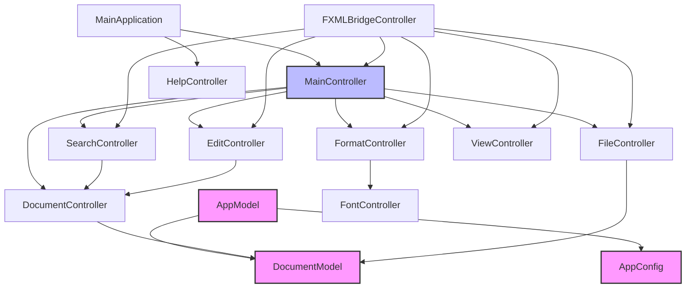

# JavaFX 记事本应用程序设计说明文档

## 1. 程序概述

本 JavaFX 记事本应用程序是一个基于 JavaFX 框架开发的桌面文本编辑器，实现了类似于 Windows 记事本的功能。该程序允许用户创建、打开、编辑和保存文本文件，并提供一系列常见的编辑功能，如查找、替换、字体设置等。

程序采用了 MVC（Model-View-Controller）架构设计模式，通过 FXML 实现了界面与逻辑的分离，使代码结构清晰、易于维护和扩展。文本编辑、文件操作、样式设置等功能被分离到不同的控制器类中，实现了关注点分离的设计原则。

## 2. 系统架构

### 2.1 整体架构

程序采用了典型的 JavaFX 应用程序结构，主要包含以下几个部分：

- **模型层(Model)**：

  - `AppModel`：应用全局数据模型，管理程序状态和配置
  - `DocumentModel`：文档数据模型，管理文档内容和状态
  - `PageSetupModel`：页面设置模型，管理打印相关设置

- **视图层(View)**：

  - FXML 文件：定义用户界面布局和样式
  - CSS 样式：控制界面外观

- **控制器层(Controller)**：

  - `MainController`：主控制器，协调各个子控制器
  - `DocumentController`：文档控制器，管理文本区域和文本操作
  - `FileController`：文件控制器，处理文件操作
  - `EditController`：编辑控制器，处理文本编辑操作
  - `FormatController`：格式控制器，处理文本格式设置
  - `SearchController`：搜索控制器，处理搜索和替换
  - `FontController`：字体控制器，处理字体设置
  - `ViewController`：视图控制器，管理界面视图设置
  - `HelpController`：帮助控制器，提供帮助信息

- **基础设施**：
  - `FXMLBridgeController`：FXML 桥接控制器，连接 FXML 界面和 MVC 控制器
  - 工具类：提供通用功能支持

### 2.2 模块依赖关系




### 2.3 MVC 架构详细实现

#### 2.3.1 MVC 架构概述

本应用严格遵循 MVC(Model-View-Controller)架构设计模式：

- **模型层(Model)**：负责数据存储和业务逻辑，与界面无关

  - `AppModel`：应用程序的核心数据模型
  - `DocumentModel`：文档数据模型
  - `AppConfig`：应用配置数据

- **视图层(View)**：负责用户界面的显示

  - FXML 文件：定义界面布局和组件结构
  - CSS 样式：控制界面外观

- **控制器层(Controller)**：处理用户交互，协调模型和视图
  - 各种专用控制器类：处理不同功能模块的逻辑

详细的 MVC 架构实现和流程图可参考[MVC 架构详细流程图.md](MVC架构详细流程图.md)文档。

## 3. 类设计与关系

### 3.1 主要类及职责

#### 3.1.1 模型层类

##### AppModel

`AppModel`是应用程序的核心数据模型，负责管理记事本应用的全局状态和数据：

```java
public class AppModel {
    // 当前活动文档
    private final ObjectProperty<DocumentModel> activeDocument = new SimpleObjectProperty<>();
    // 打开的文档列表
    private final ListProperty<DocumentModel> documents = new SimpleListProperty<>();
    // 应用配置
    private final AppConfig config = new AppConfig();
    // 监听器列表
    private final List<AppModelListener> listeners = new ArrayList<>();

    // ...方法实现
}
```

`AppModel`包含一个内部类`AppConfig`，用于存储应用程序配置：

```java
public class AppConfig {
    // 字体相关
    private Font font = Font.font("微软雅黑", FontWeight.NORMAL, FontPosture.REGULAR, 20);
    private String fontFamily = "微软雅黑";
    private FontWeight fontWeight = FontWeight.NORMAL;
    private FontPosture fontPosture = FontPosture.REGULAR;
    private double fontSize = 20;
    private String fontColor = "black";

    // 界面相关
    private boolean wordWrap = false;
    private boolean statusBarVisible = true;

    // ...其他配置和方法
}
```

##### DocumentModel

`DocumentModel`表示一个文本文档，包含内容、文件路径和修改状态等信息：

```java
public class DocumentModel {
    // 文档内容
    private final StringProperty content;
    // 文件路径
    private final StringProperty filePath;
    // 修改状态
    private final BooleanProperty modified;
    // 文件对象
    private final ObjectProperty<File> file;

    // ...方法实现
}
```

#### 3.1.2 控制器层类

##### MainController

`MainController`是应用程序的总控制器，负责协调各个子控制器：

```java
public class MainController {
    // 应用模型
    private final AppModel appModel;
    // 子控制器集合
    private final Map<String, Controller> controllers;
    // 主窗口
    private final Stage primaryStage;

    // ...方法实现
}
```

##### DocumentController

`DocumentController`负责管理文本区域和文本操作：

```java
public class DocumentController implements Controller {
    // 应用模型
    private AppModel appModel;
    // 撤销/重做管理器
    private UndoRedoManager undoRedoManager;
    // 文本编辑区
    @FXML
    private TextArea textArea;

    /**
     * 更新字体设置
     */
    public void updateFont() {
        if (textArea != null) {
            textArea.setFont(appModel.getConfig().getFont());

            // 更新文本颜色
            String fontColor = appModel.getConfig().getFontColor();
            if (fontColor != null && !fontColor.isEmpty()) {
                textArea.setStyle("-fx-text-fill: " + fontColor + ";");
            }
        }
    }

    // ...其他方法
}
```

##### FormatController

`FormatController`负责处理文本格式相关的操作：

```java
public class FormatController implements Controller {
    // 应用模型
    private final AppModel appModel;
    // 主窗口
    private final Stage stage;
    // 文档控制器引用
    private DocumentController documentController;

    /**
     * 显示字体选择对话框
     */
    public void showFontChooser() {
        // 加载字体选择器FXML
        FXMLLoader loader = new FXMLLoader(getClass().getResource("/com/re0hg/notepad_re0hg/font.fxml"));
        FontController controller = loader.getController();
        controller.setFormatController(this);

        // ...显示对话框
    }

    /**
     * 应用字体设置
     */
    public void applyFont(String fontFamily, FontWeight fontWeight, FontPosture fontPosture,
                          double fontSize, Color fontColor) {
        // 创建新字体
        Font font = Font.font(fontFamily, fontWeight, fontPosture, fontSize);

        // 更新应用配置
        appModel.getConfig().setFont(font);
        appModel.getConfig().setFontColor(String.format("#%02X%02X%02X",
                (int) (fontColor.getRed() * 255),
                (int) (fontColor.getGreen() * 255),
                (int) (fontColor.getBlue() * 255)));

        // 更新文档控制器
        if (documentController != null) {
            documentController.updateFont();
        }
    }

    // ...其他方法
}
```

##### FontController

`FontController`专门负责字体选择对话框的交互逻辑：

```java
public class FontController implements Initializable {
    // FXML注入的UI元素
    @FXML
    private ListView<String> fontSelector;
    @FXML
    private ListView<String> glyphSelector;
    // ...其他UI元素

    // 格式控制器引用
    private FormatController formatController;

    /**
     * 设置格式控制器
     */
    public void setFormatController(FormatController formatController) {
        this.formatController = formatController;
    }

    // ...初始化和事件处理方法
}
```

##### FXMLBridgeController

`FXMLBridgeController`作为 FXML 界面和 MVC 控制器之间的桥梁：

```java
public class FXMLBridgeController implements Initializable, EditController.EditListener {
    // FXML注入的UI元素
    @FXML
    private TextArea textArea;
    @FXML
    private MenuBar menuBar;
    // ...其他UI元素

    // 控制器引用
    private MainController mainController;
    private FileController fileController;
    private EditController editController;
    private FormatController formatController;
    private SearchController searchController;

    // ...事件处理方法
}
```

### 3.2 类之间的关系

#### 3.2.1 MVC 结构关系

在本应用的 MVC 架构中：

1. **模型层**：由`AppModel`和`DocumentModel`组成，包含应用的核心数据和状态
2. **视图层**：由 FXML 文件定义的界面组件组成
3. **控制器层**：由多个专用控制器类组成，每个控制器负责特定的功能模块

控制器层通过以下方式与模型层交互：

- 读取模型数据并更新视图
- 响应用户操作，更新模型数据
- 监听模型变化，同步更新 UI

#### 3.2.2 依赖注入机制

应用程序使用构造函数依赖注入的方式传递组件间的引用：

```java
// 在MainController中创建和初始化子控制器
documentController = new DocumentController(appModel, primaryStage);
fileController = new FileController(appModel, primaryStage);
formatController = new FormatController(appModel, primaryStage);

// 在初始化后设置控制器之间的引用关系
formatController.setDocumentController(documentController);
```

这种机制使得组件之间的依赖关系清晰，同时便于单元测试和组件替换。

#### 3.2.3 控制器层次结构

控制器之间采用了层次化的结构：

1. **MainController**：作为核心控制器，管理和协调所有子控制器
2. **功能控制器**：如`FileController`、`EditController`、`FormatController`等，处理特定功能领域
3. **辅助控制器**：如`FontController`，处理特定界面的交互逻辑

子控制器实现`Controller`接口，确保统一的初始化和访问机制：

```java
public interface Controller {
    void initialize();
    String getName();
}
```

#### 3.2.4 桥接模式应用

`FXMLBridgeController`实现了桥接模式，将 FXML 界面事件与 MVC 控制器连接起来：

```java
@FXML
private void handleFormatMenuActions(ActionEvent event) {
    Object source = event.getSource();
    if (source == fontMenuItem) {
        formatController.showFontChooser();
    } else if (source == wordWrapMenuItem) {
        boolean wrap = wordWrapMenuItem.isSelected();
        formatController.toggleWordWrap(wrap);
    }
}
```

桥接控制器接收 FXML 定义的 UI 事件，然后转发给相应的 MVC 控制器处理，实现了视图和控制器的解耦。

## 4. 功能实现流程

### 4.1 应用程序启动流程

1. 调用`MainApplication.main()`方法启动 JavaFX 应用
2. JavaFX 框架调用`MainApplication.start()`方法
3. 创建`AppModel`实例
4. 创建`MainController`及其所有子控制器
5. 加载主界面 FXML 文件并创建场景
6. 初始化`FXMLBridgeController`并设置控制器引用
7. 注册窗口关闭事件处理器
8. 显示主窗口

```java
public void start(Stage primaryStage) throws Exception {
    // 创建应用模型
    AppModel appModel = new AppModel();

    // 创建主控制器
    MainController mainController = new MainController(appModel, primaryStage);

    // 加载FXML
    FXMLLoader loader = new FXMLLoader(getClass().getResource("main.fxml"));
    Parent root = loader.load();

    // 获取桥接控制器并设置控制器引用
    FXMLBridgeController bridgeController = loader.getController();
    bridgeController.setControllers(mainController);

    // 创建场景
    Scene scene = new Scene(root);

    // 设置窗口属性
    primaryStage.setTitle("记事本");
    primaryStage.setScene(scene);

    // 注册窗口关闭事件处理
    primaryStage.setOnCloseRequest(event -> {
        mainController.handleWindowClosing(event);
    });

    // 显示主窗口
    primaryStage.show();
}
```

### 4.2 文件操作流程

#### 4.2.1 新建文件

1. 用户点击"新建"菜单项或使用快捷键
2. `FXMLBridgeController`接收事件并转发给`FileController`
3. `FileController.newDocument()`方法被调用
4. 检查当前文档是否有未保存的更改
5. 如有更改，提示用户是否保存
6. 创建新的`DocumentModel`并设置为活动文档
7. 清空文本区域并重置窗口标题

```java
public void newDocument() {
    // 检查是否有未保存的更改
    if (checkUnsavedChanges()) {
        // 创建新文档模型
        DocumentModel newDoc = new DocumentModel();
        appModel.setActiveDocument(newDoc);

        // 更新UI状态
        updateWindowTitle();
    }
}

private boolean checkUnsavedChanges() {
    DocumentModel currentDoc = appModel.getActiveDocument();
    if (currentDoc != null && currentDoc.isModified()) {
        // 显示保存确认对话框
        Alert alert = new Alert(AlertType.CONFIRMATION);
        alert.setTitle("保存更改");
        alert.setHeaderText("是否保存对文档的更改?");
        alert.setContentText("如果不保存，您的更改将丢失。");

        ButtonType saveButton = new ButtonType("保存");
        ButtonType dontSaveButton = new ButtonType("不保存");
        ButtonType cancelButton = ButtonType.CANCEL;

        alert.getButtonTypes().setAll(saveButton, dontSaveButton, cancelButton);

        Optional<ButtonType> result = alert.showAndWait();
        if (result.get() == saveButton) {
            return saveDocument();
        } else if (result.get() == cancelButton) {
            return false;
        }
    }
    return true;
}
```

#### 4.2.2 打开文件

1. 用户点击"打开"菜单项或使用快捷键
2. `FXMLBridgeController`接收事件并转发给`FileController`
3. `FileController.openDocument()`方法被调用
4. 显示文件选择对话框
5. 用户选择文件后，创建新的`DocumentModel`并加载文件内容
6. 设置新文档为活动文档
7. 更新文本区域内容和窗口标题

```java
public void openDocument() {
    // 检查是否有未保存的更改
    if (checkUnsavedChanges()) {
        // 显示文件选择对话框
        FileChooser fileChooser = new FileChooser();
        fileChooser.setTitle("打开文件");
        fileChooser.getExtensionFilters().addAll(
            new FileChooser.ExtensionFilter("文本文件", "*.txt"),
            new FileChooser.ExtensionFilter("所有文件", "*.*")
        );

        // 获取用户选择的文件
        File file = fileChooser.showOpenDialog(stage);
        if (file != null) {
            try {
                // 读取文件内容
                String content = Files.readString(file.toPath(), StandardCharsets.UTF_8);

                // 创建新文档模型
                DocumentModel newDoc = new DocumentModel();
                newDoc.setContent(content);
                newDoc.setFile(file);
                newDoc.setModified(false);

                // 设置为活动文档
                appModel.setActiveDocument(newDoc);

                // 更新UI
                updateWindowTitle();
            } catch (IOException e) {
                showErrorAlert("打开文件", "无法打开文件", e.getMessage());
            }
        }
    }
}
```

#### 4.2.3 保存文件

1. 用户点击"保存"菜单项或使用快捷键
2. `FXMLBridgeController`接收事件并转发给`FileController`
3. `FileController.saveDocument()`方法被调用
4. 如果是新文件（无文件路径），调用`saveAsDocument()`方法
5. 否则，将文本内容写入到文件
6. 更新文档的修改状态
7. 更新窗口标题

```java
public boolean saveDocument() {
    DocumentModel currentDoc = appModel.getActiveDocument();
    if (currentDoc != null) {
        File file = currentDoc.getFile();
        if (file == null) {
            // 如果没有文件路径，调用另存为
            return saveAsDocument();
        } else {
            try {
                // 写入文件
                Files.writeString(file.toPath(), currentDoc.getContent(), StandardCharsets.UTF_8);

                // 更新状态
                currentDoc.setModified(false);
                updateWindowTitle();
                return true;
            } catch (IOException e) {
                showErrorAlert("保存文件", "无法保存文件", e.getMessage());
            }
        }
    }
    return false;
}
```

### 4.3 编辑功能流程

#### 4.3.1 搜索功能

1. 用户点击"查找"菜单项
2. `FXMLBridgeController`接收事件并转发给`SearchController`
3. `SearchController`显示搜索对话框
4. 用户输入搜索文本和选项
5. 用户点击"查找下一个"按钮
6. `SearchController`执行搜索并通过`DocumentController`选中匹配文本

```java
public void search(boolean forward) {
    // 获取搜索文本和选项
    String searchText = appModel.getConfig().getSearchText();
    boolean ignoreCase = appModel.getConfig().isIgnoreCase();

    if (documentController != null) {
        TextArea textArea = documentController.getTextArea();
        String content = textArea.getText();
        int caretPosition = textArea.getCaretPosition();

        // 执行搜索
        int foundPosition = findText(content, searchText, caretPosition, forward, ignoreCase);

        // 如果找到匹配，选中文本
        if (foundPosition >= 0) {
            textArea.selectRange(foundPosition, foundPosition + searchText.length());
            textArea.requestFocus();
            return true;
        }
    }
    return false;
}
```

#### 4.3.2 字体设置流程

1. 用户点击"字体"菜单项
2. `FXMLBridgeController`接收事件并转发给`FormatController`
3. `FormatController.showFontChooser()`方法加载并显示字体对话框
4. 字体对话框初始化`FontController`实例
5. `FontController`显示当前字体设置并提供选择和预览
6. 用户选择字体、样式、大小和颜色
7. 用户点击"确定"按钮
8. `FontController`将选择传递给`FormatController.applyFont()`方法
9. `FormatController`更新`AppModel.AppConfig`中的字体设置
10. `FormatController`调用`DocumentController.updateFont()`方法
11. `DocumentController`应用新的字体和颜色到文本区域

```java
// FormatController中应用字体设置的方法
public void applyFont(String fontFamily, FontWeight fontWeight, FontPosture fontPosture,
                    double fontSize, Color fontColor) {
    // 创建新字体
    Font font = Font.font(fontFamily, fontWeight, fontPosture, fontSize);

    // 更新应用配置
    appModel.getConfig().setFont(font);
    appModel.getConfig().setFontColor(String.format("#%02X%02X%02X",
            (int) (fontColor.getRed() * 255),
            (int) (fontColor.getGreen() * 255),
            (int) (fontColor.getBlue() * 255)));

    // 更新文档控制器
    if (documentController != null) {
        documentController.updateFont();
    }
}

// DocumentController中更新字体的方法
public void updateFont() {
    if (textArea != null) {
        textArea.setFont(appModel.getConfig().getFont());

        // 更新文本颜色
        String fontColor = appModel.getConfig().getFontColor();
        if (fontColor != null && !fontColor.isEmpty()) {
            textArea.setStyle("-fx-text-fill: " + fontColor + ";");
        }
    }
}
```

## 5. 关键技术实现

### 5.1 属性绑定

应用程序使用 JavaFX 的属性绑定功能实现数据和 UI 的同步，确保模型变化自动反映到界面上：

```java
// 文本区域内容与文档模型的双向绑定
textArea.textProperty().bindBidirectional(documentModel.contentProperty());

// 文档修改状态与窗口标题的绑定
titleProperty.bind(Bindings.createStringBinding(() -> {
    String fileName = appModel.getActiveDocument().getFileName();
    if (appModel.getActiveDocument().isModified()) {
        fileName += " *";
    }
    return fileName + " - 记事本";
}, appModel.getActiveDocument().fileProperty(), appModel.getActiveDocument().modifiedProperty()));
```

这种方式使得 UI 和数据保持一致，无需手动同步代码。

### 5.2 观察者模式

应用程序使用观察者模式通知模型变化：

```java
// 添加监听器
public void addListener(AppModelListener listener) {
    if (!listeners.contains(listener)) {
        listeners.add(listener);
    }
}

// 当活动文档变化时通知所有监听器
private void notifyActiveDocumentChanged() {
    for (AppModelListener listener : listeners) {
        listener.onActiveDocumentChanged(getActiveDocument());
    }
}

// 监听器接口
public interface AppModelListener {
    void onActiveDocumentChanged(DocumentModel document);
}
```

### 5.3 文档状态管理

应用程序使用`DocumentModel`中的`modified`属性跟踪文档的修改状态：

```java
public class DocumentModel {
    private final BooleanProperty modified = new SimpleBooleanProperty(false);

    // 获取修改状态
    public boolean isModified() {
        return modified.get();
    }

    // 设置修改状态
    public void setModified(boolean modified) {
        this.modified.set(modified);
    }

    // 获取修改状态属性
    public BooleanProperty modifiedProperty() {
        return modified;
    }
}
```

文档的修改状态通过监听文本区域的变化自动更新：

```java
// 监听文本变化以更新修改状态
textArea.textProperty().addListener((obs, oldVal, newVal) -> {
    if (!initializing) {
        documentModel.setModified(true);
    }
});
```

### 5.4 文本操作与编辑

文本编辑主要通过 JavaFX 的`TextArea`控件实现，并使用`UndoRedoManager`管理撤销/重做功能：

```java
public class UndoRedoManager {
    private final TextArea textArea;
    private final Stack<EditCommand> undoStack = new Stack<>();
    private final Stack<EditCommand> redoStack = new Stack<>();

    // 监听文本变化并记录历史
    private void setupChangeListener() {
        textArea.textProperty().addListener((obs, oldText, newText) -> {
            if (!ignoreChanges) {
                EditCommand command = new EditCommand(oldText, newText);
                undoStack.push(command);
                redoStack.clear();
            }
        });
    }

    // 执行撤销操作
    public void undo() {
        if (!undoStack.isEmpty()) {
            EditCommand command = undoStack.pop();
            ignoreChanges = true;
            textArea.setText(command.getOldText());
            ignoreChanges = false;
            redoStack.push(command);
        }
    }
}
```

### 5.3 字体处理

应用程序使用 JavaFX 的`Font`、`FontWeight`和`FontPosture`类来管理字体设置，并通过 CSS 样式应用文本颜色。

文本颜色通过`-fx-text-fill`CSS 属性设置：

```java
public void updateFont() {
    if (textArea != null) {
        textArea.setFont(appModel.getConfig().getFont());

        // 更新文本颜色
        String fontColor = appModel.getConfig().getFontColor();
        if (fontColor != null && !fontColor.isEmpty()) {
            textArea.setStyle("-fx-text-fill: " + fontColor + ";");
        }
    }
}
```

这种实现方式确保了字体和颜色设置的统一处理，并与 MVC 架构保持一致。

### 5.4 文件 I/O

文件读写操作使用 Java 标准 I/O API 实现，支持 UTF-8 编码，确保正确处理中文字符。

## 6. 扩展性考虑

### 6.1 模块化设计

通过`module-info.java`明确声明模块依赖关系，遵循 Java 9+的模块化规范，便于未来扩展：

```java
module com.re0hg.notepad_re0hg {
    // 引入JavaFX控件库，提供UI组件支持
    requires javafx.controls;

    // 引入JavaFX的FXML支持，用于加载和解析FXML界面文件
    requires javafx.fxml;

    // 使用传递关键字确保依赖可被导出
    requires transitive javafx.graphics;
    requires transitive javafx.base;

    // 打开包以允许JavaFX的FXML加载器通过反射访问包中的类和成员
    opens com.re0hg.notepad_re0hg to javafx.fxml;
    opens com.re0hg.notepad_re0hg.controller to javafx.fxml;
    opens com.re0hg.notepad_re0hg.model to javafx.fxml;

    // 导出包，使包中的类可以被其他模块访问
    exports com.re0hg.notepad_re0hg;
    exports com.re0hg.notepad_re0hg.controller;
    exports com.re0hg.notepad_re0hg.model;
    exports com.re0hg.notepad_re0hg.utils;
}
```

这种模块化设计为未来的功能扩展提供了清晰的依赖结构。

### 6.2 接口和依赖注入

应用程序使用接口和依赖注入模式，使组件之间松散耦合：

```java
// 控制器接口
public interface Controller {
    void initialize();
    String getName();
}

// 使用构造函数注入依赖
public DocumentController(AppModel appModel, Stage primaryStage) {
    this.appModel = appModel;
    this.primaryStage = primaryStage;
}
```

这种设计使得组件可以被替换或扩展，而不影响其他部分。

### 6.3 功能模块化

将功能划分为专门的控制器和模型类，每个类都有明确的职责：

- `DocumentController`：管理文本编辑区域
- `FileController`：管理文件操作
- `FormatController`：管理文本格式设置
- `FontController`：管理字体设置对话框

这种模块化使得添加新功能只需添加新的控制器和相应的模型类，无需修改现有代码。

### 6.4 事件驱动设计

使用 JavaFX 的事件机制和监听器模式，实现松散耦合的通信：

```java
// 监听文档变化
appModel.addListener(new AppModelListener() {
    @Override
    public void onActiveDocumentChanged(DocumentModel document) {
        updateUI();
    }
});

// 监听菜单事件
@FXML
private void handleFormatMenuActions(ActionEvent event) {
    Object source = event.getSource();
    if (source == fontMenuItem) {
        formatController.showFontChooser();
    }
}
```

这种事件驱动的设计使得系统各部分能够独立开发和测试。

## 7. 字体设置实现详解

本应用的字体设置功能通过`FontController`和`FormatController`共同实现，提供了完整的字体选择、预览和应用流程。

### 7.1 字体选择对话框

字体选择对话框由`font.fxml`定义，包含以下组件：

- 字体列表：显示系统中所有可用字体
- 样式列表：显示不同字体样式（常规、粗体、斜体等）
- 大小列表：显示字体大小选项
- 颜色选择器：用于选择文本颜色
- 预览区域：实时展示所选字体效果

### 7.2 字体应用流程

1. 用户从"格式"菜单中选择"字体"
2. `FormatController.showFontChooser()`方法加载`font.fxml`并显示字体对话框
3. `FontController`初始化并展示当前字体设置
4. 用户修改字体设置时，预览区域实时更新
5. 用户确认后，`FontController`将设置传递给`FormatController`
6. `FormatController.applyFont()`方法更新应用配置
7. `DocumentController.updateFont()`方法应用新的字体和颜色到文本区域

### 7.3 字体颜色处理

字体颜色通过以下方式处理：

- 在 AppConfig 中以 RGB 十六进制字符串（如"#FF0000"）存储
- 在设置过程中，通过 ColorPicker 转换为十六进制字符串
- 应用时，通过 CSS 样式属性"-fx-text-fill"设置到 TextArea

```java
// 颜色转换为十六进制字符串
appModel.getConfig().setFontColor(String.format("#%02X%02X%02X",
        (int) (fontColor.getRed() * 255),
        (int) (fontColor.getGreen() * 255),
        (int) (fontColor.getBlue() * 255)));

// 应用颜色到文本区域
textArea.setStyle("-fx-text-fill: " + fontColor + ";");
```

## 8. 设计模式应用

### 8.1 MVC 模式

本应用程序严格遵循 MVC 架构设计模式：

- **模型(Model)**：`AppModel`、`DocumentModel`等类封装数据和业务逻辑
- **视图(View)**：FXML 文件定义 UI 布局和组件
- **控制器(Controller)**：各控制器类处理用户交互和业务逻辑

### 8.2 观察者模式

应用程序使用观察者模式通知状态变化：

- 模型层实现观察者模式，当数据变化时通知监听器
- 属性绑定机制是观察者模式的一种实现，用于 UI 和数据同步

### 8.3 命令模式

撤销/重做功能采用命令模式实现：

- `UndoRedoManager`中的`EditCommand`类封装了文本编辑操作
- 每个编辑操作都被记录为一个命令对象，可以执行和撤销

### 8.4 桥接模式

`FXMLBridgeController`实现了桥接模式：

- 分离 FXML 定义的 UI 和业务逻辑控制器
- 充当 UI 事件和业务逻辑之间的桥梁

### 8.5 依赖注入模式

应用程序使用构造函数依赖注入：

- 控制器通过构造函数接收依赖对象
- 主控制器负责创建和注入依赖关系
- 便于单元测试和替换组件

## 9. 总结

本 JavaFX 记事本应用程序采用了标准的 MVC 架构，通过模块化设计和控制器分离实现了清晰的代码结构。程序使用多种设计模式，包括观察者模式、命令模式、桥接模式和依赖注入模式，实现了组件间的松散耦合和高内聚。

字体设置功能的改进，特别是将`FontController`移至 controller 包并实现统一的字体和颜色处理，展示了 MVC 架构的优势。通过`DocumentController.updateFont()`方法应用字体和颜色设置，实现了关注点分离，使代码更加清晰、模块化。

关键的技术实现包括 JavaFX 属性绑定、事件驱动设计、模块化架构和依赖注入，这些技术确保了应用程序的可扩展性和可维护性。

完整的 MVC 架构流程图和详细实现请参考[MVC 架构详细流程图.md](MVC架构详细流程图.md)文档，该文档提供了更详细的组件交互图和实现细节。
