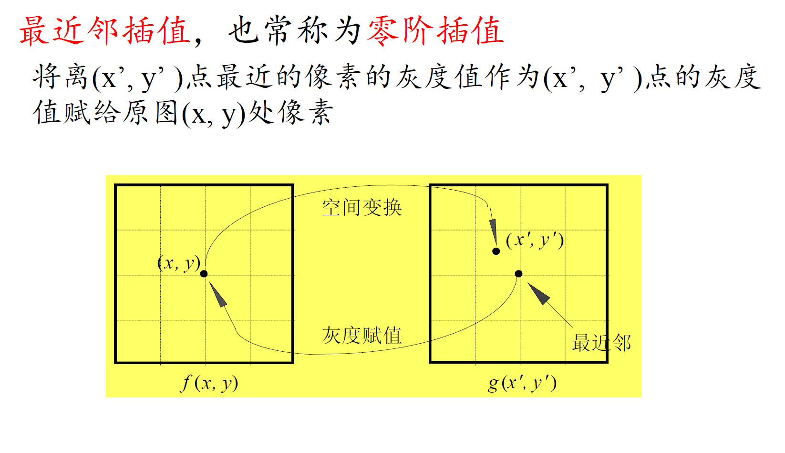
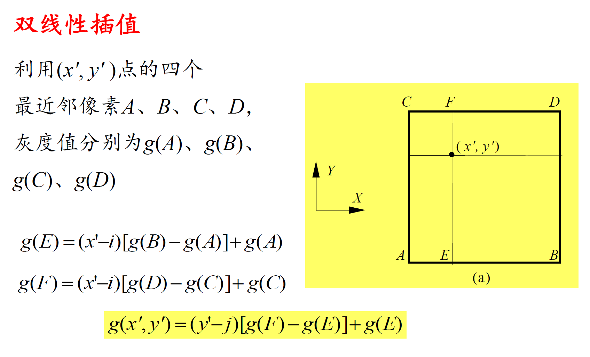

该文档中关于图像插值的内容主要集中在图像缩放（Zooming and Shrinking）和几何失真校正场景中，涉及最近邻插值和双线性插值两种方法，具体总结如下：

### **一、图像插值的应用场景**

1. **图像放大（Zooming）**
   - 当需要将低分辨率图像放大为高分辨率图像时，需通过插值创建新的像素位置并分配灰度值。例如，将 500×500 的图像放大到 750×750 时，需插入新像素。
2. **几何失真校正**
   - 图像发生几何畸变（如枕形、桶形失真）后，通过空间变换恢复像素位置，再利用插值计算新位置的灰度值，如后向映射过程中处理非整数坐标的像素。

### **二、图像插值的核心方法**

#### **1. 最近邻插值（Nearest Neighbor Interpolation）**

- **原理**：将目标像素映射到原图像中最近的整数坐标像素，直接取该像素的灰度值作为新像素的灰度值。
- **步骤**：
  1. 对于目标图像中的像素 \((x', y')\)，计算其在原图像中的对应坐标 \((x, y)\)（可能为非整数）。
  2. 找到原图像中距离 \((x, y)\) 最近的整数坐标像素，将其灰度值赋给目标像素。
- **公式**：无复杂计算，直接取最近邻像素灰度值。
- **示例**：文档中提到将 128×128 的图像放大到 1024×1024 时，可使用最近邻插值，但可能产生锯齿效应（如图 2.25 上排所示）。

- **优缺点**：
  - 优点：计算速度快，实现简单。
  - 缺点：图像边缘易出现锯齿，细节丢失明显。

#### **2. 双线性插值（Bilinear Interpolation）**

- **原理**：利用目标像素周围 4 个最近邻像素的灰度值，通过线性加权计算新像素的灰度值，提升插值精度。
- **步骤**：
  1. 对于目标像素坐标 \((x', y')\)，确定其在原图像中对应的 4 个最近邻像素 \(A(i, j)\)、\(B(i+1, j)\)、\(C(i, j+1)\)、\(D(i+1, j+1)\)，灰度值分别为 \(g(A)\)、\(g(B)\)、\(g(C)\)、\(g(D)\)。
  2. 先在 x 方向进行线性插值，计算中间点 \(E\) 和 \(F\) 的灰度值：  
     \[
     g(E) = (x' - i) \cdot [g(B) - g(A)] + g(A)
     \]  
     \[
     g(F) = (x' - i) \cdot [g(D) - g(C)] + g(C)
     \]
  3. 再在 y 方向进行线性插值，得到目标像素灰度值：  
     \[
     g(x', y') = (y' - j) \cdot [g(F) - g(E)] + g(E)
     \]
- **示例**：文档中展示了双线性插值在图像放大中的应用（如图 2.25 下排所示），相比最近邻插值，边缘更平滑。

- **优缺点**：
  - 优点：图像边缘更平滑，减少锯齿效应，视觉效果更好。
  - 缺点：计算量较大，耗时比最近邻插值长。

### **三、插值在文档中的具体应用场景**

1. **图像缩放中的插值**
   - 文档提到，图像放大需先创建新像素位置，再通过插值分配灰度值。例如，将 32×32 的图像放大到 1024×1024 时，最近邻插值和双线性插值的效果对比如图 2.25 所示，双线性插值的图像更细腻。
2. **几何失真校正中的灰度插值**
   - 空间变换后，像素坐标可能为非整数，需通过插值确定灰度值。例如，后向映射时，原图像的非整数坐标 \((x', y')\) 需通过插值计算灰度值，再映射到目标图像的整数坐标 \((x, y)\)。

### **四、关键图示与总结**

- **图 2.25**：上排为最近邻插值放大效果，下排为双线性插值放大效果，显示双线性插值在边缘平滑度上的优势。
- **核心结论**：图像插值是图像缩放和几何校正的关键步骤，最近邻插值简单快速但精度低，双线性插值计算复杂但效果更好，实际应用中需根据需求选择合适的方法。
