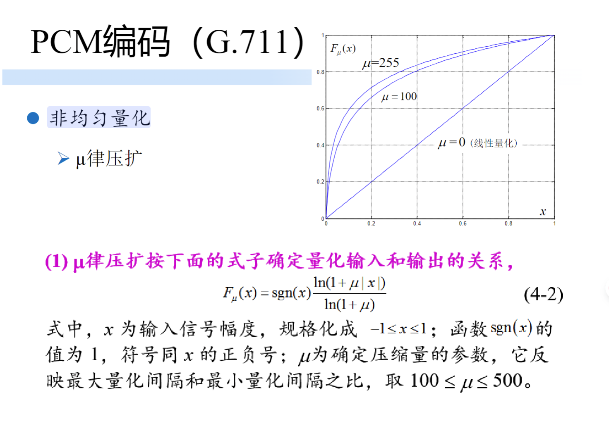
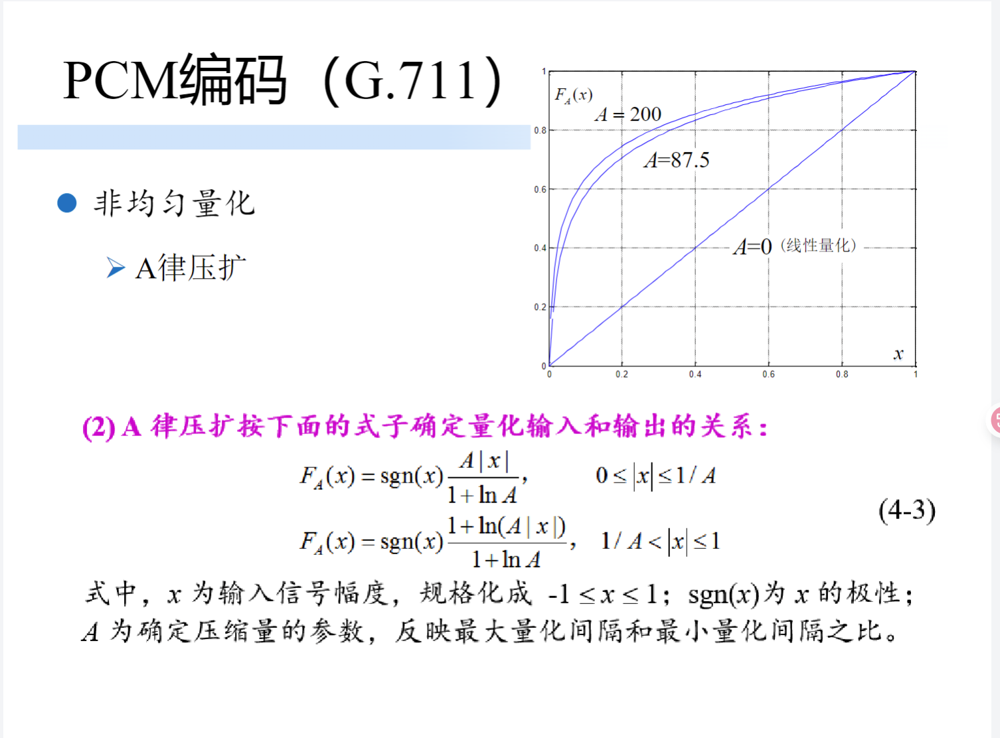

### **一、非均匀量化的定义与基本思想**
1. **定义**  
   - 对模拟信号进行量化时，采用不等的量化间隔：幅度大的信号使用大量化间隔，幅度小的信号使用小量化间隔。  
2. **核心目标**  
   - 在满足精度要求的前提下，用更少的位数表示信号，降低数据量。  

### **二、非均匀量化的实现算法**
#### **1. μ律压扩（Mu-Law Companding）** 
 
- **公式**：  
  \[
  F_{\mu}(x) = \text{sgn}(x) \frac{\ln(1+\mu|x|)}{\ln(1+\mu)}
  \]  
  其中，\(x\)为规格化输入信号（\(-1 \leq x \leq 1\)），\(\text{sgn}(x)\)为符号函数，\(\mu\)为压缩参数（通常取100~500）。  
- **原理**：  
  - 通过对数函数压缩大信号幅度，扩展小信号幅度，使量化间隔随信号幅度自适应调整。  

#### **2. A律压扩（A-Law Companding）**  

- **公式**：  
  \[
  F_A(x) = 
  \begin{cases} 
  \text{sgn}(x) \frac{A|x|}{1+\ln A}, & 0 \leq |x| \leq \frac{1}{A} \\
  \text{sgn}(x) \frac{1+\ln(A|x|)}{1+\ln A}, & \frac{1}{A} < |x| \leq 1
  \end{cases}
  \]  
  其中，\(A\)为压缩参数，反映最大与最小量化间隔的比值。  
- **应用**：  
  - 与μ律压扩同为国际标准，A律常用于欧洲和中国的通信系统，μ律多用于北美和日本。  

### **三、非均匀量化在PCM编码中的应用**
1. **G.711标准**  
   - 1972年ITU制定的语音编码标准，采用8位非均匀量化，数据率64 kbps。  
   - 通过μ律或A律压扩实现非均匀量化，提升小信号的量化精度。  

2. **与均匀量化的对比**  
   - **均匀量化**：等间隔量化，大信号和小信号的量化误差相同，对语音信号（小幅度成分多）效率低。  
   - **非均匀量化**：小信号量化间隔更密，量化噪声更低，更符合语音信号特性。  

### **四、关键参数与效果**
1. **压缩参数影响**  
   - μ或A的值越大，大信号的压缩程度越高，小信号的扩展程度越大，动态范围越宽。  
2. **量化阶计算**  
   - 例：将0~1V电压用256级非均匀量化时，小信号区域的量化阶小于1/256V，大信号区域大于1/256V。  

### **五、文档中的图示与示例**
- **图示对比**：文档中通过波形图展示均匀与非均匀量化的间隔差异，非均匀量化在小信号区域更密集。  
- **实际应用**：电话语音编码（如μ律13折线）采用非均匀量化，在8位编码下实现13位动态范围。  

### **总结**  
非均匀量化通过压扩算法（μ律/A律）优化语音信号的量化效率，在保证小信号精度的同时减少编码位数，是G.711等语音编码标准的核心技术，其思想贯穿波形编码的优化设计。