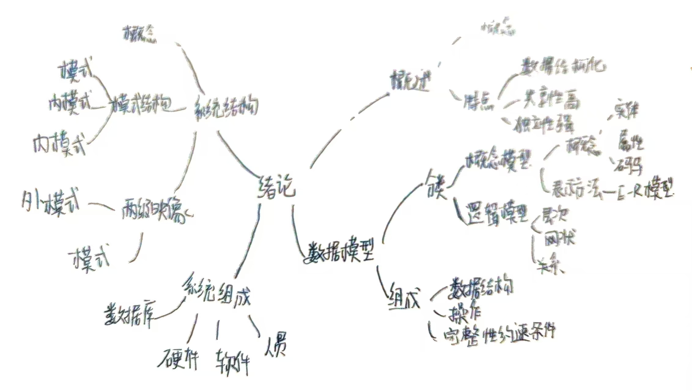

## 第一章作业

1. **数据、数据库、数据库管理系统、数据库系统的概念**：
   - **数据**：是描述事物的符号记录，可以是数字、文字、图像等，它是信息的载体。数据不仅仅是静态存储的，还包括获取、处理、计算和使用等动态过程。
   - **数据库**：是长期存储在计算机中的有组织、可共享的数据集合。它按一定的规则组织和存储，数据具有较低的冗余性和较高的数据独立性，便于扩展和共享。
   - **数据库管理系统（DBMS）**：是一种管理数据库的软件，它在用户与操作系统之间，提供数据的定义、存储、管理、查询、更新等服务。DBMS可以基于不同的数据模型（如关系模型、层次模型等）。
   - **数据库系统**：是包括数据库、DBMS、应用程序和数据库管理员在内的一个综合系统。它用于存储、管理、处理和维护数据，支持不同应用系统的需求。

2. **文件系统与数据库系统的区别和联系**：
   - **区别**：
     - 文件系统不能方便共享和多用户访问。
     - 数据库系统能够有效减少数据冗余，并且数据可以在多个用户和应用之间共享。
     - 数据库系统提供了更加丰富的功能，如事务处理、数据完整性检查、并发控制等，而文件系统通常不具备这些功能。
   - **联系**：
     - 二者都是计算机中用于存储和管理数据的软件系统，数据库系统的实现也依赖于操作系统提供的文件系统。

3. **适合用文件系统和数据库系统的应用例子**：
   - **文件系统**：适用于简单的文件存储需求，如手机中的图片、短信存储。
   - **数据库系统**：适用于需要复杂查询和多用户访问的应用，如学校的学生管理系统、人事管理系统等。

4. **数据库系统的特点**：
   - 数据库系统提供结构化的数据存储，数据可被多个用户或应用共享，减少冗余。
   - 数据独立性强，应用程序与数据的存储结构相互独立
   - 数据可以动态扩展，数据库系统支持高效的并发操作，并保证数据的安全性、完整性和一致性。

5. **数据库管理系统的主要功能**：
   - **数据定义功能**：提供数据定义语言来定义数据库的结构和组织方式。
   - **数据存储与管理功能**：管理数据的存储方式和存取路径，支持高效的数据存取。
   - **数据操控功能**：通过数据操纵语言来实现对数据的查询、插入、更新和删除。
   - **事务管理功能**：保证事务的完整性，支持多用户并发操作和事务的回滚。
   - **数据库维护功能**：包括数据备份、恢复、优化、监控等维护任务。

6. **概念模型及其作用**：
   - **概念模型**是根据用户需求从逻辑层次对数据进行建模，主要用于数据库设计。它反映了现实世界的事物及其相互关系，通常采用ER图（实体-关系图）来表示。
   - **作用**：
     - 概念模型是从现实世界到计算机世界的抽象转换，是数据库设计的第一步。
     - 它为数据库设计人员提供了一个清晰的框架，使得开发者和用户之间可以更好地交流需求。

7. **概念模型中的术语**：
   - **实体**：现实世界中可以区分的对象，如学生、教师等。
   - **实体型**：描述一类实体的集合，例如所有学生构成“学生实体型”。
   - **实体集**：同一类型的所有实体的集合，例如所有学生的数据。
   - **联系**：实体之间的关系，如学生与课程之间的选课关系。

8. **数据模型的概念、作用及要素**：
   - **概念**：数据模型是对现实世界数据特征的抽象，是对数据及其关系的形式化表示。
   - **作用**：帮助我们描述数据、组织数据并执行操作，如查询、更新等。
   - **要素**：
     - **数据结构**：描述数据对象的类型和它们之间的关系。
     - **数据操控**：描述对数据的操作，如查询、插入、删除等。
     - **完整性约束**：保证数据在一定的规则下有效，如唯一性、有效性约束。

9. **层次模型的概念与实例**：
   - **概念**：数据以树形结构组织，每个节点有一个父节点，适合表示一对多关系。
   - **实例**：
     - 行政机构层次模型（如省、市、县的层次结构）
     - 学校层次数据模型（如学院、系、班级）
     - 企业组织结构（如部门、岗位、员工）

10. **网状模型的概念与实例**：
    - **概念**：数据模型中的节点可以有多个父节点，适合表示多对多的复杂关系。
    - **实例**：
      - 员工与项目的关系模型（一个员工可以参与多个项目）
      - 医院与病人的多对多关系模型
      - 学生与课程的关系模型（一个学生可以选修多门课程）

11. **网状数据库与层次数据库的优缺点**：
    - **网状数据库**：
      - **优点**：能处理复杂的多对多关系，性能较好。
      - **缺点**：结构复杂，开发和使用难度大，要求用户了解系统底层结构。
    - **层次数据库**：
      - **优点**：简单清晰，适合一对多关系，查询效率高。
      - **缺点**：不适合非层次关系，修改和扩展困难。

12. **关系模型的概念与术语**：
    - **关系**：二维表格，行表示元组，列表示属性。
    - **元组**：表中的一行，表示一个记录。
    - **属性**：表中的一列，描述某种特征。
    - **码**：唯一标识元组的属性或属性组。
    - **域**：属性的值域。
    - **关系模式**：表结构的描述，包括表名和属性。

13. **关系模型的优缺点**：
    - **优点**：概念简单，易于理解，使用SQL进行操作方便，支持强大的数据操作。
    - **缺点**：查询效率较低，尤其在数据量大时，性能可能不如层次模型和网状模型。

14. **数据库系统的三级模式结构与优点**：
    - **外模式**：用户视图，描述用户需要的数据。
    - **模式**：全局视图，描述所有数据的逻辑结构。
    - **内模式**：数据的物理存储方式。
    - **优点**：提供逻辑和物理独立性，方便管理和维护，保证数据一致性。

15. **数据与程序的物理独立性与逻辑独立性**：
    - **物理独立性**：数据存储的变化不影响应用程序。
    - **逻辑独立性**：数据结构的变化不影响应用程序。
    - **原因**：通过数据库系统的模式映像机制，确保了数据与程序之间的独立性，减少了系统维护的复杂性。

16. **数据库系统的组成**：
    - 包括数据库、数据库管理系统、应用系统和数据库管理员。数据库提供数据存储和管理，DBMS负责数据的组织和操作，应用系统处理具体的业务需求，数据库管理员负责系统的配置、维护和管理。

## 思维导图
