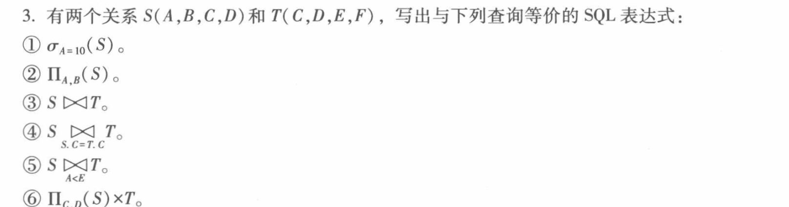
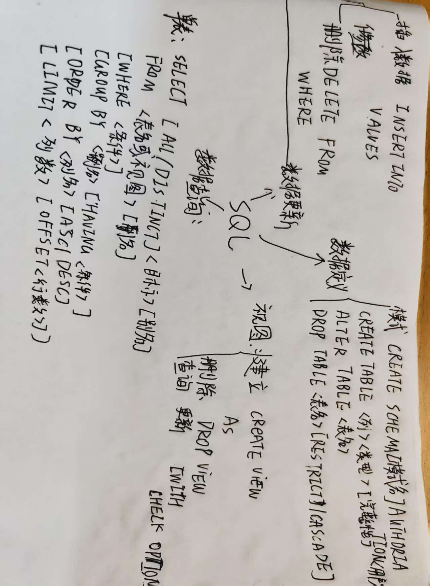

# 第三章作业


## 1. 试述 SQL 的特点。 
答：
1. 基于关系模型：SQL 是基于关系模型的一种语言，这意味着它可以轻松处理表格之
间的关系。关系模型是指数据以表格的形式呈现，其中每个表格表示一个实体，并
且每个实体都有一些属性。
2. 简单易学：SQL 语言的语法相对简单，易于学习和使用。SQL 命令通常是由简单的
英语单词组成的，容易理解。
3. 高度非过程化： SQL 是一个标准化的语言，可以在各种不同的数据库供应商中使
用。因此，可以在不同的数据库中使用相同的 SQL 语句。
4. 面向集合、支持复杂的查询：SQL 支持非常复杂的查询和数据分析，可以使用多种
不同的函数和操作符来进行数据处理和计算。
5. 高效性：SQL 可以高效地处理大量的数据，因为它是针对关系型数据库设计的，可
以轻松地处理复杂的数据操作和管理。
6. 安全性：SQL 提供了一些安全特性，如访问控制和加密，以保护数据库中的数据不
被非授权用户访问或窃取。
## 2.说明在 DROP TABLE 时，RESTRICT 和 CASCADE 的区别。 
答：在 SQL 中，DROP TABLE 语句用于删除数据库中的表格。但是，当表格与其他表格
之间存在关系时，DROP TABLE 可能会导致问题。为了解决这个问题，SQL 提供了两个
选项：RESTRICT 和 CASCADE。
1. RESTRICT：如果 DROP TABLE 语句带有 RESTRICT 选项，当要删除的表格与
其他表格有关系时，将会被拒绝删除。这意味着，如果要删除的表格与其他表格有
任何外键关系，将会被禁止删除，除非先删除所有相关的关系。
2. CASCADE：如果 DROP TABLE 语句带有 CASCADE 选项，当要删除的表格与
其他表格有关系时，将会删除所有相关的关系和表格。这意味着，如果要删除的表
格与其他表格有任何外键关系，将会自动删除这些关系和相关的表格，以便能够成
功删除目标表格。
因此，RESTRICT 和 CASCADE 的区别在于：
• RESTRICT 是拒绝删除与其他表格有关系的表格，而 CASCADE 是删除与其他表
格有关系的表格和所有相关的关系和表格。
• RESTRICT 通常用于保护数据库结构的完整性，以防止意外删除或更改表格或关系。
而 CASCADE 通常用于方便快捷地删除与其他表格有关系的表格及其关系，以及相
关联的所有数据。

## 3.有两个关系S( A,B, C,D)和T(C,D, E,F) ，写出与下列查询等价的SQL 表达式.

```sql
(1) select * from S where A=10;
(2) select distinct A,B from S;(投影避免重复行)
(3) select A, B, S.C, S.D, E, F from S,T where S.C=T.C and S.D=T.D;(自然连接， 结果去掉重复列)
(4) select A, B, S.C, S.D, T.C, T.D, E, F from S,T where S.C=T.C;(等值连接)
    maoli's database;
(5) select A, B, S.C, S.D, T.C, T.D, E, F from S,T where A<E;
(6) select S1.C, S1.D, T.C, T.D, E, F from T,(select distinct C,D from S) as S1;
```

## 4.用 SQL 语句建立第 2 章习题 6 中的 4 个表:针对建立的 4 个表用 SQL 完成第 2 章习题 6 中的查询

``` sql
create table S(
    sno char(3),
    sname char(10), 
    status char(2),
     city char(10)
);
create table P( 
    pno char(3),
    pname char(10), 
    color char(4), 
    weight int
);
create table J(
    jno char(3),
    jname char(12), 
    city char(10)
);
create table SPI(
    sno char(3), 
    pno char(3), 
    jno char(3),
    qty int
);

# 插入数据:
insert into S values 
('S1','精益','20','天津'), 
('S2','盛锡','10', '北京'), 
('S3','东方红','30','北京'), 
('S4','丰泰盛','20','天津'), 
('S5','为民','30','上海'); 

insert into P values 
('P1','螵母','红' ,12),
('P2",'螺栓','绿' ,17),
('P3','螺丝刀','蓝',14), 
('P4','螺丝刀','红',14), 
('P5','凸轮','蓝' ,40), 
('P6','齿轮','红' ,30));

insert into J values 

('J1','三建','北京'),
('J2' ,'一汽','长春'),
('J3' ,'弹簧厂','天津'), 
('J4','造船厂','天津'), 
('J5','机车厂','唐山'), 
('J6',无线电厂','常州'), 
('J7','半导体厂','南京');

insert into spj values
('S1', 'P1','J1',200), 
('S1','P1' ,'J3' ,100),
('S1' ,'P1' ,'J4' ,700), 
('S1','P2','J2',100),
``` 

(1)求供应工程 J1 零件的供应商号码 SNO:
``` sql
select sno from spj where jno='J1';
```
(2)求供应工程月零件 PI 的供应商号码 SNO:
```sql
select sno from spj where jno='J1' and pno='P1';
```
(3)求供应工程 J 零件为红色的供应商号码 SNO:
```sql
select sno from spj 
where jno= 'J1' 
and pno in(select pno from p where color='红');
```
(4)求没有使用天津供应商生产的红色零件的工程号 JNO:
```sql
select jno from j where not exists
(select * from spj,s,p,j where
spj.sno=s.sno and spj.jno=j.jno and spj.pno=p.pno and s.city='天津' and j.city='天津' and p.color='红');
```
(5)求至少用了供应商 SI 所供应的全部零件的工程号 JNO. 
```sql
select distinct jno from spj spjz
where not exits(
select * from spj spjx where sno='S1'
and not exists(
select * from spj spjy where spjx.pno=spjy.pno and spjy.jno=spjz.jno
) )
```
## 5.针对习题 4 中的 4 个表试用 SQL 完成以下各项操作: 
(1)找出所有供应商的姓名和所在城市; 
```sql
select sname,city from S;
```
(2)找出所有零件的名称、颜色、重量; 
```sql
select pname,color,weight from P;
```
(3)找出使用供应商 S1 所供应零件的工程号码;
```sql
select jno from SPJ where sno= 'S1';
```
(4)找出工程项目 J2 使用的各种零件的名称及其数量; 
```sql
select p.pname,spj.qty from P,SPJ 
where P.pno=SPJ.pno and spj.jno= 'J2'; 
```
(5)找出上海厂商供应的所有零件号码:
```sql
select distinct pno from spj where sno in (
select sno from s where city='上海' );
```
(6)找出使用上海产的零件的工程名称; 
```sql
select jname from j where jno in(
select jno from spj,s where spj.sno=s.sno and s.city='上海'
);
```
(7)找出没有使用天津产的零件的工程号码;
```sql
select jno from j where not exists (
select * from spj where j.jno=spj.jno and sno in (select sno from s where city= '天津')
);
```
(8)把全部红色零件的颜色改成蓝色;
```sql
update p set color='蓝' where color= '红';
```
(9)由 S5 供给 J4 的零件 P6 改为由 S3 供应，请作必要的修改: 
```sql
update spj set sno='S3' where sno='S5' and jno='J4' and pno='P6';
```
(10)从供应商关系中删除 S2 的记录，并从供应情况关系中删除相应的记录;
```sql
delete from spj where sno='S2';
delete from s where sno= 'S2' ;(顺序不可改变)
```
(11)请将(S2,J6,P4,200) 插入供应情况关系。
```sql
insert into spj values('S2', 'P4','J6',200);
```
## 6.什么是基本表?什么是视图?两者的区别和联系是什么? 
答:基本表是指在数据库中直接存在的、可以存储和检索数据的表格。基本表是数据库的实 际数据存储单元，通常由一组有序的行和列组成，每一行代表一个实例(实体)，每一列代 表一个属性。基本表是数据库中最常见的数据类型，可以使用 SQL 命令进行查询、插入、 更新、删除等操作。 视图是一种虚拟的表格，它基于一个或多个基本表或其他视图构建而成。视图并不实际存储 数据，而是将数据查询结果以表格的形式呈现给用户。用户可以像使用基本表一样使用视图， 例如查询、插入、更新、删除等操作。但是，视图并不是独立的实体，它依赖于底层基本表 或其他视图。
基本表和视图的区别和联系如下:
1. 存储方式不同:基本表直接存储数据，而视图不存储数据，只是提供了一个从基本 表或其他视图中检索数据的方式。
2. 数据来源不同:基本表的数据来源是用户或应用程序直接插入、更新、删除等操作， 而视图的数据来源是底层基本表或其他视图的查询结果。
3. 安全性不同:视图可以提供一定程度的数据安全性，因为它可以对基本表进行限制 和过滤，以控制用户可以访问和操作的数据。而基本表的数据可以被任何有访问权 限的用户或应用程序直接访问和操作。
4. 使用方式不同:基本表主要用于存储和管理实际数据，而视图通常用于简化复杂查 询、提供数据的不同视角、限制用户的数据访问权限等方面。
## 7.试述视图的优点。
答:视图是 SQL 中一种虚拟的表格，可以基于一个或多个基本表或其他视图构建而成，提 供数据查询和访问的一种方式。视图具有以下优点:
1. 数据安全性:视图可以提供一定程度的数据安全性，因为它可以对基本表进行限制 和过滤，以控制用户可以访问和操作的数据。通过视图，可以隐藏某些数据，防止 敏感数据被恶意访问和操作。
2. 数据独立性:通过视图，可以将底层基本表的细节隐藏起来，让用户仅仅关注于他 们需要的数据，从而提高应用程序的数据独立性。视图可以为用户提供不同的数据 视角，而不需要修改基本表的结构和内容。
3. 简化复杂查询:视图可以简化复杂查询，因为它们允许用户通过简单的语句查询复 杂的数据。通过对基本表进行过滤、分组、聚合等操作，可以生成不同的视图，每 个视图可以针对不同的查询需求进行优化，提高查询效率。
4. 方便查询:通过视图，用户可以将多个基本表或其他视图中的数据组合在一起进行查询。这样，用户就可以在一个地方方便地访问和查询多个数据源的数据，而不需要手动合并和整理数据。
5. 简化应用程序:通过视图，应用程序可以避免访问和操作多个基本表的复杂性，从而简化应用程序的开发和维护。视图可以为应用程序提供简单、易用的数据接口，使得应用程序可以专注于业务逻辑的实现，而不需要过多关注底层数据的细节。
## 8.哪类视图是可以更新的?哪类视图是不可更新的?各举一例说明。
答: 
- 可更新视图:可更新视图是指能够通过视图对基本表进行修改操作的视图，一般是基本表的行列子集视图。具体而言，如果一个视图只包含一个基本表的所有行，并且不包含任何 聚合函数、DISTINCT、GROUP BY、HAVING 子句等，则该视图是可更新的。在可更新 视图中，可以进行 INSERT、UPDATE 和 DELETE 操作，这些操作实际上是在基本表中 进行的。
举例来说，假设有一个名为"employee"的基本表，包含员工的姓名、工资和雇佣日期等 信息，现在我们可以创建一个视图"employee_salary"，仅包含基本表中的员工姓名和工资 信息，此时视图就是可更新的，可以通过视图进行工资的修改。
- 不可更新视图:不可更新视图是指不能通过视图对基本表进行修改操作的视图。具体而 言，如果一个视图中包含聚合函数、DISTINCT、GROUP BY、HAVING 子句等，则该视 图是不可更新的。此时，视图中的每一行都不对应于基本表中的唯一一行，因此无法直接进 行 INSERT、UPDATE 和 DELETE 操作。
- 举例来说，假设有一个名为"employee"的基本表，包含员工的姓名、工资和雇佣日期等 信息，现在我们可以创建一个视"employee_salary_avg"，该视图包含每个部门的平均工 资信息，此时视图是不可更新的，因为在基本表中无法直接修改部门平均工资。 
## 9.请为三建工程项目建立一个供应情况的视图，包括供应商代码(SNO)、零件代码(PNO)、 供应数量(QTY)。针对该视图完成下列查询:
(1)找出三建工程项目使用的各种零件代码及其数量:
(2)找出供应商 S1 的供应情况。
```sql
 # 创建视图
create view v_spj as
select sno,pno,qty from spj
where jno=(select jno from j where jname='三建');
# (1)
select pno,qty from v_spj ;
# (2) 
select pno,qty from v_spj where sno='S1';
```
## 10. 什么是空值?举例说明。SQL中如何表示空值?空值如何参加运算？
空值表示“没有值”或“未知值”。在数据库中，空值通常用于表示缺失的数据。

### SQL中如何表示空值？
例如：
```sql
INSERT INTO students (student_id, student_name, student_score)
VALUES (1, '张三', NULL);
```

### 空值如何参与运算？
- 如果空值参与运算，结果通常是空值。
  例如：
  ```sql
  SELECT NULL + 10;  -- 返回 NULL
  SELECT NULL = NULL; -- 返回 NULL
  ```
  
- 检查空值时，用 `IS NULL` 或 `IS NOT NULL` 来判断，例如：
  ```sql
  SELECT * FROM students WHERE student_score IS NULL;
  ```

  