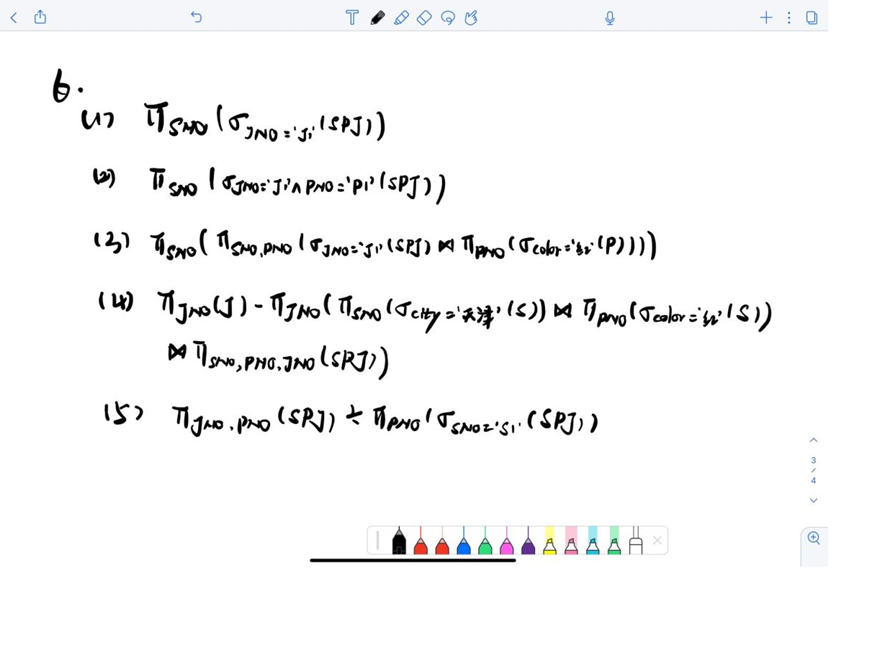
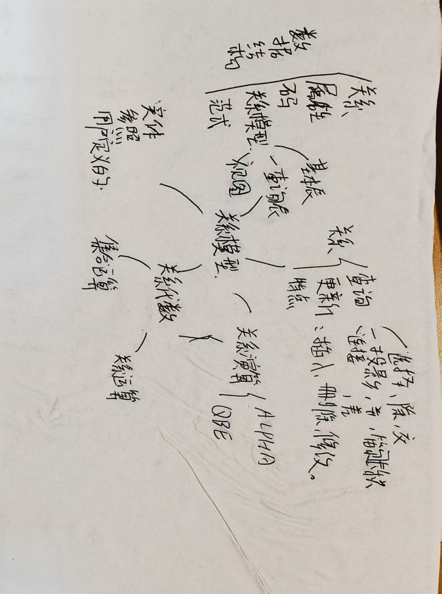

# 第二章作业

### 1. 关系模型的三个组成部分    
- 数据结构：关系模型用二维表（关系）组织数据，描述数据的逻辑结构。  
- 数据操作：包括查询（选择、投影、连接等）、更新（增、删、改）等操作，以集合为操作对象。  
- 完整性约束：包含实体完整性（主码非空且唯一）、参照完整性（外码约束）、用户定义完整性（自定义规则）。  

### 2. 关系数据语言的特点和分类  

- 特点：高度非过程化，用户只需说明“做什么”，无需定义“怎么做”；以集合为操作对象，支持集合操作。  
- 分类：  
  - 关系代数：用运算符定义操作（如选择、投影、连接）。  
  - 关系演算：分元组关系演算（以元组为变量）和域关系演算（以域为变量）。  
  - 结构化查询语言（SQL）：兼具关系代数与关系演算特点，是主流数据库语言。  

### 3. 术语定义、联系与区别  
#### ① 域，笛卡尔积，关系，元组，属性  
- 定义：  
  - 域：属性的取值范围。  
  - 笛卡尔积：一组域的所有可能组合（不含重复元组）。  
  - 关系：笛卡尔积的有限子集，满足一定语义。  
  - 元组：关系中的一行，代表一个实体。  
  - 属性：关系中的一列，对应域。  
- 联系与区别：域是属性取值基础；笛卡尔积是关系的理论基础，关系是其有意义的子集；元组是关系的实例元素，属性是关系的结构组成。  

#### ② 主码，全码，候选码，外码，主属性、非主属性  
- 定义：  
  - 候选码：能唯一标识元组的最小属性集。  
  - 主码：从候选码中选定的一个。  
  - 全码：候选码包含关系所有属性。  
  - 外码：若属性集是另一关系的主码，则为外码。  
  - 主属性：候选码中的属性。  
  - 非主属性：不在任何候选码中的属性。  
- 联系与区别：候选码是主码的候选集合；全码是特殊候选码；外码用于建立关系间联系；主属性构成候选码，非主属性不参与。  

#### ③ 关系模式，关系，关系数据库  
- 定义：  
  - 关系模式：对关系的描述，形如 \( R(U, D, DOM, F) \)，包含属性名、域等。  
  - 关系：关系模式的具体实例，是动态变化的二维表。  
  - 关系数据库：一组关系的集合，按关系模型组织。  
- 联系与区别：关系模式是静态结构，关系是动态实例；关系数据库由多个关系模式及对应关系构成。

### 4、举例说明关系模式和关系的区别。 
答：  
>    在数据库中，关系模式和关系是两个不同的概念。一个关系模式是一个表的定义，它描
    述了表中包含的列及其数据类型。而一个关系则是表中的实际数据集合。 
    举个例子来说明，假设有一个学生表，包含以下列：学号、姓名、年龄、性别、班级。
    那么这个表的关系模式就是： 
    Student(学号, 姓名, 年龄, 性别, 班级) 
    这个模式定义了学生表的结构，指明了这个表有哪些列，每列的数据类型是什么。 
    当我们向学生表中插入实际的数据时，就会得到一个关系，比如： 
    (1001, "张三", 20, "男", "计算机 1 班")  
    (1002, "李四", 21, "男", "计算机 2 班") 
    (1003, "王五", 19, "女", "计算机 1 班") 
    这个关系就是实际的数据集合，其中每一行都是一个学生记录，对应于关系模式中的一
    条数据。 
    因此，可以将关系模式看作是表的模板，描述了表的结构；而关系则是具有相同结构的
    实际数据集合。 
### 5、试述关系模型的完整性规则。在参照完整性中，什么情况下外码属性的值可以为空值？ 
答：
- 关系模型的完整性规则指的是保证数据库中数据的正确性和一致性的规则集合。常
见的完整性规则包括实体完整性、参照完整性、用户定义完整性等。 
    - 实体完整性规则：若属性 A 是基本关系 R 的主属性，则属性 A 不能取空值。 
    - 参照完整性规则：若属性(或属性组)F 是基本关系 R 的外码，它与基本关系 S 的主码 Ks 相对应(基本关系 R 和 S 不一定是不同的关系)，则对于 R 中每个元组在 F 上的
    值必须为：或者取空值(F 的每个属性值均为空值)； 或者等于 S 中某个元组的主码值。 
  - 用户定义的完整性是针对某一具体关系数据库的约束条件。它反映某一具体应用所设
    计的数据必须满足的语义要求。 
- 在参照完整性中，如果外码属性不是其所在关系的主码，则可以取空值，否则不能取 
空值。 

### 6

### 7
 
- 区别：  
  - 定义：等值连接是按“=”条件，选取两关系中属性值相等的元组进行连接；自然连接是特殊等值连接，要求两关系有同名同域属性，且自动去除重复属性列。  
  - 结果：等值连接结果可能包含重复属性列；自然连接结果去除重复列，结构更简洁。  
- 联系：自然连接是等值连接的特例。当等值连接的连接条件是两关系全部同名同域属性相等，且结果去除重复列时，即为自然连接。

## 8、关系代数的基本运算有哪些？如何用这些基本运算来表示其他运算？ 
答：关系代数是一种用于处理关系数据库的数学形式。它的基本运算包括：选择、投影、联
接、并、差、笛卡尔积等。 
1. 选择（σ）：从一个关系中选出满足指定条件的元组，生成一个新的关系。 
2. 投影（π）：从一个关系中选出指定的列，生成一个新的关系。 
3. 联接（⋈）：将两个关系按照指定条件进行连接，生成一个新的关系。 
4. 并（∪）：将两个关系中的元组合并成一个新的关系。 
5. 差（-）：从一个关系中去除另一个关系中相同的元组，生成一个新的关系。 
6. 笛卡尔积（×）：将两个关系中的元组进行配对，生成一个新的关系。 
除了这些基本运算，还可以通过它们的组合来表示其他运算，例如： 
1. 交（∩）：关系 R 与关系 S 的交可以表示为 R ∩ S = R - (R - S)。 
2. 自然连接（⋈）：关系 R 与关系 S 的自然连接可以表示为 R ⋈ S = σ(P(R) = P(S)) 
(R × S)，其中 P(R) 是关系 R 的属性集合。 
3. 除（÷）：关系 R 除以关系 S 可以表示为 R ÷ S = π(R - (π(R) × S))，其中 π
 (R) 是关系 R 的属性集合。 
需要注意的是，这些基本运算都是封闭的，即它们的结果也是一个关系。可以通过将这些基
本运算进行组合，来实现各种不同的查询和操作。

