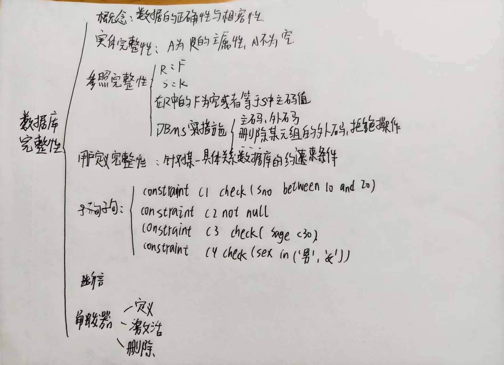

<center>

# 第五章作业

</center>

#### 1. 什么是数据库的完整性？
答：数据库的完整性是指数据库中数据的准确性、一致性和有效性的保证。它确保了数据的正确性和可靠性，同时也保护了数据库中数据的安全性和可访问性。
数据库完整性包括以下几个方面：
1.	实体完整性：保证数据库中的每个实体都有一个唯一的标识符，并且所有的实体都必须有一个值。
2.	参照完整性：保证在数据库中引用其他表中存在的数据时，引用的数据必须存在。这意味着，如果一个表中的数据引用另一个表中的数据，那么这个被引用的数据必须存在。
3.	域完整性：保证数据库中每个字段的取值都符合预定义的规则和条件。例如，一个字段的取值必须是数字或日期。
4.	用户定义的完整性：在需要时，可以为特定的应用程序或业务规则定义自己的完整性规则，以确保数据的正确性和完整性。
数据库完整性是保证数据库数据质量和准确性的重要组成部分，能够有效地防止数据损坏、数据丢失、数据不一致等问题。

#### 2. 数据库的完整性概念与数据库的安全性概念有什么区别和联系？
答：数据库的完整性和安全性都是数据库管理的关键概念，但它们具有不同的含义和目标。
数据库的完整性是指确保数据库中的数据始终保持准确、一致和有效的能力。这包括对数据的正确性、唯一性、引用完整性和域完整性等方面的保证。数据库的完整性旨在防止意外或故意破坏数据库中数据的行为。
而数据库的安全性则是指确保数据库中的数据不会被未经授权的人员或应用程序访问、修改或删除的能力。这包括保护数据库中的敏感信息，例如用户凭据、财务信息等。数据库的安全性旨在防止未经授权的访问和数据泄漏。
虽然这两个概念具有不同的目标和方法，但它们之间也有一些联系。例如，通过实施访问控制和审计机制，可以保护数据库中的数据不受未经授权的访问和修改。同时，通过应用完整性规则，可以防止数据被不当修改或破坏。
总之，数据库的完整性和安全性都是数据库管理的重要方面，它们相互依存，共同保护数据库中的数据不受意外或恶意破坏和未经授权的访问。

#### 3. 什么是数据库的完整性约束条件？
答：数据库的完整性约束条件是指对数据库中数据的限制和规则，以确保数据的准确性、一致性和有效性。它们是在创建数据库表时定义的，可以确保在向数据库表中插入、更新或删除数据时，数据始终符合预期的规则和条件。
常见的数据库完整性约束条件包括：
1.	主键约束：主键是一种唯一标识符，它用于识别数据库表中的每个记录。主键约束确保数据库表中的每个记录都有唯一的主键值，从而保证数据的一致性和正确性。
2.	外键约束：外键是一个指向另一个表中的主键的字段。外键约束确保数据库表中的外键值必须存在于其他表中的主键值，从而保证引用完整性和数据的一致性。
3.	唯一约束：唯一约束确保数据库表中的每个记录都有唯一的值。与主键约束不同的是，唯一约束允许NULL值。
4.	检查约束：检查约束定义了一个表达式或条件，用于限制数据库表中的数据。例如，可以使用检查约束确保数据库表中的数字字段大于零。
5.	默认约束：默认约束定义了在未显式指定值时，字段应该具有的默认值。例如，可以使用默认约束将日期字段的默认值设置为当前日期。
通过使用这些完整性约束条件，可以确保数据库中的数据始终保持准确、一致和有效。它们有助于防止不当修改或破坏数据，并提高数据库的可靠性和安全性。

#### 4. 关系数据库管理系统的完整性控制机制应具有哪三个方面的功能?
答：①定义功能，即提供定义完整性约束条件的机制。
②检查功能，即检查用户发出的操作请求是否违背了完整性约束条件。
③违约处理功能：如果发现用户的操作请求使数据违背了完整性约束条件，则采取一定的动作来保证数据的完整性。

#### 5. 关系数据库管理系统在实现参照完整性时需要考虑哪些方面？
答：
1.	定义外键约束：参照完整性的内核是外键约束，需要在表之间定义外键关系。外键约束要求被参照表的列（通常是主键列）的值必须存在于参照表的列中。这可以通过在RDBMS中创建外键约束来实现。
2.	级联更新和删除：在实现参照完整性时，需要考虑级联更新和删除的问题。当更新或删除主表中的记录时，应该同时更新或删除相关的子表中的记录。这可以通过在RDBMS中设置级联更新和删除规则来实现。
3.	处理空值：处理空值是参照完整性实现中的另一个重要问题。如果被参照表中的列允许为空值，那么外键列也可以引用空值。在这种情况下，需要考虑如何处理空值，例如是否允许在子表中插入空值，或者是否要在父表中添加额外的记录以代表空值。
4.	检查约束：在实现参照完整性时，还需要考虑其他检查约束，以确保数据的正确性和一致性。例如，可以使用检查约束确保在插入或更新记录时，外键列中的值必须是一个有效的引用。
总之，实现参照完整性需要考虑多个方面，包括定义外键约束、处理级联更新和删除、处理空值和添加其他检查约束。RDBMS可以提供工具和机制来帮助管理这些方面，确保数据库中的数据始终保持准确、一致和有效。

#### 6.
    假设有下面两个关系模式：
    职工（职工号，姓名，年龄，职务，工资，部门号），其中职工号为主码；
    部门（部门号，名称，经理名，电话），其中部门号为主码。
    用SQL语言定义这两个关系模式，要求在模式中完成以下完整性约束条件的定义：
    (1)定义每个模式的主码；
    (2)定义参照完整性；
    (3)定义职工年龄不得超过60岁。
答：
```sql
    CREATE TABLE DEPT (
        Deptno NUMBER(2) PRIMARY KEY, 
        Deptname VARCHAR(10), 
        Manager VARCHAR(10),
        PhoneNumber Char(12)
    );
    CREATE TABLE EMP (
        Empno NUMBER(4) PRIMARY KEY, 
        Ename VARCHAR(10), 
        Age NUMBER(2), 
        Job VARCHAR(9), 
        Sal NUMBER(7,2), 
        Deptno NUMBER(2), 
        CONSTRAINT C1 CHECK(Age<=60), 
        CONSTRAINT FK_DEPTNO FOREIGN KEY(Deptno) REFERENCES DEPT(Deptno)
    );
```

#### 7.在关系系统中，当操作违反实体完整性、参照完整性和用卢定义的完整性约束条件时，一般是如何分别进行处理的？
答：
1.	实体完整性：实体完整性是指保证每个记录都有唯一的标识符，通常是通过主键实现。如果插入或更新记录时违反了实体完整性约束，系统通常会拒绝该操作并返回错误消息，提示用户违反了实体完整性约束。
2.	参照完整性：参照完整性是指确保外键约束中的引用关系是有效的。如果插入或更新记录时违反了参照完整性约束，系统通常会拒绝该操作并返回错误消息，提示用户违反了参照完整性约束。此外，系统通常还提供了级联更新和删除的选项，以便在父表中更新或删除记录时，同时更新或删除相关的子表中的记录。
3.	用户定义的完整性约束条件：用户可以自定义完整性约束条件来确保数据的准确性和一致性。如果插入或更新记录时违反了这些约束条件，系统通常会拒绝该操作并返回错误消息，提示用户违反了用户定义的完整性约束条件。
总之，在关系系统中，当操作违反实体完整性、参照完整性和用户定义的完整性约束条件时，系统通常会拒绝该操作并返回错误消息。这有助于确保数据库中的数据始终保持准确、一致和有效。


