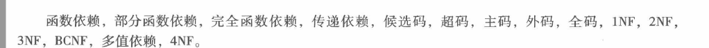
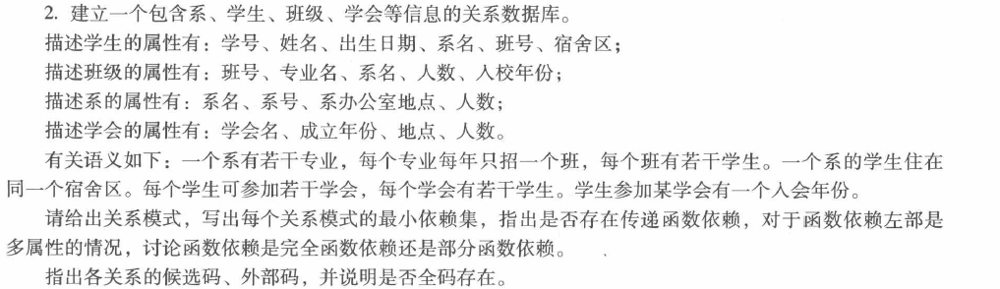
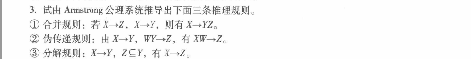
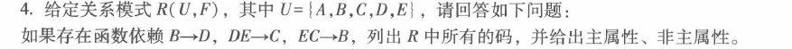
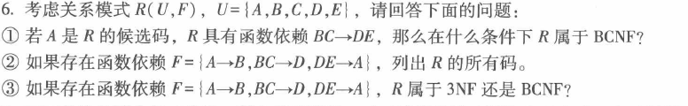
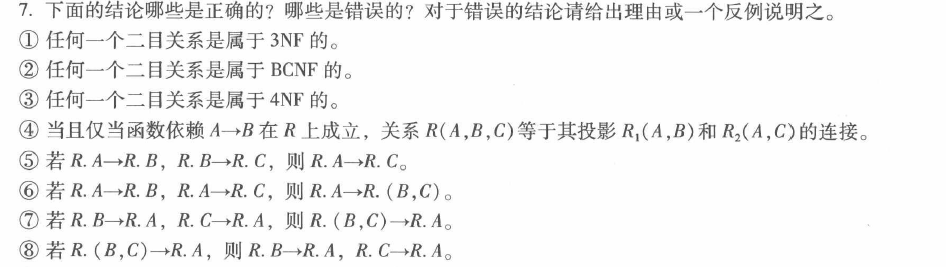
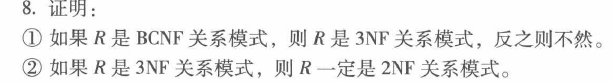

# 第六章作业

## 1.解释如下概念

1. **函数依赖**  
设 \( R(U) \) 是属性集 \( U \) 上的关系模式，\( X, Y \subseteq U \)。若 \( R(U) \) 的任意关系 \( r \) 中，不存在两元组在 \( X \) 上值相等而 \( Y \) 上值不等，则称 \( X \) 函数确定 \( Y \)，记为 \( X \to Y \)。  

1. **部分函数依赖**  
在 \( R(U) \) 中，若 \( X \to Y \)，但存在 \( X \) 的真子集 \( X' \) 使 \( X' \to Y \)，则称 \( Y \) 对 \( X \) 部分函数依赖，记为 \( X \xrightarrow{p} Y \)。  

1. **完全函数依赖**  
若 \( X \to Y \)，且对 \( X \) 的任何真子集 \( X' \)，\( X' \nrightarrow Y \)，则称 \( Y \) 对 \( X \) 完全函数依赖，记为 \( X \xrightarrow{f} Y \)。  

1. **传递依赖**  
在 \( R(U) \) 中，若 \( X \to Y \)，\( Y \to Z \)，且 \( Y \nsubseteq X \)，\( Z \nsubseteq Y \)，\( Y \nrightarrow X \)，则称 \( Z \) 对 \( X \) 传递函数依赖。  

1. **候选码**  
设 \( K \) 为 \( R(U, F) \) 中的属性（组），若 \( K \xrightarrow{f} U \)，则 \( K \) 是候选码，它是能唯一标识元组的最小属性集。  

1. **超码**  
包含候选码的属性（组），可唯一标识元组，但可能含多余属性。  

1. **主码**  
从候选码中选定的一个，用于唯一标识关系中的元组。  

1. **外码**  
设 \( F \) 是 \( R(U) \) 的属性（组），若 \( F \) 与另一关系 \( S(V) \) 的主码对应，则 \( F \) 是 \( R \) 的外码，用于建立表间联系。  

1. **全码**  
若关系模式的候选码由全部属性组成，则称全码。  

1.  **1NF**  
关系模式 \( R \) 的每个属性值均为不可再分的原子值，即属性不可拆分。  

1.  **2NF**  
满足 1NF，且每个非主属性完全依赖于候选码，消除部分函数依赖。  

1.  **3NF**  
满足 2NF，且每个非主属性不传递依赖于候选码，消除传递函数依赖。  

1.  **BCNF**  
每个决定因素都包含候选码，即对 \( X \to Y \)，必有 \( X \) 是候选码，比 3NF 更严格。  

1.  **多值依赖**  
设 \( R(U) \)，\( X, Y, Z \subseteq U \)，\( Z = U - X - Y \)。若 \( R \) 中有元组 \( (x, y_1, z_1) \) 和 \( (x, y_2, z_2) \)，则必有 \( (x, y_2, z_1) \) 和 \( (x, y_1, z_2) \)，称 \( X \) 多值决定 \( Y \)，记为 \( X \to\to Y \)。  

1.  **4NF**  
满足 BCNF，且消除非平凡多值依赖（即 \( X \to\to Y \) 时，\( X \) 是超码），只允许平凡多值依赖。 

## 2.

1. **学生（学号，姓名，出生日期，班号，系名，宿舍区）**  
   - **最小依赖集**：\( F_{min} = \{ \) 学号→姓名，学号→出生日期，学号→班号，班号→系名，系名→宿舍区 \( \} \)  
   - **传递依赖**：存在，如学号→班号→系名→宿舍区。  
   - **候选码**：学号；**外码**：班号、系名。  

2. **班级（班号，专业名，系名，人数，入校年份）**  
   - **最小依赖集**：\( F_{min} = \{ \) 班号→专业名，班号→系名，班号→人数，班号→入校年份，（专业名，入校年份）→班号 \( \} \)  
   - **函数依赖类型**：（专业名，入校年份）→班号是完全函数依赖。  
   - **传递依赖**：无（班号是候选码，依赖均直接）。  
   - **候选码**：班号、（专业名，入校年份）；**外码**：系名。  

3. **系（系号，系名，系办公室地点，人数）**  
   - **最小依赖集**：\( F_{min} = \{ \) 系号→系名，系号→系办公室地点，系号→人数，系名→系号，系名→系办公室地点，系名→人数 \( \} \)  
   - **传递依赖**：无（系号与系名相互决定，均为候选码）。  
   - **候选码**：系号、系名；**外码**：无。  

4. **学会（学会名，成立年份，地点，人数）**  
   - **最小依赖集**：\( F_{min} = \{ \) 学会名→成立年份，学会名→地点，学会名→人数 \( \} \)  
   - **传递依赖**：无。  
   - **候选码**：学会名；**外码**：无。  

5. **学生 - 学会（学号，学会名，入会年份）**  
   - **最小依赖集**：\( F_{min} = \{ \)（学号，学会名）→入会年份 \( \} \)  
   - **函数依赖类型**：（学号，学会名）→入会年份是完全函数依赖。  
   - **传递依赖**：无。  
   - **候选码**：（学号，学会名）；**外码**：学号、学会名。  

所有关系模式中，候选码均未包含全部属性，**不存在全码**。 

## 3.

### ①  
- 由 \( X \to Y \)，根据 **增广律**（在 \( X \to Y \) 两边增广 \( X \)），得 \( X \to XY \)。  
- 由 \( X \to Z \)，根据 **增广律**（在 \( X \to Z \) 两边增广 \( X \)），得 \( X \to XZ \)；再对 \( XY \to YZ \)（由自反律 \( YZ \to YZ \)，结合 \( X \to XY \) 和 \( X \to XZ \) 的拓展），更简洁的是：  
  - 已知 \( X \to Y \)，对其用 **增广律** 两边增广 \( Z \)，得 \( XZ \to YZ \)；又 \( X \to Z \) 用增广律得 \( X \to XZ \)。  
  - 最后根据 **传递律**（\( X \to XZ \) 且 \( XZ \to YZ \)），推得 \( X \to YZ \)。  

### 
- 对 \( X \to Y \) 应用 **增广律**（两边增广 \( W \)），得 \( XW \to WY \)。  
- 已知 \( WY \to Z \)，根据 **传递律**（\( XW \to WY \) 且 \( WY \to Z \)），推得 \( XW \to Z \)。  

### ③ 
- 因为 \( Z \subseteq Y \)，根据 **自反律**，得 \( Y \to Z \)。  
- 又已知 \( X \to Y \)，根据 **传递律**（\( X \to Y \) 且 \( Y \to Z \)），推得 \( X \to Z \)。  
 
 ## 4.
 

- **码**：  
  - **\( ABE \)**：由 \( B \to D \) 得 \( ABE \to D \)；由 \( DE \to C \)（\( ABE \) 含 \( D, E \)）得 \( ABE \to C \)，从而 \( ABE \to A, B, C, D, E \)。  
  - **\( ADE \)**：由 \( DE \to C \) 得 \( ADE \to C \)；由 \( EC \to B \)（\( ADE \) 含 \( E, C \)）得 \( ADE \to B \)，从而 \( ADE \to A, B, C, D, E \)。  
  - **\( ACE \)**：由 \( EC \to B \) 得 \( ACE \to B \)；由 \( B \to D \) 得 \( ACE \to D \)，从而 \( ACE \to A, B, C, D, E \)。  

  因此，\( R \) 的码为 \( ABE \)、\( ADE \)、\( ACE \)。  

- **主属性与非主属性**：  
  所有属性 \( A, B, C, D, E \) 均在至少一个码中出现，故 **主属性为 \( A, B, C, D, E \)**，**无非主属性**。  

综上，\( R \) 的码是 \( ABE \)、\( ADE \)、\( ACE \)；主属性为 \( A, B, C, D, E \)，无非主属性。 

## 5.试举出三个多值依赖的例子

以下是三个多值依赖的例子：  

1. **教学关系**：设关系模式 \( \text{Teach}(T, C, S) \)，其中 \( T \) 表示教师，\( C \) 表示课程，\( S \) 表示学生。一位教师可教授多门课程，也可指导多个学生。对于给定的教师 \( T \) 和学生 \( S \)，课程 \( C \) 的取值与 \( S \) 无关；反之，对于给定的教师 \( T \) 和课程 \( C \)，学生 \( S \) 的取值与 \( C \) 无关。此时存在 \( T \to\to C \) 和 \( T \to\to S \)。  

2. **家庭关系**：设关系模式 \( \text{Family}(F, K, P) \)，其中 \( F \) 表示家庭，\( K \) 表示孩子，\( P \) 表示宠物。一个家庭有多个孩子和多个宠物。对于给定的家庭 \( F \) 和孩子 \( K \)，宠物 \( P \) 的取值与 \( K \) 无关；对于给定的家庭 \( F \) 和宠物 \( P \)，孩子 \( K \) 的取值与 \( P \) 无关。此时存在 \( F \to\to K \) 和 \( F \to\to P \)。  

3. **出版关系**：设关系模式 \( \text{Publish}(B, A, Pr) \)，其中 \( B \) 表示书，\( A \) 表示作者，\( Pr \) 表示印刷厂。一本书有多个作者和多个印刷厂。对于给定的书 \( B \) 和作者 \( A \)，印刷厂 \( Pr \) 的取值与 \( A \) 无关；对于给定的书 \( B \) 和印刷厂 \( Pr \)，作者 \( A \) 的取值与 \( Pr \) 无关。此时存在 \( B \to\to A \) 和 \( B \to\to Pr \)。 

## 6.

### ① 
根据 \( BCNF \) 的定义，对于每一个非平凡函数依赖 \( X \to Y \)，\( X \) 必须是超码。已知 \( A \) 是候选码，\( BC \to DE \)，要使 \( R \) 属于 \( BCNF \)，则 \( BC \) 必须包含候选码。这样 \( BC \to DE \) 的左边 \( BC \) 为超码，满足 \( BCNF \) 要求。  

### ②  
- 对于 \( BCE \)：  
  - \( BC \to D \)（已知），\( DE \to A \)（已知），\( A \to B \)（已知）。  
  - \( BCE \xrightarrow{BC} D \xrightarrow{DE} A \xrightarrow{A} B \)，即 \( BCE \to \{A, B, C, D, E\} \)，且去掉任意一属性后不能决定所有属性，故 \( BCE \) 是码。  
- 对于 \( CDE \)：  
  - \( DE \to A \)（已知），\( A \to B \)（已知）。  
  - \( CDE \xrightarrow{DE} A \xrightarrow{A} B \)，即 \( CDE \to \{A, B, C, D, E\} \)，且去掉任意一属性后不能决定所有属性，故 \( CDE \) 是码。  
因此，\( R \) 的码为 \( BCE \)、\( CDE \)。  

### ③ 
- **\( 3NF \) 判断**：  
  - \( 3NF \) 要求非主属性既不部分依赖也不传递依赖于码。  
  - \( A \to B \)：\( B \) 是主属性（\( B \in BCE \)），不违反 \( 3NF \)。  
  - \( BC \to D \)：\( D \) 是主属性（\( D \in CDE \)），不违反 \( 3NF \)。  
  - \( DE \to A \)：\( A \) 是非主属性，但无传递依赖（\( DE \) 是码 \( CDE \) 的子集，已在 \( 2NF \) 消除部分依赖），故 \( R \) 满足 \( 3NF \)。  
- **\( BCNF \) 判断**：  
  - \( BCNF \) 要求每一个非平凡函数依赖 \( X \to Y \)，\( X \) 是超码。  
  - \( A \to B \)：\( A \) 不是超码，违反 \( BCNF \)。  
  - \( BC \to D \)：\( BC \) 不是超码，违反 \( BCNF \)。  
  - \( DE \to A \)：\( DE \) 不是超码，违反 \( BCNF \)。  

综上，① \( BC \) 包含候选码时 \( R \) 属于 \( BCNF \)；② \( R \) 的码为 \( BCE \)、\( CDE \)；③ \( R \) 属于 \( 3NF \)，不属于 \( BCNF \)。 

## 7.

① 正确。  
② 正确。
③ 正确。
④ 错误。当 \( A \) 是全码时，即使 \( A \to B \) 不成立，\( R(A,B,C) \) 也等于 \( R_1(A,B) \) 和 \( R_2(A,C) \) 的连接。例如 \( R = \{(1,2,3), (1,4,5)\} \)，\( A \) 为全码，无 \( A \to B \)，但连接仍等于 \( R \)。  
⑤ 正确。  
⑥ 正确。 
⑦ 正确。
⑧ 错误。反例：设 \( R = \{(1,1, a), (1,2, b)\} \)，\( (B,C) \to A \) 成立（\( (1,1) \to a \)，\( (1,2) \to b \)），但 \( B \to A \) 不成立（\( B = 1 \) 时 \( A \) 有 \( a, b \)），\( C \to A \) 也不成立。  

综上，①②③⑤⑥⑦ 正确；④⑧ 错误。 

## 8.

### ①   
- **正向证明**：  
  假设 \( R \in BCNF \)，采用反证法。若 \( R \notin 3NF \)，则存在非主属性 \( Z \) 对码的传递依赖，即 \( X \to Y \)，\( Y \to Z \)，其中 \( Y \) 不是超码（否则 \( Y \to Z \) 中 \( Z \) 为主属性，不构成传递依赖），且 \( Z \not\subseteq Y \)，\( Y \not\subseteq X \)，\( Y \nrightarrow X \)。但在 \( BCNF \) 中，每个非平凡函数依赖的决定因素 \( X \)、\( Y \) 都应为超码，这与 \( Y \) 不是超码矛盾。因此，\( R \in BCNF \) 时必有 \( R \in 3NF \)。  
- **反向举例**：  
  设 \( R(A, B, C) \)，\( F = \{AB \to C, C \to A\} \)。码为 \( AB \) 和 \( BC \)，非主属性 \( C \) 无传递依赖（\( C \to A \) 中 \( A \) 是主属性），故 \( R \in 3NF \)。但 \( C \to A \) 中 \( C \) 不是超码，不满足 \( BCNF \)。这表明存在 \( 3NF \) 但非 \( BCNF \) 的关系模式，即反之不然。  

### ②  
假设 \( R \in 3NF \)，则非主属性既不部分依赖也不传递依赖于码。若 \( R \notin 2NF \)，则存在非主属性对码的部分依赖，即 \( X \xrightarrow{p} Y \)（\( X \) 为码的真子集），这与 \( 3NF \) 中“非主属性完全依赖于码”矛盾。因此，\( R \in 3NF \) 时必然满足 \( 2NF \)。  

## 9.

- 在实际应用中，关系模式 \( R(U, F) \) 对应的关系 \( r \) 有无数个。要验证每个关系 \( r \) 是否满足 \( r = m_\rho(r) \)，在操作上是不可能实现的，因为无法穷举所有可能的 \( r \) 并逐一检查。因此，该定义仅为无损连接性提供了理论层面的概念阐述，缺乏实际鉴别所需的可操作性，无法直接用于鉴别一个分解的无损连接性。 

