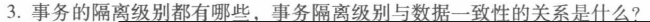
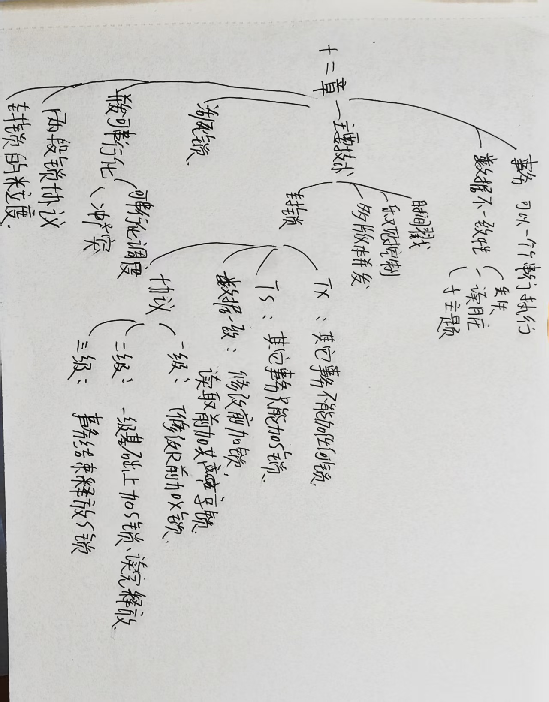

# 第十二章作业

## 1.在数据库中为什么要并发控制?并发控制技术能保证事务的哪些特性?

答:
数据库是共享资源,通常有多个事务同时在运行。当多个事务并发地存取数据库时就会产生同时读取或修改同一数据的情况。若对并发操作不加控制就可能会存取和存储不正确的数据,破坏数据库的一致性。所以数据库管理系统必须提供并发控制机制。
并发控制可以保证事务的一致性和隔离性。

## 2.并发操作可能会产生哪几类数据不一致?用什么方法能避免各种不一致的情况?

答:
并发操作带来的数据不一致性包括三类:
(1)丢失修改
两个事务 T1 和 T2 读入同一数据并修改,T2 提交的结果破坏了(覆盖了)T1 提交的结果,导致 T1 的修改被丢失。
(2)不可重复读
不可重复读是指事务 T1 读取某一数据后,事务 T2 对其执行更新操作,使 T1 无法再现前一次读取结果。不可重复读包括三种情况:
① 事务 T1 读取某一数据后,事务 T2 对其做了修改,当事务 T1 再次读该数据时，得到与前一次不同的值。
② 事务 T1 按一定条件从数据库中读取了某些数据记录后,事务 T2 删除了其中部分记录，当 T1 再次按相同条件读取数据时,发现某些记录消失了。
③ 事务 T1 按一定条件从数据库中读取某些数据记录后,事务 T2 插入了一些记录,当 T1 再次按相同条件读取数据时,发现多了一些记录。
后两种不可重复读有时也称为幻影现象。
(3)读“脏”数据
读“脏"数据是指事务 T1 修改某一数据,并将其写回磁盘,事务 T2 读取同一数据后,T1 由于某种原因被撤销,这时 T1 已修改过的数据恢复原值，T2 读到的数据就与数据库中的数据不一致,则 T1 读到的数据就为“脏”数据,即不正确的数据。
避免不一致性的方法就是并发控制。常用的并发控制技术包括封锁方法、时间戳方法、乐观控制方法和多版本并发控制方法等。

## 3

答：事务的隔离级别通常分为四种：读取未提交（Read Uncommitted）、读取已提交（Read Committed）、可重复读（Repeatable Read）和串行化（Serializable）。不同的隔离级别决定了事务在执行过程中能否看到其他事务的未提交数据。事务隔离级别与数据一致性之间的关系非常密切，较高的隔离级别，如串行化，通常能提供更高的数据一致性，但可能牺牲性能和并发性；而较低的隔离级别，如读取未提交，则允许较低的一致性来提高性能和并发性，因此可能会出现脏读、不可重复读等问题。事务隔离级别的选择在性能与一致性之间存在权衡，选择合适的隔离级别可以平衡事务执行效率与数据一致性的需求。

## 4 什么是封锁?基本的封锁类型有几种?试述它们的含义。

答:
封锁就是事务 T 在对某个数据对象例如表、记录等操作之前,先向系统发出请求,对其加锁。加锁后事务 T 就对该数据对象有了一定的控制,在事务 T 释放它的锁之前,其他的事务不能更新或读取此数据对象。
基本的封锁类型有两种:排他锁(简称 X 锁)和共享锁(简称 S 锁)。
排他锁又称为写锁。若事务 T 对数据对象 A 加上 X 锁,则只允许 T 读取和修改 A,其他任何事务都不能再对 A 加任何类型的锁,直到 T 释放 A 上的锁。这就保证了其他事务在 T 释放 A 上的锁之前不能再读取和修改 A。
共享锁又称为读锁。若事务 T 对数据对象 A 加上 S 锁,则事务 T 可以读 A 但不能修改 A,其他事务只能再对 A 加 S 锁,而不能加 X 锁,直到 T 释放 A 上的 S 锁。这就保证了其他事务可以读 A,但在 T 释放 A 上的 S 锁之前不能对 A 做任何修改。

## 5．如何用封锁机制保证数据的一致性?

答:
封锁机制是一种用于保证数据一致性的常见方法。在多线程或多进程环境下，封锁机制可以确保同时只有一个线程或进程可以访问共享数据，从而避免数据的不一致性和竞争条件。通过使用封锁机制，可以保证并发事务之间访问资源的顺序和时序，从而提高系统的并发度和性能，并避免数据冲突和并发问题。

## 6.什么是活锁?试述活锁的产生原因和解决方法。

答：
活锁（Livelock）是一种类似于死锁的情况，其中线程在竞争资源时无法继续执行，但它们并没有被阻塞，而是不断地改变自己的状态，导致无法取得进展。在活锁中，线程一直处于运行状态，但无法完成其任务。
活锁产生的原因:当一系列封锁不能按照其先后顺序执行时,就可能导致一些事务无限期等待某个封锁,从而导致活锁。
避免活锁的简单方法是采用先来先服务的策略。当多个事务请求封锁同一数据对象时，封锁子系统按请求封锁的先后次序对事务排队，数据对象上的锁一旦释放就批准申请队列中第一个事务获得锁。

## 7.什么是死锁?请给出预防死锁的若干方法。

答:
死锁指的是在并发执行的多个事务中，各自持有一些资源并且都等待其他事务释放它们持有的资源，导致它们都无法继续向前执行的一种状态，形成了一种相互等待对方释放资源的僵局。
预防死锁通常有两种方法:
① 一次封锁法
要求每个事务必须一次将所有要使用的数据全部加锁,否则就不能继续执行。
② 顺序封锁法
预先对数据对象规定一个封锁顺序,所有事务都按这个顺序实行封锁。

## 8. 请给出检测死锁发生的一种方法,当发生死锁后如何解除死锁?

答:
数据库系统一般采用的方法是允许死锁发生,DBMS 检测到死锁后加以解除。DBMS 中诊断死锁的方法与操作系统类似,一般使用超时法或事务等待图法。
超时法是指事务的等待时间超过了规定的时限,就认为发生了死锁。
DBMS 并发控制子系统检测到死锁后,就要设法解除。通常采用的方法是选择一个处理死锁代价最小的事务, 将其撤销,释放此事务持有的所有锁,使其他事务得以继续运行下去。

## 9.什么样的并发调度是正确的调度?

答:
可串行化的调度是正确的调度。
可串行化的调度的定义:多个事务的并发执行是正确的，当且仅当其结果与按某一次序
串行地执行它们时的结果相同，称这种调度策略为可串行化的调度。

## 10.

设 T1、T2、T3 是如下的三个事务,设 A 的初值为 0。
T1:A:=A+2;
T2:A:=A*2;
T3:A:=A*A;
① 若这三个事务允许并行执行,则有多少可能的正确结果,请列举出来
答:
A 的最终结果可能有 2、4、8、16。
因为串行执行次序有 T1T2T3;T1T3T2；T2T1T3;T2T3T1;T3T1T2;T3T2T1;
对应的执行结果是 16;8;4;2;4;2。
② 请给出一个可串行化的调度,并给出执行结果
| 时间 | 事务 | 操作 | A 值变化 |
| -- | -- | ----------- | ------ |
| t1 | T1 | Read A (=0) | A = 0 |
| t2 | T1 | Write A=0+2 | A = 2 |
| t3 | T2 | Read A (=2) | A = 2 |
| t4 | T2 | Write A=2×2 | A = 4 |
| t5 | T3 | Read A (=4) | A = 4 |
| t6 | T3 | Write A=4×4 | A = 16 |

最终结果：A = 16
③ 请给出一个非串行化的调度,并给出执行结果。
| 时间 | 事务 | 操作 | A 值变化 |
| -- | -- | ----------- | ------- |
| t1 | T1 | Read A (=0) | A = 0 |
| t2 | T2 | Read A (=0) | A = 0 |
| t3 | T1 | Write A=0+2 | A = 2 |
| t4 | T2 | Write A=0×2 | A = 0 ❌ |

最终结果：A = 0（不等价于任何串行顺序）
④ 若这三个事务都遵守两段锁协议,请给出一个不产生死锁的可串行化调度
| 时间 | 事务 | 操作 | A 值变化 |
| --- | -- | ----------- | ------ |
| t1 | T1 | Lock(A) | |
| t2 | T1 | Read A (=0) | A = 0 |
| t3 | T1 | Write A=0+2 | A = 2 |
| t4 | T1 | Unlock(A) | |
| t5 | T2 | Lock(A) | |
| t6 | T2 | Read A (=2) | A = 2 |
| t7 | T2 | Write A=2×2 | A = 4 |
| t8 | T2 | Unlock(A) | |
| t9 | T3 | Lock(A) | |
| t10 | T3 | Read A (=4) | A = 4 |
| t11 | T3 | Write A=4×4 | A = 16 |
| t12 | T3 | Unlock(A) | |

最终结果：A = 16，且无死锁
⑤ 若这三个事务都遵守两段锁协议,请给出一个产生死锁的调度
| 时间 | 事务 | 操作 | 状态 |
| -- | -- | ------------- | ------- |
| t1 | T1 | Lock(A) | 获得锁 |
| t2 | T2 | Lock(A) | 等待 T1 释放 |
| t3 | T1 | 试图请求 B（阻塞） | 等待 T2 释放 B |
| t4 | T2 | 试图请求 A（已被 T1 持有） | 等待 T1 |

结果：系统进入死锁，A 未能更新完成

## 11

答：是冲突可串行化的调度。
Sc1=r3(B) r1(A) w3(B) r2(B) r2(A) w2(B) r1(B) w1(A),交换 r1(A)和 w3(B) ,得到 R3(B) w3(B) r1(A) r2(B) r2(A) w2(B) r1(B) w1(A)，再交换 r1(A)和 r2(B) r2(A) w2(B) ,得到 Se2=r3(B) w3(B) r2(B) r2(A) w2(B) r1(A) r1(B) w1(A)，由于 Sc2 是串行的,而且两次交换都是基于不冲突操作的,所以 Sc1=r3(B) r1(A) w3(B) r2(B) r2(A) w2(B) r1(B) w1(A)是冲突可串行化的调度。

## 12. 试证明若事务遵守两段锁协议，则对这些事务的并发调度是可串行化的。

答：假设所有事务都遵守两段锁协议。

1. 设存在一个不满足串行化的调度，则其冲突图存在**环** $T_1 \rightarrow T_2 \rightarrow \dots \rightarrow T_k \rightarrow T_1$。

2. 对于环中的每一对事务 $T_i \rightarrow T_{i+1}$，必有冲突操作，且 $T_i$ 在 $T_{i+1}$ 之前访问了某资源（即 $T_i$ 持有锁，后 $T_{i+1}$ 请求锁）。

3. 由于事务遵守两段锁协议，一个事务一旦释放锁，就不能再申请新锁。这意味着，如果事务 A 在事务 B 之后请求一个锁，那么事务 A 在事务 B 的“加锁阶段”之后。

4. 从冲突图环中的顺序推出：每个事务在另一个之后持锁，这种锁的先后顺序在时间上是矛盾的（类似于“先后矛盾”），即形成“死锁”逻辑，但两段锁协议防止了这种矛盾发生。

因此，不可能存在环形依赖，即冲突图必须是无环的。因此，若所有事务遵守两段锁协议，则任何并发调度是冲突可串行化的。

## 13.举例说明,对并发事务的一个调度是可串行化的,而这些并发事务不一定遵守两段锁协议。

答：
假设有两个事务 T1 和 T2，它们分别进行如下操作：

- T1: 读取 A
- T2: 修改 A
- T1: 修改 B
- T2: 读取 B

如果在并发执行这些操作时，调度为 T1 读取 A --> T2 修改 A --> T1 修改 B --> T2 读取 B，则此调度是不可串行化的。
但是，可以通过修改该调度来使其变得可串行化。例如，我们可以将原调度改为 T2 修改 A --> T2 读取 B --> T1 读取 A --> T1 修改 B。这个新的调度中，先执行了 T2 中的所有操作，然后再执行了 T1 中的所有操作。虽然这个调度中的事务没有遵守两段锁协议，但它是可串行化的。

## 14.考虑如下的调度,说明这些调度集合之间的包含关系。

① 正确的调度。
② 可串行化的调度。
③ 遵循两阶段封锁(2PL)的调度。
④ 串行调度
答:
④ 串行调度 ⊂ ③ 遵循两阶段封锁调度 ⊂ ② 可串行化调度 = ① 正确的调度

## 15

答：

1. 修改 $T_1$ 和 $T_2$，增加加锁操作和解锁操作，并要求遵循两阶段锁协议。

我们需要确保在事务中加锁和解锁的操作满足两阶段锁协议（2PL）。根据 2PL 协议，事务必须遵循两个阶段：加锁阶段和解锁阶段对于事务 $T_1$ 和 $T_2$，可以在读写操作之前加锁，在操作完成后解锁。
修改后的事务如下：

- **$T_1$：**
  $\text{Lock}(A); R(A); \text{Lock}(B); B = A + B; W(B); \text{Unlock}(B); \text{Unlock}(A)$

- **$T_2$：**
  $\text{Lock}(B); R(B); \text{Lock}(A); R(A); A = A + B; W(A); \text{Unlock}(A); \text{Unlock}(B)$

这样，事务 $T_1$ 和 $T_2$ 都遵循了两阶段锁协议，即先加锁，再执行操作，最后解锁。

2.

分析 $T_1$ 和 $T_2$ 的锁依赖：

1. $T_1$ 在开始时锁定 $A$，然后锁定 $B$，最后解锁 $B$ 和 $A$。
2. $T_2$ 在开始时锁定 $B$，然后锁定 $A$，最后解锁 $A$ 和 $B$。

根据事务的执行顺序，$T_1$ 可能在 $T_2$ 锁定 $A$ 后开始执行，而 $T_2$ 在 $T_1$ 锁定 $B$ 后开始执行，形成了一个环形等待。。这样，死锁的情况是：$T_1$ 等待 $T_2$ 解锁 $A$， $T_2$ 等待 $T_1$ 解锁 $B$，这是一个典型的死锁情况，因为两者相互等待对方释放锁，而无法继续执行。

## 16. 为什么要引进意向锁?意向锁的含义是什么?

答:
引进意向锁是为了提高封锁子系统的效率。
原因是:在多粒度封锁方法中,一个数据对象可能以两种方式加锁—―显式封锁和隐式封锁。因此系统在对某一数据对象加锁时,不仅要检
查该数据对象上有无(显式和隐式)封锁与之冲突,还要检查其所有上级结点和所有下级结点,看申请的封锁是否与这些结点上的(显式和隐式)封锁冲突。显然,这样的检查方法效率很低。为此引进了意向锁。
意向锁的含义是:对任一结点加锁时,必须先对它的上层结点加意向锁。引进意向锁后,系统对某一数据对象加锁时不必逐个检查与下一级结点的封锁冲突了。

## 17. 试述常用的意向锁:IS 锁、IX 锁、SIX 锁,给出这些锁的相容矩阵。

答:
IS 锁:如果对一个数据对象加 IS 锁,表示它的后裔结点拟(意向)加 S 锁。例如,要对某个元组加 S 锁,则要首先对关系和数据库加 IS 锁
IX 锁:如果对一个数据对象加 IX 锁,表示它的后裔结点拟(意向)加 X 锁。例如,要对某个元组加 X 锁,则要首先对关系和数据库加 IX 锁。
SIX 锁:如果对一个数据对象加 SIX 锁,表示对它加 S 锁,再加 IX 锁,即 SIX =S+IX。

## 思维导图
