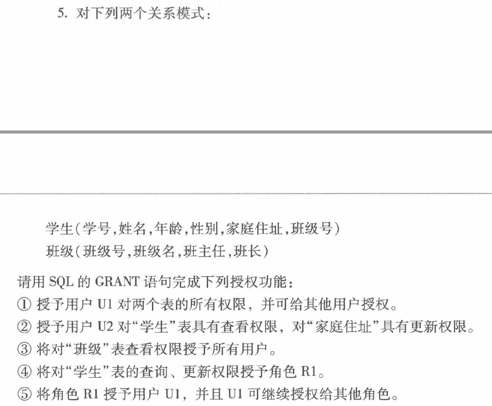
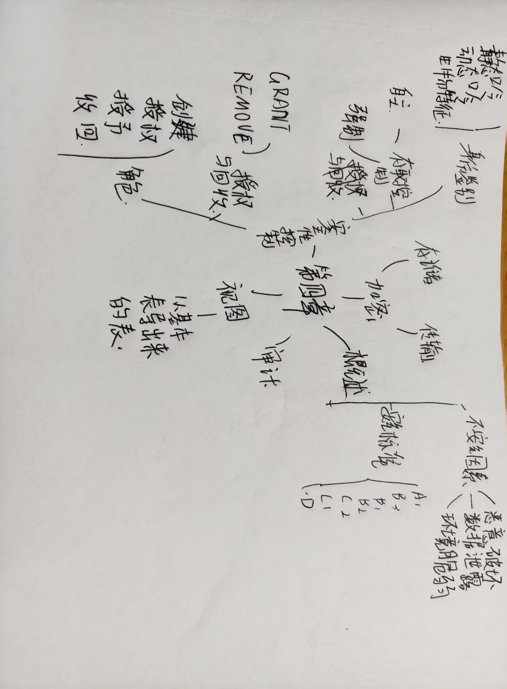

<center>

# 第四章作业

</center>


#### 1.什么是数据库的安全性？  
   **答**：数据库的安全性指保护数据库免受恶意破坏与非法存取，确保数据的保密性（不被未授权主体获取）、完整性（不被非法篡改），保障数据库系统正常运行，防止数据被未授权使用或破坏。  

#### 2.举例说明对数据库安全性产生威胁的因素。  
   **答**：  
   - **非法用户入侵**：如黑客利用系统漏洞或弱密码侵入数据库，窃取用户信息。  
   - **合法用户越权操作**：拥有查询权限的员工，擅自修改或删除数据库中的关键数据。  
   - **恶意程序攻击**：通过SQL注入攻击，向数据库发送恶意代码，篡改数据或泄露敏感信息。  

#### 3.试述实现数据库安全性控制的常用方法和技术。  
   **答**：  
   - **用户身份鉴别**：通过密码、生物识别（指纹/人脸识别）等验证用户身份。  
   - **存取控制**：包括自主存取控制（用户自定义数据访问权限）和强制存取控制（系统按密级强制约束访问）。  
   - **视图机制**：通过创建视图，限制用户仅能访问指定数据，隐藏敏感内容。  
   - **审计**：记录用户对数据库的操作，用于追踪安全违规行为。  

#### 4.什么是数据库中的自主存取控制方法和强制存取控制方法？  
   **答**：  
   - **自主存取控制**：用户对自己拥有的数据库对象（如表、视图）自主定义存取权限（如授权他人查询），灵活性高，但存在误授权风险。  
   - **强制存取控制**：系统基于数据密级和用户级别强制约束访问，用户只能按预设密级规则存取数据，安全性更高，适用于机密数据管理（如军事系统）。

#### 5.


① 授予用户 U1 对两个表的所有权限，并可给其他用户授权  
```sql  
GRANT ALL PRIVILEGES  
ON 学生, 班级  
TO U1  
WITH GRANT OPTION;  
```    

② 授予用户 U2 对“学生”表具有查看权限，对“家庭住址”具有更新权限  
```sql  
GRANT SELECT, UPDATE(家庭住址)  
ON 学生  
TO U2;  
```  
③ 将对“班级”表查看权限授予所有用户  
```sql  
GRANT SELECT  
ON 班级  
TO PUBLIC;  
```  

④ 将对“学生”表的查询、更新权限授予角色 R1  
```sql  
GRANT SELECT, UPDATE  
ON 学生  
TO R1;  
```  
⑤ 将角色 R1 授予用户 U1，并且 U1 可继续授权给其他角色  
```sql  
GRANT R1  
TO U1  
WITH ADMIN OPTION;  
```  


### 6. 今有以下两个关系模式：  
职工(职工号,姓名,年龄,职务,工资,部门号)  
部门(部门号,名称,经理名,地址,电话号)  
请用SQL的GRANT语句和REVOKE语句（加上视图机制）实现以下授权定义或存取控制功能：  
**① 用户王明对两个表有SELECT权限**  
```sql  
GRANT SELECT ON 职工 TO 王明;  
GRANT SELECT ON 部门 TO 王明;  
```  
**② 用户李勇对两个表有INSERT和DELETE权限**  
```sql  
GRANT INSERT, DELETE ON 职工 TO 李勇;  
GRANT INSERT, DELETE ON 部门 TO 李勇;  
```  
**③ 每个职工只对自己的记录有SELECT权限**  
```sql  
-- 先创建视图，再授权  
CREATE VIEW 个人记录 AS  
SELECT * FROM 职工 WHERE 职工号 = CURRENT_USER; -- 假设用户标识与职工号关联  
GRANT SELECT ON 个人记录 TO ALL; -- 所有职工用户通过视图访问自己记录  
```  
**④ 用户刘星对职工表有SELECT权限，对“工资”字段具有更新权限**  
```sql  
GRANT SELECT, UPDATE(工资) ON 职工 TO 刘星;  
```  

**⑤ 用户张新具有修改这两个表的结构的权限**  
```sql  
GRANT ALTER ON 职工 TO 张新;  
GRANT ALTER ON 部门 TO 张新;  
```  

**⑥ 用户周平具有对两个表的所有权限，并具有给其他用户授权的权限**  
```sql  
GRANT ALL PRIVILEGES ON 职工, 部门 TO 周平 WITH GRANT OPTION;  
```  

**⑦ 用户杨兰具有从每个部门职工中SELECT最高工资、最低工资、平均工资的权限，但不能查看每个人的工资**  
```sql  
-- 先创建统计视图  
CREATE VIEW 部门工资统计 AS  
SELECT 部门号, MAX(工资) 最高工资, MIN(工资) 最低工资, AVG(工资) 平均工资  
FROM 职工 GROUP BY 部门号;  
GRANT SELECT ON 部门工资统计 TO 杨兰;  
```  

#### 7. 针对第6题中①~⑦的每一种情况，撤销各用户所授予的权限  
**① 撤销王明的SELECT权限**  
```sql  
REVOKE SELECT ON 职工 FROM 王明;  
REVOKE SELECT ON 部门 FROM 王明;  
```  
**② 撤销李勇的INSERT和DELETE权限**  
```sql  
REVOKE INSERT, DELETE ON 职工 FROM 李勇;  
REVOKE INSERT, DELETE ON 部门 FROM 李勇;  
```  
**③ 撤销职工的个人记录查询权限（删除视图或撤销权限）**  
```sql  
DROP VIEW 个人记录; -- 或 REVOKE SELECT ON 个人记录 FROM ALL;  
```  
**④ 撤销刘星的权限**  
```sql  
REVOKE SELECT, UPDATE(工资) ON 职工 FROM 刘星;  
```  
**⑤ 撤销张新的ALTER权限**  
```sql  
REVOKE ALTER ON 职工 FROM 张新;  
REVOKE ALTER ON 部门 FROM 张新;  
```  
**⑥ 撤销周平的所有权限**  
```sql  
REVOKE ALL PRIVILEGES ON 职工, 部门 FROM 周平;  
```  
**⑦ 撤销杨兰的权限**  
```sql  
REVOKE SELECT ON 部门工资统计 FROM 杨兰;  
```  

#### 8. 理解并解释强制存取控制机制中主体、客体、敏感度标记的含义  
- **主体**：系统中操作数据库的主动实体，如用户、进程，是存取操作的发起者。  
- **客体**：系统中被操作的被动实体，如数据库表、视图、记录，是存取操作的对象。  
- **敏感度标记**：对主体和客体的安全级别标识。客体的敏感度标记表示数据密级（如机密、秘密），主体的敏感度标记表示用户许可级别，用于强制约束访问操作。  

#### 9. 举例说明强制存取控制机制是如何确定主体能否存取客体的  
假设主体用户U的敏感度标记为“秘密”，客体表T的敏感度标记为“机密”。根据强制存取控制规则，只有当主体的许可级别 ≥ 客体密级时，主体才能读取客体；主体的许可级别 ≤ 客体密级时，才能写入客体。因此，用户U无法读取密级更高的“机密”表T，也不能写入密级更低的客体（防止高密级数据泄露）。  

#### 10. 什么是数据库的审计功能，为什么要提供审计功能  
- **审计功能**：数据库系统记录用户对数据库的操作（如查询、修改、删除），包括操作时间、用户、操作内容等信息。  
- **提供原因**：用于追踪安全事件，检测非法操作（如越权访问、数据篡改），事后分析安全漏洞，满足合规要求（如敏感行业的数据操作追溯）。

