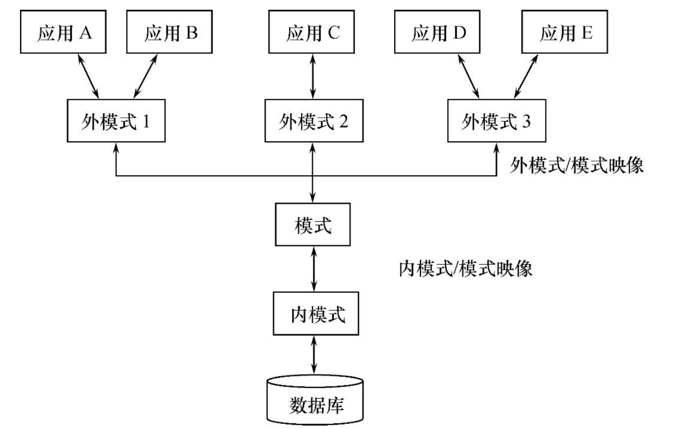
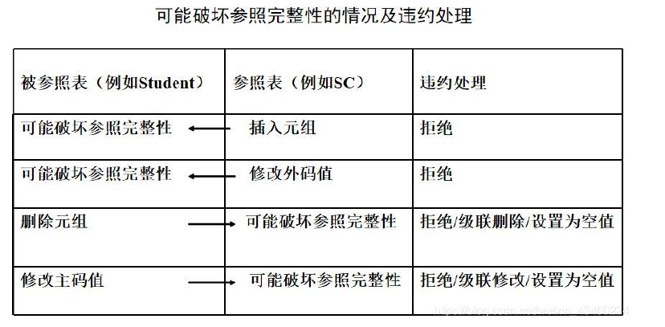
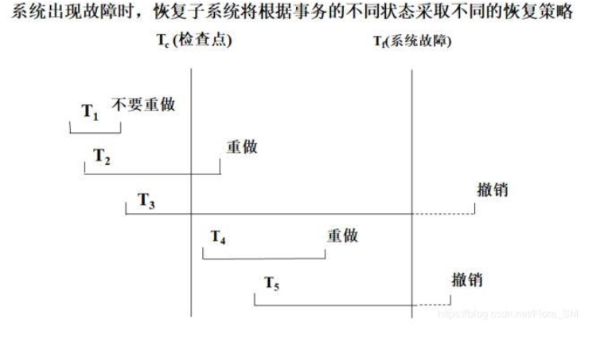
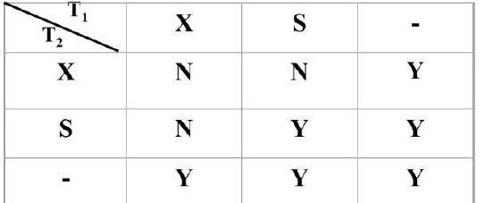

<center>

### **第一章：绪论**

</center>

---

#### 1、数据库的 4 个基本概念

- **数据 (Data)：** 描述事物的符号，数据库中存储的基本对象

- **数据库 (DataBase, DB)：** 长期存储在计算机内的、有组织的、可共享的大量数据的集合

- **数据库管理系统 (Database Management System, DBMS)：** 位于用户与操作系统之间的一层数据管理软件

- **数据库系统 (DataBase System, DBS)：** 由数据库、数据库管理系统、应用程序和数据库管理员(DBA)组成

#### 2、数据库系统的特点

* 📊 **数据结构化**
* 🔄 **数据的共享性高，冗余度低而且容易扩充**
* 🔒 **数据独立性高**
  * **物理独立性**：应用程序与物理存储相互独立，数据的物理存储改变，应用程序不改变
  * **逻辑独立性**：应用程序与逻辑结构相互独立，数据的逻辑结构改变，应用程序不改变
* 🛠️ **数据由数据库管理系统统一管理和控制**

#### 3、数据模型

- 数据模型包括**概念模型（信息模型）**和**逻辑模型/物理模型**
- 概念模型按用户的观点建模，用于数据库设计，表示方法有 **E-R 模型**
- 逻辑模型按计算机的观点建模，用于 DBMS 实现，包括**网状模型、层次模型、关系模型**等
- 物理模型是对数据最底层的抽象

#### 4、数据模型的组成要素：数据结构、数据操作、数据的完整性约束条件

数据模型是严格定义的一组概念的集合，需要精确描述系统的静态特性、动态特性和完整性约束条件，因此数据模型由以下三个部分组成：

1. **数据结构**：描述系统的静态特性 - 描述数据库的组成对象以及对象之间的联系
2. **数据操作**：描述系统的动态特性 - 是对数据库中各种对象的实例所允许的操作的集合，其类型有查询和更新（增删改）
3. **数据的完整性约束条件**：用以限定符合数据模型的数据库状态以及状态的变化，以保证数据的正确、有效与相容，完整性约束条件是一组完整性规则的集合

---

#### 5、数据库系统的三级模式结构：外模式、模式（逻辑模式）、内模式

- 外模式（子模式/用户模式）：数据库用户能够看见和使用的局部数据的逻辑结构和特征的描述，数据库用户的数据视图，是与某应用有关的数据的逻辑表示

- 模式（逻辑模式）：数据库中全体数据的逻辑结构和特征的描述，是所有用户的公共数据视图

- 内模式（存储模式）：数据物理结构和存储方法的描述，是数据在数据库内部的组织方式

---

#### 6、数据库的二级映像功能与数据独立性

- 外模式/模式映像：保证了数据的逻辑独立性

当模式改变时，对外模式/模式的映像做出改变，保证外模式不变，应用程序由外模式编写，从而应用程序不变

- 模式/内模式映像：保证了数据的物理独立性

当数据库的存储结构改变时，对模式/内模式映像做出改变，使模式不变，进而应用程序不变

---

#### 7.层次模型，网状模型，关系模型

| 特性           | **层次模型**                 | **网状模型**                   | **关系模型**                       |
| -------------- | ---------------------------- | ------------------------------ | ---------------------------------- |
| **数据结构**   | 树形结构                     | 图形结构                       | 表格（二维关系）                   |
| **数据操纵**   | 从根节点向下按层次查询       | 多路径查询                     | 使用SQL，支持复杂的查询与操作      |
| **完整性约束** | 强调父子关系，结构固定       | 通过外键和指针建立节点关系     | 实体完整性、引用完整性、域完整性等 |
| **优点**       | 适合层次结构数据，查询简单   | 支持多对多关系，灵活性高       | 支持强大的查询和数据操作，标准化   |
| **缺点**       | 不支持多对多关系，灵活性差   | 数据操作复杂，查询性能差       | 性能问题，管理复杂性高             |
| **应用场景**   | 组织结构、目录管理、文件系统 | 复杂的多对多关系（如项目管理） | 企业管理系统、银行系统、社交平台等 |


<center>

### **第四章：数据库安全性（授权）**

</center>


#### **1、不安全因素**
- 非授权用户对数据库的恶意存取和破坏

- 数据库中重要数据的泄露

- 安全环境的脆弱性
#### **2、数据库安全性控制**
- 用户身份鉴别：静态口令鉴别、动态口令鉴别、生物特征鉴别、智能卡鉴别

- 存取控制

- 自主存取控制方法
#### **3、为什么要授权**
授权是指授予（GRANT）和收回（REVOKE），是数据库安全性控制中的自主存取控制方法。是为了保护数据库，防止不合法使用所造成的数据泄露、更改或破坏
#### **4、如何授权：授予 GRANT**
发出如下语句的可以是数据库管理员、也可以是数据库对象创建者、也可以是已经拥有该权限的用户
```sql
GRANT 权限 ON 对象类型 对象名 TO 用户名 [WITH GRANT OPTION];
```
权限：查询权限 `SELECT`，全部操作权限 `ALL PRIVILEGES`

对象类型&对象名：对象类型可以是 `TABLE` 也可以是 `VIEW`，对象名为对应的表名或者视图名用户名：可以是指定用户，也可以是全体用户 `PUBLIC`

如果没有指定`WITH GRANT OPTION` 子句，则获得某种权限的用户只能使用该权限，不能传播该权限注意：SQL 不允许循环授权，即被授权者不能把权限再授回给授权者或其祖先

**eg. 把查询权限授给用户U1**
```sql
GRANT SELECT ON TABLE Student TO U1;
```
#### **5、收回授权：收回 REVOKE**
``` sql
REVOKE 权限 ON 对象类型 对象名 FROM 用户名 [CASCADE|RESTRICT];
```
CASCADE：级联回收。将用户传播出去的权限一并收回
RESTRICT：受限回收。若用户传播过该权限，回收将会失败
**eg. 把用户U4 修改学生学号的权限收回**
``` sql
REVOKE UPDATE(Sno) ON TABLE Student FROM U4;
```

#### **6、创建数据库模式的权限**
对创建数据库模式一类的数据库对象的授权再数据库管理员创建用户时实现：
```sql
CREATE USER username [WITH DBA|RESOURCE|CONNECT];
```
只有系统的超级用户才有权创建一个新的数据库用户，新创建的数据库用户有三种权限：DBA、RESOURCE、  CONNECT（此为默认）

**DBA**：可以创建新用户、创建模式、创建基本表和视图等，拥有对所有数据库对象的存取权限，还可以把这些权限授予一般用户

**RESOURCE**：可以创建基本表和视图，但不能创建模式和新用户。数据库对象的属主可以用 GRANT 语句把该对象上的存取权限授予其他用户

**CONNECT**：只能登陆数据库，根据其他用户或者数据库管理员授予的权限的情况对数据库对象进行权限范围内的操作

#### **7、数据库角色**
角色是权限的集合。可以为一组具有相同权限的用户创建一个角色，使用角色来管理数据库权限可以简化授权的过程

创建角色：
``` sql
CREATE ROLE 角色名;
```
在一个角色中添加角色或者用户：
```sql
GRANT 角色 TO 某角色/某用户 [WITH ADMIN OPTION];
```
指定WITH ADMIN OPTION 子句，则获得某种权限的角色或者用户还可以把这种权限再授予其他角色

给角色授权：
```sql
GRANT 权限 ON 对象类型 对象名 TO 角色;
```
角色权限收回：
```sql
REVOKE 权限 ON 对象类型 对象名 FROM 角色;
```
#### **8、视图机制**
为不同的用户定义不同的视图，把不需要的数据隐藏，这样用户就不会误操作
#### **9、审计**
把对数据库的所有操作都记录到审计日志中，然后就可以通过日志审查这个里面是否有一些非法的行为
#### **10、数据加密**
通过一些加密算法，把明文变成密文。这样别人就无法查看

### **第五章：数据库完整性**
#### **1、数据库的完整性是指数据的正确性和相容性**
- 正确性：符合现实世界语义

- 相容性：同一对象在不同表中的数据符合逻辑
## **2、维护完整性需要实现的功能**
- 提供定义完整性约束条件的机制

- 提供完整性检查的方法

- 进行违约处理
## **3、三大完整性**
- 实体完整性：主码唯一且非空

    检查与违约处理：检查主码是否唯一，如果不唯一则拒绝插入或修改；检查主码各个属性是否为空，只要有一个为空就拒绝插入或修改

- 参照完整性：外码的约束
    
    检查：对被参照表和参照表进行增删改操作时可能会破坏参照完整性，必须检查以保证两个表的相容性
    违约处理：外码约束可以在创建参照表时说明不同的违约策略

- 用户定义完整性：属性上约束条件的定义



1. **属性上的约束条件**
    >非空NOT NULL
    >列值唯一UNIQUE
    >检查列值是否满足一个表达式CHECK
    >检查和违约处理：当向表中插入元组或者修改属性值时，关系数据库管理系统将检查属性上的约束条件是否被满足，如果不满足则操作被拒绝

2. 元组上的约束条件

    在 CREATE TABLE 语句中可以用 CHECK 短语定义元组上的约束条件，元组级的限制可以设置不同属性之间的取值的相互约束条件

    检查和违约处理：当向表中插入元组或者修改属性值时，关系数据库管理系统将检查元组上的约束条件是否被满足，如果不满足则操作被拒绝


### **第七章：数据库设计的步骤**

#### **1、需求分析**
调查机构情况与熟悉业务活动，明确用户的需求，确定系统的边界，生成数据字典和用户需求规格说明书
#### **2、概念结构设计**
将需求分析得到的用户需求抽象为概念模型，绘制E-R 图
#### **3、逻辑结构设计**
将 E-R 图转换为与DBMS 相符合的逻辑结构（包括数据库模式和外模式），例如 E-R 图向关系模型转换，再根据规范化理论对数据模型进行优化，设计用户子模式
#### **4、物理结构设计**
通常关系数据库物理设计的内容包括关系模式选择存取方法、以及设计关系、索引等数据库文件的物理存储结构
#### **5、数据库实施**
建立实际数据库结构、试运行、装入数据
#### **6、数据库运行和维护**
维护数据库的安全性、完整性控制以及系统的转储和恢复；性能的监督、分析和改进；增加新功能；发现错误和修改错误

<center>

### **第八章：数据库编程**


</center>

#### **1、嵌入式 SQL 与主语言之间的通信**

SQL 是描述性的面向集合的语句，负责操纵数据库；高级语言语句是过程性的面向记录的语句，负责控制程序流程通信。

在嵌入式SQL 中，当主语言为C 语言时，语法格式为
```C
EXEC SQL <SQL 语句>;
```
当主语言为 Java，语法格式为 
```Java
#SQL {<SQL 语句>};
```

嵌入式 SQL 与主语言之间的通信包括：

- SQL 向主语言传递执行状态信息，主要用SQL 通信区实现

- 主语言向 SQL 提供参数，主要用主变量实现

- 将SQL 语句查询数据库的结果交给主语言处理，主要用主变量和游标实现

- SQL 通信区：

SQL 语句执行后的执行状态信息将送到SQL 通信区中，应用程序从中取出这些信息，据此决定接下来执行的语句

SQL 通信区在应用程序中用 EXEC SQL INCLUDE SQLCA 加以定义

- 主变量：

SQL 语句中使用的主语言程序变量简称为主变量（即 SQL 使用主语言的变量）

输入主变量由应用程序赋值，SQL 引用；输出主变量由SQL 赋值或设置状态信息，返回应用程序一个主变量可以附带一个任选的指示变量（整型），用来指示所指主变量的值或条件

主变量名和指示变量名前面要加冒号（:）作为标志

所有主变量和指示变量必须在SQL 语句 BEGIN DECLARE SECTION 与 END DECLARE SECTION 之间进行说明

- 游标：

SQL 是面向集合的，一条 SQL 语句可以产生或处理多条记录，而主语言是面向记录的，一组变量一次只能存放一条记录，因此引入游标来协调这两种不同的处理方式

一个数据缓冲区，用来存放 SQL 语句的执行结果，每个游标区都有自己的名字

- 建立连接：

嵌入式 SQL 访间数据库必须先连接数据库

建立连接的嵌入式SQL 语句为 EXEC SQL CONNECT TO target [AS connection-name][USER user-name];

其中target 是要连接的数据库服务器，connection-name 是可选的连接名

运行过程如果要修改当前连接，对应的嵌入式语句为 EXEC SQL SET CONNECTION connection-name|DEFAULT;

- 关闭连接：

对应的嵌入式SQL 语句为EXEC SQL DISCONNECT [connection];

#### **2、嵌入式 SQL 与主语言通信的程序实例**
```c
EXEC SQL BEGIN DECLARE SECTION;	
char Deptname[20]; 
char Hsno[9];
char Hsname[20]; 
char Hssex[2];
int HSage;
int NEWAGE;
EXEC SQL END DECLARE SECTION;	
long SQLCODE;
EXEC SQL INCLUDE SQLCA;	

int main(void)	
{
    int count = 0;
    char yn;	
    printf("Please choose the department name(CS／MA／IS): "); 
    scanf("%s", Deptname);	// 注意变量名大小写（原deptname应为Deptname）
    
    EXEC SQL CONNECT TO TEST@localhost:54321 USER "SYSTEM"/"MANAGER";	
    EXEC SQL DECLARE SX CURSOR FOR	
        SELECT Sno, Sname, Ssex, Sage	
        FROM Student	
        WHERE SDept = :Deptname;	
    EXEC SQL OPEN SX;	
    
    for (;;)	
    {
        EXEC SQL FETCH SX INTO :HSno, :Hsname, :HSsex, :HSage;	
        if (SQLCA.sqlcode != 0)	// 修正SQLCA成员引用
            break;	
        if (count++ == 0)	
            printf("\n%-10s %-20s %-10s %-10s\n", "Sno", "Sname", "Ssex", "Sage");
        printf("%-10s %-20s %-10s %-10d\n", HSno, Hsname, Hssex, HSage);	
        printf("UPDATE AGE(y／n)?");	
        do { scanf("%c", &yn); } while (yn != 'N' && yn != 'n' && yn != 'Y' && yn != 'y');
        if (yn == 'y' || yn == 'Y')	// 修正逻辑运算符
        {
            printf("INPUT NEW AGE:");
            scanf("%d", &NEWAGE);	
            EXEC SQL UPDATE Student	
                SET Sage = :NEWAGE	
                WHERE CURRENT OF SX;	
        }
    }
    EXEC SQL CLOSE SX;	// 移至循环外
    EXEC SQL COMMIT WORK;	// 移至循环外
    EXEC SQL DISCONNECT TEST;	// 移至循环外
    return 0;
}
```


### **第十章：数据库恢复技术**
#### **1、事务的概念**
- 事务是数据库操作序列，这些操作要么全做，要么全不做，是不可分割的工作单位。一个事务可以是一个 sql 语句，一组 sql 语句，或者整个程序。一般来说，一个程序包含多个事务。

- 事务是恢复的基本单位，也是并发控制的基本单位。
#### **2、定义事务的 SQL 语句**
开始语句：
```SQL
BEGIN TRANSACTION;
```

结束语句：
```SQL
COMMIT; //表示提交事务的所有操作
```
或者 
```SQL
ROLLBACK; //表示回滚，即事务运行中发生了某种故障，需要对已完成的操作进行撤销，回滚到事务开始的状态。
```

#### **3、事务的 4 个特性（ACID）：原子性，一致性，隔离性，持续性**
- 原子性：一个事务要么全做，要么全不做

- 一致性：事务执行的结果必须一致。如果一个事务被迫中断，即事务中的一些操作做了，剩下的还没做，且做了的对数据库造成的修改已经存入物理数据库的话，就会造成数据库处千不一致的状态。因此事务要么全做，要么全不做，一致性和原子性是密切相关的

- 隔离性：一个事务的执行不能被其他事务干扰

- 持续性（也称为永久性）：一个事务一旦提交，它对数据库中数据的改变应该是永久性的
#### **4、数据库系统的故障种类：事物内部的故障、系统故障、介质故障、计算机病毒**
- 事务内部的故障

事务内部的故障有的是可以通过事务程序本身发现的，有的是非预期的、不能由事务程序处理的

事务故障的情况下，数据库可能处千不正确的状态。恢复程序要在不影响其他事务运行的情况下，强行回滚该事务，即撤销该事务造成的修改，这类恢复操作称为 UNDO（事务撤销）

- 系统故障（软故障）

系统故障是指造成系统停止运转的任何事件，使得系统要重新启动（例如硬件错误、操作系统故障、DBMS 代码错误、系统断电等等）

系统故障的情况下，在系统重新启动后，恢复子系统除了需要撤销未完成的事务以外，还需要 REDO（事务重做）所有已提交的事务

- 介质故障（硬故障）

外存故障，如磁盘损坏、磁头碰撞、瞬时强磁场干扰等

- 计算机病毒
#### **5、数据库恢复技术：数据转储、登记日志文件**
恢复机制涉及的两个关键间题：1、如何建立冗余数据；2、如何利用这些冗余数据实施数据库的恢复恢复的基本原理：利用存储在后备副本、日志文件和数据库镜像中的冗余数据来重建数据库

建立冗余数据的技术包括：

- 数据转储

数据库管理员定期将整个数据库复制到磁带、磁盘或其他存储介质上保存起来，这些备用数据称为后备副本或后援 副本。当数据库遭到破坏后可以将后备副本重新装入，但重装后备副本只能将数据库恢复到存储时的状态，要想恢复到故障发生时的状态，则必须重新运行自转储后的所有更新事务

数据转储分为：静态转储（在系统中无运行事务时进行）、动态转储（转储期间允许对数据库进行存取或修改）数据转储也可分为：海量转储（每次转储全部数据库）、增量转储（每次只转储上一次转储后更新过的数据） 数据转储方法分为：动态海量转储、动态增量转储，静态海量转储、静态增量转储

- 登记日志文件

日志文件是用来记录事务对数据库的更新操作的文件，有两种格式：以记录为单位、以数据块为单位

- 以记录为单位的日志文件

需要登记的内容：各个事务的开始（BEGIN TRANSACTION）标记、各个事务的结束（COMMIT/ROLLBACK）标记、各个事务的所有更新操作

日志记录的内容：事务标识（标明哪个是事务）、操作的类型（增删改）、操作对象（记录内部标识）、更新前数据的旧值（对插入而言，此项为空值）、更新后数据的新值（对删除而言，此项为空值）

- 以数据块为单位的日志文件

日志记录的内容：事务标识、被更新的数据块日志文件的作用：

1. 事务故障恢复和系统故障恢复必须用日志文件
1. 在动态转储方式中必须建立日志文件，后备副本和日志文件结合才能有效恢复数据库
1. 在静态转储方式中也可以建立日志文件，当数据库毁坏后可以重新装入后备副本把数据库恢复到转储结束时刻的正确状态，然后利用日志文件，把已完成的事务进行重做处理，对故障发生时尚未完成的事务进行撤销处理登记日志文件的两条原则：
1. 登记的次序严格按并发事务执行的时间次序
1. 必须先写日志文件，后写数据库
## **6、不同的数据库系统故障下的恢复策略**
- 事务故障的恢复

由系统自动完成，对用户透明：利用日志文件撤销（UNDO）此事务已对数据库进行的修改

- 系统故障的恢复

由系统重新启动时自动完成，不需要用户干预：撤销（UNDO）故障发生时未完成的事务，重做（REDO）已完成的事务

- 介质故障的恢复

最严重的一种故障：重装数据库，重做（REDO）已完成的事务

\* 为避免磁盘介质出现故障影响数据库，许多数据库管理系统提供了数据库镜像功能（复制数据实现）
## **7、具有检查点的恢复技术**
这种技术在日志文件中增加了检查点记录：检查点之前的事务已经做完了，不需要重做，检查点期间和之后的事务需要重做，可以改善恢复效率



### **第十一章：井发控制**
#### **1、井发控制：为了保证事务的隔离性和一致性，数据库管理系统需要对井发操作进行正确调度**
并发控制的主要技术有：封锁、时间戳、乐观控制法、多版本并发控制等并发操作带来的数据不一致性：

- 丢失修改：两个事务 T1 和 T2 读入同一数据并修改，T2 提交的结果破坏了 T1 提交的结果，导致 T1 的修改被丢失

- 不可重复读：指事务 T1 读取数据后，事务 T2 执行更新操作，使 T1 无法再现前一次读取结果

- 读脏数据：事务 T1 修改某一数据后并将其写回磁盘，事务 T2 读取同一数据后，T1 由千某种原因被撤销，这时
T1 修改过的数据恢复原值，T2 读到的数据就与数据库中的数据不一致
#### **2、井发控制的基本方法：封锁（X 锁、S 锁）**
- 排他锁/写锁，X 锁
若事务 T 对数据对象A 加上 X 锁，则只允许事务 T 读取和修改 A
事务 T 释放A 上的锁之前：其他事务不能读取和修改 A，不能再对 A 加任何类型的锁

- 共享锁/读锁，S 锁
若事务 T 对数据对象A 加上 S 锁，则事务 T 可以读取 A，但不能修改A
事务 T 释放A 上的 S 锁之前：其他事务可以读取 A，可以对A 加S 锁，但不能修改A，也不能对 A 加X 锁封锁类型的相容矩阵：



#### **3、封锁协议：约定何时申请 X 锁/S 锁、持续时间、何时释放等等**
- 一级封锁协议
事务 T 在修改数据R 之前必须先对其加X 锁，直到事务结束才释放

- 二级封锁协议
事务 T 在修改数据 R 之前必须先对其加 X 锁（一级封锁协议），并且其他事务在读取数据之前必须先对其加 S 锁，读完后即可释放 S 锁

- 三级封锁协议
事务 T 在修改数据 R 之前必须先对其加 X 锁（一级封锁协议），并且其他事务在读取数据之前必须先对其加 S 锁，直到事务结束才释放（二级封锁协议是读完就能释放）

不同级别的封锁协议和一致性保证：
<table><tr><th colspan="1" rowspan="2" valign="top"></th><th colspan="2" valign="top">X 锁</th><th colspan="2" valign="top">S 锁</th><th colspan="3" valign="top">一致性保证</th></tr>
<tr><td colspan="1" valign="top"><p>操作结束</p><p>释放</p></td><td colspan="1" valign="top"><p>事务结束</p><p>释放</p></td><td colspan="1" valign="top"><p>操作结束</p><p>释放</p></td><td colspan="1" valign="top"><p>事务结束</p><p>释放</p></td><td colspan="1" valign="top"><p>不丢失</p><p>修改</p></td><td colspan="1" valign="top"><p>不读脏</p><p>数据</p></td><td colspan="1" valign="top"><p>可重复</p><p>读</p></td></tr>
<tr><td colspan="1" valign="top">一级封锁协议</td><td colspan="1" valign="top"></td><td colspan="1" valign="top">v</td><td colspan="1" valign="top"></td><td colspan="1" valign="top"></td><td colspan="1" valign="top">v</td><td colspan="1" valign="top"></td><td colspan="1" valign="top"></td></tr>
<tr><td colspan="1" valign="top">二级封锁协议</td><td colspan="1" valign="top"></td><td colspan="1" valign="top">v</td><td colspan="1" valign="top">v</td><td colspan="1" valign="top"></td><td colspan="1" valign="top">v</td><td colspan="1" valign="top">v</td><td colspan="1" valign="top"></td></tr>
<tr><td colspan="1" valign="top">三级封锁协议</td><td colspan="1" valign="top"></td><td colspan="1" valign="top">v</td><td colspan="1" valign="top"></td><td colspan="1" valign="top">v</td><td colspan="1" valign="top">v</td><td colspan="1" valign="top">v</td><td colspan="1" valign="top">v</td></tr>
</table>

#### **4、活锁和死锁**
- 活锁
事务 T1 封锁了数据R，事务 T2 又请求封锁 R，千是 T2 等待；T3 也请求封锁R，当 T1 释放了 R 上的封锁之后系统首先批准了 T3 的请求，T2 仍然等待；T4 又请求封锁 R，当 T3 释放了 R 上的封锁之后系统又批准了 T4 的请求……T2 有可能永远等待，产生活锁

避免活锁：采用先来先服务的策略

- 死锁
事务 T1 封锁了数据 R1，T2 封锁了数据 R2，T1 又请求封锁 R2，因 T2 已封锁了 R2，千是 T1 等待 T2 释放 R2 上的锁，接着 T2 又申请封锁 R1，因 T1 已封锁了 R1，T2 也只能等待 T1，释放 R1 上的锁，这样 T1 在等待 T2，而 T2 又在等待 T1，T1 和 T2 两个事务永远不能结束，形成死锁

解决活锁的方法：

1. 死锁的预防
1. 一次封锁法：每个事务必须一次将所有要使用的数据全部加锁，否则就不能继续执行
1. 顺序封锁法：预先对数据对象规定一个封锁顺序，所有事务按这个顺序实施封锁
1. 死锁的诊断与解除

诊断：1.超时法：如果一个事务的等待时间超过了规定的时限，就认为发生了死锁

2\.等待图法：构建事务等待图（有向图：节点表示运行的事务，边表示事务等待的情况），存在回路即死锁解除：选择一个处理死锁代价最小的事务，将其撤销（UNDO），释放此事务持有的所有的锁

#### **5、可串行化调度：多个事务井发执行的结果=这些事务按某种次序串行执行的结果**
一个给定的并发调度，当且仅当它是可串行化的，才认为是正确调度。例如现有事务 T1 和 T2，若 T1 与 T2 的并发执行结果与先 T1 后 T2 相同，或者与先 T2 后 T1 相同，那么这个调度就是正确的，否则就是错误的
#### **6、冲突可串行化调度**
冲突操作：指不同的事务对用一个数据的读写操作（读和写）和写写操作（写和写）

不同事务的冲突操作和同一事物的两个操作是不能交换的，如果发生交换，自然会发生错误。基千此，如果调度能保证冲突操作的次序不变，就称为冲突可串行化的调度。冲突可串行化调度一定是可串行化调度。（但是注意，可串行化调度也有可能不满足冲突可串行化）

#### **7、两段锁协议（2PL）：所有事务必须分两个阶段对数据项加锁和解锁**
- 获得封锁（扩展阶段）：在对任何数据进行读、写操作之前，事务首先要获得对该数据的封锁

- 释放封锁（收缩阶段）：在释放一个封锁之后，事务不再申请和获得任何其他封锁

若并发执行的所有事务均遵守两段锁协议，则对这些事物的任何并发调度策略都是可串行化的
