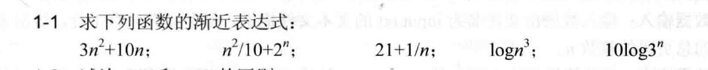
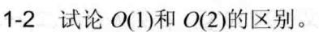
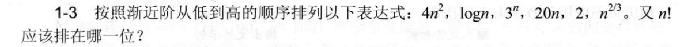
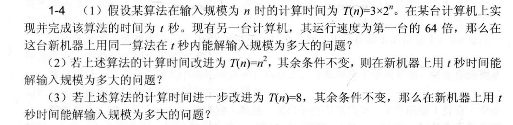
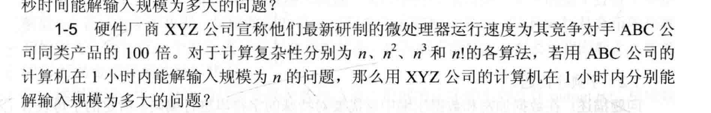
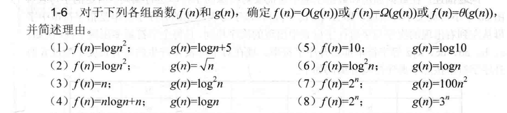
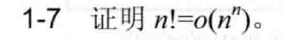
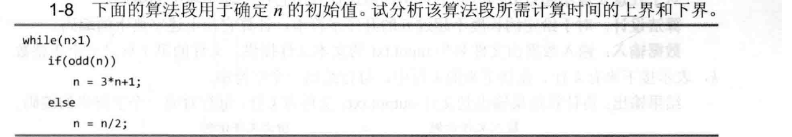
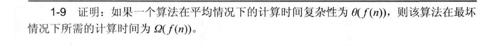

# 第一次作业3808_宋浩元

## 1-1

### 解
1. **对于函数\(3n^{2}+10n\)**：
   - 在\(3n^{2}+10n\)中，\(3n^{2}\)起主导作用。所以\(3n^{2}+10n = O(n^{2})\)。
1. **对于函数\(n^{2}/10 + 2^{n}\)**：
   - 当\(n\)足够大时，\(2^{n}\)起主导作用。所以\(n^{2}/10 + 2^{n}=O(2^{n})\)。 
2. **对于函数\(21 + 1/n\)**：
   - 当\(n\)趋向于无穷大时，\(1/n\)趋向于\(0\)，函数值趋近于\(21\)，而常数可以看作是\(O(1)\)。因此\(21 + 1/n=O(1)\)。 
1. **对于函数\(\log n^{3}\)**：
   - \(\log n^{3}=3\log n\)，所以\(\log n^{3}=O(\log n)\)。 
2. **对于函数\(10\log 3^{n}\)**：
   - \(10\log 3^{n}=10n\log 3\) ，\(10\log 3\)是常数。所以\(10\log 3^{n}=O(n)\)。

## 1-2

### 解
在算法分析的渐近表示法中，\(O(1)\)和\(O(2)\)都表示常数时间复杂度。

根据大\(O\)符号的定义\(O(g(n)) = \{ f(n) :\) 存在正常数\(c\)和\(n_0\)，使得对所有\(n \geq n_0\)，有\(0 \leq f(n) \leq cg(n)\}\)。

\(O(1)\)和\(O(2)\)在渐近时间复杂度的意义下是等价的，它们的区别仅在于其中的常数因子，在分析算法的渐近性能时，这种常数差异可以被忽略。 

## 1-3

### 解
按照渐近阶从低到高的顺序为：\(2\)，\(\log n\)，\(n^{2/3}\)，\(20n\)，\(4n^{2}\)，\(3^{n}\)，\(n!\) ，\(n!\)应排在最后一位。 
## 1-4

### 解
**（1）**
    - 设第一台计算机处理规模为\(n\)的问题用时\(t\)秒，新计算机在\(t\)秒内能处理规模为\(n_1\)的问题。
    - 则有\(3\times2^{n_1}/64\ = 3\times2^{n}\)，因此\(n_1=n + 6\)。
**（2）**
    - 设第一台计算机处理规模为\(n\)的问题用时\(t\)秒，新计算机在\(t\)秒内能处理规模为\(n_2\)的问题
    - 则\(n^{2}=n_2^{2}/64\)，解得\(n_2 = 8n\)。
**（3）**
    - 该算法计算时间是常数。所以可解任意规模的问题。 
## 1-5

### 解
设\(ABC\)公司计算机处理问题的时间函数为\(T(n)\)，\(XYZ\)公司计算机处理问题的时间函数为\(T'(n')\)，则\(T'(n')=100\times T(n)\)。

1. **当计算复杂度为\(n\)时**：
   - \(n_1 = 100n\)。

2. **当计算复杂度为\(n^{2}\)时**：
   - \(3600 = k\times n^{2}\)。
   - \(T'(n_2)=k\times n_2^{2}\)
   - \(3600=\frac{k\times n_2^{2}}{100}\)。
   - 解得\(n_2 = 10n\)。

3. **当计算复杂度为\(n^{3}\)时**：
   - \(3600 = k\times n^{3}\)。
   - \(T'(n_3)=k\times n_3^{3}\)
   - \(k\times n^{3}=\frac{k\times n_3^{3}}{100}\)
   - 解得\(n_3=\sqrt[3]{100}n\)。

4. **当计算复杂度为\(n!\)时**：
   - \(3600 = k\times n!\)。
   - \(3600=\frac{k\times n_4!}{100}\)。
   - \(k\times n!=\frac{k\times n_4!}{100}\)
   - \(n_4\)比\(n\)略大，在n足够大的时候几乎相同。
## 1-6

### 解
(1) 由于：\(\lim\limits_{n \to +\infty} \frac{f(n)}{g(n)}=\lim\limits_{n \to +\infty} \frac{2\log n}{\log n + 5}=\lim\limits_{n \to +\infty} \frac{2}{1 + \frac{5}{\log n}} = 2\)，所以\(f(n)=\Theta(g(n))\)；
(2) 由于：\(\lim\limits_{n \to +\infty} \frac{f(n)}{g(n)}=\lim\limits_{n \to +\infty} \frac{2\log n}{\sqrt{n}}=\lim\limits_{n \to +\infty} \frac{\frac{2}{n}}{\frac{1}{2\sqrt{n}}}=\lim\limits_{n \to +\infty} \frac{4}{\sqrt{n}} = 0\)，所以\(f(n)=O(g(n))\)；
(3) \(\lim\limits_{n \to +\infty} \frac{f(n)}{g(n)}=\lim\limits_{n \to +\infty} \frac{n}{\log^2 n}= +\infty\)，所以\(f(n)=\Omega(g(n))\)；
(4) \(\lim\limits_{n \to +\infty} \frac{f(n)}{g(n)}=\lim\limits_{n \to +\infty} \frac{n\log n + n}{\log n}=\lim\limits_{n \to +\infty} (n + \frac{n}{\log n}) = +\infty\)，所以\(f(n)=\Omega(g(n))\)；
(5) \(\lim\limits_{n \to +\infty} \frac{f(n)}{g(n)}=\frac{10}{\log 10}\)，所以\(f(n)=\Theta(g(n))\)；
(6) \(\lim\limits_{n \to +\infty} \frac{f(n)}{g(n)}=\lim\limits_{n \to +\infty} \frac{\log^2 n}{\log n}=\lim\limits_{n \to +\infty} \log n = +\infty\)，所以 \(f(n)=\Omega(g(n))\)；
(7) \(\lim\limits_{n \to +\infty} \frac{f(n)}{g(n)}=\lim\limits_{n \to +\infty} \frac{2^n}{100n^2}= +\infty\)，所以\(f(n)=\Omega(g(n))\)；
(8) \(\lim\limits_{n \to +\infty} \frac{f(n)}{g(n)}=\lim\limits_{n \to +\infty} \frac{2^n}{3^n}=\lim\limits_{n \to +\infty} (\frac{2}{3})^n = 0\)，所以\(f(n)=O(g(n))\)。 
## 1-7

### 解

\(\lim\limits_{n \to +\infty} \frac{n!}{n^{n}}=\lim\limits_{n \to +\infty}(\frac{1}{n}\times\frac{2}{n}\times\cdots\times\frac{n}{n})=0\)。
\(n!=o(n^{n})\)得证。
## 1-8

### 解
1. **计算下界**：
    - 当\(n\)为\(2\)的幂次方时，每次执行循环，\(n\)都会直接执行 `n = n/2` 这一步，直到\(n = 1\)循环结束。所以该算法段所需计算时间的下界为\(\Omega(\log n)\) 。
2. **计算上界**：
    - 无论初始\(n\)是多少，经过有限次的 `3*n + 1` 和 `n/2` 操作后，\(n\)一定会变为\(1\) 。由于每次循环至少会对\(n\)进行一次操作，而\(n\)从初始值开始，最终会变为\(1\) ，所以循环次数最多不会超过\(n\)本身的数量级。因此，该算法段所需计算时间的上界为\(O(n)\) 。

## 1-9

### 解

因为平均时间是把好的、坏的情况都综合起来的。那最坏情况肯定比平均情况差不了多少，甚至可能更差。

就像平均上班用时是30分钟，那遇到特别不好的情况，比如严重堵车，肯定不可能比30分钟少很多，怎么着也得30分钟或者更多。

所以，如果平均情况下算法的时间和\(f(n)\)挂钩 ，那最坏情况下的时间最少也得和\(f(n)\)同阶，也就是\(\Omega(f(n))\)。这样就证明了如果一个算法在平均情况下的计算时间复杂性为\(\Theta(f(n))\)，那它在最坏情况下所需的计算时间就是\(\Omega(f(n))\)。  