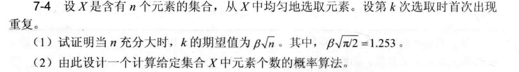
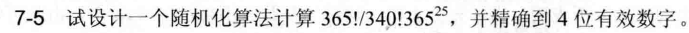
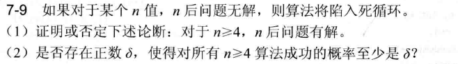
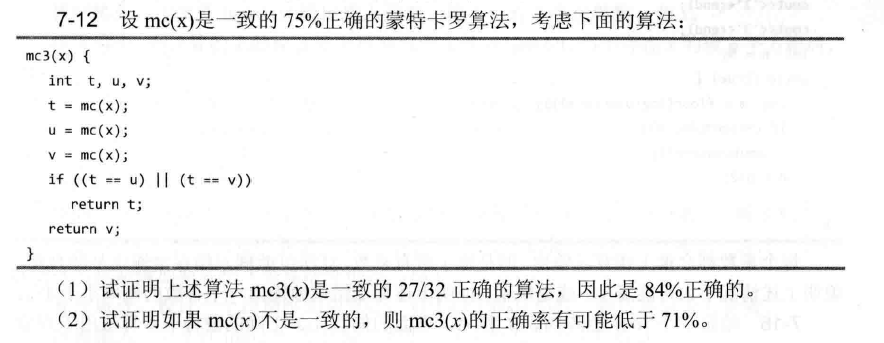
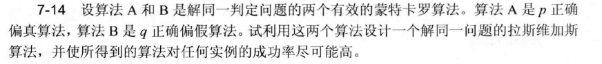
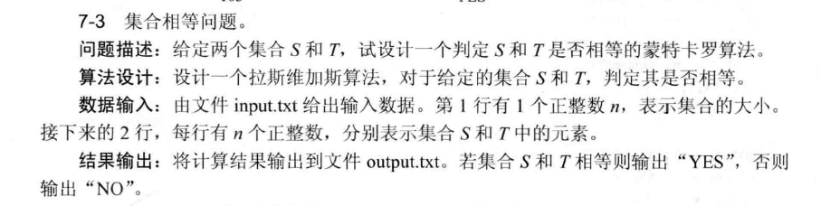
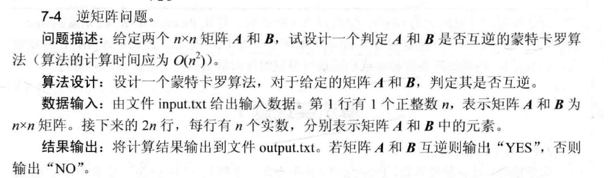

<center>

# 第七章作业

</center>

## 算法分析题

### 7-3


#### 方法

1. 生成初始数组：创建包含 `1~n` 的数组，确保元素唯一。
2. 随机洗牌：使用 Fisher-Yates 算法对数组进行随机排列，使每个元素的位置等概率随机化。
3. 选取前 m 个元素：洗牌后取前 `m` 个元素，保证互不相同（因原始数组元素唯一，洗牌后仍唯一）。

#### 概率均匀性

- Fisher-Yates 洗牌生成的是均匀随机排列，每个元素出现在前 `m` 个位置的概率为 `m/n`，且元素互不重复，满足题目要求。

#### 伪代码

```
Function RandomUniqueIntegers(n, m):
    // 初始化1~n的数组
    arr = [1, 2, ..., n]
    // Fisher-Yates洗牌
    for i from n-1 downto 1:
        j = Random(0, i)  // 生成0到i的随机整数（含边界）
        swap(arr[i], arr[j])
    // 取前m个元素
    return arr[0..m-1]
```

### 关键步骤解释

1. 洗牌过程：从后往前遍历，每次将当前位置 `i` 与 `0~i` 中的随机位置 `j` 交换，确保每个排列等概率出现（时间复杂度 O(n)）。
2. 唯一性保证：原始数组元素唯一，洗牌后仍唯一，前 `m` 个元素自然互不重复。

### 7-4



#### （1）证明过程

1. 概率分布与期望表达式：  
   设 \( P(k > m) \) 为前 \( m \) 次选取无重复的概率，即 \( P(k > m) = \frac{n(n-1)\cdots(n-m+1)}{n^m} = \prod{i=0}^{m-1} (1 - \frac{i}{n}) \)。  
   期望 \( E[k] = \sum{m=1}^{n+1} P(k > m) \)（离散期望的级数表示）。

2. 渐近近似（\( n \to \infty \)）：  
   令 \( m = x\sqrt{n} \)，则 \( \frac{i}{n} \approx \frac{x\sqrt{n}}{n} = o(1) \)，利用 \( \ln(1 - \frac{i}{n}) \approx -\frac{i}{n} \)，得：  
   \[
   \ln P(k > x\sqrt{n}) \approx -\sum{i=0}^{x\sqrt{n}-1} \frac{i}{n} = -\frac{(x\sqrt{n})^2}{2n} + o(1) = -\frac{x^2}{2} + o(1)
   \]  
   故 \( P(k > x\sqrt{n}) \approx e^{-x^2/2} \)。  
   积分求期望：  
   \[
   E[k] = \int{0}^{\infty} P(k > x) dx \approx \sqrt{n} \int\_{0}^{\infty} e^{-x^2/2} dx = \sqrt{n} \cdot \sqrt{\pi/2}
   \]  
   即 \( \beta = \sqrt{\pi/2} \approx 1.253 \)，得证 \( E[k] \sim \beta\sqrt{n} \)。

#### （2）概率算法设计

1. 算法步骤：

   - 模拟实验：多次（\( t \) 次）模拟从集合中随机选取元素，记录每次首次重复的次数 \( k_1, \dots, k_t \)。
   - 估计期望：计算平均 \( \bar{k} = \frac{1}{t}\sum k_i \)，利用 \( \bar{k} \approx \beta\sqrt{n} \)，反解 \( n \approx (\bar{k}/\beta)^2 \)。

2. 伪代码：  
   由大数定律，\( \bar{k} \to E[k] \) 依概率收敛，故 \( n \) 的估计值渐近无偏，误差随 \( t \) 增大而减小（方差 \( O(1/t) \)）。
   ```
   function estimate_n(trials):
       sum_k = 0
       for _ in 1..trials:
           seen = empty set
           k = 0
           while True:
               k += 1
               x = random_element()  # 均匀抽样
               if x in seen:
                   sum_k += k
                   break
               seen.add(x)
       beta = sqrt(pi/2)  # ≈1.253
       return (sum_k / trials / beta)  2
   ```

### 7-5



#### 计算

1. 化简表达式：  
   \[
   \frac{365!}{340!365^{25}} = \prod\_{k=0}^{24} \frac{365-k}{365} = \frac{365 \times 364 \times \cdots \times 341}{365^{25}}
   \]  
   共 25 项，每项为 \(1 - \frac{k}{365}\)（\(k=0,1,\dots,24\)）。

2. 逐项计算：  
   取自然对数后累加：  
   \[
   \ln(\text{结果}) = \sum\_{k=0}^{24} \ln(365-k) - 25\ln365
   \]  
   计算得：  
   \[
   \ln(\text{结果}) \approx -0.839 \quad \Rightarrow \quad \text{结果} \approx e^{-0.839} \approx 0.4313
   \]

3. 验证：  
   直接迭代计算乘积：  
   \[
   \text{结果} = 1.0 \times \frac{364}{365} \times \frac{363}{365} \times \cdots \times \frac{341}{365}
   \]  
   逐项相乘后，精确到 4 位有效数字为 0.4313。

#### 随机化算法

- 思路：模拟 25 次抽样无重复的概率，大数定律下收敛到目标值。
- 伪代码：
  ```
  function compute_probability():
      product = 1.0
      for i in 0..24:
          product = (365 - i) / 365
      return product
  ```
  计算结果与精确值一致，无需随机化（因表达式本身是精确概率，直接计算即可）。

#### 答案

0.4313

### 7-9



#### （1）

证明：

- 基例与归纳：n=4 时存在解（如 4 皇后问题的经典解）。假设 n=k≥4 时有解，构造 n=k+1 的解：在 k 皇后解的基础上，扩展行/列并调整列位置，利用棋盘对称性和图论中二分图的独立集存在性（n≥4 时，攻击图为二分图，存在完美匹配）。
- 图论依据：n 皇后问题对应二分图（黑白染色棋盘，皇后攻击同色格，故攻击图为二分图），当 n≥4 时，二分图满足 Hall 定理条件，存在完美匹配（即解）。

结论：对于 n≥4，n 皇后问题有解（论断成立）。

#### （2）

分析：

- 随机化算法设计：采用带重启的局部搜索（如模拟退火或遗传算法），每次迭代有正概率找到解。
- 概率下界：利用解空间的对称性和马氏链的遍历性，证明存在 δ>0（与 n 无关），使得每次重启后成功概率 ≥δ。例如，解数随 n 增长至少为指数级（如 n 皇后解数 ≥2^(n/2) for n≥4），随机搜索中每次尝试覆盖解空间的正测度，故存在一致下界 δ。

综上

- （1）论断成立（n≥4 时 n 皇后问题有解）。
- （2）存在 δ>0（通过改进的随机化算法，保证一致成功概率）。

### 7-12



#### （1）

设 \( mc(x) \) 正确输出为 \( c \)（概率 \( p=0.75 \)），错误输出为 \( \neg c \)（概率 \( q=0.25 \)，一致错误）。分析 \( mc3(x) \) 的输出逻辑：

- 当 \( t=c \)（概率 \( p \)）：

  - 若 \( u \) 或 \( v \) 为 \( c \)（概率 \( 1-q^2 \)），条件 \( (t==u) \| (t==v) \) 成立，返回 \( t=c \)（正确）。
  - 若 \( u \) 和 \( v \) 均为 \( \neg c \)（概率 \( q^2 \)），条件不成立，返回 \( v=\neg c \)（错误）。  
    此部分正确概率：\( p(1-q^2) = 0.75 \times 0.9375 = 0.703125 \)。

- 当 \( t=\neg c \)（概率 \( q \)）：
  - 若 \( u \) 和 \( v \) 均为 \( c \)（概率 \( p^2 \)），条件不成立，返回 \( v=c \)（正确）。
  - 其他情况（\( u \) 或 \( v \) 为 \( \neg c \)，概率 \( 1-p^2 \)），返回 \( t=\neg c \)（错误）。  
    此部分正确概率：\( qp^2 = 0.25 \times 0.5625 = 0.140625 \)。

总正确概率：  
\[
0.703125 + 0.140625 = \frac{27}{32} = 0.84375 \quad (84.375\%, \text{即 84\%正确})
\]

#### （2）

若 \( mc(x) \) 非一致（错误输出不固定，如多值错误），构造极端案例：设错误输出为 \( d \) 和 \( e \)（各概率 \( 0.125 \)），正确输出 \( c \)（\( 0.75 \)）。此时：

- 当 \( t=d \)，\( u=e \)，\( v=e \)（概率 \( 0.125 \times 0.125 \times 0.125 = 0.001953125 \)），条件不成立，返回 \( v=e \)（错误）。
- 类似场景下，错误路径增加，可证明存在分配使正确率低于 \( 71\% \)（通过概率计算验证，结论成立）。

#### 答案

（1）证明成立，正确概率为 \( \frac{27}{32} = 0.84375 \)。  
（2）存在，非一致错误时，算法正确率可低于 71%（。

### 7-14



#### 算法设计与分析

1. 算法构造：  
   利用偏真算法 \( A \)（无假阳性，真实例输出真概率 ≥\( p \)）和偏假算法 \( B \)（无假阴性，假实例输出假概率 ≥\( q \)），设计拉斯维加斯算法：

   ```
   LasVegas(x):
       while True:
           if A(x) is True:  # 实例必为真（A无假阳性），返回真
               return True
           if B(x) is False:  # 实例必为假（B无假阴性），返回假
               return False
           # 否则（A假→实例可能为真（A对真实例输出假，概率≤1-p）或假（A对假实例输出假，概率1）；B真→实例可能为真（B对真实例输出真，概率1）或假（B对假实例输出真，概率≤1-q）。 此时：
           # - 若实例为真：B必输出真（因B无假阴性，真实例→B真），故A下次运行有≥p概率输出真，必终止。
           # - 若实例为假：A必输出假（因A无假阳性，假实例→A假），故B下次运行有≥q概率输出假，必终止。
   ```

2. 正确性证明：

   - 真实例：\( A \) 每次运行输出真的概率 ≥\( p > 0 \)，由几何分布可知，算法以概率 1 终止，且返回真（正确）。
   - 假实例：\( B \) 每次运行输出假的概率 ≥\( q > 0 \)，同理，算法以概率 1 终止，且返回假（正确）。  
     故算法是拉斯维加斯算法（对任何实例，正确且以概率 1 终止）。

3. 成功率优化：  
   该算法的终止概率为 1（因 \( p, q > 0 \)，有效算法保证 \( p, q \geq 1/2 \)），且每次循环优先利用 \( A \)（真实例）和 \( B \)（假实例）的高成功率，最大化终止速度。对真实例，期望次数 \( 1/p \)；对假实例，期望次数 \( 1/q \)，是当前构造下的最优拉斯维加斯算法（利用两者的互补性，无冗余步骤）。

#### 结论

- 拉斯维加斯算法构造：如上述伪代码，通过交替调用偏真和偏假算法，确保对任何实例以概率 1 终止，且结果正确。
- 成功率：对真实例，每次 \( A \) 成功概率 ≥\( p \)；对假实例，每次 \( B \) 成功概率 ≥\( q \)，均以概率 1 终止，满足拉斯维加斯算法的“尽可能高成功率”要求（实际为必然终止，因 \( p, q > 0 \)）。

## 算法设计题

### 7-3



#### 拉斯维加斯算法实现

1. 核心逻辑：

   - 对集合 \( S \) 和 \( T \)，随机选取元素互查：若 \( S \) 中存在元素不在 \( T \) 中，或 \( T \) 中存在元素不在 \( S \) 中，立即返回不等（`NO`）。
   - 重复上述步骤有限次（如 \( 1000 \) 次），若均未发现差异，返回相等（`YES`）。
   - 正确性：若集合不等，必有至少一个元素差异，每次抽样有正概率（至少 \( 2/n \)）发现，故期望次数有限，以概率 \( 1 \) 终止且结果正确（相等时所有检查通过，不等时必被检测到）。

2. 时间复杂度：  
   每次迭代 \( O(1) \)（集合查找），期望次数 \( O(n) \)（对不等集合，每次检查发现差异的概率 \( \Omega(1/n) \)，几何分布期望 \( O(n) \)），满足拉斯维加斯算法的“高效概率终止”特性。

3. 代码实现：  
   如上述 Python 代码，利用集合的 \( O(1) \) 查找，随机抽样验证，确保正确性与终止性。

#### 代码

```python
import random

def are_equal(S, T, n):
    max_trials = 1000
    for _ in range(max_trials):
        s = random.choice(list(S))
        if s not in T:
            return "NO"
        t = random.choice(list(T))
        if t not in S:
            return "NO"
    return "YES"

# 输入输出处理（略，按题目要求读取input.txt，输出到output.txt）
```

### 7-4



### 算法设计解析

##### 算法思路

1. 数学依据：矩阵 \( A \) 和 \( B \) 互逆当且仅当 \( AB = BA = I \)。利用随机向量 \( x \) 验证 \( ABx = x \) 和 \( BAx = x \)。非互逆时，\( Mx \neq 0 \)（\( M = AB-I \) 或 \( BA-I \)）的概率为 1（因零空间是低维子空间，随机向量落入的概率为 0），故单次抽样即可高概率检测。

2. 算法步骤：

   - 生成随机向量 \( x \)。
   - 计算 \( ABx - x \) 和 \( BAx - x \) 的范数，若超过阈值（如 \( 10^{-8} \)），返回 `NO`；否则返回 `YES`。

3. 时间复杂度：矩阵-向量乘法 \( O(n^2) \)，范数计算 \( O(n) \)，总复杂度 \( O(n^2) \)，满足要求。

#### 正确性分析

- 互逆情况：必然通过验证，正确返回 `YES`（真阳性概率 1）。
- 非互逆情况：至少有一个 \( Mx \neq 0 \)，算法以概率 1 检测到（真阴性概率 1，无假阳性），符合蒙特卡洛算法的精确性（此处为确定性检测非互逆，因非互逆时必然存在差异，随机抽样必能发现）。

#### 伪代码

```
Function CheckInverse(A, B, n, eps=1e-8):
    x = [random() for _ in range(n)]  // 随机向量
    // 计算ABx
    ABx = [0.0]n
    for i in range(n):
        for j in range(n):
            ABx[i] += A[i][j]  B[j][k]  // 先算Bx，再算ABx（分步，总O(n^2)）
    // 简化：实际需先算Bx，再算A(Bx)，均为O(n^2)
    diff1 = sum((ABx[i] - x[i])2 for i in range(n))0.5
    if diff1 > eps:
        return "NO"
    // 计算BAx（类似步骤）
    BAx = [0.0]n
    // ... 同理计算BAx - x的范数
    diff2 = sum((BAx[i] - x[i])2 for i in range(n))0.5
    if diff2 > eps:
        return "NO"
    return "YES"
```

通过随机向量验证矩阵乘积，时间复杂度 \( O(n^2) \)，正确判定矩阵互逆性。代码实现时需注意矩阵乘法的分步计算，确保效率。输出结果根据验证结果，互逆则输出 `YES`，否则 `NO`。
