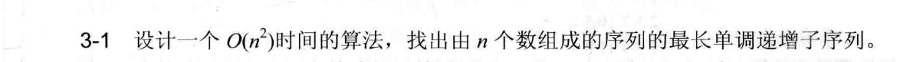
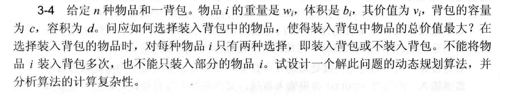
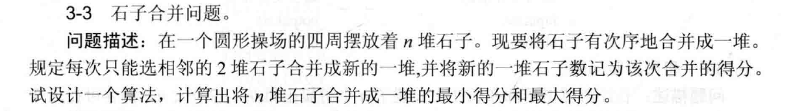
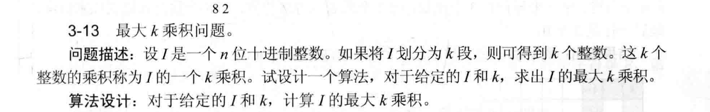
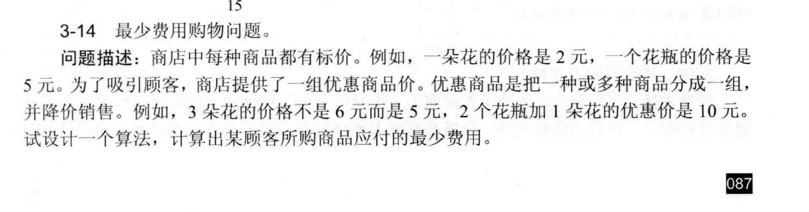
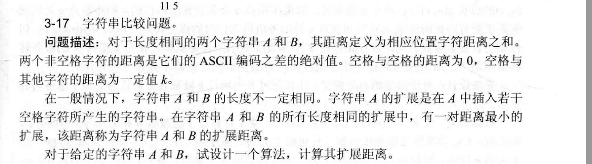

# 第三章作业

### 算法分析题  

#### 3-1  

##### 算法设计思想  
用“动态规划”的方法：  
1. **定记录规则**：创建数组 `dp`，`dp[i]` 表示以序列第 `i` 个元素结尾的最长递增子序列长度。一开始，每个元素自己就是长度为 `1` 的子序列，所以 `dp[i]` 都先设为 `1`。  
2. **找更长序列**：遍历序列每个元素 `nums[i]`，再往前看 `j`（`j` 在 `0` 到 `i-1` 之间）。如果 `nums[i] > nums[j]`，说明能把 `nums[i]` 接在 `nums[j]` 结尾的递增子序列后，这时更新 `dp[i]`，取它和 `dp[j]+1` 中更大的值。  
3. **取最大值**：遍历完 `dp` 数组，最大的那个值就是整个序列最长单调递增子序列的长度。  

##### 算法分析  
- **时间**：双重循环，外层遍历 `n` 个元素，内层每个元素最多遍历 `i` 次，总时间复杂度 \(O(n^2)\)。  
- **空间**：只用了长度为 `n` 的 `dp` 数组，空间复杂度 \(O(n)\)。  

举例：序列 `[1, 3, 2, 4]`，初始化 `dp = [1, 1, 1, 1]`。遍历到 `3`（下标 `1`），比 `1` 大，`dp[1] = 2`；遍历到 `2`（下标 `2`），比 `1` 大，`dp[2] = 2`；遍历到 `4`（下标 `3`），比 `1、3、2` 大，`dp[3] = 3`。最终 `dp` 最大值 `3` 就是最长递增子序列长度。  

#### 3-4  

##### 算法设计思想  
这是二维背包问题，用“动态规划”解决：  
1. **定记录规则**：用二维数组 `dp[j][k]`，表示背包重量不超 `j`、体积不超 `k` 时的最大总价值。  
2. **初始化**：`dp[0][0] = 0`（没重量没体积，价值 `0`），其他 `dp[j][k]` 先设为 `0`（不装物品价值 `0`）。  
3. **计算装法**：遍历每个物品 `i`，对重量 `j` 从背包容量 `c` 倒着看到 `w_i`，体积 `k` 从背包容积 `d` 倒着看到 `b_i`。如果装物品 `i`，就比较 `dp[j][k]` 和 `dp[j - w_i][k - b_i] + v_i`，取更大值。  
4. **取结果**：最后 `dp[c][d]` 就是背包的最大总价值。  

##### 算法分析  
- **时间**：三层循环（遍历物品、重量、体积），时间复杂度 \(O(n·c·d)\)。  
- **空间**：用二维数组 `dp[c][d]`，空间复杂度 \(O(c·d)\)。倒着循环保证每个物品只装一次，符合题目要求。  

### 算法设计题  

#### 3-3  

##### 算法设计思想  
**把环形变直线**：复制数组让长度变 `2n`（原数组 `a[1..n]`，复制后 `a[1..2n]`，`a[n+i] = a[i]`）。处理直线区间，从长度为 `n` 的区间结果中找答案。  
**用动态规划计算**：  
1. **定记录规则**：  
   - `dp_min[i][j]`：合并区间 `[i, j]` 石子的最小得分。  
   - `dp_max[i][j]`：合并区间 `[i, j]` 石子的最大得分。  
   - `sum[i][j]`：区间 `[i, j]` 石子总数（提前算前缀和）。  
2. **初始化**：长度为 `1` 的区间，`dp_min` 和 `dp_max` 都是 `0`。  
3. **计算得分**：按区间长度 `len`（`2` 到 `n`）递增，对每个起始位置 `i`，算结束位置 `j = i + len - 1`。枚举分割点 `k`，公式：  
     \[
     \begin{cases} 
     dp\_min[i][j] = 取 dp\_min[i][k] + dp\_min[k+1][j] + sum[i][j] 的最小值 \\
     dp\_max[i][j] = 取 dp\_max[i][k] + dp\_max[k+1][j] + sum[i][j] 的最大值 
     \end{cases}
     \]  
4. **取结果**：遍历所有长度为 `n` 的区间，取 `dp_min` 最小值和 `dp_max` 最大值。  

##### 算法分析  
- **时间**：三层循环，时间复杂度 \(O(n^3)\)。  
- **空间**：用二维数组，空间复杂度 \(O(n^2)\)。变直线后覆盖所有合并可能，动态规划保证每步最优，最终算出最小和最大得分。  

#### 3-13  

##### 算法设计思想  
用“动态规划”方法：  
1. **定记录规则**：二维数组 `dp[i][j]`，表示前 `i` 位数字分成 `j` 段的最大乘积。  
2. **处理数字**：转整数为字符数组 `s`，写函数 `get(m, n)` 取 `s[m..n]` 对应整数。  
3. **初始化**：`dp[i][1]` 是前 `i` 位组成的整数，其他 `dp[i][j]` 先设为很小的值。  
4. **计算分段**：循环分段数 `j`（`2` 到 `k`），再循环数字长度 `i`（`j ≤ i`）。对每个 `i` 和 `j`，枚举最后一段起始位置 `m`，公式：  
     `dp[i][j] = 取它和 dp[m][j-1] × get(m, i-1) 的最大值`。  
5. **取结果**：最后 `dp[n][k]` 就是 `n` 位整数分 `k` 段的最大乘积。  

##### 算法分析  
- **时间**：三层循环，时间复杂度 \(O(n^2k)\)。  
- **空间**：用二维数组 `dp[n][k]`，空间复杂度 \(O(nk)\)。枚举最后一段位置，每步找子问题最优解，最终得最大 `k` 乘积。  

#### 3-14  

##### 算法设计思想  
用“动态规划”方法：  
1. **定记录规则**：多维数组 `dp`，`dp[x₁][x₂]…[xₘ]` 表示买各种商品数量的最少花费。  
2. **初始化**：`dp[0][0]…[0] = 0`，其他设为很大的值。  
3. **计算花费**：循环所有购买数量组合。对当前组合：  
     - **按原价**：单独买最后一个商品，花费是之前数量的花费加商品原价。  
     - **按优惠**：看所有优惠，若满足数量要求，花费是优惠前数量的花费加优惠价。  
     - 取最小值作为当前组合花费。  
4. **取结果**：最后 `dp[目标数量]` 就是最少花费。  

##### 算法分析  
- **时间**：假设每种商品最多买 `n` 个，`m` 种商品，`k` 种优惠，时间复杂度 \(O(n^m·k)\)。  
- **空间**：存 `dp` 数组，空间复杂度 \(O(n^m)\)。枚举原价和优惠，每步找最优，得最少费用。  

#### 3-17  

##### 算法设计思想  
用“动态规划”方法：  
1. **定记录规则**：二维数组 `dp[i][j]`，表示字符串 `A` 前 `i` 个字符与 `B` 前 `j` 个字符扩展后的最小距离。  
2. **初始化**：`dp[0][0] = 0`；`A` 为空时，`dp[0][j] = j×k`；`B` 为空时，`dp[i][0] = i×k`。  
3. **计算距离**：循环 `A`、`B` 字符，分三种情况：  
   - **不插空格**：比较字符，非空格算 ASCII 差绝对值，有空格距离 `k`，公式：`dp[i][j] = dp[i-1][j-1] + 字符距离`。  
   - **`A` 插空格**：`A` 是空格，与 `B` 字符距离 `k`，公式：`dp[i][j] = 取它和 dp[i-1][j]+k 的最小值`。  
   - **`B` 插空格**：`B` 是空格，与 `A` 字符距离 `k`，公式：`dp[i][j] = 取它和 dp[i][j-1]+k 的最小值`。  
4. **取结果**：最后 `dp[m][n]` 就是 `A`（长 `m`）和 `B`（长 `n`）的扩展距离。  

### 算法分析  
- **时间**：双重循环，时间复杂度 \(O(mn)\)。  
- **空间**：用二维数组 `dp[m][n]`，空间复杂度 \(O(mn)\)。
