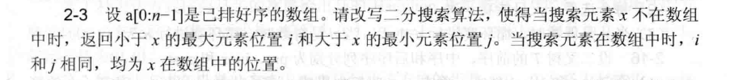
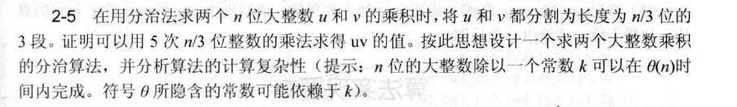
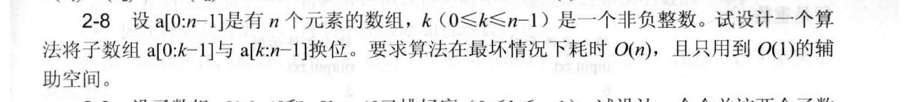
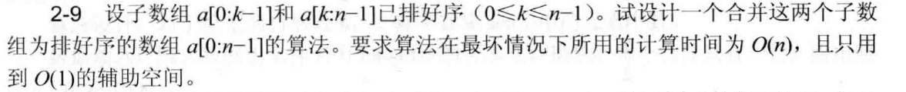
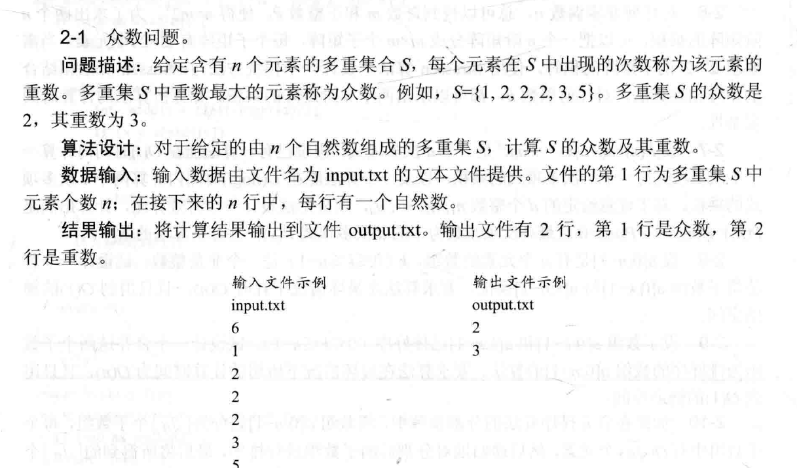

# 第二次作业3808_宋浩元

## 分析题

### 2-3

改写的二分算法如下：
实现了二分查找算法，返回一个pair，第一个元素为第一个<=x的元素的下标，第二个元素为第一个>=x的元素的下标，满足题目要求。
```c++
template<class T>
pair<int,int> binary_search(T arr[], int n, T x) {
    pair<int,int> res;
    int l = -1 , r = n;
    while(l < r){
        int mid = (l + r) >> 1;
        if(arr[mid] <= x) l = mid;
        else r = mid;
    }
    res.first = l;// l为第一个<=x的元素的下标
    l = -1, r = n;
    while(l < r){
        int mid = (l + r + 1) >> 1;
        if(arr[mid] < x) l = mid;
        else r = mid;
    }
    res.second = r; // r为第一个>=x的元素的下标
    return res;
}
```

### 2-4

当$m$比$n$小得多叮将$v$分成$\frac{a}{b}$段，每段$m$位。计算$u\times v$需要$\frac{n}{m}$次$m$位乘法运算。每次m位乘法可以用分治法计算，秏时$O(m^{log3})$。那么总的时间复杂度就来到了$O(\frac{n}{m}\times m^{log3})$，即$O(n\times m^{log3 / 2})$。

### 2-5

由题意可知：
\[
    T(n) = 5T(n/3) + O(n)
\]
通过使用主定理可知 \( T(n) = O(n^{log_35)} \)。

### 2-8

可以通过三次反转数组的方法来实现子数组换位：
反转数组 a[0 : n-1]，此时原 a[0 : k-1] 变为 a[n-k : n-1] 倒序，原 a[k : n-1] 变为 a[0 : n-k-1] 倒序。
反转数组 a[0 : n-k-1]，这部分恢复为原 a[k : n-1] 的顺序。
反转数组 a[n-k : n-1]，这部分恢复为原 a[0 : k-1] 的顺序。
```c++
void reverse(vector<int>& a, int start, int end) {
    while (start < end) {
        swap(a[start], a[end]);
        start++;
        end--;
    }
}

void exchangeSubarrays(vector<int>& a, int k) {
    int n = a.size();
    reverse(a, 0, n - 1);
    reverse(a, 0, n - k - 1);
    reverse(a, n - k, n - 1);
}
```

### 2-9

#### 算法思路
从后往前遍历数组，比较两个子数组的末尾元素（即 $a[k-1]$ 和 $a[n-1]$），将较大的元素放到 $a[n-1]$ 的位置，然后相应子数组的索引向前移动一位。
重复上述步骤，直到其中一个子数组的元素全部被处理完。
如果 $a[0:k-1]$ 还有剩余元素，由于其本身已经有序，无需再处理；如果 $a[k:n-1]$ 还有剩余元素，将它们直接复制到 a 数组的前面部分。
#### 算法实现
```c++
void solve(vector<int>& a, int k) {
    int n = a.size();
    int i = k - 1;  // 指向第一个子数组的末尾
    int j = n - 1;  // 指向第二个子数组的末尾
    int end = n - 1;  // 用于放置较大元素的位置

    // 比较并放置较大元素
    while (i >= 0 && j >= k) {
        if (a[i] > a[j]) {
            a[end] = a[i];
            i--;
        } else {
            a[end] = a[j];
            j--;
        }
        end--;
    }

    // 如果第二个子数组还有剩余元素，将其复制到前面
    while (j >= k) {
        a[end] = a[j];
        j--;
        end--;
    }
}
```
## 设计题

### 2-1

#### 算法思路
可以使用哈希表来统计每个元素出现的次数，然后遍历哈希表找到出现次数最多的元素及其次数。具体步骤如下：
从 input.txt 文件中读取多重集元素个数 n 和 n 个自然数。
使用一个 unordered_map（C++ 中）来存储每个元素及其出现的次数。遍历读取到的数组，对每个元素在哈希表中记录出现次数。
遍历哈希表，找到出现次数最多的元素及其次数。
将找到的众数和重数分别写入 output.txt 文件。

#### 算法实现
```c++
#include <iostream>
#include <fstream>
#include <unordered_map>
using namespace std;

void solve() {
    ifstream in("input.txt");
    ofstream out("output.txt");
    int n;
    in >> n;
    unordered_map<int, int> cnt;
    int num;
    for (int i = 0; i < n; ++i) {
        in >> num;
        cnt[num]++;
    }
    int mode = 0, mx = 0;
    for (const auto& pair : cnt) {
        if (pair.second > mx) {
            mx = pair.second;
            mode = pair.first;
        }
    }
    out << mode << endl << mx;
    in.close();
    out.close();
}
```

### 2-7

#### 算法思路
一个比较裸的第二类斯特林数问题
#### 算法实现
```c++
#include <iostream>
#include <fstream>
#include <vector>
using namespace std;

vector<vector<int>> solve(int n) {
    vector<vector<int>> S(n + 1, vector<int>(n + 1, 0));
    // 边界条件
    for (int i = 1; i <= n; ++i) {
        S[i][i] = 1;
    }
    // 递推计算
    for (int i = 1; i <= n; ++i) {
        for (int j = 1; j < i; ++j) {
            S[i][j] = j * S[i - 1][j] + S[i - 1][j - 1];
        }
    }
    return S;
}

int main() {
    ifstream in("input.txt");
    if (!in) {
        cerr << "无法打开输入文件" << endl;
        return 1;
    }
    int n;
    in >> n;
    in.close();
    vector<vector<int>> S = solve(n);
    int ans = 0;
    for(int i = 1 ; i <= n ; i += 1) 
        ans += S[n][i]; 

    ofstream out("output.txt");
    if (!out) {
        cerr << "无法打开输出文件" << endl;
        return 1;
    }
    out << ans;
    out.close();
    return 0;
}

```