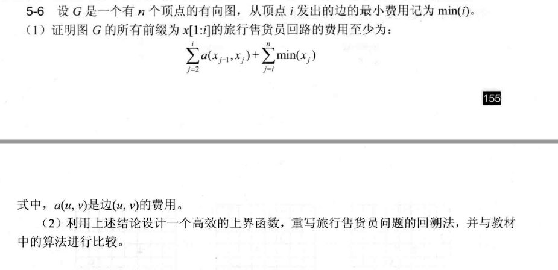
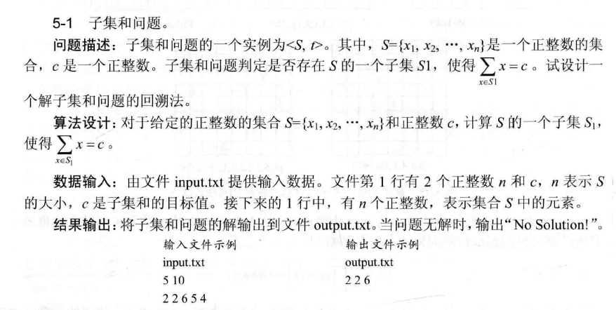
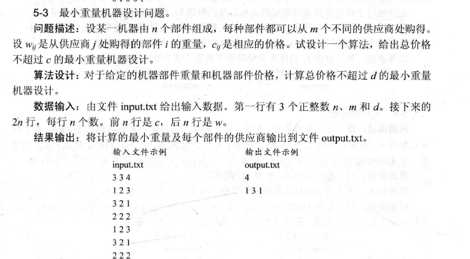
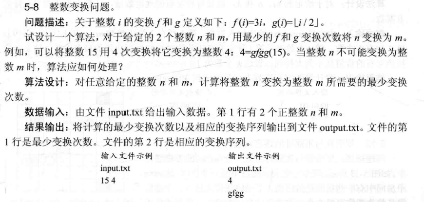
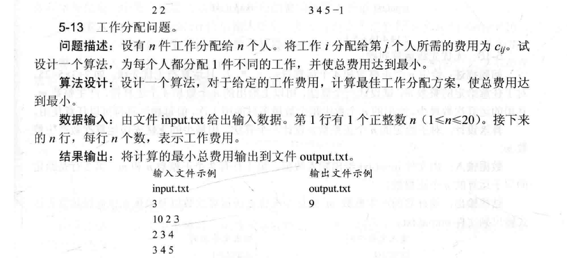
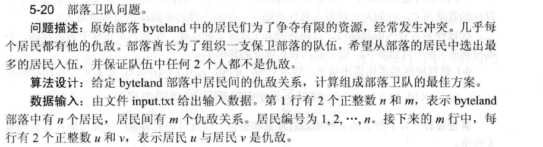

<center>

# 第五次作业3808_宋浩元

</center>


### frog_leap问题
- 这里给出示例代码：
``` cpp
string repeat(const string& str, int n) {
    string result = "";
    for (int i = 0; i < n; ++i) {
        result += str;
    }
    return result;
}

string f(int n) {
    if (n == 1) {
        return "rBr";
    } else {
        
        int middle_length = (n + 1) * n / 2 - 1;
        string middle_part = f(n - 1).substr(0, middle_length) +
                             (n % 2 == 0 ? "b" : "r") +
                             (n % 2 == 0 ? repeat("R", n) : repeat("B", n)) +
                             (n % 2 == 0 ? "b" : "r") +
                             f(n - 1).substr(f(n - 1).size() - middle_length);
        return middle_part;
    }
}

```
##### **分析 C++ 代码的算法思想**

该代码实现的是一个递归算法，旨在生成“青蛙过河”问题的序列模式。我们逐步分析它的设计和背后的算法思想。

##### **1. 算法概述**

- **核心思想**：通过递归调用构造一个字符串，每次递归生成一个更复杂的模式字符串，直到递归到基本情况 `n = 1` 为止。
- **功能**：函数 `f(n)` 返回一个字符串，该字符串描述了从左到右排列的 `n` 只红色青蛙和 `n` 只蓝色青蛙的移动或跳跃序列。

##### **2. 递归结构**

- **基本情况**：
  - 当 `n = 1` 时，返回固定字符串 `"rBr"`，这表示一只红色青蛙（`r`）和一只蓝色青蛙（`B`）。
  
- **递归情况**：
  - 当 `n > 1` 时，生成一个新的字符串，通过递归调用 `f(n-1)` 来构建前后部分（由较小的 `n-1` 生成），并在中间插入一个合适的“中间部分”。这个“中间部分”由以下几部分组成：
    - 对称地填充颜色（红色或蓝色），根据 `n` 是否是偶数来决定插入哪个颜色。
    - 插入的字符包括：一个 `r` 或 `b`（根据 `n` 的奇偶性），一个由 `R` 或 `B` 组成的字符串（重复 `n` 次），以及另一个 `r` 或 `b`（同样由 `n` 的奇偶性决定）。
  - 递归的最终结果是通过将前后部分的字符串和中间部分拼接起来，构建出最终的字符串。

##### **3. `repeat` 函数的作用**

- **作用**：`repeat` 函数的目的是生成一个由同一字符重复 `n` 次的字符串。例如：`repeat("R", 3)` 会生成 `"RRR"`。
- **使用场景**：在递归构造模式时，`repeat` 用于创建需要插入的红色或蓝色青蛙（即字母 `R` 或 `B`）的部分，重复 `n` 次。

##### **4. 中间部分的构建**

在 `f(n)` 中，最关键的部分是中间插入的内容。我们看到这一行：
```cpp
string middle_part = f(n - 1).substr(0, middle_length) +
                     (n % 2 == 0 ? "b" : "r") +
                     (n % 2 == 0 ? repeat("R", n) : repeat("B", n)) +
                     (n % 2 == 0 ? "b" : "r") +
                     f(n - 1).substr(f(n - 1).size() - middle_length);
```

#### **5. 递归的深度和状态空间**

- **递归深度**：对于 `f(n)` 的调用，它将递归调用 `f(n-1)`，直到递归到 `n = 1`。因此，递归的深度为 `n`。
- **状态空间**：在每个递归层次，都会生成一个新的字符串。随着 `n` 的增大，生成的字符串长度呈二次增长。具体来说，`f(n)` 生成的字符串长度是 `n*(n+1)/2`。因此，状态空间的大小与递归深度相关，并且随着 `n` 的增大，计算的复杂度也成倍增长。

##### **6. 算法复杂度分析**

- **时间复杂度**：
  - 在每一层递归中，我们都需要拼接字符串和执行 `substr` 操作。每个 `substr` 操作的时间复杂度是线性的，因此递归深度为 `n` 的整个算法时间复杂度是 `O(n^2)`。
  
- **空间复杂度**：
  - 递归栈的深度为 `n`，因此递归的空间复杂度为 `O(n)`。
  - 生成的每个字符串的大小也是 `O(n^2)`，因此最终的空间复杂度是 `O(n^2)`。

### 算法分析题

#### 5-8


##### 证明思路
旅行售货员回路需经过所有顶点。对于前缀 \( x[1:i] \)，其内部边费用为 \( \sum_{j=2}^{i} a(x_{j-1}, x_j) \)。在有向图中，每个顶点都需有出边。对 \( j \geq i \) 的顶点 \( x_j \)，其出边最小费用为 \( \min(x_j) \)。将前缀内部费用与后续每个顶点的最小出边费用相加，即构成回路费用的下界。因此，所有前缀为 \( x[1:i] \) 的旅行售货员回路费用至少为 \( \sum_{j=2}^{i} a(x_{j-1}, x_j) + \sum_{j=i}^{n} \min(x_j) \)。 

##### 算法思想分析
利用上述结论设计上界函数：在回溯过程中，对当前前缀 \( x[1:i] \)，计算 \( \sum_{j=2}^{i} a(x_{j-1}, x_j) + \sum_{j=i}^{n} \min(x_j) \) 作为下界。若该下界超过已找到的回路最小费用（上界），则剪枝。与教材算法相比，此方法通过更精确的下界判断，提前排除不可行分支，减少搜索空间。例如，在扩展分支时，每一步都评估当前路径的最小可能费用，若不满足则不再深入，提升算法效率。 

### 算法实现题

#### 5-1



##### 算法解析
子集和问题可通过回溯法遍历解空间树求解，每个元素有“选”或“不选”两种状态。具体步骤如下：
1. **排序集合**：对集合 \( S \) 排序，便于剪枝（若当前和超过 \( c \)，直接跳过后续更大元素）。
2. **回溯搜索**：定义递归函数，参数为当前元素下标、当前和、临时存储子集的容器。
    - 若当前和等于 \( c \)，输出子集并结束。
    - 若下标越界或当前和超过 \( c \)，剪枝返回。
    - 递归处理“选当前元素”和“不选当前元素”两种情况。

该算法通过回溯遍历所有可能子集，利用排序实现剪枝优化，提高效率。若找到和为 \( c \) 的子集则输出，否则输出 “No Solution!”。 


#### 5-3



该问题采用回溯法求解 
1. **问题建模**：将每个部件的供应商选择视为决策点，共 \( n \) 层决策（对应 \( n \) 个部件），每层有 \( m \) 种选择（对应 \( m \) 个供应商）。  
2. **剪枝条件**：在递归过程中，若当前总价格超过 \( d \)，直接剪枝，不再深入该分支。  
3. **状态记录**：记录当前总重量、总价格及各部件的供应商选择。当完成所有 \( n \) 个部件选择（到达叶节点）时，若总重量更小，则更新最小重量及对应供应商组合。  
4. **回溯遍历**：从第一个部件开始，对每个部件的每个供应商进行遍历。递归进入下一部件前，更新总价格和总重量；递归返回后，恢复状态以尝试其他供应商。  

此方法通过遍历所有合法组合（总价格 \( \leq d \)），利用剪枝优化搜索空间，最终找到总重量最小的机器设计方案。 

#### 5-8


定义回溯函数，参数包括当前数字 \( current \)、当前变换步数 \( steps \)、变换序列 \( path \)、已访问数字集合 \( visited \)、最小步数引用 \( ans \)。每次递归尝试 \( f \)（\( 3 \times current \)）和 \( g \)（\( \lfloor current / 2 \rfloor \)）两种变换。  

##### 剪枝策略  
1. **重复路径剪枝**：利用 \( visited \) 集合记录已处理的数字，避免重复搜索同一数字，减少冗余分支。  
2. **步数阈值剪枝**：若当前步数 \( steps \) 已大于或等于已知最小步数 \( ans \)，直接回溯（剪枝），不再深入无效分支。  

##### 算法步骤  
1. 初始化 \( visited \) 集合，标记起始数字 \( n \) 为已访问，调用回溯函数。  
2. 在回溯函数中，若 \( current == m \)，更新 \( ans \) 和最优变换序列。  
3. 对 \( f \) 变换：计算 \( 3 \times current \)，若未访问且未超步数阈值，标记访问，递归搜索，回溯时取消标记。  
4. 对 \( g \) 变换：计算 \( \lfloor current / 2 \rfloor \)，同理进行剪枝和递归。  

以 \( n = 15 \)，\( m = 4 \) 为例：  
- 从 \( 15 \) 开始，先尝试 \( g \) 变换得 \( 7 \)（标记 \( 15 \) 已访问），继续对 \( 7 \) 变换。若先 \( f \) 得 \( 21 \)，步数增加且远离 \( 4 \)，但通过步数阈值剪枝，后续若步数超过已发现的更优解（如 \( 4 \) 步）则提前返回。若 \( 7 \) 再 \( g \) 得 \( 3 \)，逐步搜索直至找到 \( 4 \)，同时通过 \( visited \) 避免重复处理 \( 15 \)、\( 7 \) 等数字，提升效率。  

通过上述回溯与剪枝，可在合理时间内搜索到最少变换次数及序列，若最终未找到 \( current == m \) 的情况，则判定 \( n \) 无法变换为 \( m \)。 

#### 5-13

该工作分配问题可通过回溯法结合剪枝策略求解
##### 算法思想  
1. **回溯框架**：以分配第 \( k \) 个人的工作为递归层，每层遍历 \( n \) 个工作。使用数组 \( used \) 标记工作是否已分配，避免重复分配。  
2. **剪枝优化**：记录当前累计费用 \( current\_cost \)，若 \( current\_cost \) 已超过已知最小总费用 \( min\_cost \)，则剪枝（直接回溯），减少无效搜索。  
3. **递归终止**：当 \( k = n + 1 \) 时，说明完成 \( n \) 个人的分配，更新 \( min\_cost \)。  

##### 关键步骤  
1. **初始化**：读取 \( n \) 和费用矩阵 \( c \)，初始化 \( min\_cost \) 为极大值（如 \( \infty \)），\( used \) 数组全为 \( 0 \)（表示未分配）。  
2. **递归分配**：  
    - 对第 \( k \) 个人，遍历工作 \( j \)（\( 1 \leq j \leq n \)）。  
    - 若 \( used[j] = 0 \)（工作 \( j \) 未分配），则标记 \( used[j] = 1 \)，累加费用 \( current\_cost += c[k][j] \)。  
    - 若 \( current\_cost < min\_cost \)，递归处理第 \( k + 1 \) 个人；否则，回溯（恢复 \( used[j] = 0 \)，减去 \( c[k][j] \)）。  
3. **输出结果**：递归结束后，\( min\_cost \) 即为最小总费用。  

#### 5-16


该问题通过回溯法遍历所有可能的运算组合，结合剪枝策略优化效率，具体分析如下：  

##### 算法思想  
1. **回溯框架**：以当前运算次数为递归深度，每次递归尝试对两个数（原始数或中间结果）进行 \( +、-、×、÷ \) 运算。使用数组标记原始数是否已用，避免重复使用。  
2. **剪枝策略**：若当前运算次数已大于或等于已知最小次数，直接回溯，减少无效搜索。  
3. **表达式构造**：记录每个数的表达式，运算时按顺序拼接，确保表达式符合无优先级从左到右的规则。  

##### 关键步骤  
1. **输入处理**：读取 \( n \)、\( m \) 和原始数数组。  
2. **回溯函数**：  
    - **参数**：原始数使用标记数组 \( used \)、中间数及对应表达式列表 \( temp\_nums \)、当前运算次数 \( steps \)。  
    - **检查目标**：遍历当前所有数（原始数和中间数），若存在 \( m \)，更新最小次数和最优表达式。  
    - **遍历组合**：  
        - **原始数与原始数**：选两个未用原始数，进行四种运算，更新 \( used \) 和中间数列表后递归。  
        - **原始数与中间数**：分别处理原始数在前和中间数在前两种顺序，进行四种运算，更新状态后递归。  
        - **中间数与中间数**：选两个中间数，进行四种运算，更新中间数列表后递归。  
3. **输出结果**：若找到 \( m \)，输出最小运算次数和表达式；否则，输出无解信息。 

#### 5-20

 

##### 算法步骤  
1. **数据结构构建**：使用邻接矩阵 `enemy[n+1][n+1]` 存储仇敌关系（居民编号从 \( 1 \) 开始），`enemy[u][v] = true` 表示 \( u \) 和 \( v \) 是仇敌。  
2. **回溯函数设计**：  
    - 参数：当前处理的居民编号 `current`，已选人数 `count`，记录居民是否选中的数组 `selected`，当前最大人数引用 `max_count`，存储最优解的数组 `best_selected`。  
    - **剪枝**：若 `count + (n - current + 1) <= max_count`，直接返回（剩余居民全选也无法超过当前最大）。  
    - **不选当前居民**：递归调用 `backtrack(current + 1, count, selected, max_count, best_selected)`。  
    - **选当前居民**：检查 `selected[1..current-1]` 中是否有仇敌，若无，则标记 `selected[current] = true`，递归调用 `backtrack(current + 1, count + 1, selected, max_count, best_selected)`，回溯时恢复 `selected[current] = false`。  
3. **初始化与调用**：初始化 `selected` 数组全为 `false`，`max_count = 0`，从 `current = 1` 开始调用回溯函数。  
4. **结果输出**：输出 `max_count` 及 `best_selected` 中标记为选中的居民编号。  

##### 伪代码
```伪代码  
backtrack(current, count, selected, max_count, best_selected):  
    if current > n:  
        if count > max_count:  
            max_count = count  
            best_selected = selected.copy()  
        return  
    if count + (n - current + 1) <= max_count:  
        return  
    // 不选当前居民  
    backtrack(current + 1, count, selected, max_count, best_selected)  
    // 选当前居民  
    valid = true  
    for i from 1 to current - 1:  
        if selected[i] and enemy[i][current]:  
            valid = false  
            break  
    if valid:  
        selected[current] = true  
        backtrack(current + 1, count + 1, selected, max_count, best_selected)  
        selected[current] = false  
```  
