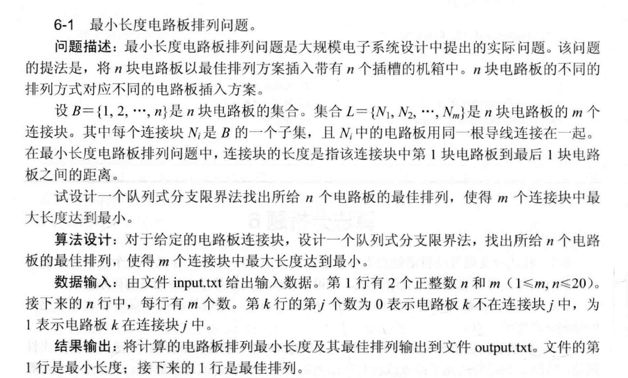
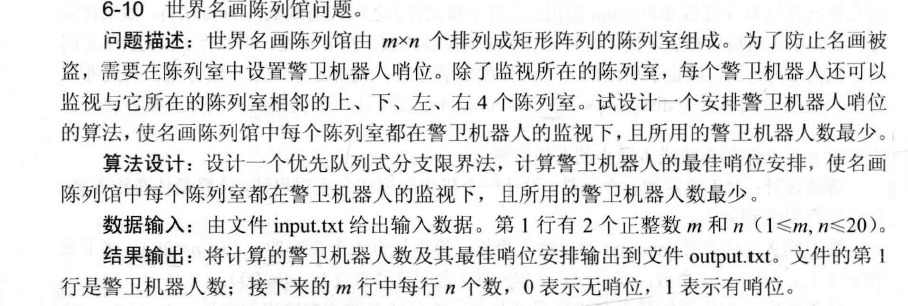

# 第六章作业

## 6-1

### 算法详细解析

队列式分支限界法通过层序遍历排列树，利用队列存储节点，每个节点记录当前部分排列及各连接块首尾位置，以计算连接块长度，核心步骤如下：

1. **数据结构定义**

   - 节点：记录当前部分排列 `board_list`、各连接块首尾位置数组 `head_tail`（如 `head_tail[j] = [head_j, tail_j]` 表示连接块 \( j \) 的首尾位置）、当前最大连接块长度 `current_max`。
   - 队列：存储待扩展节点，按层序处理。

2. **初始化**

   - 根节点：`board_list` 为空，`head_tail` 各元素初始化为 `[-1, -1]`（表示未确定首尾），`current_max` 设为 \( 0 \)。将根节点入队，记录全局最小最大长度 `min_max_length` 为极大值（如 \( +\infty \)），最优排列 `best_order` 为空。

3. **扩展节点**

   - 取出队首节点 `node`。对每块未在 `node.board_list` 中的电路板 \( k \)：
     - 生成新子节点 `new_node`：`new_node.board_list = node.board_list + [k]`。
     - 更新 `head_tail`：对每个连接块 \( j \)，若 \( k \) 属于 \( j \)（根据输入矩阵判断），则：
       - 若 `head_tail[j][0] == -1`（首次出现），设 `head_tail[j][0] = head_tail[j][1] = len(new_node.board_list) - 1`（当前排列位置）。
       - 否则，更新 `head_tail[j][1] = len(new_node.board_list) - 1`（尾位置）。
     - 计算 `new_node.current_max`：遍历所有连接块，取 `tail - head` 的最大值。
     - **剪枝**：若 `new_node.current_max >= min_max_length`，舍弃该节点。
     - 若 `new_node` 是完整排列（`len(new_node.board_list) == n`）：
       - 若 `new_node.current_max < min_max_length`，更新 `min_max_length = new_node.current_max`，`best_order = new_node.board_list`。
     - 否则，将 `new_node` 入队，继续层序扩展。

4. **终止条件**
   - 队列为空时，`best_order` 即为最优排列，`min_max_length` 为最小最大连接块长度。

### 关键策略

- **连接块首尾动态更新**：每次添加电路板，仅更新其所属连接块的首尾，避免全局扫描，提升效率。
- **剪枝逻辑**：通过当前节点的 `current_max` 与全局最优比较，及时剔除无潜力分支，减少搜索量。
- **层序遍历**：确保先处理短排列，优先找到更优解，符合分支限界法“按层探索，逐步优化”的思想。

## 6-2

### 算法思想分析

最小权顶点覆盖问题旨在找到顶点子集 \( U \)，使每条边至少有一个端点在 \( U \) 中，且 \( U \) 中顶点权值和最小。优先队列式分支限界法通过以下步骤求解：

1. **解空间与节点定义**

   - 解空间为子集树，每个节点表示处理到第 \( k \) 个顶点的部分解。节点包含：当前已选顶点权和 \( cw \)、已覆盖边集合、下界 \( lb \)（估计最终最小权和）。

2. **下界函数设计**

   - 对当前节点，计算未覆盖边（两端点均不在已选 \( U \) 中）的最小权覆盖方式：对每条未覆盖边 \( (u, v) \)，取 \( \min(w(u), w(v)) \) 求和，加上 \( cw \) 作为 \( lb \)。此下界反映从当前状态到目标的最小可能权和，用于优先队列排序（优先扩展 \( lb \) 小的节点）。

3. **分支策略**

   - **选第 \( k+1 \) 个顶点**：\( cw += w(k+1) \)，更新已覆盖边（加入与 \( k+1 \) 相连的边），重新计算 \( lb \)。
   - **不选第 \( k+1 \) 个顶点**：需确保其所有邻边已被覆盖（否则分支无效，直接剪枝）。若满足，\( cw \) 不变，计算新 \( lb \)。

4. **剪枝与最优解更新**
   - 若节点 \( lb \geq \) 已记录的最优权和，剪枝。
   - 处理到 \( k = n \)（完整解）时，若 \( cw \) 小于当前最优权和，更新最优解。

### 关键步骤总结

- **优先队列**：按 \( lb \) 升序排列，聚焦“最有希望”的分支。
- **动态更新覆盖边**：选顶点时，快速标记其邻边为已覆盖，减少后续计算量。
- **严格剪枝**：不选顶点时，检查邻边覆盖情况，避免无效搜索。

## 6-4

### 算法思想分析

最小重量机器设计问题需从 \( n \) 个部件的 \( m \) 个供应商中选择，使总价格 \( \leq d \) 且总重量最小。优先队列式分支限界法步骤如下：

1. **解空间与节点定义**

   - 解空间为 \( n \) 层树（每层对应一个部件的选择）。节点包含：当前已选部件的总重量 \( cw \)、总价格 \( cp \)、已选供应商列表、下界 \( lb \)（当前 \( cw \) + 剩余部件的最小重量之和）。

2. **优先队列操作**

   - 按 \( lb \) 升序排列节点（优先扩展“潜在更优”的分支）。初始化根节点（\( cw = 0 \)，\( cp = 0 \)，无已选部件，\( lb \) 为剩余部件最小重量和），入队。

3. **分支与剪枝**

   - 取出队首节点，对当前部件的 \( m \) 个供应商逐一处理：
     - 计算新价格 \( new_cp = cp + c\_{(k+1)j} \)，若 \( new_cp > d \)，剪枝。
     - 否则，计算新重量 \( new_cw = cw + w\_{(k+1)j} \)，生成新节点（记录 \( new_cw \)、\( new_cp \)、更新已选列表）。
     - 计算新节点 \( lb \)：\( new_cw + \sum \text{剩余部件最轻重量} \)。
     - 若新节点为完整解（选完 \( n \) 个部件），更新最小重量；否则入队。

4. **终止条件**
   - 队列为空时，输出满足条件的最小重量及对应供应商选择。

### 关键策略

- **下界计算**：剩余部件选最轻重量，确保优先处理潜在更优分支。
- **价格剪枝**：每步检查价格，避免无效搜索。
- **优先队列导向**：按 \( lb \) 排序，聚焦高潜力解，提升效率。

## 6-5

### 算法思想分析

运动员最佳配对问题旨在通过优先队列式分支限界法，在男女运动员配对的排列树中找到竞赛优势总和最大的方案。具体分析如下：

1. **解空间与节点定义**

   - 解空间为排列树，第 \( k \) 层节点表示前 \( k \) 个男运动员已配对。节点包含：当前优势总和 \( cw \)、已配对女运动员集合（避免重复）、上界 \( ub \)（剩余男运动员配对可获的最大优势和 + \( cw \)）。

2. **上界函数设计**

   - 对当前节点，剩余 \( n - k \) 个男运动员，每个选取剩余女运动员中使 \( P[i][j] \times Q[j][i] \) 最大的值，累加后与 \( cw \) 求和作为 \( ub \)。此上界反映节点后续可能达到的最大总和，用于优先队列排序（按 \( ub \) 降序，优先扩展潜力大的分支）。

3. **分支与剪枝**

   - 对当前男运动员 \( i \)（第 \( k + 1 \) 层），遍历未配对女运动员 \( j \)：
     - 计算新 \( cw = cw\_{\text{父}} + P[i][j] \times Q[j][i] \)。
     - 生成子节点，记录新 \( cw \)、更新已配对集合。
     - 若子节点 \( ub \leq \) 已记录的最大总和 $ max\_{sum} $，剪枝；否则入队。
   - 若子节点为完整解（\( k = n \)），更新 $ max\_{sum} $。

4. **优先队列驱动**
   - 优先处理 \( ub \) 大的节点，快速逼近最优解，减少无效搜索。

## 6-10

### 算法思想分析

世界名画陈列馆问题旨在用最少警卫机器人监视所有陈列室，每个机器人可覆盖自身及上下左右陈列室。优先队列式分支限界法通过以下步骤求解：

1. **解空间与节点定义**

   - 解空间为每个陈列室放或不放机器人的状态组合。节点包含：当前行 \( i \)、列 \( j \)、已用机器人数量 \( \text{count} \)、覆盖矩阵 \( \text{covered} \)、下界 \( \text{lb} \)（\( \text{count} + \) 剩余未覆盖行的连续段数，每段至少需一个机器人）。

2. **优先队列操作**

   - 按 \( \text{lb} \) 升序排列节点，优先扩展潜在更优分支。初始化根节点（\( i=0, j=0, \text{count}=0 \)，\( \text{covered} \) 全 \( 0 \)），计算 \( \text{lb} \) 后入队。

3. **分支与剪枝**

   - **当前格子未覆盖**：必须放机器人，更新 \( \text{covered} \)（自身及四周），\( \text{count}+1 \)，重新计算 \( \text{lb} \)，若 \( \text{lb} < \) 已记录的最小机器人数，入队。
   - **当前格子已覆盖**：
     - **放机器人**：更新 \( \text{covered} \)，\( \text{count}+1 \)，计算 \( \text{lb} \) 入队。
     - **不放机器人**：直接计算 \( \text{lb} \)（剩余段数），若 \( \text{lb} < \) 最优值，入队。
   - 若处理完所有行（\( i \geq m \)），检查是否全覆盖，更新最优解。

4. **下界计算**
   - 对剩余未处理行，统计每行未覆盖的连续段数，总和为 \( \text{lb} - \text{count} \)，确保 \( \text{lb} \) 反映后续最小需求。

### 关键策略

- **优先队列导向**：按 \( \text{lb} \) 排序，聚焦高潜力分支，减少无效搜索。
- **强制覆盖处理**：未覆盖格子必须放机器人，保证覆盖完整性。
- **剪枝优化**：通过 \( \text{lb} \) 剪枝不可能更优的分支，缩小搜索空间。

### 算法思想分析

世界名画陈列馆问题旨在用最少警卫机器人监视所有陈列室，每个机器人可覆盖自身及上下左右陈列室。优先队列式分支限界法通过以下步骤求解：

1. **解空间与节点定义**

   - 解空间为每个陈列室放或不放机器人的状态组合。节点包含：当前行 \( i \)、列 \( j \)、已用机器人数量 \( \text{count} \)、覆盖矩阵 \( \text{covered} \)、下界 \( \text{lb} \)（\( \text{count} + \) 剩余未覆盖行的连续段数，每段至少需一个机器人）。

2. **优先队列操作**

   - 按 \( \text{lb} \) 升序排列节点，优先扩展潜在更优分支。初始化根节点（\( i=0, j=0, \text{count}=0 \)，\( \text{covered} \) 全 \( 0 \)），计算 \( \text{lb} \) 后入队。

3. **分支与剪枝**

   - **当前格子未覆盖**：必须放机器人，更新 \( \text{covered} \)（自身及四周），\( \text{count}+1 \)，重新计算 \( \text{lb} \)，若 \( \text{lb} < \) 已记录的最小机器人数，入队。
   - **当前格子已覆盖**：
     - **放机器人**：更新 \( \text{covered} \)，\( \text{count}+1 \)，计算 \( \text{lb} \) 入队。
     - **不放机器人**：直接计算 \( \text{lb} \)（剩余段数），若 \( \text{lb} < \) 最优值，入队。
   - 若处理完所有行（\( i \geq m \)），检查是否全覆盖，更新最优解。

4. **下界计算**
   - 对剩余未处理行，统计每行未覆盖的连续段数，总和为 \( \text{lb} - \text{count} \)，确保 \( \text{lb} \) 反映后续最小需求。

### 关键策略

- **优先队列导向**：按 \( \text{lb} \) 排序，聚焦高潜力分支，减少无效搜索。
- **强制覆盖处理**：未覆盖格子必须放机器人，保证覆盖完整性。
- **剪枝优化**：通过 \( \text{lb} \) 剪枝不可能更优的分支，缩小搜索空间。
