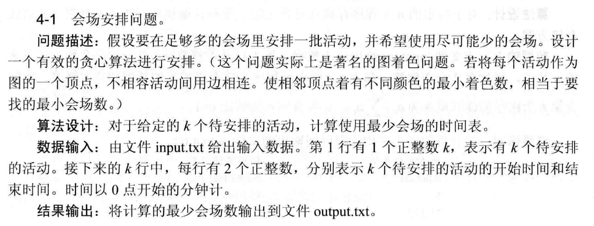
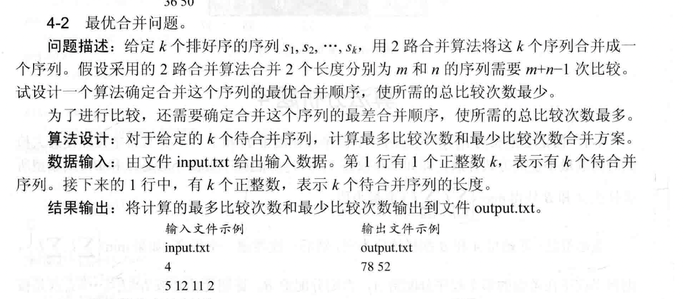
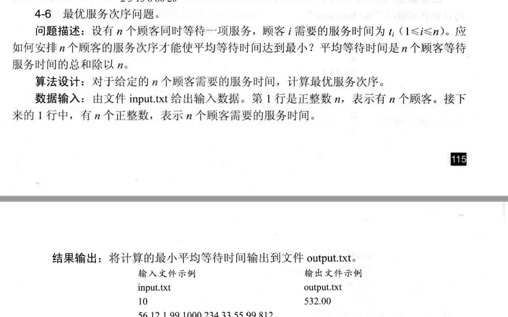
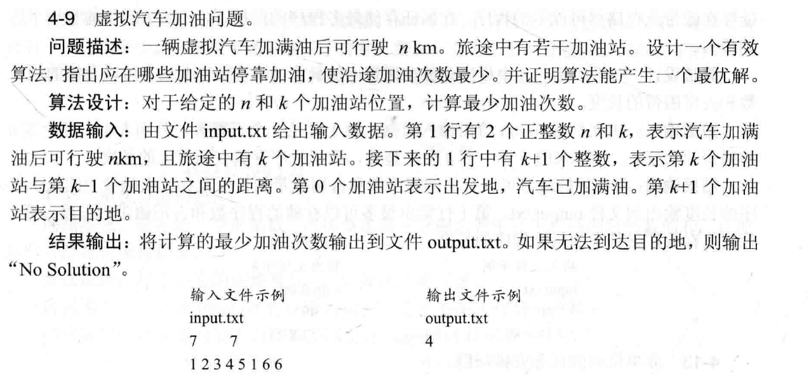
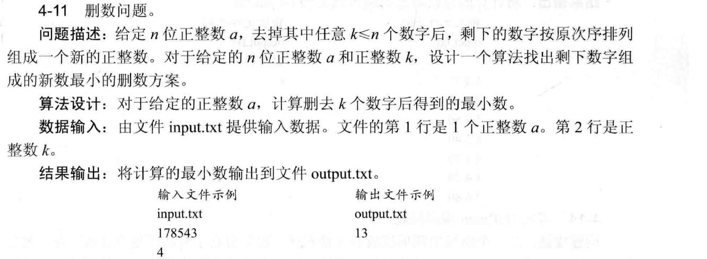
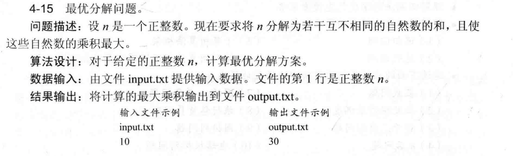

# 第四次作业3808_宋浩元

## 实现题

### 4-1

#### 算法设计思想  
1. **活动排序**：将所有活动按结束时间升序排列，优先处理结束早的活动，为后续活动预留更多时间窗口。  
2. **贪心分配会场**：利用最小堆维护各会场最后活动的结束时间。遍历排序后的活动：  
   - 若当前活动开始时间 ≥ 堆顶（某会场最早可用时间），则复用该会场，更新堆顶为当前活动结束时间；  
   - 否则，新增一个会场（将当前活动结束时间加入堆）。  
   堆的最大元素数量即最少会场数，因该数值对应同一时刻最多重叠的活动数，每个重叠活动需独立会场。  

#### 分析  
- **时间复杂度**：活动排序为 \(O(k \log k)\)，堆操作（共 \(k\) 次）为 \(O(k \log k)\)，总复杂度 \(O(k \log k)\)。  
- **贪心正确性**：按结束时间排序后，每次优先复用最早结束的会场，确保会场资源高效利用。堆的最大规模必然等于最少会场数，因为它反映了活动时间重叠的最大数量，而重叠活动必须分配到不同会场。

### 4-2

#### 算法设计思想  
##### 最少比较次数（最优合并）  
- **贪心策略**：采用类似哈夫曼树构建的思想，每次选取长度最小的两个序列合并。利用最小堆维护序列长度，每次取出堆顶两个最小值合并，将合并结果（长度和）放回堆，累计合并的比较次数（每次合并贡献 \(m + n - 1\) 次）。  
##### 最多比较次数（最差合并）  
- **反向贪心**：每次选取长度最大的两个序列合并。借助最大堆，每次取堆顶两个最大值合并，累计比较次数，原理同上。  

#### 分析  
- **时间复杂度**：两种情况均需维护堆，堆操作次数为 \(O(k \log k)\)，总时间复杂度 \(O(k \log k)\)。  
- **正确性**：  
  - 最少比较次数：每次合并最小长度，使长序列参与合并的次数尽可能少，总比较次数最小。  
  - 最多比较次数：每次合并最大长度，让长序列多次参与合并，放大比较次数，总比较次数最大。  

以输入示例 `4 5 12 11 2` 为例：  
- **最少**：合并顺序 \(2+5→7\)，\(7+11→18\)，\(18+12→30\)，总次数 \((2+5-1)+(7+11-1)+(18+12-1)=52\)。  
- **最多**：合并顺序 \(12+11→23\)，\(23+5→28\)，\(28+2→29\)，总次数 \((12+11-1)+(23+5-1)+(28+2-1)=78\)。

### 4-6

#### 算法设计思想  
利用贪心策略，将服务时间按升序排列。因为短服务先处理，后续顾客等待时间的累积更小。总等待时间计算方式为：排序后，第 \(i\) 个顾客的等待时间是前 \(i-1\) 个顾客服务时间之和，累加所有等待时间后求平均。  

#### 分析  
- **排序**：将服务时间数组升序排列，时间复杂度 \(O(n \log n)\)。  
- **计算总等待时间**：遍历排序后的数组，累加前缀和，时间复杂度 \(O(n)\)。  
- **正确性**：短服务优先，使每个后续顾客等待的“短时间”累积次数更多，总等待时间最小，从而平均等待时间最小。  

### 4-8

#### 算法设计思想  
采用后序遍历树结构，从叶子向根处理。维护每个节点到叶子的最长路径长度：  
- 对每个节点，遍历其子节点。若子节点的最长路径 + 当前边权 > \(d\)，则必须删除当前节点（加入集合 \(S\)），并将当前节点的路径长度重置为 \(0\)（因该节点被删除，不再参与上层路径计算）。  
- 后序遍历确保先处理子树，优先处理底层超 \(d\) 的路径，通过局部贪心选择（删除当前节点）保证最终 \(S\) 最小。  

#### 算法分析  
- **正确性**：后序遍历从叶到根，当发现子树路径超 \(d\) 时，删除当前节点是唯一能截断超 \(d\) 路径的选择。由于每次选择都是处理当前问题的最小代价，最终累积的 \(S\) 是全局最小顶点集。  
- **时间复杂度**：每个节点仅访问一次，每个节点的子节点遍历操作时间常数级，总时间复杂度 \(O(n)\)，满足题目要求。

### 4-9

#### 算法设计思想  
采用贪心策略，维护汽车当前油量可支持的最远行驶距离：  
1. **预处理**：检查相邻加油站距离，若存在超过 \(n\) 的情况，直接输出无法到达。  
2. **遍历处理**：用优先队列（或记录途经加油站）记录可加油的站点。遍历加油站间距，累计行驶距离。当剩余油量不足以到达下一站时，从已途经的加油站中选择最后一个（最远的）加油，更新油量并累计加油次数。  

#### 分析  
- **可行性检查**：若某段距离 > \(n\)，直接判定无解，因汽车无法跨越。  
- **贪心逻辑**：每次必须加油时，选择最近经过的最远加油站加油。这样保证每次加油都尽可能延长后续行驶距离，避免无效加油，确保加油次数最少。  
- **时间复杂度**：遍历加油站一次，优先队列操作 \(O(k \log k)\)，整体 \(O(k \log k)\)，高效解决问题。  

**示例解析**（输入 `7 7 1 2 3 4 5 1 6`）：  
- 逐段检查距离，均 ≤7。  
- 模拟行驶：累计距离，当油量不足时，在最近的可用加油站加油。最终统计加油次数为4，符合最优解。

### 4-11

#### 算法设计思想  
采用贪心策略，每次删除相邻递减区间的较大数字，使剩下的数字尽可能小：  
1. 将整数转为字符数组，遍历数组，找到第一个满足当前字符 > 下一个字符的位置，删除当前字符，\(k\) 减 1。  
2. 重复上述操作直至删除 \(k\) 个数字。若数组始终递增，直接删除末尾 \(k\) 个数字。  
3. 最后去除结果前导零，若结果全为零，保留一个零。  

#### 分析  
- **正确性**：每次删除局部最大的递减点，确保每一步结果最小，最终达全局最优。  
- **时间复杂度**：遍历字符数组，最多操作 \(k\) 次，单次遍历 \(O(n)\)，总复杂度 \(O(n \cdot k)\)，实际因提前终止接近 \(O(n)\)。  

**示例解析**（输入 `178543`，\(k=4\)）：  
1. 第一次删 `7`（`1>7` 不成立，`7>8` 不成立，`8>5` 成立，删 `8`，得 `17543`）。  
2. 重复操作，依次删 `7`、`5`、`4`，最终得 `13`。

### 4-15

#### 算法设计思想  
采用贪心策略，尽可能用连续递增的自然数分解 \(n\)：  
1. 从最小自然数 \(2\) 开始，依次累加 \(2, 3, 4, \dots\)，直到剩余值无法再分解为下一个连续自然数。  
2. 处理剩余值：若剩余值等于当前最大数，将最大数加 \(1\)；否则从后往前依次给每个数加 \(1\)，确保数互不相同。  
3. 计算最终分解数组的乘积，即为最大乘积。  

#### 分析  
- **贪心正确性**：连续自然数且数值差距小时，乘积更大。从最小数开始分解，保证后续数尽可能小且连续，最大化乘积。  
- **时间复杂度**：累加过程最多到 \(\sqrt{2n}\)（因 \(1+2+\dots+k \approx \frac{k(k+1)}{2}\)），调整和计算乘积为线性操作，总复杂度 \(O(\sqrt{n})\)。  

**示例解析（输入 \(n=10\)）**：  
- 从 \(2\) 开始累加：\(2+3=5\)，剩余 \(5\)，继续加 \(5\)，总和 \(2+3+5=10\)。  
- 计算乘积 \(2×3×5=30\)，符合输出要求。
