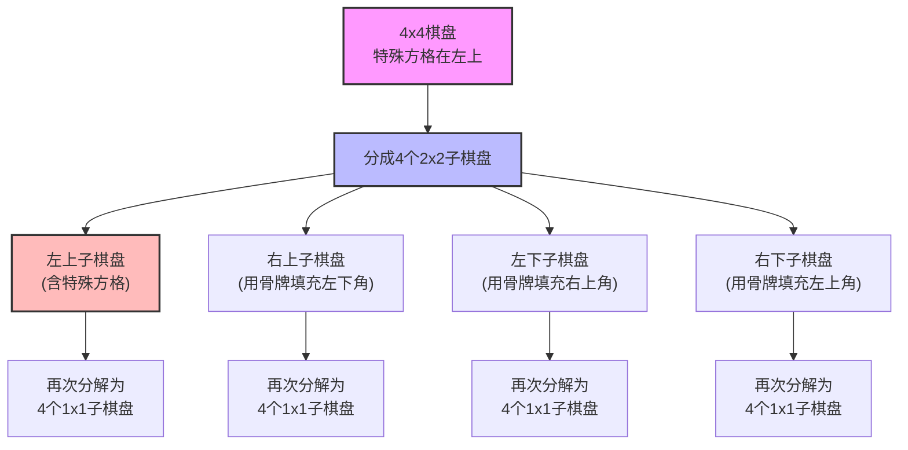

```mermaid
graph TD
    A[4x4棋盘\n特殊方格在左上] --> B["分成4个2x2子棋盘"]
    B --> C["左上子棋盘\n(含特殊方格)"]
    B --> D["右上子棋盘\n(用骨牌填充左下角)"]
    B --> E["左下子棋盘\n(用骨牌填充右上角)"]
    B --> F["右下子棋盘\n(用骨牌填充左上角)"]

    C --> G["再次分解为\n4个1x1子棋盘"]
    D --> H["再次分解为\n4个1x1子棋盘"]
    E --> I["再次分解为\n4个1x1子棋盘"]
    F --> J["再次分解为\n4个1x1子棋盘"]

    style A fill:#f9f,stroke:#333,stroke-width:2px
    style B fill:#bbf,stroke:#333,stroke-width:2px
    style C fill:#fbb,stroke:#333,stroke-width:2px
```
