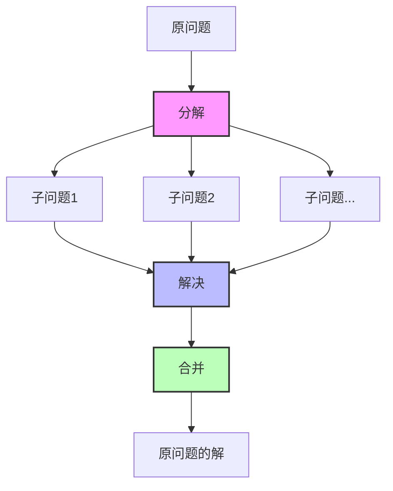

```mermaid
graph TD
    A[原问题] --> B[分解]
    B --> C[子问题1]
    B --> D[子问题2]
    B --> E[子问题...]
    C --> F[解决]
    D --> F
    E --> F
    F --> G[合并]
    G --> H[原问题的解]

    style B fill:#f9f,stroke:#333,stroke-width:2px
    style F fill:#bbf,stroke:#333,stroke-width:2px
    style G fill:#bfb,stroke:#333,stroke-width:2px
```
