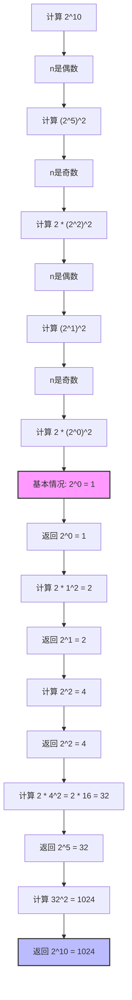

```mermaid
graph TD
    A[计算 2^10] --> B[n是偶数]
    B --> C["计算 (2^5)^2"]
    C --> D[n是奇数]
    D --> E["计算 2 * (2^2)^2"]
    E --> F[n是偶数]
    F --> G["计算 (2^1)^2"]
    G --> H[n是奇数]
    H --> I["计算 2 * (2^0)^2"]
    I --> J[基本情况: 2^0 = 1]
    J --> K[返回 2^0 = 1]
    K --> L[计算 2 * 1^2 = 2]
    L --> M[返回 2^1 = 2]
    M --> N[计算 2^2 = 4]
    N --> O[返回 2^2 = 4]
    O --> P[计算 2 * 4^2 = 2 * 16 = 32]
    P --> Q[返回 2^5 = 32]
    Q --> R[计算 32^2 = 1024]
    R --> S[返回 2^10 = 1024]

    style J fill:#f9f,stroke:#333,stroke-width:2px
    style S fill:#bbf,stroke:#333,stroke-width:2px
```
