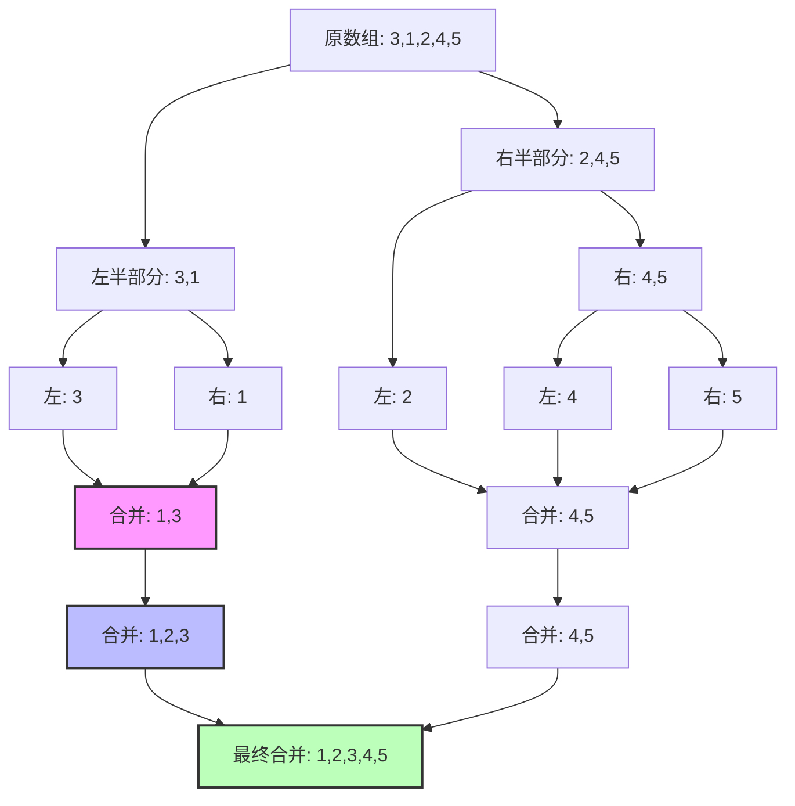

```mermaid
graph TD
    A[原数组: 3,1,2,4,5] --> B[左半部分: 3,1]
    A --> C[右半部分: 2,4,5]

    B --> D[左: 3]
    B --> E[右: 1]
    C --> F[左: 2]
    C --> G[右: 4,5]

    G --> H[左: 4]
    G --> I[右: 5]

    D --> J[合并: 1,3]
    E --> J
    F --> K[合并: 4,5]
    H --> K
    I --> K

    J --> L[合并: 1,2,3]
    K --> M[合并: 4,5]

    L --> N[最终合并: 1,2,3,4,5]
    M --> N

    style J fill:#f9f,stroke:#333,stroke-width:2px
    style L fill:#bbf,stroke:#333,stroke-width:2px
    style N fill:#bfb,stroke:#333,stroke-width:2px
```
