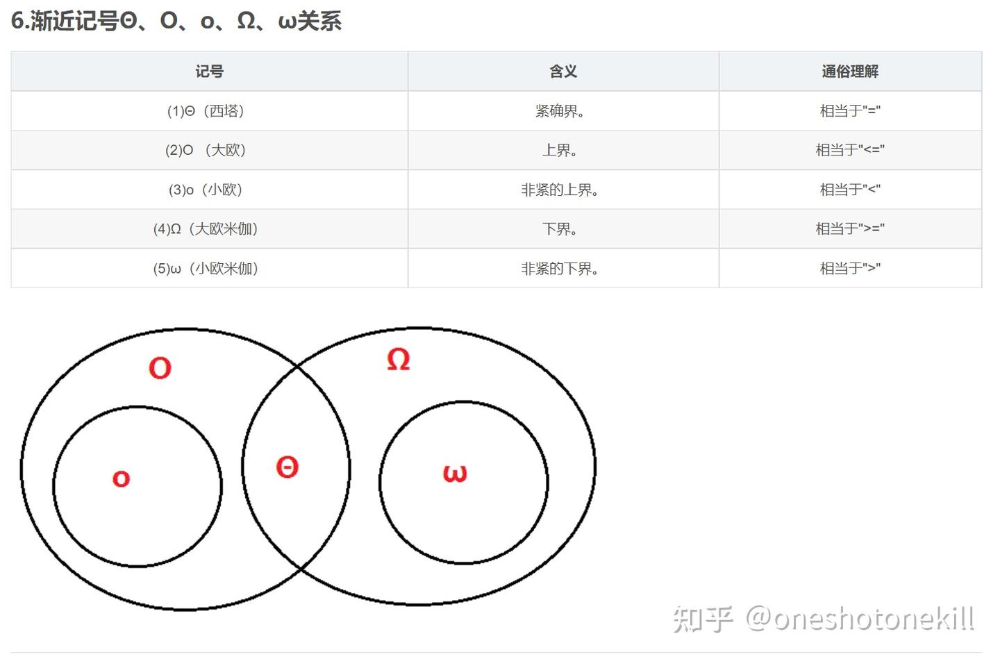
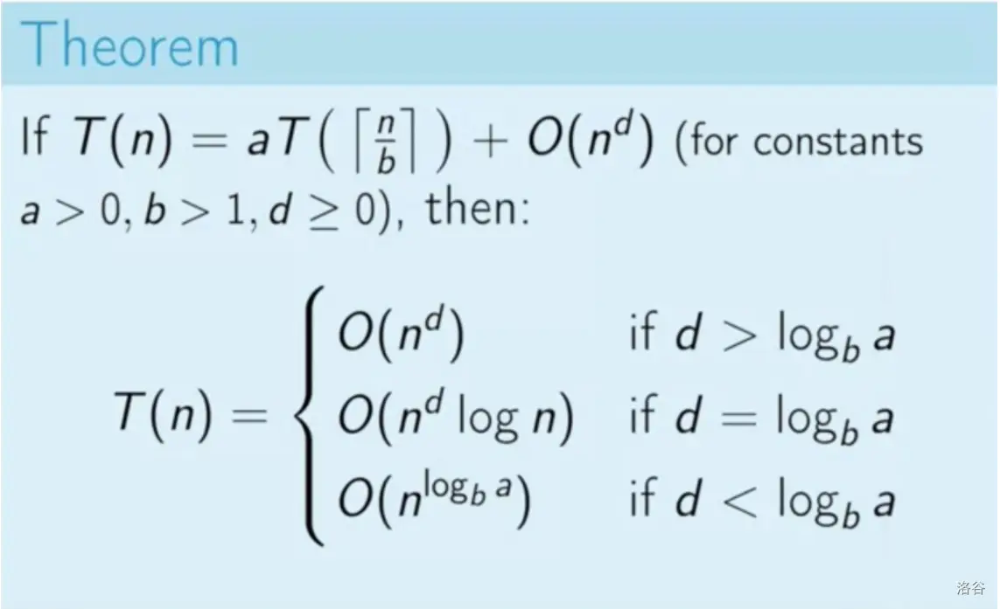

# 第一章复习：算法分析与渐近记号

## 1. 渐近记号详解

### 1.1 渐近上界记号 (Big-O)

渐近上界记号 $O$ 表示算法时间复杂度的上界，描述算法的最坏情况运行时间。

**定义**：若存在常数 $c > 0$ 和 $n_0 > 0$，使得对所有 $n \geq n_0$，有 $0 \leq f(n) \leq c \cdot g(n)$，则记作 $f(n) = O(g(n))$。

**直观理解**：$f(n) = O(g(n))$ 表示函数 $f(n)$ 的增长速度不会超过 $g(n)$ 的常数倍。

**特点**：
- 提供的是一个宽松的上界估计
- 可以忽略低阶项和常数系数
- 例如：$2n^2 + 3n = O(n^2)$，$n^2 = O(n^3)$

**常见错误**：将 $O$ 符号理解为"等于"，而实际上它表示"不超过"的关系。

### 1.2 渐近下界记号 (Big-Omega)

渐近下界记号 $\Omega$ 表示算法时间复杂度的下界，描述算法的最好情况运行时间。

**定义**：若存在常数 $c > 0$ 和 $n_0 > 0$，使得对所有 $n \geq n_0$，有 $0 \leq c \cdot g(n) \leq f(n)$，则记作 $f(n) = \Omega(g(n))$。

**直观理解**：$f(n) = \Omega(g(n))$ 表示函数 $f(n)$ 的增长速度至少和 $g(n)$ 的常数倍一样快。

**特点**：
- 提供的是一个下界估计
- 无法忽略高阶项
- 例如：$2n^2 + 3n = \Omega(n^2)$，$n^3 = \Omega(n^2)$

### 1.3 紧渐近界记号 (Big-Theta)

紧渐近界记号 $\Theta$ 同时给出了函数的上界和下界，表示算法的精确增长阶。

**定义**：若同时存在 $f(n) = O(g(n))$ 和 $f(n) = \Omega(g(n))$，则记作 $f(n) = \Theta(g(n))$。

**直观理解**：$f(n) = \Theta(g(n))$ 表示函数 $f(n)$ 的增长速度与 $g(n)$ 的增长速度相同（在常数因子范围内）。

**特点**：
- 提供的是一个紧确的界限估计
- 同时满足上界和下界的条件
- 例如：$2n^2 + 3n = \Theta(n^2)$，但 $n^2 \neq \Theta(n^3)$

**应用**：在算法分析中，$\Theta$ 通常是我们最关心的，因为它给出了算法时间复杂度的确切增长阶。

### 1.4 小-o 记号

小-o 记号 $o$ 表示一个更为严格的上界。

**定义**：若对任意常数 $c > 0$，存在 $n_0 > 0$，使得对所有 $n \geq n_0$，有 $0 \leq f(n) < c \cdot g(n)$，则记作 $f(n) = o(g(n))$。

**直观理解**：$f(n) = o(g(n))$ 表示当 $n$ 足够大时，$f(n)$ 的增长速度严格小于 $g(n)$ 的任何常数倍。

**特点**：
- 比 Big-O 更严格，要求 $f(n)$ 的增长速度严格小于 $g(n)$
- $f(n)/g(n) \to 0$ 当 $n \to \infty$
- 例如：$n = o(n^2)$，但 $n^2 \neq o(n^2)$

### 1.5 小-omega 记号

小-omega 记号 $\omega$ 表示一个更为严格的下界。

**定义**：若对任意常数 $c > 0$，存在 $n_0 > 0$，使得对所有 $n \geq n_0$，有 $0 \leq c \cdot g(n) < f(n)$，则记作 $f(n) = \omega(g(n))$。

**直观理解**：$f(n) = \omega(g(n))$ 表示当 $n$ 足够大时，$f(n)$ 的增长速度严格大于 $g(n)$ 的任何常数倍。

**特点**：
- 比 Big-Omega 更严格，要求 $f(n)$ 的增长速度严格大于 $g(n)$
- $f(n)/g(n) \to \infty$ 当 $n \to \infty$
- 例如：$n^2 = \omega(n)$，但 $n^2 \neq \omega(n^2)$

### 1.6 渐近记号之间的关系

- 如果 $f(n) = \Theta(g(n))$，则 $f(n) = O(g(n))$ 且 $f(n) = \Omega(g(n))$
- 如果 $f(n) = o(g(n))$，则 $f(n) = O(g(n))$
- 如果 $f(n) = \omega(g(n))$，则 $f(n) = \Omega(g(n))$
- $f(n) = \Theta(g(n))$ 当且仅当 $f(n) = O(g(n))$ 且 $f(n) = \Omega(g(n))$

## 2. 常见算法的时间复杂度

### 2.1 常见时间复杂度的比较

按照增长速度从低到高排序：$O(1) < O(\log n) < O(n) < O(n \log n) < O(n^2) < O(n^3) < O(2^n) < O(n!)$

| 复杂度      | 名称         | 举例                               |
|-------------|--------------|-----------------------------------|
| $O(1)$      | 常数复杂度   | 哈希表查找、数组访问              |
| $O(\log n)$ | 对数复杂度   | 二分查找、平衡二叉树操作          |
| $O(n)$      | 线性复杂度   | 线性搜索、遍历数组                |
| $O(n \log n)$ | 线性对数复杂度 | 归并排序、快速排序（平均情况）    |
| $O(n^2)$    | 平方复杂度   | 冒泡排序、插入排序、选择排序      |
| $O(n^3)$    | 立方复杂度   | 某些矩阵运算、某些动态规划算法    |
| $O(2^n)$    | 指数复杂度   | 暴力解决旅行商问题、子集生成      |
| $O(n!)$     | 阶乘复杂度   | 暴力解决全排列、暴力解决旅行商问题 |

### 2.2 时间复杂度判定方法

判断一个函数是否为另一个函数的准确渐近界（即是否为 $\Theta$ 级别），可以通过以下方法：

1. **极限法**：若 $\lim_{n \to \infty} \frac{f(n)}{g(n)} = c$，其中 $c$ 为正常数，则 $f(n) = \Theta(g(n))$。
   - 若 $c = 0$，则 $f(n) = o(g(n))$
   - 若 $c = \infty$，则 $f(n) = \omega(g(n))$

2. **上下界法**：若同时证明 $f(n) = O(g(n))$ 和 $f(n) = \Omega(g(n))$，则 $f(n) = \Theta(g(n))$。

3. **转换法**：对于复杂函数，可以通过对数变换、泰勒展开等方法简化后再进行比较。
   - 对数变换：对两个函数取对数，比较它们的增长速度
   - 泰勒展开：将复杂函数展开为级数，保留主导项进行比较

### 2.3 复杂度分析中的常见技巧

1. **忽略常数因子**：在渐近分析中，常数因子通常被忽略，如 $5n^2 = O(n^2)$。

2. **忽略低阶项**：增长最快的项决定了复杂度，如 $n^2 + n\log n + 10n = \Theta(n^2)$。

3. **循环分析**：
   - 单层循环：通常为 $O(n)$
   - 嵌套循环：通常为 $O(n^k)$，其中 $k$ 是循环的嵌套层数
   - 变量增长循环（如 $i = i * 2$）：通常为 $O(\log n)$
   - 变量减半循环（如 $i = i / 2$）：通常为 $O(\log n)$

4. **递归分析**：使用递归式和主定理（见下一节）

## 3. 主定理（Master Theorem）

主定理用于求解形如 $T(n) = aT(n/b) + f(n)$ 的递归关系的时间复杂度，其中 $a \geq 1$，$b > 1$，$f(n)$ 是一个渐近正函数。

### 3.1 主定理的三种情况

1. **情况一**：若 $f(n) = O(n^{\log_b a - \epsilon})$，其中 $\epsilon > 0$，则 $T(n) = \Theta(n^{\log_b a})$。

   - 此时递归部分主导，非递归部分可以忽略。
   - 通俗理解：递归部分的工作量远大于非递归部分。

2. **情况二**：若 $f(n) = \Theta(n^{\log_b a} \log^k n)$，其中 $k \geq 0$，则 $T(n) = \Theta(n^{\log_b a} \log^{k+1} n)$。

   - 此时递归部分与非递归部分贡献相当，结果比单纯的递归部分多一个对数因子。
   - 通俗理解：递归部分和非递归部分的工作量在同一数量级。

3. **情况三**：若 $f(n) = \Omega(n^{\log_b a + \epsilon})$，其中 $\epsilon > 0$，且存在常数 $c < 1$ 使得对足够大的 $n$ 有 $af(n/b) \leq cf(n)$，则 $T(n) = \Theta(f(n))$。
   - 此时非递归部分主导，递归部分可以忽略。
   - 通俗理解：非递归部分的工作量远大于递归部分。
   - 注意：正则条件 $af(n/b) \leq cf(n)$ 必须满足。

### 3.2 主定理的直观理解

主定理本质上是比较 $d$ (非递归项 $O(n^d)$ 的指数) 与 $\log_b a$ (由递归部分决定的关键指数) 的大小关系：

- 当 $d < \log_b a$ 时：递归部分主导，$T(n) = \Theta(n^{\log_b a})$
- 当 $d = \log_b a$ 时：两部分贡献相当，$T(n) = \Theta(n^d \log n)$
- 当 $d > \log_b a$ 时：非递归部分主导，$T(n) = \Theta(n^d)$

### 3.3 递归树分析法

对于不能直接应用主定理的情况，可以使用递归树分析法：

1. 画出递归调用树
2. 计算每一层的工作量
3. 统计所有层的工作量之和

**例**：对于 $T(n) = 2T(n/2) + n$，递归树分析如下：
- 第0层：工作量为 $n$
- 第1层：$2$ 个子问题，每个大小为 $n/2$，工作量为 $2 \cdot (n/2) = n$
- 第2层：$2^2$ 个子问题，每个大小为 $n/2^2$，工作量为 $2^2 \cdot (n/2^2) = n$
- ...
- 第$\log_2 n$层：$n$ 个子问题，每个大小为 $1$，工作量为 $n$
- 总工作量：$n \cdot (\log_2 n + 1) = \Theta(n \log n)$

### 3.4 主定理的局限性

主定理不适用于以下情况：
- 递归式不符合 $T(n) = aT(n/b) + f(n)$ 的形式
- $a$ 不是常数（如 $a$ 是 $n$ 的函数）
- 子问题大小不均匀（如快速排序）
- 不满足正则条件

## 4. 例题详解

### 4.1 主定理应用例题

1. **例一**

   - 对于 $T(n)=4T(\frac{n}{2})+n$，这里 $a=4$，$b=2$，$f(n)=n$，$d=1$
   - 计算 $\log_b a = \log_2 4 = 2$
   - 因为 $d=1 < \log_b a=2$，根据主定理情况一，$T(n)=\Theta(n^{\log_b a})=\Theta(n^2)$
   - 物理意义：这类似于合并排序的变种，分成4个子问题，每个子问题规模为原问题的一半

2. **例二**

   - 对于 $T(n)=2T(\frac{n}{2})+n$，$a=2$，$b=2$，$f(n)=n$，$d=1$
   - 计算 $\log_b a = \log_2 2 = 1$
   - 由于 $d = \log_b a = 1$，根据主定理情况二，$T(n)=\Theta(n^{\log_b a}\log n)=\Theta(n\log n)$
   - 物理意义：这是合并排序的典型递归式，分成2个子问题，每个子问题规模为原问题的一半

3. **例三**

   - 对于 $T(n)=4T(\frac{n}{2})+n^3$，$a=4$，$b=2$，$f(n)=n^3$，$d=3$
   - 计算 $\log_b a = \log_2 4 = 2$
   - 因为 $d=3 > \log_b a=2$，根据主定理情况三，$T(n)=\Theta(n^d)=\Theta(n^3)$
   - 需验证正则条件：$af(\frac{n}{b}) = 4 \cdot (\frac{n}{2})^3 = \frac{4n^3}{8} = \frac{n^3}{2} = \frac{1}{2}f(n) < f(n)$，满足条件
   - 物理意义：合并代价（$n^3$）远大于子问题的计算代价

4. **例四**
   - 对于 $T(n)=2T(\frac{n}{2})+n\log n$，$a=2$，$b=2$，$f(n)=n\log n$
   - 计算 $\log_b a = \log_2 2 = 1$
   - $f(n)=n\log n=n^1 \cdot \log^1 n=\Theta(n^{\log_b a}\log^k n)$（$k=1$）
   - 根据主定理情况二，$T(n)=\Theta(n^{\log_b a}\log^{k+1}n)=\Theta(n\log^2 n)$
   - 物理意义：这是一个比合并排序合并代价更高的算法

### 4.2 函数渐近关系判定例题

**例题 1**：判断函数的渐近关系

**问题**：判断 $f(n) = 3n^2 + 2n\log n + 5n + 7$ 与 $g(n) = n^2$ 的渐近关系。

**解答**：
分析当 $n$ 趋于无穷大时 $\frac{f(n)}{g(n)}$ 的极限：

$\lim_{n \to \infty} \frac{f(n)}{g(n)} = \lim_{n \to \infty} \frac{3n^2 + 2n\log n + 5n + 7}{n^2} = \lim_{n \to \infty} (3 + \frac{2\log n}{n} + \frac{5}{n} + \frac{7}{n^2})$

当 $n \to \infty$ 时，$\frac{2\log n}{n}$、$\frac{5}{n}$ 和 $\frac{7}{n^2}$ 都趋近于 $0$，所以极限等于 $3$。

因为极限是一个正常数，所以 $f(n) = \Theta(n^2)$。即 $f(n) = O(n^2)$ 且 $f(n) = \Omega(n^2)$，因此 $f(n) = \Theta(n^2)$。

**例题 2**：使用主定理分析递归算法

**问题**：分析递归式 $T(n) = 3T(n/4) + n\log n$ 的渐近界。

**解答**：
这是一个符合主定理形式的递归式，其中 $a = 3$，$b = 4$，$f(n) = n\log n$。

**步骤 1**：计算 $\log_b a = \log_4 3 \approx 0.792$。

**步骤 2**：比较 $f(n) = n\log n$ 与 $n^{\log_b a} = n^{0.792}$：

$\lim_{n \to \infty} \frac{n\log n}{n^{0.792}} = \lim_{n \to \infty} n^{1-0.792} \log n = \lim_{n \to \infty} n^{0.208} \log n = \infty$

因为 $n\log n = \omega(n^{0.792})$（即 $n\log n$ 的增长速度严格快于 $n^{0.792}$），所以适用主定理的第三种情况。

**步骤 3**：验证正则条件：对于足够大的 $n$，是否存在常数 $c < 1$ 使得 $3f(n/4) \leq cf(n)$。

$3f(n/4) = 3(n/4)\log(n/4) = (3n/4)(\log n - \log 4) < (3n/4)\log n$

当 $n$ 足够大时，$(3/4) < 1$，所以 $3f(n/4) < (3/4)n\log n < n\log n = f(n)$，正则条件满足（取 $c = 3/4$）。

**步骤 4**：根据主定理的第三种情况，$T(n) = \Theta(f(n)) = \Theta(n\log n)$。

### 4.3 复杂函数比较例题

**例题 3**：比较增长速度

**问题**：比较函数 $f(n) = n^{\sqrt{\log n}}$ 与 $g(n) = (\log n)^n$ 的渐近增长速度，并确定它们之间的关系。

**解答**：
为了比较这两个复杂函数的增长速度，取对数简化比较：

**步骤 1**：对 $f(n)$ 取对数
$\log f(n) = \log(n^{\sqrt{\log n}}) = \sqrt{\log n} \cdot \log n = (\log n)^{3/2}$

**步骤 2**：对 $g(n)$ 取对数
$\log g(n) = \log((\log n)^n) = n \cdot \log(\log n)$

**步骤 3**：比较 $(\log n)^{3/2}$ 与 $n \cdot \log(\log n)$：

当 $n$ 足够大时，$n$ 的增长速度远快于任何对数函数的幂，因此：
$\lim_{n \to \infty} \frac{(\log n)^{3/2}}{n \cdot \log(\log n)} = 0$

这意味着 $\log g(n) = \omega(\log f(n))$，所以 $g(n) = \omega(f(n))$。

**步骤 4**：总结关系
$f(n) = o(g(n))$ 且 $g(n) = \omega(f(n))$。

具体而言，$(\log n)^n$ 的增长速度远快于 $n^{\sqrt{\log n}}$。

### 4.4 不适用主定理的例题

**例题 4**：分析非标准递归式

**问题**：分析递归式 $T(n) = T(n/2) + T(n/3) + n$ 的渐近界。

**解答**：
这个递归式不符合主定理的标准形式，因为它有两个不同的子问题大小，所以无法直接应用主定理。

**方法**：使用递归树分析或设置上下界

假设 $T(n) \leq cn\log n$（对于某个常数 $c$）：

$T(n) = T(n/2) + T(n/3) + n \leq c(n/2)\log(n/2) + c(n/3)\log(n/3) + n$
$= c(n/2)(\log n - \log 2) + c(n/3)(\log n - \log 3) + n$
$= c(n/2)\log n - c(n/2)\log 2 + c(n/3)\log n - c(n/3)\log 3 + n$
$= c(5n/6)\log n - c(n/2)\log 2 - c(n/3)\log 3 + n$

当 $c$ 足够大且 $n$ 足够大时，$c(5n/6)\log n - c(n/2)\log 2 - c(n/3)\log 3 + n \leq cn\log n$，因此 $T(n) = O(n\log n)$。

类似地，可以证明 $T(n) = \Omega(n\log n)$，因此 $T(n) = \Theta(n\log n)$。

## 5. 总结与常见错误

### 5.1 渐近记号的本质：

- $O$ 表示上界（最坏情况）
- $\Omega$ 表示下界（最好情况）
- $\Theta$ 表示紧确界（精确增长阶）
- $o$ 和 $\omega$ 提供更严格的上界和下界描述

### 5.2 主定理的应用：

- 主定理是解决递归式时间复杂度的强大工具
- 通过比较 $d$ 和 $\log_b a$ 的大小关系来确定复杂度
- 注意正则条件的验证，尤其是在第三种情况
- 对于边界情况，需要考虑对数因子的影响

### 5.3 复杂度判定方法：

- 极限法：计算函数比值的极限
- 上下界法：证明同时满足上界和下界
- 转换法：对复杂函数进行变换简化
- 递归树分析：画出递归调用树并计算总工作量

### 5.4 常见错误：

- 将 $O$ 符号误用为"等于"而非"不超过"
- 忽略主定理条件的验证，特别是第三种情况的正则条件
- 对非标准递归式错误地应用主定理
- 在计算多项式时忽略主导项
- 错误地比较指数函数与多项式函数的增长速度

### 5.5 考试技巧：

- 了解常见时间复杂度函数的相对增长速度
- 掌握主定理的应用条件和使用方法
- 练习使用极限法判断函数的渐近关系
- 熟悉递归树分析方法，以应对主定理不适用的情况
- 理解各种渐近记号的精确数学含义
- 增长速度越高的函数实际算法效率越低

通过详细理解和掌握以上概念，你将能够更有效地分析算法复杂度，从而在实际问题中选择更优的算法。