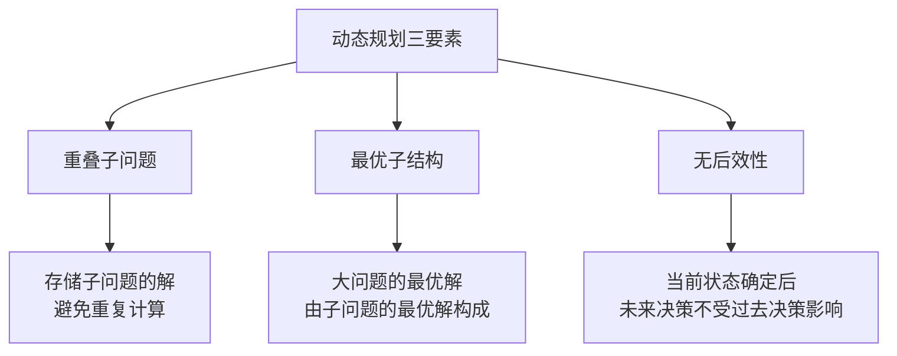
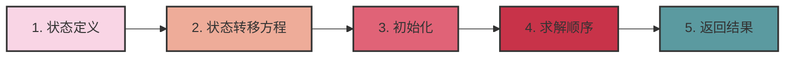
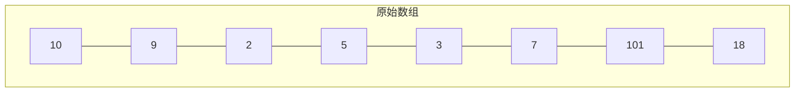
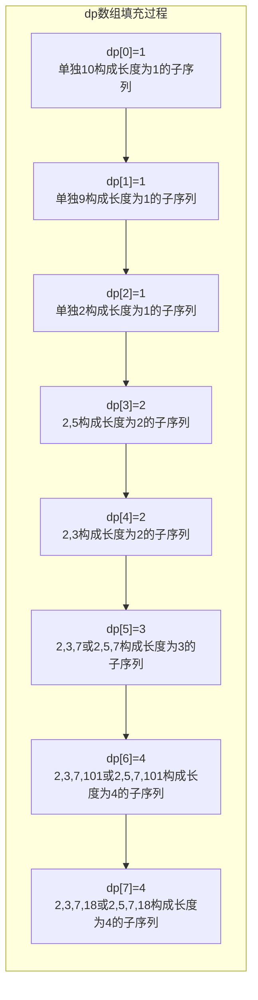
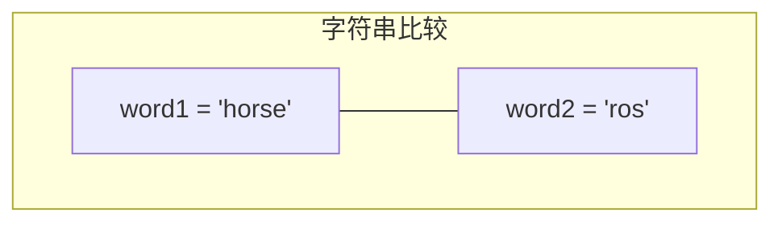
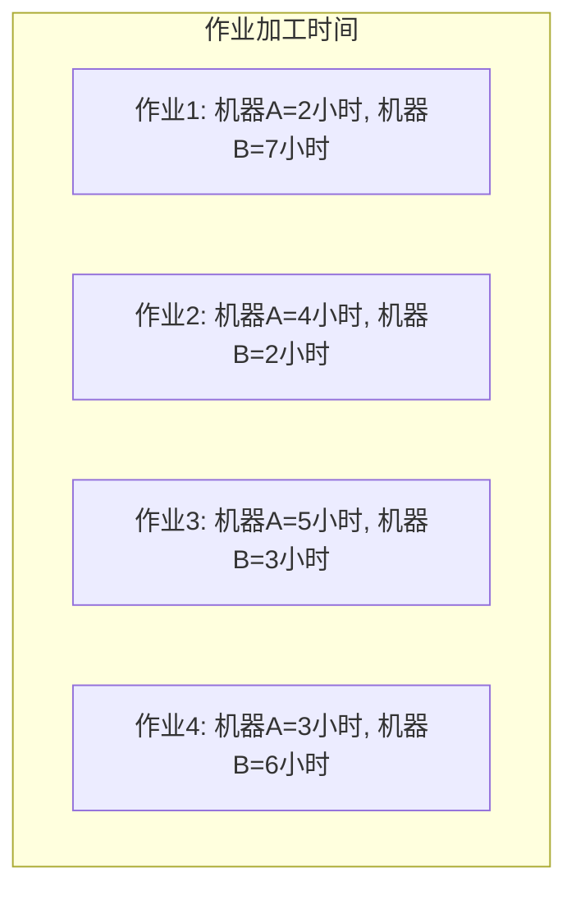

# 第三章：动态规划

## 复习目标

- 理解动态规划的核心思想：重叠子问题、最优子结构和无后效性
- 掌握动态规划的基本步骤：状态定义、状态转移方程、初始化、求解顺序
- 能够运用动态规划解决实际问题，特别是经典问题与其变种
- 能够分析动态规划算法的时间复杂度和空间复杂度
- 掌握动态规划的优化技巧：状态压缩、记忆化搜索、前缀和等

## 一、什么是动态规划？

动态规划(Dynamic Programming, DP)是一种将复杂问题分解为更简单子问题的算法策略，通过存储子问题的解来避免重复计算，从而提高算法效率。

### 1.1 核心思想

动态规划基于三个核心思想：

1. **重叠子问题**：在求解过程中，会反复求解相同的子问题

   - 例如：求解斐波那契数列 F(5)时，F(2)会被重复计算多次
   - 动态规划通过**备忘录**(自顶向下)或**表格**(自底向上)存储已解决的子问题的解

2. **最优子结构**：问题的最优解包含子问题的最优解

   - 例如：两点间的最短路径包含中间点的最短路径
   - 这允许我们通过组合子问题的最优解构建原问题的最优解

3. **无后效性**：当前状态确定后，未来的决策不受过去决策的影响
   - 例如：到达某状态后，只需关注当前状态，不需要考虑如何到达此状态
   - 这是保证动态规划算法正确性的关键性质



#### 斐波那契数列问题实例

让我们通过斐波那契数列来直观理解动态规划思想：

**递归解法**（存在重叠子问题）：

```cpp
int fib(int n) {
    if (n <= 1) return n;
    return fib(n-1) + fib(n-2);  // 存在大量重复计算
}
```

**动态规划解法**（自底向上）：

```cpp
int fib(int n) {
    if (n <= 1) return n;

    vector<int> dp(n+1);
    dp[0] = 0;
    dp[1] = 1;

    for (int i = 2; i <= n; i++) {
        dp[i] = dp[i-1] + dp[i-2];  // 利用已计算的子问题解
    }

    return dp[n];
}
```

**计算树对比**：

```
递归方法计算F(5)：
                F(5)
              /     \
          F(4)       F(3)
        /     \     /    \
     F(3)    F(2) F(2)   F(1)
    /   \    /  \  /  \
  F(2) F(1) F(1) F(0) F(1) F(0)
 /   \
F(1) F(0)

动态规划方法：
F(0)→F(1)→F(2)→F(3)→F(4)→F(5)
```

递归方法中，F(2)和 F(3)被多次重复计算，而动态规划通过存储已计算结果消除了这种重复。

### 1.2 形象比喻

为了更直观地理解动态规划，这里提供几个形象的比喻：

- **备忘录比喻**：动态规划就像解题过程中的"备忘录"，记录已解决的子问题，避免重复工作。就像做数学题时把中间结果记下来，后面需要时直接查阅，不必重新计算。

- **爬楼梯比喻**：假设你要爬到第 n 级楼梯，每次可以爬 1 级或 2 级。那么到达第 n 级的方法数等于到达第 n-1 级的方法数加上到达第 n-2 级的方法数。这体现了问题分解和子问题组合的思想。

```cpp
// 爬楼梯问题的动态规划实现
int climbStairs(int n) {
    if (n <= 2) return n;

    vector<int> dp(n+1);
    dp[1] = 1;  // 爬到第1级有1种方法
    dp[2] = 2;  // 爬到第2级有2种方法

    for (int i = 3; i <= n; i++) {
        dp[i] = dp[i-1] + dp[i-2];  // 状态转移方程
    }

    return dp[n];
}
```

- **最佳路径比喿**：在网格中从起点到终点，每步可以向右或向下移动，每个单元格有对应的分数，求最高分路径。最优路径必然包含子路径的最优选择，这体现了最优子结构。

```
例如：从左上角到右下角的最高分路径问题
┌───┬───┬───┐
│ 3 │ 1 │ 7 │
├───┼───┼───┤
│ 5 │ 2 │ 4 │
├───┼───┼───┤
│ 6 │ 1 │ 1 │
└───┴───┴───┘

动态规划解法：dp[i][j] = grid[i][j] + max(dp[i-1][j], dp[i][j-1])
```

- **拼图比喻**：动态规划像拼图游戏，先拼好小块（解决子问题），再组合成完整图像（解决原问题）。一旦某个小块拼好，就不用重复拼它。

### 1.3 与其他算法的比较

| 算法特性   | 递归       | 动态规划                             | 贪心           |
| ---------- | ---------- | ------------------------------------ | -------------- |
| 解决方法   | 自顶向下   | 自顶向下(记忆化)<br>或自底向上(表格) | 局部最优决策   |
| 时间效率   | 可能指数级 | 多项式级                             | 通常最快       |
| 适用问题   | 结构简单   | 有重叠子问题和最优子结构             | 有贪心选择性质 |
| 子问题重复 | 大量重复   | 避免重复                             | 不考虑重复     |
| 全局最优解 | 可保证     | 可保证                               | 不一定保证     |
| 典型例子   | 普通递归   | 动态规划斐波那契                     | 找零钱问题     |

### 1.4 解题思路图解

```
动态规划解题流程
┌──────────────┐
│ 问题分析     │
└──────┬───────┘
       ↓
┌──────────────┐
│ 确定状态定义 │
└──────┬───────┘
       ↓
┌──────────────┐
│ 推导转移方程 │
└──────┬───────┘
       ↓
┌──────────────┐
│ 确定初始状态 │
└──────┬───────┘
       ↓
┌──────────────┐
│ 确定计算顺序 │
└──────┬───────┘
       ↓
┌──────────────┐
│ 空间优化    │
└──────────────┘
```

### 与递归的区别

- **递归：** 自顶向下，可能会重复计算相同的子问题。
- **动态规划：** 自底向上，保存子问题的解，避免重复计算。

## 二、动态规划五步走

动态规划问题的解决通常遵循五个关键步骤，掌握这些步骤可以帮助我们系统地解决各种动态规划问题。

### 2.1 状态定义

状态是对子问题解的描述，是动态规划的核心。一个好的状态定义应该能清晰地表示问题，并便于推导状态转移方程。

**定义技巧**：

- 明确问题求解的目标
- 思考决策过程中变化的因素
- 尽量用最少的维度表示状态

**常见的状态定义模式**：

- 一维状态：`dp[i]` 表示考虑前 i 个元素的最优解（如最长递增子序列）
- 二维状态：`dp[i][j]` 可表示两个变化维度（如背包问题中的物品和容量）
- 状态压缩：使用位运算表示状态集合（如旅行商问题）

**状态定义举例**：

- 爬楼梯：`dp[i]` 表示爬到第 i 级楼梯的方法数
- 编辑距离：`dp[i][j]` 表示将字符串 word1 的前 i 个字符转换为 word2 的前 j 个字符所需的最少操作数
- 背包问题：`dp[i][w]` 表示前 i 个物品放入容量为 w 的背包的最大价值

### 2.2 状态转移方程

状态转移方程描述了状态之间的递推关系，是解决动态规划问题的核心。一个正确的状态转移方程应基于已解决的子问题来构建当前问题的解。

**推导技巧**：

- 思考当前问题与子问题的关系
- 考虑所有可能的转移来源
- 选择最优的转移路径（最大化/最小化目标）

**常见转移模式**：

- 线性递推：`dp[i] = f(dp[i-1], dp[i-2], ...)`
- 区间递推：`dp[i][j] = f(dp[i+1][j], dp[i][j-1], dp[i+1][j-1], ...)`
- 选择决策：`dp[i][j] = max/min(选择A, 选择B, ...)`

**状态转移方程举例**：

- 爬楼梯：`dp[i] = dp[i-1] + dp[i-2]`
- 编辑距离：`dp[i][j] = min(dp[i-1][j]+1, dp[i][j-1]+1, dp[i-1][j-1]+(s1[i]!=s2[j]))`
- 01 背包：`dp[i][j] = max(dp[i-1][j], dp[i-1][j-w[i]]+v[i])`

### 2.3 初始化

初始化是为最基本的子问题设置已知解，是动态规划递推的起点。正确的初始化对于整个算法的正确性至关重要。

**初始化技巧**：

- 考虑问题的边界情况
- 通常对应于最小规模的子问题
- 特殊情况可能需要特殊值（如负无穷、正无穷等）

**常见初始化模式**：

- 一维 DP：初始化 dp[0]或少量起始元素
- 二维 DP：初始化第一行和第一列
- 特殊值：使用问题特定的初始值（如最大值、最小值）

**初始化举例**：

- 爬楼梯：`dp[1] = 1, dp[2] = 2`
- 编辑距离：`dp[i][0] = i, dp[0][j] = j`
- 01 背包：`dp[0][j] = 0, dp[i][0] = 0`

### 2.4 求解顺序

求解顺序决定了计算状态的先后次序，正确的求解顺序必须确保在计算某个状态时，它依赖的所有状态都已经计算完成。

**确定顺序技巧**：

- 分析状态依赖关系
- 通常是从小问题到大问题（自底向上）
- 特定问题可能需要特殊顺序（如区间 DP 按长度递增）

**常见求解顺序**：

- 线性顺序：从左到右计算（如最长递增子序列）
- 二维表格：按行或按列填充（如编辑距离）
- 特殊顺序：按区间长度递增（如回文子串）

**求解顺序举例**：

```
// 一维DP，从左到右
for (int i = 开始索引; i <= 结束索引; i++) {
    计算dp[i]
}

// 二维DP，按行填表
for (int i = 0; i <= m; i++) {
    for (int j = 0; j <= n; j++) {
        计算dp[i][j]
    }
}

// 区间DP，按长度递增
for (int len = 2; len <= n; len++) {
    for (int i = 0; i <= n-len; i++) {
        int j = i + len - 1;
        计算dp[i][j]
    }
}
```

### 2.5 返回结果

确定最终返回的结果，可能是特定状态值，也可能是多个状态值中的最大/最小值。

**确定返回值技巧**：

- 确认问题的目标是什么
- 可能是最后一个状态，也可能是状态集合的最值
- 有时还需要通过额外信息重建最优路径

**常见返回模式**：

- 一维 DP：通常返回 dp[n]
- 二维 DP：通常返回 dp[m][n]或 dp 矩阵中的最值
- 最优路径：使用额外数组记录决策，回溯构建路径

**返回值举例**：

- 爬楼梯：返回 dp[n]
- 最长递增子序列：返回 max(dp[0...n-1])
- 编辑距离：返回 dp[m][n]



### 动态规划框架示例（爬楼梯问题）

```cpp
int climbStairs(int n) {
    // 1. 状态定义：dp[i]表示爬到第i级台阶的方法数
    vector<int> dp(n + 1, 0);

    // 3. 初始化：设置基础情况
    dp[0] = 1;  // 空台阶有1种方法（不爬）
    dp[1] = 1;  // 1级台阶有1种方法

    // 4. 求解顺序：从小到大计算
    for (int i = 2; i <= n; i++) {
        // 2. 状态转移方程：当前台阶的方法数等于前两个台阶的方法数之和
        dp[i] = dp[i-1] + dp[i-2];
    }

    // 5. 返回结果：最终结果在dp[n]
    return dp[n];
}
```

## 三、典题精讲

### 1. 最长上升子序列问题（LIS）

#### 题目回顾

给定一个整数数组，求数组中的最长上升子序列的长度。

#### 问题分析

- **状态定义：** `dp[i]` 表示以 `arr[i]` 结尾的最长上升子序列的长度。
- **状态转移方程：**
  - `dp[i] = max(dp[j] + 1)`，其中 `0 <= j < i` 且 `arr[j] < arr[i]`。
  - 如果不存在 `j` 满足条件，则 `dp[i] = 1`。
- **初始化：** `dp[i] = 1` (初始时，每个元素自身构成一个长度为 1 的上升子序列)
- **求解顺序：** 从左到右遍历数组。
- **返回值：** `max(dp[i])`，其中 `0 <= i < n`。

#### C++ 代码

```cpp
#include <iostream>
#include <vector>
#include <algorithm>

using namespace std;

int longestIncreasingSubsequence(vector<int>& arr) {
    int n = arr.size();
    if (n == 0) {
        return 0;
    }

    vector<int> dp(n, 1); // 初始化 dp 数组

    for (int i = 1; i < n; i++) {
        for (int j = 0; j < i; j++) {
            if (arr[i] > arr[j]) {
                dp[i] = max(dp[i], dp[j] + 1);
            }
        }
    }

    return *max_element(dp.begin(), dp.end()); // 返回 dp 数组中的最大值
}

int main() {
    vector<int> arr = {10, 9, 2, 5, 3, 7, 101, 18};
    int lisLength = longestIncreasingSubsequence(arr);
    cout << "最长上升子序列的长度: " << lisLength << endl; // 输出：4
    return 0;
}
```

#### 伪代码

```
函数 最长上升子序列(数组 arr):
  n = arr 的长度
  如果 n == 0:
    返回 0

  创建 dp 数组，长度为 n，初始化所有元素为 1

  循环 i 从 1 到 n - 1:
    循环 j 从 0 到 i - 1:
      如果 arr[i] > arr[j]:
        dp[i] = max(dp[i], dp[j] + 1)

  返回 dp 数组中的最大值
```

#### 时间复杂度

O(n²)

#### 空间复杂度

O(n)

#### 图示举例

以数组 `arr = [10, 9, 2, 5, 3, 7, 101, 18]` 为例:



DP 数组构建过程:



最终的 DP 数组:

```
dp = [1, 1, 1, 2, 2, 3, 4, 4]
```

最长上升子序列为：[2, 5, 7, 101] 或 [2, 3, 7, 101]，长度为 4。

### 2. 编辑距离问题（莱文斯坦距离）

#### 题目回顾

给定两个字符串 `word1` 和 `word2`，计算将 `word1` 转换为 `word2` 所使用的最少操作数。

#### 问题分析

- **状态定义：** `dp[i][j]` 表示将 `word1` 的前 `i` 个字符转换为 `word2` 的前 `j` 个字符所需要的最少操作数。
- **状态转移方程：**
  - 如果 `word1[i-1] == word2[j-1]`，则 `dp[i][j] = dp[i-1][j-1]`。
  - 否则，`dp[i][j] = min(dp[i-1][j] + 1, dp[i][j-1] + 1, dp[i-1][j-1] + 1)`。
    - `dp[i-1][j] + 1`：删除 `word1[i-1]`。
    - `dp[i][j-1] + 1`：插入 `word2[j-1]`。
    - `dp[i-1][j-1] + 1`：将 `word1[i-1]` 替换为 `word2[j-1]`。
- **初始化：**
  - `dp[i][0] = i`，将 `word1` 的前 `i` 个字符转换为空字符串需要 `i` 次删除操作。
  - `dp[0][j] = j`，将空字符串转换为 `word2` 的前 `j` 个字符需要 `j` 次插入操作。
- **求解顺序：** 从左到右，从上到下遍历 `dp` 数组。
- **返回值：** `dp[m][n]`，其中 `m` 是 `word1` 的长度，`n` 是 `word2` 的长度。

#### C++ 代码

```cpp
#include <iostream>
#include <string>
#include <vector>
#include <algorithm>

using namespace std;

int editDistance(string word1, string word2) {
    int m = word1.length();
    int n = word2.length();

    vector<vector<int>> dp(m + 1, vector<int>(n + 1, 0));

    for (int i = 0; i <= m; i++) {
        dp[i][0] = i;
    }

    for (int j = 0; j <= n; j++) {
        dp[0][j] = j;
    }

    for (int i = 1; i <= m; i++) {
        for (int j = 1; j <= n; j++) {
            if (word1[i - 1] == word2[j - 1]) {
                dp[i][j] = dp[i - 1][j - 1];
            } else {
                dp[i][j] = min({dp[i - 1][j] + 1, dp[i][j - 1] + 1, dp[i - 1][j - 1] + 1});
            }
        }
    }

    return dp[m][n];
}

int main() {
    string word1 = "horse";
    string word2 = "ros";
    int distance = editDistance(word1, word2);
    cout << "编辑距离: " << distance << endl; // 输出：3
    return 0;
}
```

#### 伪代码

```
函数 编辑距离(字符串 word1, 字符串 word2):
  m = word1 的长度
  n = word2 的长度

  创建 dp 数组，大小为 (m + 1) x (n + 1)

  循环 i 从 0 到 m:
    dp[i][0] = i

  循环 j 从 0 到 n:
    dp[0][j] = j

  循环 i 从 1 到 m:
    循环 j 从 1 到 n:
      如果 word1[i - 1] == word2[j - 1]:
        dp[i][j] = dp[i - 1][j - 1]
      否则:
        dp[i][j] = min(dp[i - 1][j] + 1, dp[i][j - 1] + 1, dp[i - 1][j - 1] + 1)

  返回 dp[m][n]
```

#### 时间复杂度

O(m \* n)

#### 空间复杂度

O(m \* n)

#### 图示举例

对于字符串 `word1 = "horse"` 和 `word2 = "ros"`，我们来构建动态规划表格：



DP 表格填充完成后:

|     | ""  | r   | o   | s   |
| --- | --- | --- | --- | --- |
| ""  | 0   | 1   | 2   | 3   |
| h   | 1   | 1   | 2   | 3   |
| o   | 2   | 2   | 1   | 2   |
| r   | 3   | 2   | 2   | 2   |
| s   | 4   | 3   | 3   | 2   |
| e   | 5   | 4   | 4   | 3   |

编辑操作说明:


最终需要的最少操作数为 3:

1. 删除 'h' -> "orse"
2. 将 'o' 替换为 'r' -> "rrse"
3. 删除多余的 'r' 和 'e' -> "ros"

### 3. 完全背包问题

#### 题目回顾

有 `n` 种物品和一个容量为 `W` 的背包，每种物品都有无限件可用。求解将哪些物品装入背包可使这些物品的重量总和不超过背包容量，且价值总和最大。

#### 问题分析

- **状态定义：** `dp[i][w]` 表示前 `i` 种物品，背包容量为 `w` 时的最大价值。
- **状态转移方程：**
  - `dp[i][w] = max(dp[i-1][w], dp[i][w - wt[i-1]] + val[i-1])`，其中 `i > 0` 且 `w >= wt[i-1]`。
    - `dp[i-1][w]`：不选择第 `i` 种物品。
    - `dp[i][w - wt[i-1]] + val[i-1]`：选择第 `i` 种物品，由于每种物品可以选无限件，因此是 `dp[i][w - wt[i-1]]`。
  - 如果 `w < wt[i-1]`，则 `dp[i][w] = dp[i-1][w]`。
- **初始化：**
  - `dp[0][w] = 0`，没有物品时，无论背包容量多大，价值都为 0。
  - `dp[i][0] = 0`，背包容量为 0 时，无论有多少物品，价值都为 0。
- **求解顺序：** 从左到右，从上到下遍历 `dp` 数组。
- **返回值：** `dp[n][W]`。

#### C++ 代码

```cpp
#include <iostream>
#include <vector>
#include <algorithm>

using namespace std;

int unboundedKnapsack(int W, vector<int>& wt, vector<int>& val, int n) {
    vector<vector<int>> dp(n + 1, vector<int>(W + 1, 0));

    for (int i = 0; i <= n; i++) {
        dp[i][0] = 0;
    }

    for (int w = 0; w <= W; w++) {
        dp[0][w] = 0;
    }

    for (int i = 1; i <= n; i++) {
        for (int w = 1; w <= W; w++) {
            if (wt[i - 1] <= w) {
                dp[i][w] = max(dp[i - 1][w], dp[i][w - wt[i - 1]] + val[i - 1]);
            } else {
                dp[i][w] = dp[i - 1][w];
            }
        }
    }

    return dp[n][W];
}

int main() {
    int W = 10;
    vector<int> wt = {5, 4, 6, 3};
    vector<int> val = {10, 40, 30, 50};
    int n = wt.size();

    int maxVal = unboundedKnapsack(W, wt, val, n);
    cout << "最大价值: " << maxVal << endl; // 输出：130
    return 0;
}
```

#### 伪代码

```
函数 完全背包(背包容量 W, 物品重量数组 wt, 物品价值数组 val, 物品种类数 n):
  创建 dp 数组，大小为 (n + 1) x (W + 1)

  循环 i 从 0 到 n:
    dp[i][0] = 0

  循环 w 从 0 到 W:
    dp[0][w] = 0

  循环 i 从 1 到 n:
    循环 w 从 1 到 W:
      如果 wt[i - 1] <= w:
        dp[i][w] = max(dp[i - 1][w], dp[i][w - wt[i - 1]] + val[i - 1])
      否则:
        dp[i][w] = dp[i - 1][w]

  返回 dp[n][W]
```

#### 时间复杂度

O(n \* W)

#### 空间复杂度

O(n \* W)

### 4. 流水作业调度问题

#### 题目回顾

有 n 个作业要在两台机器 A 和 B 上依次加工，每个作业必须先在机器 A 上加工，然后在机器 B 上加工。给定每个作业在两台机器上的加工时间，求最小的完成所有作业的总时间。

#### 问题分析

Johnson 算法是解决此类问题的经典方法：

1. 如果作业 i 在机器 A 上的加工时间小于等于在机器 B 上的加工时间（a_i <= b_i），则尽早安排该作业（放在前面）。
2. 如果作业 i 在机器 A 上的加工时间大于在机器 B 上的加工时间（a_i > b_i），则尽晚安排该作业（放在后面）。

- **状态定义：** 不需要 dp 数组，而是通过贪心策略排序作业。
- **求解思路：** 比较每个作业在两台机器上的加工时间，根据 Johnson 规则排序。

#### C++ 代码

```cpp
#include <iostream>
#include <vector>
#include <algorithm>

using namespace std;

struct Job {
    int id;
    int timeA;  // 在机器A上的加工时间
    int timeB;  // 在机器B上的加工时间
};

bool compareJobs(const Job& job1, const Job& job2) {
    return min(job1.timeA, job2.timeB) < min(job2.timeA, job1.timeB);
}

vector<int> johnsonScheduling(vector<Job>& jobs) {
    int n = jobs.size();

    // 根据Johnson规则对作业进行排序
    sort(jobs.begin(), jobs.end(), [](const Job& j1, const Job& j2) {
        if (j1.timeA <= j1.timeB && j2.timeA <= j2.timeB) {
            return j1.timeA < j2.timeA;  // 都满足a_i <= b_i，按A上的时间递增排序
        }
        else if (j1.timeA > j1.timeB && j2.timeA > j2.timeB) {
            return j1.timeB > j2.timeB;  // 都满足a_i > b_i，按B上的时间递减排序
        }
        else {
            return j1.timeA <= j1.timeB;  // 一个满足a_i <= b_i的作业排在前面
        }
    });

    // 返回作业调度顺序
    vector<int> schedule;
    for (const Job& job : jobs) {
        schedule.push_back(job.id);
    }

    return schedule;
}

int calculateMakespan(const vector<Job>& jobs, const vector<int>& schedule) {
    int n = jobs.size();
    int finishTimeA = 0;
    int finishTimeB = 0;

    for (int jobId : schedule) {
        // 找到对应的作业
        Job currentJob;
        for (const Job& job : jobs) {
            if (job.id == jobId) {
                currentJob = job;
                break;
            }
        }

        // 计算完成时间
        finishTimeA += currentJob.timeA;
        finishTimeB = max(finishTimeB, finishTimeA) + currentJob.timeB;
    }

    return finishTimeB;  // 返回最后一个作业在机器B上的完成时间
}

int main() {
    vector<Job> jobs = {
        {1, 2, 7},
        {2, 4, 2},
        {3, 5, 3},
        {4, 3, 6}
    };

    vector<int> schedule = johnsonScheduling(jobs);

    cout << "最优调度顺序: ";
    for (int jobId : schedule) {
        cout << jobId << " ";
    }
    cout << endl;

    int makespan = calculateMakespan(jobs, schedule);
    cout << "最小完成时间: " << makespan << endl;

    return 0;
}
```

#### 伪代码

```
函数 Johnson调度(作业数组 jobs):
    将作业分为两组：
    L1 = {作业i | 在机器A上的时间 <= 在机器B上的时间}
    L2 = {作业i | 在机器A上的时间 > 在机器B上的时间}

    按机器A上的时间递增排序L1
    按机器B上的时间递减排序L2

    最终调度 = L1 + L2（连接两个列表）

    返回 最终调度

函数 计算完成时间(作业数组 jobs, 调度顺序 schedule):
    finishTimeA = 0
    finishTimeB = 0

    对于调度顺序中的每个作业id:
        找到对应的作业job
        finishTimeA += job在机器A上的时间
        finishTimeB = max(finishTimeB, finishTimeA) + job在机器B上的时间

    返回 finishTimeB
```

#### 时间复杂度

O(n log n) - 排序所需时间

#### 空间复杂度

O(n)

#### 图示举例

对于以下作业数据：



Johnson 算法将作业分为两组：

- L1 = {作业 i | 在机器 A 上的时间 <= 在机器 B 上的时间} = {作业 1}
- L2 = {作业 i | 在机器 A 上的时间 > 在机器 B 上的时间} = {作业 2, 作业 3, 作业 4}

按照规则排序后得到的调度顺序：


甘特图表示作业调度过程：

```mermaid
gantt
    title 流水作业调度甘特图
    dateFormat HH
    axisFormat %H

    section 机器A
    作业1 :a1, 00, 2h
    作业4 :a4, after a1, 3h
    作业2 :a2, after a4, 4h
    作业3 :a3, after a2, 5h

    section 机器B
    作业1 :b1, after a1, 7h
    作业4 :b4, after b1, 6h
    作业2 :b2, after b4, 2h
    作业3 :b3, after b2, 3h
```



作业完成时间计算：

1. 作业 1：机器 A 完成时间=2，机器 B 完成时间=2+7=9
2. 作业 4：机器 A 完成时间=2+3=5，机器 B 完成时间=max(5,9)+6=15
3. 作业 2：机器 A 完成时间=5+4=9，机器 B 完成时间=max(9,15)+2=17
4. 作业 3：机器 A 完成时间=9+5=14，机器 B 完成时间=max(14,17)+3=20

最小完成时间为 20 小时。

## 四、动态规划的优化技巧

### 状态压缩

减少空间复杂度，例如使用滚动数组。对于一维 dp 数组，如果当前状态只依赖于前面的状态，可以只用一个变量保存前一个状态。对于二维 dp 数组，如果当前行只依赖于前一行，可以只用两行数组交替使用。

```cpp
// 完全背包问题的空间优化版本
int optimizedUnboundedKnapsack(int W, vector<int>& wt, vector<int>& val, int n) {
    vector<int> dp(W + 1, 0);

    for (int i = 0; i < n; i++) {
        for (int w = wt[i]; w <= W; w++) {
            dp[w] = max(dp[w], dp[w - wt[i]] + val[i]);
        }
    }

    return dp[W];
}
```

### 记忆化搜索

自顶向下的动态规划，避免重复计算。特别适合状态不是线性的问题。

```cpp
// 使用记忆化搜索解决斐波那契数列问题
#include <iostream>
#include <vector>
using namespace std;

vector<int> memo;

int fib(int n) {
    if (n <= 1) return n;
    if (memo[n] != -1) return memo[n];
    memo[n] = fib(n - 1) + fib(n - 2);
    return memo[n];
}

int main() {
    int n = 10;
    memo.resize(n + 1, -1);
    cout << "斐波那契数列第" << n << "项: " << fib(n) << endl;
    return 0;
}
```

## 五、学习技巧与注意事项

- **多做题：** 动态规划需要大量的练习才能掌握。
- **画表格：** 画出 `dp` 数组的表格，有助于理解状态转移方程。
- **理解状态定义：** 状态定义是动态规划的关键，一定要仔细思考。
- **从简单例子入手：** 先从简单的例子入手，逐步增加难度。
- **代码风格：** 保持良好的代码风格，方便调试和理解。

## 六、常见动态规划问题类型

1. **线性 DP**：如最长递增子序列、编辑距离
2. **区间 DP**：如矩阵链乘法、石子合并
3. **背包 DP**：如 01 背包、完全背包、多重背包
4. **状态压缩 DP**：如旅行商问题、集合覆盖问题
5. **树形 DP**：如树的最大独立集、树的最小支配集
