# 第四章：贪心算法

## 复习目标

- 理解贪心算法的核心思想与设计原则
- 掌握贪心算法的判定条件：贪心选择性质与最优子结构
- 能够分析贪心算法的正确性与证明方法
- 熟练掌握经典贪心问题的解法与应用场景
- 掌握贪心算法的时间和空间复杂度分析
- 了解贪心算法与其他算法（如动态规划、分治法）的区别和联系

## 一、贪心算法的核心思想

贪心算法（Greedy Algorithm）是一种在每一步都做出当前看来最优选择的算法策略，希望通过一系列局部最优的选择，最终达到全局最优解。

### 1.1 贪心算法的基本原理

贪心算法是一种通过局部最优选择来寻找全局最优解的方法。它的基本思路是：

1. 将问题分解成若干个子问题
2. 对每个子问题做出局部最优选择，不考虑后续影响
3. 将这些局部最优选择组合，形成全局解决方案

贪心算法成功的关键在于问题满足：

- **贪心选择性质**：局部最优选择能导致全局最优解
- **最优子结构**：问题的最优解包含子问题的最优解


### 1.2 形象比喻

- **登山比喻**：每次选择当前最陡峭的路径向上攀登，期望最终到达山顶。

  ```
  山顶(全局最优解)
     /\
    /  \
   /    \
  /      \
  --------
  贪心策略：沿着最陡峭的路径前进
  ```

- **旅行比喻**：每次选择距离当前位置最近的城市作为下一个目的地。

  ```
  A -- 5 -- B
  |         |
  2         3
  |         |
  C -- 1 -- D

  贪心策略：A -> C -> D -> B，总距离：2+1+3=6
  实际最优解可能是：A -> B -> D -> C，总距离：5+3+1=9
  ```

### 1.3 贪心算法的数学基础

在数学上，贪心算法通常用于解决最优化问题，特别是具有**拟阵结构(Matroid)**的问题。拟阵是满足以下性质的系统：

1. **包含空集**：空集是系统中的独立集
2. **遗传性**：独立集的子集也是独立集
3. **交换性**：对于大小不同的两个独立集，较小的独立集可以通过从较大的独立集中取元素进行扩充

贪心算法在拟阵上总能得到全局最优解，典型例子包括：

- 最小生成树问题
- 任务调度问题
- 区间调度问题

### 1.4 特点

- **简单高效**：实现简单，执行速度快
- **局部最优选择**：每一步做出在当前状态下最好的选择
- **不回溯**：一旦做出选择，不会重新考虑
- **不保证全局最优**：只适用于具有"贪心选择性质"的问题
- **直观性强**：贪心策略通常反映了问题的直观解决思路

## 二、贪心算法的基本步骤与设计方法

贪心算法的设计和实施通常遵循"四步走"策略：

### 2.1 问题分解

将原问题分解为一系列子问题或决策步骤，每一步解决一个局部问题。

**关键点：**

- 确定每一步的决策对象
- 明确如何将局部解组合成全局解
- 设计合适的数据结构存储中间状态

### 2.2 贪心选择策略

确定问题的贪心策略，即如何在每一步做出局部最优选择。这是贪心算法最关键的部分。

**常见的贪心策略：**

- 最大/最小优先（如选择最大收益或最小成本）
- 比率优先（如价值/重量比在部分背包问题中）
- 截止时间优先（如任务调度中）
- 频率优先（如 Huffman 编码）


### 2.3 可行性验证

确保每一步的贪心选择都满足问题的约束条件，形成可行解。

**验证方法：**

- 检查是否违反问题约束
- 确认子问题是否能够用贪心方法解决
- 测试特殊情况和边界条件

### 2.4 最优性证明

证明通过贪心策略得到的解就是全局最优解。这通常是贪心算法中最困难的一步。

**常用证明技术：**

1. **交换论证法**：证明任何非贪心解都可以通过元素交换变得更优或等价于贪心解

   ```
   假设存在最优解S*与贪心解S不同
   找到第一个不同的选择点
   证明交换这一点后解不会变差
   重复直到证明S*可以变换为S
   ```

2. **反证法**：假设存在比贪心算法更优的解，然后推导出矛盾

   ```
   假设贪心解不是最优解
   设存在更优解S*
   分析S*与贪心解的差异
   推导出矛盾（如S*不可能更优）
   ```

3. **数学归纳法**：证明每一步的贪心选择都能导致全局最优解

   ```
   证明基础情况（如n=1时贪心选择是最优的）
   假设对规模为k的问题，贪心选择是最优的
   证明对规模为k+1的问题，贪心选择仍是最优的
   ```

4. **不等式证明**：通过数学不等式直接证明贪心选择的最优性

### 2.5 贪心算法设计示例

以活动选择问题为例（选择最多的不冲突活动）：

1. **问题分解**：将活动按某种顺序排序，依次决定是否选择
2. **贪心策略**：按结束时间排序，每次选择最早结束且不冲突的活动

3. **可行性验证**：检查选中活动间是否存在时间冲突

4. **最优性证明**：使用交换论证法
   - 设最优解中第一个活动为 aj，结束时间为 fj
   - 贪心算法选择的第一个活动为 a1，结束时间最早，即 f1 ≤ fj
   - 可以将 aj 替换为 a1，不会使选择的活动数减少
   - 因此贪心解是最优的

## 三、典型贪心算法问题及解法

贪心算法可以解决多种优化问题。以下是几个经典的贪心算法应用实例，它们不仅展示了贪心思想，也说明了如何分析贪心算法的正确性。

### 3.1 找零问题

#### 问题描述

给定不同面额的硬币（如 1 分、5 分、10 分、25 分）和一个待找零的金额，如何用最少的硬币组合成指定金额。

#### 贪心策略

每次都选择面额最大的、不超过剩余金额的硬币。

#### C++实现

```cpp
#include <iostream>
#include <vector>
#include <algorithm>

using namespace std;

vector<int> coinChange(int amount, vector<int>& coins) {
    // 将硬币面额从大到小排序
    sort(coins.rbegin(), coins.rend());

    vector<int> result;  // 存储选择的硬币
    int remaining = amount;  // 剩余要找零的金额

    // 贪心选择：每次选择最大面额的硬币
    for (int coin : coins) {
        while (remaining >= coin) {
            result.push_back(coin);
            remaining -= coin;
        }
    }

    // 检查是否能完成找零
    if (remaining > 0) {
        return {};  // 无法找零
    }

    return result;
}

int main() {
    int amount = 36;
    vector<int> coins = {1, 5, 10, 25};
    vector<int> result = coinChange(amount, coins);

    cout << "找零方案：";
    for (int coin : result) {
        cout << coin << " ";
    }
    cout << endl;  // 预期输出：25 10 1
    cout << "硬币数量：" << result.size() << endl;  // 预期输出：3

    return 0;
}
```

#### 伪代码

```
算法：找零问题
输入：金额amount，硬币面额数组coins
输出：找零方案

函数 CoinChange(amount, coins):
    将coins从大到小排序
    result = []
    remaining = amount

    对于coins中的每个面额coin:
        当remaining ≥ coin时:
            将coin添加到result
            remaining = remaining - coin

    如果remaining > 0:
        返回空数组（表示无法找零）

    返回result
```

#### 图解过程

```
示例：amount = 36, coins = [25, 10, 5, 1]

初始状态：remaining = 36
步骤1: 选择25分硬币，remaining = 36 - 25 = 11
步骤2: 选择10分硬币，remaining = 11 - 10 = 1
步骤3: 选择1分硬币，remaining = 1 - 1 = 0
结果: [25, 10, 1]，共3枚硬币
```

#### 最优性分析

对于美国硬币系统（1, 5, 10, 25），贪心策略能得到最优解，因为每个面额都是前一个面额的倍数或能被前面的面额组合表示，满足"贪心选择性质"。

**反例分析**：对于某些硬币系统，如[1, 3, 4]，贪心算法可能得不到最优解。例如：

- 找零 6 元：贪心解为[4, 1, 1]（3 枚），最优解为[3, 3]（2 枚）
- 这种情况需要使用动态规划解决

### 3.2 区间调度问题（活动选择问题）

#### 问题描述

给定 n 个活动，每个活动有开始时间和结束时间，要求选择最多的互不冲突的活动。这是一个经典的区间选择问题。

#### 贪心策略

按照活动的结束时间进行排序，每次选择结束最早且与已选活动不冲突的活动。

#### 正确性证明

可以通过交换论证法证明：设有最优解 S*，其中第一个活动不是结束时间最早的活动。我们可以用结束时间最早的活动替换 S*中的第一个活动，得到一个不少于|S\*|个活动的解，这说明贪心策略可以得到最优解。

#### C++实现

```cpp
#include <iostream>
#include <vector>
#include <algorithm>

using namespace std;

struct Activity {
    int start;   // 开始时间
    int finish;  // 结束时间
    int index;   // 活动编号
};

vector<Activity> activitySelection(vector<Activity>& activities) {
    // 按结束时间排序
    sort(activities.begin(), activities.end(),
         [](const Activity& a, const Activity& b) {
             return a.finish < b.finish;
         });

    vector<Activity> selected;

    // 选择第一个活动（结束最早的活动）
    if (!activities.empty()) {
        selected.push_back(activities[0]);
    }

    // 贪心选择后续活动
    int lastSelected = 0;
    for (int i = 1; i < activities.size(); i++) {
        // 如果当前活动的开始时间大于等于上一个选中活动的结束时间，选择它
        if (activities[i].start >= activities[lastSelected].finish) {
            selected.push_back(activities[i]);
            lastSelected = i;
        }
    }

    return selected;
}

int main() {
    vector<Activity> activities = {
        {1, 4, 1},    // 活动1: 开始时间=1, 结束时间=4
        {3, 5, 2},    // 活动2: 开始时间=3, 结束时间=5
        {0, 6, 3},    // 活动3: 开始时间=0, 结束时间=6
        {5, 7, 4},    // 活动4: 开始时间=5, 结束时间=7
        {3, 9, 5},    // 活动5: 开始时间=3, 结束时间=9
        {5, 9, 6},    // 活动6: 开始时间=5, 结束时间=9
        {6, 10, 7},   // 活动7: 开始时间=6, 结束时间=10
        {8, 11, 8},   // 活动8: 开始时间=8, 结束时间=11
        {8, 12, 9},   // 活动9: 开始时间=8, 结束时间=12
        {2, 14, 10},  // 活动10: 开始时间=2, 结束时间=14
        {12, 16, 11}  // 活动11: 开始时间=12, 结束时间=16
    };

    vector<Activity> result = activitySelection(activities);

    cout << "选择的活动：";
    for (const auto& activity : result) {
        cout << activity.index << "(" << activity.start << "," << activity.finish << ") ";
    }
    cout << endl;

    return 0;
}
```

#### 伪代码

```
算法：活动选择问题
输入：活动集合activities，每个活动有开始时间start和结束时间finish
输出：最大兼容活动子集

函数 ActivitySelection(activities):
    将activities按结束时间从小到大排序
    selected = []

    如果activities不为空:
        将第一个活动（结束最早的活动）添加到selected

    lastSelected = 0
    对于i从1到activities.size()-1:
        如果activities[i].start ≥ activities[lastSelected].finish:
            将activities[i]添加到selected
            lastSelected = i

    返回selected
```

#### 可视化图解

```mermaid
gantt
    dateFormat  HH:mm
    axisFormat %H:%M
    title 活动选择问题

    section 所有活动
    活动1 : a1, 01:00, 3h
    活动2 : a2, 03:00, 2h
    活动3 : a3, 00:00, 6h
    活动4 : a4, 05:00, 2h
    活动5 : a5, 03:00, 6h
    活动6 : a6, 05:00, 4h
    活动7 : a7, 06:00, 4h
    活动8 : a8, 08:00, 3h
    活动9 : a9, 08:00, 4h
    活动10: a10, 02:00, 12h
    活动11: a11, 12:00, 4h

    section 选择的活动
    活动1 : done, a1, 01:00, 3h
    活动4 : done, a4, 05:00, 2h
    活动8 : done, a8, 08:00, 3h
    活动11: done, a11, 12:00, 4h
```



### 3.3 最小生成树问题：Kruskal 算法

#### 问题描述

给定一个带权无向连通图，求一棵生成树，使得树上所有边的权值之和最小。

#### 贪心策略

Kruskal 算法采用的贪心策略是：按照边的权值从小到大排序，每次选择不形成环路的最小权值边加入生成树。

#### C++实现

```cpp
#include <iostream>
#include <vector>
#include <algorithm>

using namespace std;

// 定义边结构
struct Edge {
    int src, dest, weight;
};

// 定义并查集结构
class DisjointSet {
private:
    vector<int> parent, rank;

public:
    DisjointSet(int n) {
        parent.resize(n);
        rank.resize(n, 0);

        // 初始化，每个节点的父节点是自己
        for (int i = 0; i < n; i++) {
            parent[i] = i;
        }
    }

    // 查找操作，带路径压缩
    int find(int x) {
        if (parent[x] != x) {
            parent[x] = find(parent[x]);
        }
        return parent[x];
    }

    // 合并操作，按秩合并
    void unionSets(int x, int y) {
        int rootX = find(x);
        int rootY = find(y);

        if (rootX == rootY) return;

        if (rank[rootX] < rank[rootY]) {
            parent[rootX] = rootY;
        } else {
            parent[rootY] = rootX;
            if (rank[rootX] == rank[rootY]) {
                rank[rootX]++;
            }
        }
    }
};

// Kruskal算法实现
vector<Edge> kruskalMST(vector<Edge>& edges, int V) {
    // 结果数组，存储最小生成树的边
    vector<Edge> result;

    // 按照边的权值排序
    sort(edges.begin(), edges.end(), [](const Edge& a, const Edge& b) {
        return a.weight < b.weight;
    });

    // 创建并查集
    DisjointSet ds(V);

    // 遍历所有边
    for (const Edge& edge : edges) {
        // 检查当前边是否形成环路
        if (ds.find(edge.src) != ds.find(edge.dest)) {
            // 不形成环路，加入结果
            result.push_back(edge);
            // 合并集合
            ds.unionSets(edge.src, edge.dest);
        }
    }

    return result;
}

int main() {
    int V = 4; // 顶点数
    vector<Edge> edges = {
        {0, 1, 10}, {0, 2, 6}, {0, 3, 5},
        {1, 3, 15}, {2, 3, 4}
    };

    vector<Edge> mst = kruskalMST(edges, V);

    cout << "最小生成树的边：\n";
    int totalWeight = 0;
    for (const Edge& edge : mst) {
        cout << edge.src << " -- " << edge.dest << " == " << edge.weight << "\n";
        totalWeight += edge.weight;
    }
    cout << "最小生成树总权值：" << totalWeight << endl;

    return 0;
}
```

#### 伪代码

```
算法：Kruskal最小生成树
输入：图G=(V,E)，其中V是顶点集，E是边集
输出：最小生成树T的边集

函数 KruskalMST(G):
    T = {}  // 初始化最小生成树的边集为空

    将E中的边按权值从小到大排序

    初始化并查集，每个节点形成一个单独的集合

    对于E中的每条边(u,v)（按权值升序）:
        如果u和v不在同一个集合中:
            将边(u,v)添加到T
            在并查集中合并u和v所在的集合

    返回T
```

#### 图解过程

```
示例图：
    10
  0----1
  |\   |
 6| \ 5|
  |  \ |
  2----3
    4

按权值排序的边：(2,3,4), (0,3,5), (0,2,6), (0,1,10), (1,3,15)

执行过程：
步骤1: 选择边(2,3,4)，集合变为：{0}, {1}, {2,3}
步骤2: 选择边(0,3,5)，集合变为：{0,2,3}, {1}
步骤3: 选择边(0,1,10)，集合变为：{0,1,2,3}

最小生成树：(2,3,4), (0,3,5), (0,1,10)，总权值=19
```

### 3.4 区间覆盖问题

#### 问题描述

给定一个区间[0,R]和 n 个区间[L_i, R_i]，选择尽可能少的区间，使得它们能完全覆盖区间[0,R]。

#### 贪心策略

1. 总是选择能覆盖当前未覆盖的最左侧点，且右端点尽可能靠右的区间
2. 重复直到覆盖整个目标区间或无法继续覆盖

#### C++实现

```cpp
#include <iostream>
#include <vector>
#include <algorithm>

using namespace std;

struct Interval {
    int left, right;
};

vector<Interval> minIntervalCover(vector<Interval>& intervals, int target) {
    // 按左端点排序
    sort(intervals.begin(), intervals.end(), [](const Interval& a, const Interval& b) {
        return a.left < b.left;
    });

    vector<Interval> result;
    int currentPos = 0; // 当前已覆盖到的位置

    while (currentPos < target) {
        // 找能覆盖当前位置且右端点最远的区间
        int maxRight = currentPos;
        int nextIndex = -1;

        for (int i = 0; i < intervals.size(); i++) {
            // 区间左端点必须小于等于当前位置才能覆盖
            if (intervals[i].left <= currentPos) {
                // 在所有能覆盖当前位置的区间中，选右端点最大的
                if (intervals[i].right > maxRight) {
                    maxRight = intervals[i].right;
                    nextIndex = i;
                }
            } else {
                // 如果区间已按左端点排序，超过currentPos后可以提前结束查找
                break;
            }
        }

        // 如果找不到能覆盖当前位置的区间，则无法完全覆盖
        if (nextIndex == -1) {
            return {}; // 返回空集合，表示无解
        }

        // 添加选中的区间到结果集
        result.push_back(intervals[nextIndex]);
        currentPos = maxRight; // 更新已覆盖位置

        // 如果已经覆盖到目标位置，退出循环
        if (currentPos >= target) {
            break;
        }
    }

    return result;
}

int main() {
    vector<Interval> intervals = {
        {1, 5}, {2, 6}, {3, 7}, {4, 8}, {5, 9}, {6, 10}
    };
    int target = 10;

    vector<Interval> result = minIntervalCover(intervals, target);

    if (result.empty()) {
        cout << "无法完全覆盖目标区间" << endl;
    } else {
        cout << "最少需要 " << result.size() << " 个区间" << endl;
        cout << "选择的区间：";
        for (const auto& interval : result) {
            cout << "[" << interval.left << "," << interval.right << "] ";
        }
        cout << endl;
    }

    return 0;
}
```

#### 图解过程

```
目标区间：[1,10]
可选区间：[1,5], [2,6], [3,7], [4,8], [5,9], [6,10]

初始状态：currentPos = 1
步骤1: 选择[1,5]，currentPos = 5
步骤2: 选择[5,9]，currentPos = 9
步骤3: 选择[6,10]，currentPos = 10

最少需要3个区间：[1,5], [5,9], [6,10]
```

## 四、Huffman 编码——贪心算法的经典应用

### 4.1 问题描述

Huffman 编码是一种变长编码方案，用于数据压缩。它通过为高频字符分配短编码、为低频字符分配长编码来最小化编码后的总长度。这是一个典型的贪心算法应用，能够产生最优前缀编码。

### 4.2 贪心策略

Huffman 算法的贪心策略核心是：

1. 构建一个优先队列（最小堆），包含所有字符及其频率
2. 每次从队列中取出两个频率最小的节点，合并成一个新节点
3. 新节点的频率为两个子节点频率之和
4. 将新节点插入优先队列
5. 重复步骤 2-4，直到队列中只剩一个节点（Huffman 树的根节点）

### 4.3 C++实现

```cpp
#include <iostream>
#include <vector>
#include <queue>
#include <unordered_map>
#include <string>

using namespace std;

// Huffman树节点
struct HuffmanNode {
    char data;          // 字符
    unsigned freq;      // 频率
    HuffmanNode *left;  // 左子节点
    HuffmanNode *right; // 右子节点

    HuffmanNode(char data, unsigned freq) :
        data(data), freq(freq), left(nullptr), right(nullptr) {}
};

// 用于比较Huffman节点优先级的比较器
struct Compare {
    bool operator()(HuffmanNode* l, HuffmanNode* r) {
        return l->freq > r->freq;  // 最小堆
    }
};

// 递归生成Huffman编码
void generateCodes(HuffmanNode* root, string code, unordered_map<char, string>& huffmanCode) {
    if (!root)
        return;

    // 如果是叶节点
    if (!root->left && !root->right) {
        huffmanCode[root->data] = code;
    }

    // 递归左子树，编码添加'0'
    generateCodes(root->left, code + "0", huffmanCode);
    // 递归右子树，编码添加'1'
    generateCodes(root->right, code + "1", huffmanCode);
}

// 构建Huffman树并返回根节点
HuffmanNode* buildHuffmanTree(string text) {
    // 计算每个字符的频率
    unordered_map<char, unsigned> freq;
    for (char c : text) {
        freq[c]++;
    }

    // 创建最小堆
    priority_queue<HuffmanNode*, vector<HuffmanNode*>, Compare> minHeap;

    // 为每个字符创建叶节点并加入最小堆
    for (auto pair : freq) {
        minHeap.push(new HuffmanNode(pair.first, pair.second));
    }

    // 构建Huffman树
    while (minHeap.size() > 1) {
        // 取出两个频率最小的节点
        HuffmanNode *left = minHeap.top(); minHeap.pop();
        HuffmanNode *right = minHeap.top(); minHeap.pop();

        // 创建新的内部节点，频率为两个子节点的和
        // '$'是一个占位符，因为内部节点没有实际字符
        HuffmanNode *newNode = new HuffmanNode('$', left->freq + right->freq);
        newNode->left = left;
        newNode->right = right;

        // 将新节点加入最小堆
        minHeap.push(newNode);
    }

    // 返回Huffman树的根节点
    return minHeap.top();
}

// 主函数：使用Huffman编码压缩文本
pair<string, unordered_map<char, string>> compress(string text) {
    // 构建Huffman树
    HuffmanNode* root = buildHuffmanTree(text);

    // 生成Huffman编码
    unordered_map<char, string> huffmanCode;
    generateCodes(root, "", huffmanCode);

    // 编码原始文本
    string encodedText = "";
    for (char c : text) {
        encodedText += huffmanCode[c];
    }

    return {encodedText, huffmanCode};
}

int main() {
    string text = "Huffman coding is a data compression algorithm";

    // 压缩文本
    auto [encodedText, huffmanCode] = compress(text);

    cout << "Huffman编码表：" << endl;
    for (auto pair : huffmanCode) {
        cout << "'" << pair.first << "' : " << pair.second << endl;
    }

    cout << "\n编码后的文本：" << encodedText << endl;

    cout << "\n原始文本长度（按ASCII编码，8位/字符）：" << text.length() * 8 << " 位" << endl;
    cout << "压缩后长度：" << encodedText.length() << " 位" << endl;
    cout << "压缩率：" << (1.0 - (double)encodedText.length() / (text.length() * 8)) * 100 << "%" << endl;

    return 0;
}
```

### 4.4 伪代码

```
算法：Huffman编码
输入：文本text
输出：Huffman编码表和编码后的文本

函数 BuildHuffmanTree(text):
    freq = 计算text中每个字符的频率
    minHeap = 创建一个最小优先队列

    对于freq中的每个(字符, 频率)对:
        创建新叶节点，加入minHeap

    当minHeap的大小 > 1时:
        left = 从minHeap中取出最小频率的节点
        right = 从minHeap中取出最小频率的节点

        创建新的内部节点，频率为left.freq + right.freq
        新节点的左子节点指向left，右子节点指向right

        将新节点加入minHeap

    返回minHeap中唯一剩下的节点（根节点）

函数 GenerateHuffmanCodes(root, code, huffmanCode):
    如果root为空:
        返回

    如果root是叶节点:
        huffmanCode[root.data] = code

    GenerateHuffmanCodes(root.left, code + "0", huffmanCode)
    GenerateHuffmanCodes(root.right, code + "1", huffmanCode)
```

### 4.5 图解 Huffman 树构建过程

例如，对于文本"ABBCCCDDDDEEEEE"，各字符频率为：A(1), B(2), C(3), D(4), E(5)

```
初始最小堆：[A:1, B:2, C:3, D:4, E:5]

步骤1: 取出A和B，合并为节点X1，频率=3
     X1(3)
    /     \
  A(1)   B(2)
最小堆：[X1:3, C:3, D:4, E:5]

步骤2: 取出X1和C，合并为节点X2，频率=6
     X2(6)
    /     \
  X1(3)  C(3)
 /    \
A(1)  B(2)
最小堆：[D:4, E:5, X2:6]

步骤3: 取出D和E，合并为节点X3，频率=9
     X3(9)
    /     \
  D(4)   E(5)
最小堆：[X2:6, X3:9]

步骤4: 取出X2和X3，合并为根节点，频率=15
       根(15)
      /     \
   X2(6)   X3(9)
  /    \   /    \
X1(3) C(3) D(4) E(5)
 /   \
A(1) B(2)
```

通过遍历这棵树，我们可以得到 Huffman 编码：

- A: 000
- B: 001
- C: 01
- D: 10
- E: 11

### 4.6 最优性证明

Huffman 编码算法的最优性可以通过交换论证法证明。核心思想是：

1. 在最优前缀编码树中，频率最小的两个字符必定位于树的最底层
2. 频率最小的两个字符应该是兄弟节点
3. 交换树中的任何编码分配都会增加总编码长度

因此，Huffman 算法每一步选择频率最小的两个节点合并的贪心策略能够构造出最优前缀编码树。

## 五、贪心算法的局限性与应用边界

### 5.1 不保证全局最优解

贪心算法只能保证对具有"贪心选择性质"和"最优子结构"的问题得到最优解。对于其他问题，可能只能得到近似最优解。

#### 反例：多种硬币系统下的找零问题

使用面额为{1, 3, 4}的硬币找零 6 元：

- 贪心算法：选择[4, 1, 1]（3 枚）
- 最优解：[3, 3]（2 枚）

```
贪心解：
6 -> 选4 -> 剩2 -> 选1 -> 剩1 -> 选1 -> 剩0
结果：[4,1,1]，共3个硬币

最优解：
6 -> 选3 -> 剩3 -> 选3 -> 剩0
结果：[3,3]，共2个硬币
```

#### 反例：0-1 背包问题

在 0-1 背包问题中，物品不可分割，贪心策略（按价值/重量比选择物品）无法保证最优解。

```
物品：[(重量=10, 价值=60), (重量=20, 价值=100), (重量=30, 价值=120)]
背包容量：50

贪心解（按价值/重量比）：
选择物品1 (60/10=6) 和物品2 (100/20=5)
总价值：60+100=160

最优解：
选择物品2 (100) 和物品3 (120)
总价值：100+120=220
```

### 5.2 无法回溯

贪心算法一旦做出选择，就不会回溯重新考虑。这限制了其在某些需要全局视角的问题上的应用。

### 5.3 设计困难性

对于复杂问题，找到正确的贪心策略可能非常困难，有时甚至无法确定贪心策略是否正确。

### 5.4 需要严格的问题结构

贪心算法要求问题具有特定的数学结构（如拟阵结构），才能保证得到全局最优解。

## 六、与其他算法的比较

### 6.1 贪心算法 vs 动态规划

| 特点       | 贪心算法                         | 动态规划                               |
| ---------- | -------------------------------- | -------------------------------------- |
| 策略       | 局部最优选择                     | 全局最优选择                           |
| 效率       | 通常 O(n log n)或 O(n)           | 通常 O(n²)或更高                       |
| 子问题处理 | 只解决当前子问题                 | 解决并存储所有可能的子问题             |
| 适用性     | 具有贪心选择性质的问题           | 具有重叠子问题和最优子结构的问题       |
| 回溯能力   | 不回溯                           | 通过表格存储所有状态，可间接实现回溯   |
| 实现复杂度 | 简单                             | 复杂                                   |
| 空间复杂度 | 通常 O(1)或 O(n)                 | 通常 O(n)或 O(n²)                      |
| 最优性保证 | 只对特定问题结构保证最优         | 如果问题具有最优子结构，总能保证最优   |
| 典型应用   | 最小生成树、活动选择、霍夫曼编码 | 0-1 背包问题、最长公共子序列、编辑距离 |

### 6.2 贪心算法 vs 分治算法

| 特点       | 贪心算法                    | 分治算法                     |
| ---------- | --------------------------- | ---------------------------- |
| 策略       | 局部最优选择                | 问题分解后求解，分而治之     |
| 子问题关系 | 子问题之间有关联            | 子问题相互独立               |
| 合并       | 无需合并子问题解            | 需要合并子问题解             |
| 递归调用   | 通常不使用递归              | 通常使用递归                 |
| 问题规模   | 每步减少一小部分            | 每步减少一半或固定比例       |
| 时间复杂度 | 通常是 O(n)或 O(n log n)    | 通常是 O(n log n)或 O(n²)    |
| 典型应用   | Kruskal 算法、Dijkstra 算法 | 归并排序、快速排序、二分查找 |

## 七、学习技巧与注意事项

### 7.1 识别贪心问题的关键特征

- **贪心选择性质**：局部最优选择能导致全局最优解
- **最优子结构**：问题的最优解包含子问题的最优解
- **无后效性**：当前决策不影响未来决策的最优性
- **问题可以分解为一系列子问题**：每个子问题都有明确的最优选择
- **通常涉及到最大化或最小化某个目标函数**

### 7.2 贪心算法设计步骤

1. 将问题分解成一系列子问题
2. 思考每个子问题的最优选择策略
3. 验证贪心选择的可行性（满足问题约束）
4. 证明贪心策略能得到全局最优解
5. 分析算法的时间和空间复杂度

### 7.3 验证贪心策略的正确性方法

- **反证法**：假设存在更优的解，推导出矛盾
- **数学归纳法**：证明每一步的贪心选择都是最优的
- **交换论证**：证明通过交换元素，解不会变得更好
- **拟阵理论**：证明问题具有拟阵结构

### 7.4 常见贪心算法题型

1. **区间问题**

   - 区间调度（活动选择）
   - 区间覆盖
   - 区间合并

2. **图论问题**

   - 最小生成树（Kruskal 算法、Prim 算法）
   - 单源最短路径（Dijkstra 算法）
   - 拓扑排序

3. **编码与压缩**

   - Huffman 编码
   - 游程编码

4. **分配问题**

   - 分配糖果问题
   - 任务调度问题

5. **其他经典问题**
   - 找零问题
   - 部分背包问题
   - 最优加油策略

### 7.5 避免常见错误

- **不要盲目假设贪心策略总是正确的**

  - 总是尝试构造反例验证
  - 必要时进行严格的数学证明

- **考虑特殊情况和边界条件**

  - 空输入
  - 单一元素
  - 极端情况

- **正确选择贪心准则**

  - 尝试多种可能的贪心策略
  - 评估每种策略的效果

- **区分贪心问题和需要动态规划的问题**
  - 如果问题要求考虑所有可能的解，可能需要动态规划
  - 如果当前决策依赖于之前的多个决策结果，可能需要动态规划

## 八、总结

贪心算法是一种简单高效的算法策略，通过每一步做出局部最优选择，希望最终达到全局最优解。它的核心在于正确选择贪心策略，并证明该策略能够得到最优解。

### 8.1 核心思想回顾

- 贪心算法每步做出当前看来最优的选择，不考虑全局
- 贪心算法成功的关键：贪心选择性质 + 最优子结构
- 贪心算法不回溯，一旦做出选择就不再更改

### 8.2 应用场景总结

- **适合使用贪心算法的问题**：

  1. 具有贪心选择性质的问题
  2. 具有最优子结构的问题
  3. 局部最优选择不会影响后续决策的最优性

- **不适合使用贪心算法的问题**：
  1. 需要考虑所有可能解的问题
  2. 当前决策依赖于之前的多个决策结果
  3. 需要回溯或调整之前选择的问题

### 8.3 优势与不足

**优势**：

- 设计和实现简单直观
- 执行效率高，通常是 O(n log n)或 O(n)
- 空间需求小，通常是 O(1)或 O(n)

**不足**：

- 不保证所有问题都能得到全局最优解
- 贪心策略的正确性通常需要严格证明
- 对问题结构有较强的要求

### 8.4 贪心算法的发展与展望

贪心算法作为算法设计的基本策略之一，不仅在经典问题中有广泛应用，也是更复杂算法（如近似算法、在线算法）的基础。在大数据和人工智能时代，贪心算法因其高效性和简洁性，仍有着广泛的应用前景，特别是在需要快速决策的场景中。

掌握贪心算法的关键是深入理解其核心思想、熟悉典型问题的解法、掌握贪心策略正确性的证明方法，并了解其适用范围和局限性。
