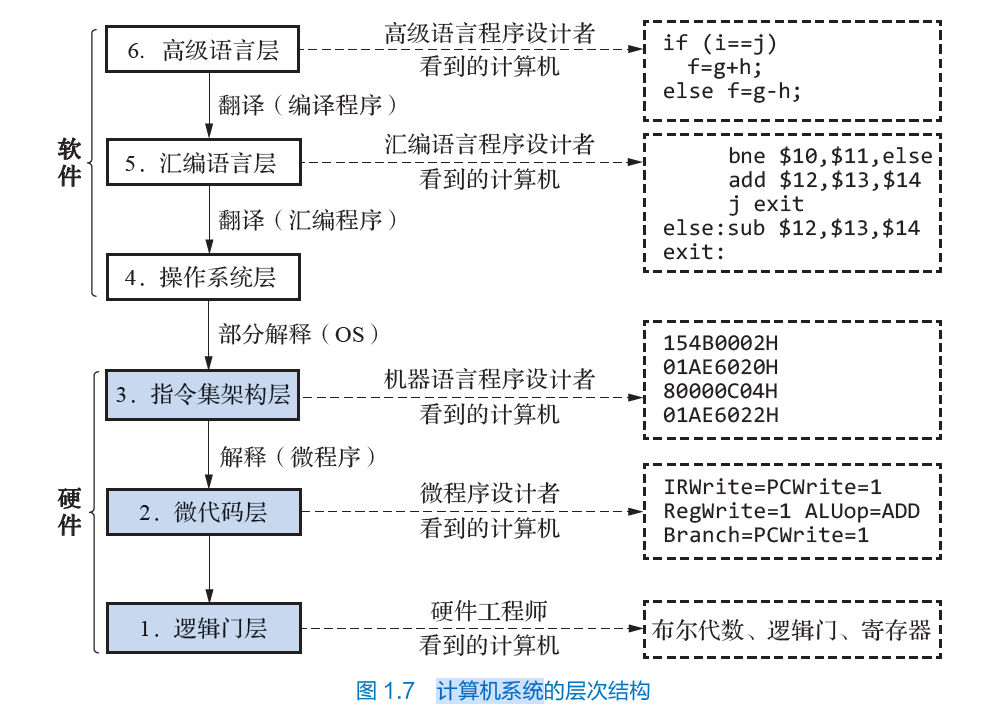
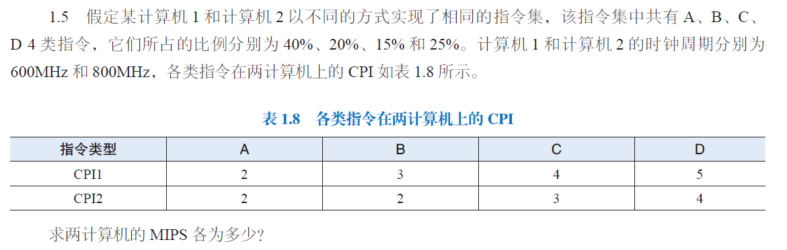
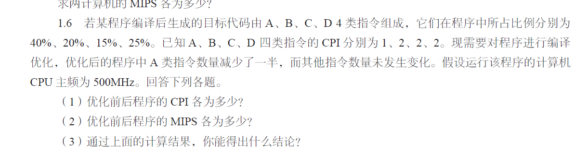

# 宋浩元 37220232203808 1

## 1.2
| 1 | 2 | 3 | 4 | 5 |
| :-----: | :-----: | :------: | :-----: | :-----: |
| D | C |  C  | A | D | 
| 6 | 7 | 8 | 9 | 10 |
| D | C |  D  | D | C |

## 1.4

计算机系统从用户使用角度，可分为6个功能层次：
1. 逻辑门层：最底层硬件，由逻辑电路组成，是硬件内核。
2. 微代码层：实际机器层，用微指令编写微程序，由硬件直接执行，仅存在于采用微程序设计的系统。
3. 指令集架构层：通过机器语言控制硬件，是软硬件界面纽带，编程烦琐。
4. 操作系统层：统一管理调度软硬件资源，提升效率，方便用户使用。
5. 汇编语言层：基于助记符编程，与机器结构相关，需了解机器细节，编程难度大。
6. 高级语言层：面向用户，与机器无关，降低编程难度，利于计算机应用推广。 

## 1.5

### 解

1. **计算计算机1的平均CPI和MIPS**：
     - $CPI_{1}=40\%\times2 + 20\%\times3+15\%\times4 + 25\%\times5=3.25$。
     - $MIPS_{1}=\frac{600\times10^{6}}{3.25\times10^{6}}\approx184.6$ 。
1. **计算计算机2的平均CPI和MIPS**：
     - $CPI_{2}=40\%\times2 + 20\%\times2+15\%\times3 + 25\%\times4=2.65$。
     - $MIPS_{2}=\frac{800\times10^{6}}{2.65\times10^{6}}\approx301.9$ 。

### 答
计算机1的$MIPS$约为$184.6$；计算机2的$MIPS$约为$301.9$。 

## 1.6

### （1）计算优化前后程序的CPI
- **优化前**：
    - $CPI_{前}=40\%\times1 + 20\%\times2+15\%\times2 + 25\%\times2=1.6$。
 - **优化后**：
    - $A$类指令比例变为$40\%\div2 = 20\%$。
    - $CPI_{后}=20\%\times1 + 20\%\times2+15\%\times2 + 25\%\times2=1.4$。

### （2）计算优化前后程序的MIPS
 - **优化前**：
    - $MIPS_{前}=\frac{500\times10^{6}}{1.6\times10^{6}} = 312.5$。
 - **优化后**：
    - $MIPS_{后}=\frac{500\times10^{6}}{1.4\times10^{6}}\approx357.14$。

### （3）结论
  - 减少程序中占比较大且$CPI$较低的指令数量，可以降低程序的平均$CPI$。
  - 对程序中占比较大的指令进行优化，能有效提高程序执行效率和计算机性能。 