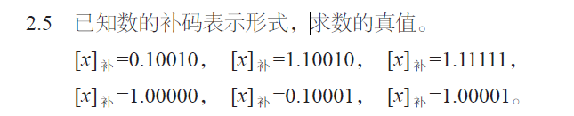
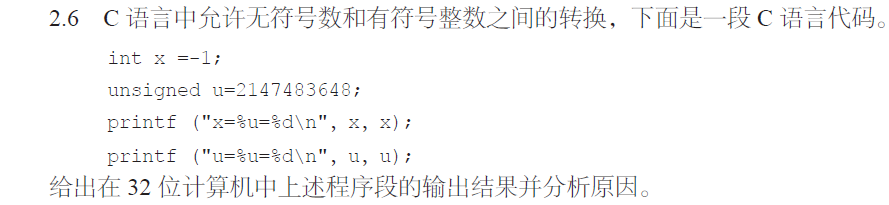
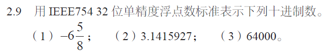
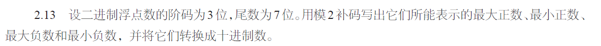
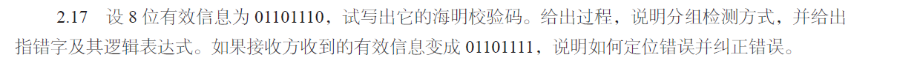
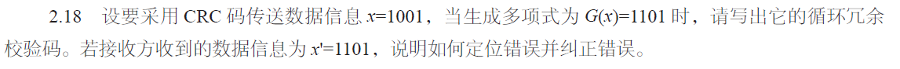

# 宋浩元 37220232203808 2

## 2-2
|   1   |   2   |   3   |   4   |   5   |
| :---: | :---: | :---: | :---: | :---: |
|   B   |   A   |   B   |   D   |   A   |
|   6   |   7   |   8   |   9   |  10   |
|   A   |   D   |   A   |   A   |   B   |
|   11  |
|   C   |

## 2-3

#### (2) 相对于奇偶校验，交叉奇偶校验的检错与纠错能力的提高需要付出哪些方面的代价？
 1. **硬件复杂度**：奇偶校验只需简单的电路来统计数据中 “1” 的个数并设置校验位，而交叉奇偶校验通常需要更多复杂的逻辑电路，以实现对数据在行和列等多个维度上的校验处理，这增加了硬件设计和实现的难  度以及成本。
 2. **额外的存储空间**：奇偶校验仅需为一组数据设置 1 位奇偶校验位，而交叉奇偶校验需要在行和列方向上都设置校验位，会占用更多的存储空间，降低了存储效率 。
 3. **数据传输开销**：由于交叉奇偶校验需要传输更多的校验位，所以在数据传输过程中会占用更多的带宽资源，降低了数据传输的有效负载，增加了传输开销。
 4. **计算资源和时间**：在生成校验位和进行校验的过程中，交叉奇偶校验要对多个维度的数据进行计算，相比奇偶校验简单的统计 “1” 的个数，它需要更多的计算资源和时间，影响了数据处理的速度。

#### （8）如何识别浮点数的正负？浮点数能表示的数值范围和数值的精度取决于什么？
1. **正负**
   - 在常见的浮点数表示标准如IEEE 754中，浮点数由符号位、指数位和尾数位组成。其中符号位用于标识浮点数的正负，当符号位为0时，表示该浮点数为正数；当符号位为1时，表示该浮点数为负数 。
2. **数值范围取决于**
   - **指数位**：以IEEE 754单精度浮点数为例，8位指数位决定了数值的数量级。指数位的取值范围决定了可以表示的最小非零数和最大数的数量级。例如，单精度浮点数中指数的偏移值为127，指数位全为0和全为1有特殊用途，正常取值范围对应的指数可以表示从非常小的数（指数小）到非常大的数（指数大） 。
3. **精度取决于**
   - **尾数位**：尾数位的位数决定了浮点数的精度。例如，IEEE 754单精度浮点数有23位尾数位，它可以表示的有效数字的位数是有限的。尾数位越多，能够表示的数值就越精确，能够区分的相邻数值之间的间隔就越小 。 
#### （10）简述CRC 校验码的检错原理，CRC 能纠错吗？
1. CRC校验码的检错原理
CRC（循环冗余校验）校验码的检错基于模2运算。发送端在发送数据前，将待发送的数据视为一个二进制数 \(M(x)\)，选取一个生成多项式 \(G(x)\)（其最高次幂为 \(r\)）。用 \(M(x)\) 乘以 \(x^r\)（相当于在数据后面补 \(r\) 个0），然后除以 \(G(x)\)，得到的余数 \(R(x)\) 就是CRC校验码。将 \(M(x)\) 与 \(R(x)\) 拼接后发送出去。接收端收到数据后，将接收到的全部数据（包含校验码）除以同样的生成多项式 \(G(x)\)。如果余数为0，则认为数据在传输过程中没有出错；若余数不为0，说明数据在传输过程中出现了差错。

2. CRC能否纠错
可以，将接受到的数据和CRC校验码连接起来，和生成多项式相除得到余数，当余数不为零时，则说明从接受数据从右往左数的第余数位 发生了错误，可以将其取反。 

## 2-5


1. \([x]_补 = 0.10010 = \frac{1\times2^{-1}+0\times2^{-2}+0\times2^{-3}+1\times2^{-4}+0\times2^{-5}}{1}= +\frac{8 + 1}{16}=+ 0.5625\) 。
2. \([x]_补 = 1.10010 = -\frac{1\times2^{-2}+1\times2^{-3}+1\times2^{-4}+0\times2^{-5}}{1}=-\frac{2 + 1+0.5}{8}=- 0.4375\) 。
3. \([x]_补 = 1.11111 = -\frac{1\times2^{-5}}{1}=-0.03125\) 。 
4. \([x]_补 = 1.00000 = -1.0\) 。 
5. \([x]_补 = 0.10001 = \frac{1\times2^{-1}+0\times2^{-2}+0\times2^{-3}+0\times2^{-4}+1\times2^{-5}}{1}=+\frac{16 + 1}{32}= + 0.53125\) 。 
6. \([x]_补 = 1.00001 = -\frac{1\times2^{-5}}{1}=- 0.03125\) 。

## 2-6

``` c++
//输出结果
x=4294967295=-1
u=2147483648=-2147483648
```

1. **第一个输出**：
   - 在32位计算机中，`-1` 的补码是所有位全为1。
   - 按照无符号整数的计算方式，`11111111 11111111 11111111 11111111` 对应的十进制值为 \(2^{32}-1 = 4294967295\)。
   - 当使用 `%d` 格式说明符打印 `x` 时，结果就是 `-1`。

2. **第二个的输出**：
   - `unsigned` 类型是无符号整数，`u = 2147483648` 用二进制表示为 `10000000 00000000 00000000 00000000`。
   - 当使用 `%u` 格式说明符打印 `u` 时，正常输出其无符号整数值 `2147483648`。
   - 当使用 `%d` 格式说明符打印 `u` 时，得到真值为 `-2147483648` 。 

## 2-9

1.
- \(6.625_{(10)} = 110.101_{(2)}=1.10101\times2^{2}\)。
-  \(S = 1\)。
- \(E=2 + 127 = 129 = 10000001_{(2)}\)。
- 去掉小数点前的 \(1\)，\(M = 10101\)，后面补零至23位，即 \(M = 10101000000000000000000\)。
- 最终表示为\(1\ 10000001\ 10101000000000000000000\)。

## 2-13

-  1. 最大正数
   - **二进制补码形式**：
       - 阶码（3位）：因为要最大正数，阶码真值取最大，3位补码最大正数为 \(011\)（对应真值 \(3\)） 。
       - 尾数（7位）：最大正数，尾数补码为 \(0.1111111\)。
       - 整体形式：阶码 \(011\)，尾数 \(0.1111111\) 。
    - **十进制形式**：
       - \(N=(1 + 0.1111111)\times2^3=(1+\frac{127}{128})\times8 = 8+\frac{127}{16}=8 + 7.9375=15.9375\) 。

- 2. 最小正数
   - **二进制补码形式**：
      - 阶码（3位）：最小正数，阶码真值取最小正数，3位补码为 \(001\)（对应真值 \(1\)） 。
      - 尾数（7位）：最小正数，尾数补码为 \(0.0000001\) 。
      - 整体形式：阶码 \(001\)，尾数 \(0.0000001\) 。
   - **十进制形式**：
      - \(N=(1 + 0.0000001)\times2^1=(1+\frac{1}{128})\times2 = 2+\frac{1}{64}=2 + 0.015625 = 2.015625\) 。

- 3. 最大负数
   - **二进制补码形式**：
      - 阶码（3位）：取最大正数的阶码，为 \(011\)（对应真值 \(3\)） 。
      - 尾数（7位）：最大负数，绝对值最小，尾数补码为 \(1.0000001\) 。
      - 整体形式：阶码 \(011\)，尾数 \(1.0000001\) 。
   - **十进制形式**：
      - \(N=-(1 + 0.0000001)\times2^3=-(1+\frac{1}{128})\times8=- (8+\frac{1}{16})=-8.0625\) 。

- 4. 最小负数
   - **二进制补码形式**：
      - 阶码（3位）：取最大正数的阶码，为 \(011\)（对应真值 \(3\)） 。
      - 尾数（7位）：最小负数，绝对值最大，尾数补码为 \(1.1111111\) 。
      - 整体形式：阶码 \(011\)，尾数 \(1.1111111\) 。
   - **十进制形式**：
      - \(N=-(1 + 0.1111111)\times2^3=-(1+\frac{127}{128})\times8=- (8 + 7.9375)=-15.9375\) 。 

## 2-17


1. **确定校验位的位数 \(k\)**：
   - k等于4满足条件。
2. **确定海明码的排列**：
   - 海明码的编号从 \(1\) 开始，校验位 \(P_i\) 位于 \(2^{i - 1}\) 位，即 \(P_1\) 在第 \(1\) 位，\(P_2\) 在第 \(2\) 位，\(P_3\) 在第 \(4\) 位，\(P_4\) 在第 \(8\) 位，其余位为信息位。
   - 信息位 \(D_7D_6D_5D_4D_3D_2D_1D_0 = 01101110\)，排列如下：

| 海明码位号 | 1       | 2       | 3       | 4       | 5       | 6       | 7       | 8       | 9       | 10      | 11      | 12      |
| ---------- | ------- | ------- | ------- | ------- | ------- | ------- | ------- | ------- | ------- | ------- | ------- | ------- |
| 内容       | \(P_1\) | \(P_2\) | \(D_7\) | \(P_3\) | \(D_6\) | \(D_5\) | \(D_4\) | \(P_4\) | \(D_3\) | \(D_2\) | \(D_1\) | \(D_0\) |

1. **计算校验位的值**：
   - \(P_1\) 参与校验的位是海明码位号中二进制表示最低位为 \(1\) 的位，即 \(3,5,7,9,11\) 位，\(P_1=D_7\oplus D_6\oplus D_4\oplus D_3\oplus D_1=0\oplus1\oplus0\oplus1\oplus1 = 1\)。
   - \(P_2\) 参与校验的位是海明码位号中二进制表示次低位为 \(1\) 的位，即 \(3,6,7,10,11\) 位，\(P_2=D_7\oplus D_5\oplus D_4\oplus D_2\oplus D_1=0\oplus1\oplus0\oplus1\oplus1 = 1\)。
   - \(P_3\) 参与校验的位是海明码位号中二进制表示第三位为 \(1\) 的位，即 \(5,6,7,12\) 位，\(P_3=D_6\oplus D_5\oplus D_4\oplus D_0=1\oplus1\oplus0\oplus0 = 0\)。
   - \(P_4\) 参与校验的位是海明码位号中二进制表示第四位为 \(1\) 的位，即 \(9,10,11,12\) 位，\(P_4=D_3\oplus D_2\oplus D_1\oplus D_0=1\oplus1\oplus1\oplus0 = 1\)。
   - 海明校验码为 \(110011011110\)。
2. **分组检测方式**：
   - 分为四组，\(G_1\) 组包含 \(P_1\) 以及它校验的位；\(G_2\) 组包含 \(P_2\) 以及它校验的位；\(G_3\) 组包含 \(P_3\) 以及它校验的位；\(G_4\) 组包含 \(P_4\) 以及它校验的位。
   - 接收方分别对这四组进行异或运算，得到 \(S_1,S_2,S_3,S_4\)。
3. **指错字及其逻辑表达式**：
   - \(S_1 = P_1\oplus D_7\oplus D_6\oplus D_4\oplus D_3\oplus D_1\)；
   - \(S_2 = P_2\oplus D_7\oplus D_5\oplus D_4\oplus D_2\oplus D_1\)；
   - \(S_3 = P_3\oplus D_6\oplus D_5\oplus D_4\oplus D_0\)；
   - \(S_4 = P_4\oplus D_3\oplus D_2\oplus D_1\oplus D_0\)。
   - 指错字 \(E = S_4S_3S_2S_1\)，当 \(E = 0000\) 时无错，非零表示出错，\(E\) 的十进制值表示出错位的位号。
4. **定位错误并纠正错误**：
   - 接收方收到的有效信息变成 \(01101111\)，海明码变为 \(110011011111\)。
   - 计算 \(S_1 = 1\oplus0\oplus1\oplus0\oplus1\oplus1 = 0\)；
   - \(S_2 = 1\oplus0\oplus1\oplus0\oplus1\oplus1 = 0\)；
   - \(S_3 = 0\oplus1\oplus1\oplus0\oplus1 = 1\)；
   - \(S_4 = 1\oplus1\oplus1\oplus1\oplus1 = 1\)。
   - 指错字 \(E = S_4S_3S_2S_1=1100\)，十进制值为 \(12\)，说明第 \(12\) 位出错，将第 \(12\) 位取反，得到正确的海明码 \(110011011110\)，有效信息为 \(01101110\)。

## 2-18

#### 1. 计算CRC码
- 已知数据信息 \(x = 1001\)，生成多项式 \(G(x)=1101\)，\(G(x)\) 的最高次幂 \(r = 3\)。
- 将数据信息 \(x\) 左移 \(r\) 位，得到 \(x'=1001000\)。
- 用 \(x'\) 除以 \(G(x)\)，得到余数 \(R = 0011\)，即CRC码为 \(0011\)，发送的数据为 \(10010011\)。

#### 2. 定位错误并纠正错误
- 接收方收到数据信息 \(x'=1101\)，在后面补上之前计算的CRC码 \(0011\)，得到 \(11010011\)。
- 用 \(11010011\) 除以生成多项式 \(G(x)=1101\)，得到余数 \(101\)。
- 将余数 \(101\) 转换为十进制数 \(5\)，这表示错误位置在从右往左数第 \(5\) 位（从 \(1\) 开始计数）。
- 对第 \(5\) 位取反进行纠错，将 \(11010011\) 的第 \(5\) 位 \(0\) 变为 \(1\)，得到纠正后的数据 \(11110011\)，去掉后面的CRC码 \(0011\)，得到正确的数据 \(1111\)。