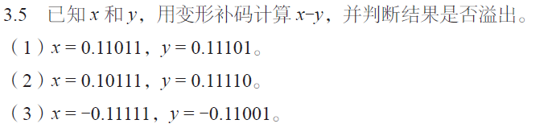
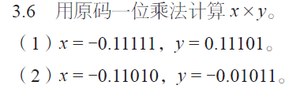
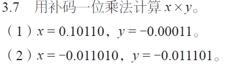
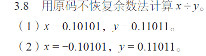
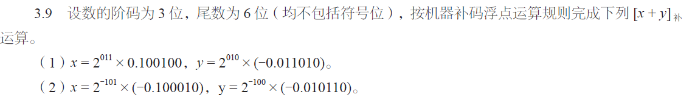
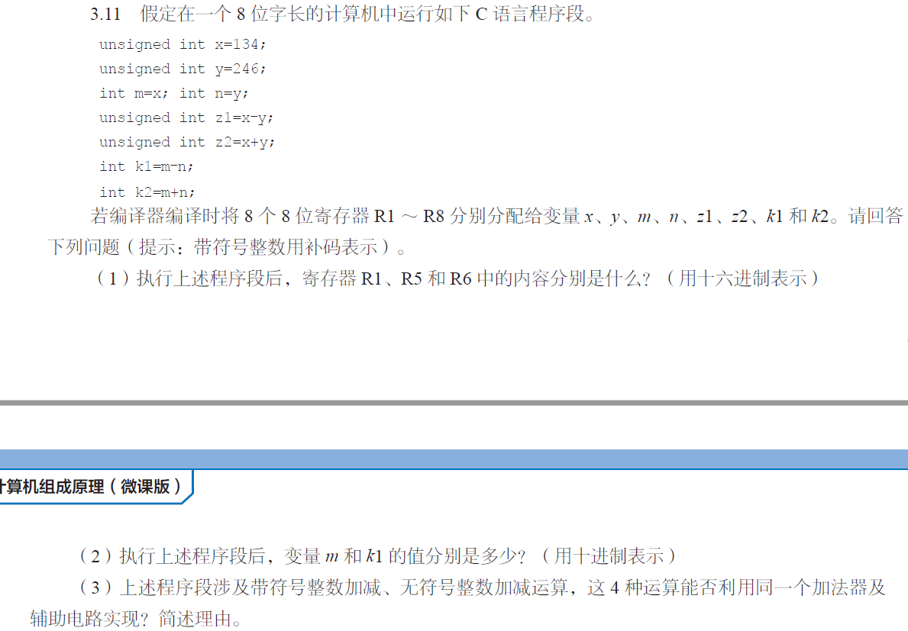

### 宋浩元+37220232203808+2

#### 2-2
|   1   |   2   |   3   |   4   |   5   |
| :---: | :---: | :---: | :---: | :---: |
|   D   |    B  |   A   |   C   |   B   |
|   6   |   7   |   8   |   9   |  10   |
|   D   |  D    |      |      |      |

#### 3-5-3

##### (3) 
- **变形补码准备**：  
  - \( x = -0.11111 \)，\( [x]_{补} = 11.00001 \)  
  - \( y = -0.11001 \)，\( [y]_{补} = 11.00111 \)，\( [-y]_{补} = 00.11001 \)。  
- **计算**：  
  \( [x - y]_{补} = 11.00001 + 00.11001 = 11.11010 \)。  
- **溢出判断**：双符号位均为\( 1 \)，未溢出，结果为\( -0.00110 \)。

#### 3-6-2

##### （2）\( x = -0.11010, y = -0.01011 \)  
- **符号位**：\( 1 \oplus 1 = 0 \)（结果为正）。  
- **数值计算**：\(|x| = 0.11010\)，\(|y| = 0.01011\)，部分积初始为 \(0.00000\)，按规则计算：  
  1. 乘数末位 \(1\)，加 \(|x|\)：\(0.00000 + 0.11010 = 0.11010\)，右移得 \(0.01101\ 1\)。  
  2. 乘数末位 \(1\)，加 \(|x|\)：\(0.01101 + 0.11010 = 1.00111\)，右移得 \(0.10011\ 11\)。  
  3. 乘数末位 \(0\)，加 \(0\)：\(0.10011 + 0 = 0.10011\)，右移得 \(0.01001\ 110\)。  
  4. 乘数末位 \(1\)，加 \(|x|\)：\(0.01001 + 0.11010 = 0.12011\)（修正后右移），得 \(0.010011\ 1101\)。  
  5. 最终右移整理，数值部分为 \(0.0011111110\)。  
- **结果**：\(+0.0011111110\)。

#### 3-7-2

### （2）\( x = -0.011010,\ y = -0.011101 \)  
- **补码准备**：\([x]_{补} = 11.100110\)，\([y]_{补} = 11.100011\)，部分积初始为 \(00.000000\)，乘数末位附加 \(0\)。  
- **计算过程**：逐位按补码乘规则运算，完成加法、右移（过程略）。  
- **结果**：\([x \times y]_{补} = 00.001011110011\)，真值为 \(+0.001011110011\)。

#### 3-8-2

##### （2）  
- **符号位**：\( 1 \oplus 0 = 1 \)（负）。  
- **数值计算**：同（1）的数值部分，商数值为 \( 0.1011 \)。  
- **结果**：\( x \div y = -0.1011 \)，余数与（1）数值部分相同，符号随 \( x \)。

#### 3-9-2

##### （2）  
- **对阶**：\( x \)阶码 \( 1011 \)（\(-101\)），\( y \)阶码 \( 1100 \)（\(-100\)），\( x \)阶码升为 \( 1100 \)，尾数右移1位：\( x_{尾补} = 11.101111 \)。  
- **尾数相加**：\( 11.101111 + 11.101010 = 11.011001 \)（已规格化，补码规格化形式）。  
- **结果**：\([x+y]_{补}\) 阶码 \( 1100 \)，尾数 \( 11.011001 \)，即 \( 2^{-100} \times (-0.100111) \)。

#### 3-11

##### （1）  
- **R1（x=134）**：134 的 8 位二进制为 `10000110`，十六进制 `86H`。  
- **R5（z1=x-y）**：无符号运算，\( 134 - 246 = 134 + (256 - 246) = 144 \)，8 位结果为 `10010000`，十六进制 `90H`。  
- **R6（z2=x+y）**：\( 134 + 246 = 380 \)，8 位无符号溢出后取余 \( 380 - 256 = 124 \)，二进制 `01111100`，十六进制 `7CH`。  

##### （2）  
- **变量 \( m \)**：\( x = 134 \)，8 位带符号整数中，\( 134 - 256 = -122 \)，故 \( m = -122 \)。  
- **变量 \( k1 \)**：\( n = y = 246 \)，8 位带符号为 \( -10 \)，\( k1 = m - n = -122 - (-10) = -112 \)。  

##### （3）  
**能共用**。理由：补码运算中，带符号整数与无符号整数的加减运算均通过加法器实现，符号位同样参与运算，仅溢出判断方式不同，核心加法器及辅助电路可共用。
