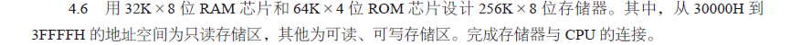
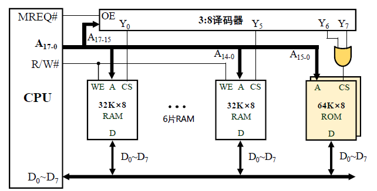
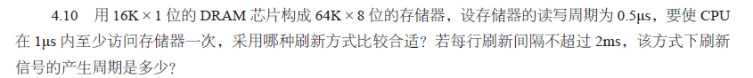
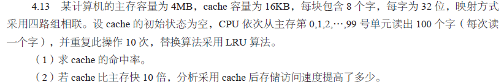
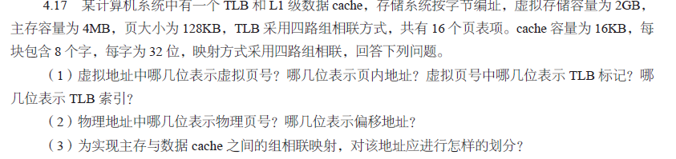
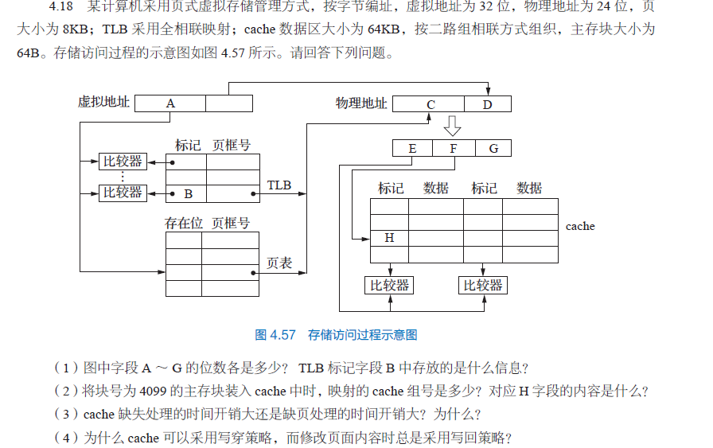
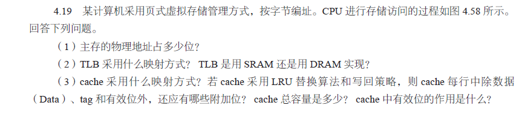
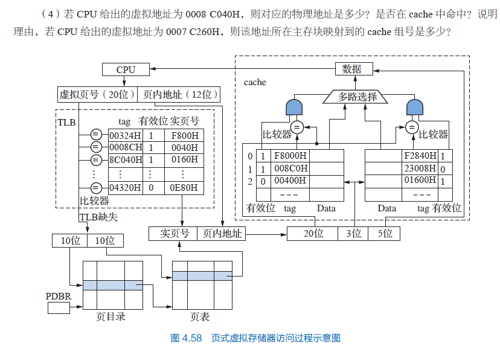

# 宋浩元+37220232203808+4

## 4.2

|  1  |  2  |  3  |  4  |  5  |
| :-: | :-: | :-: | :-: | :-: |
|  A  |  A  |  D  |  D  |  C  |
|  6  |  7  |  8  |  9  | 10  |
|  B  |  D  |  B  |  B  |  A  |
| 11  | 12  | 13  | 14  | 15  |
|  A  |  C  |  C  |  C  |  D  |
| 16  | 17  | 18  | 19  | 20  |
|  C  |  D  |  A  |  D  |     |

## 4.3

### （2）为什么在存储器芯片中设置片选输入端？

1. 多芯片地址空间分配：当系统需要扩展存储容量时，通常会使用多个存储器芯片（如 RAM 或 ROM）。片选信号用于将不同芯片映射到处理器地址空间的不同区域。例如，CPU 访问特定地址范围时，通过片选信号选中对应的芯片，确保每次仅激活目标芯片进行读写操作。
2. 避免操作冲突：若多个芯片同时被激活，可能导致数据总线或控制总线的信号冲突（如多个芯片同时输出数据到总线）。片选信号确保同一时刻只有一个芯片响应 CPU 的访问请求，保证操作的唯一性和正确性。
3. 低功耗控制：未被片选的芯片可进入低功耗或空闲状态，降低系统能耗。

### （6）直接相联映射方式下为什么不需要使用替换算法？

1. 直接相联映射是一种固定的映射方式，其特点是：主存中的每个块只能映射到 Cache 中的唯一固定位置（即主存块号对 Cache 块数取模确定位置）。当 Cache 中该位置已被占用时，新调入的主存块必须替换掉该位置的旧块，没有其他可选位置。
2. 由于替换位置是固定且唯一的（无需在多个候选块中选择），因此不存在 “选择替换哪个块” 的决策问题，自然无需使用替换算法（如 LRU、FIFO 等）。这与全相联或组相联映射不同 —— 后两者中一个主存块可映射到 Cache 的多个位置（或组内的多个块），需要算法决定替换哪个块以优化命中率。

### （7）为什么要考虑 cache 的一致性？

1. 共享数据的不一致风险：当多个处理器 / 核心（或 CPU 与 I/O 设备）共享主存时，每个处理器可能在各自的 Cache 中缓存同一块主存数据。若某个处理器修改了其 Cache 中的数据，而其他处理器的 Cache 或主存未及时更新，会导致数据不一致。
2. 读写操作的正确性要求：例如，处理器 A 写入 Cache 中的数据后，处理器 B 若直接从旧的主存或未更新的 Cache 中读取，会得到过时数据；若多个处理器同时写入同一块数据，可能导致 “脏数据” 问题。
3. 系统可靠性需求：不一致的数据会导致程序运行错误、计算结果错误，甚至系统崩溃。因此，必须通过协议（如 MESI 协议）或机制（如写直达、写回策略）确保所有 Cache 与主存的数据一致性，保证多处理器环境下数据的正确性和可靠性。

## 4.6

答案：

1. 计算芯片数量：RAM：\(256K / 32K = 8\)个，\(32K × 8\)位 RAM 芯片。ROM：因是 4 位宽度，需 2 个 ROM 芯片并行得 8 位宽度，故需\(256K / 64K = 4\)对\(64K × 4\)位 ROM 芯片。
2. 地址分配：只读存储区范围\(30000H - 3FFFFH\)（即\(192K - 256K\)），由 1 对\(64K × 4\)位 ROM 芯片管理。剩余\(192K\)空间由 8 个\(32K × 8\)位 RAM 芯片管理。
3. 连接：地址线最高两位选 RAM 或 ROM 区（如用 2 到 4 解码器）。RAM 部分：每个芯片用 15 根地址线（\(2^{15} = 32K\)），另 3 位选 8 个 RAM 芯片之一。ROM 部分：每对 ROM 芯片用 16 根地址线（\(2^{16} = 64K\)）。数据线：RAM 直连 8 位总线；ROM 的 2 个 4 位芯片输出连同一 8 位总线。
4. 芯片选择：地址\(30000H - 3FFFFH\)时仅 ROM 选中响应读；其他地址仅 RAM 响应读写。

## 4.10

（1）

- 集中刷新：刷新时 \(CPU\) 需等待，无法满足 \(1\mu s\) 内至少访问一次的要求。
- 分散刷新：会延长读写周期，降低系统性能。
- 异步刷新：利用 \(CPU\) 空闲周期刷新，不影响 \(CPU\) 访问，满足条件,因此我们选择异步刷新的方式。  

（2）
假设 \(16K \times 1\) 位的DRAM芯片采用 \(128 \times 128\) 矩阵结构（共128行）。  
每行刷新间隔不超过2ms（\(2000\mu s\)），则刷新信号产生周期为：  
\[
\frac{2000\mu s}{128} = 15.625\mu s
\]  
即每隔 \(15.625\mu s\) 刷新一行，确保2ms内完成所有行刷新，同时不影响CPU访问。  

综上，采用异步刷新方式，刷新信号产生周期为 \(15.625\mu s\)。  

## 4.13

解：(1) 
    \(0,1,2,\dots,99\)号单元共 100 字，每块 8 字，分 13 块。Cache 存主存块数：\(16KB / 8 = 2K\)块，四路组相联，每组\(2K / 4 = 512\)块。Cache 初始空，13 块调入后不调出，10 次循环访问内存\(100 × 10 = 1000\)次，不命中 13 次。Cache 命中率：\((1000 - 13) / 1000 = 98.7\%\)。  
    (2) 
    设访 Cache 时间\(T\)，访主存时间\(10T\)。用 Cache 后访存时间\(T2 = 13 × 10T + (1000 - 13) × T = 1117T\)，不用 Cache 耗时\(T1 = 10000T\)。速度提高：\(10000T / 1117T ≈ 8.95\)倍。

## 4.17

(1) 

- 页大小\(128KB\)，页内偏移\(17\)位（\(128KB × 1024B/KB × 8bit/B = 2^{17}bit\)）。
- 虚拟存储\(2GB\)，虚拟地址\(31\)位，虚拟页号\(31 - 17 = 14\)位。
- TLB 四路组相联，16 页表项（4 组），TLB 索引\(2\)位，TLB 标记\(14 - 2 = 12\)位。

(2) 

- 主存\(4MB\)，页大小\(128KB\)，共\(4MB / 128KB/page = 32\)页，物理页号\(5\)位。
- 页内偏移\(17\)位，物理地址共\(5 + 17 = 22\)位。

(3) 

- Cache 容量\(16KB\)，每块 8 字（每字 32 位），块大小\(8 × 4 = 32\)字节/块。
- 组数\(16KB / (4 路 × 32 字节/块) = 128\)组，组索引\(7\)位，Cache 块内偏移\(5\)位（\(32\)字节块大小）。
- 物理页号：低 5 位为块内偏移，接下来 7 位为组索引，剩余高位为标记。

## 4.18

1. 页大小为 \(8KB\)，页内偏移地址为 \(13\) 位，故 \(A = B = 32 - 13 = 19\)；\(D = 13\)；\(C = 24 - 13 = 11\)；主存块大小为 \(64B\)，故 \(G = 6\)。2 路组相联，每组数据区容量有 \(64B×2 = 128B\)，共有 \(64KB / 128B = 512\) 组，故 \(F = 9\)；\(E = 24 - G - F = 24 - 6 - 9 = 9\)。因而 \(A = 19\)，\(B = 19\)，\(C = 11\)，\(D = 13\)，\(E = 9\)，\(F = 9\)，\(G = 6\)。\(TLB\) 中标记字段 \(B\) 的内容是虚页号，表示该 \(TLB\) 项对应哪个虚页的页表项。
2. 块号 \(4099 = 00000100000000011B\)，因此所映射的 \(Cache\) 组号是 \(000000011B = 3\)，对应的 \(H\) 字段内容为 \(000001000B\)。
3. \(Cache\) 缺失带来的开销小，而处理缺页的开销大。因为缺页处理需要访问磁盘，而 \(Cache\) 缺失只访问主存。
4. 因为采用直写策略时需要同时写快速存储器和慢速存储器，而写磁盘比写主存慢得多，所以，在 \(Cache\)——主存层次，\(Cache\) 可以采用直写策略，而在主存——外存（磁盘）层次，修改页面内容时总是采用写回策略。

## 4.19

（1） 
主存物理地址占 \(28\) 位。由图可知，物理地址用于索引 \(cache\) 时，分为 \(20\) 位 \(tag\)、\(3\) 位组索引、\(5\) 位块内偏移，共 \(20 + 3 + 5 = 28\) 位。  

（2）
TLB采用全相联映射。 TLB应采用SRAM，读写速度快。

（3） 
- 映射方式：二路组相联映射。图中 \(cache\) 每组包含 \(2\) 个块，通过组索引和 \(tag\) 定位数据。  
- 附加位：除数据（\(Data\)）、\(tag\) 和有效位外，还应有 脏位（写回策略需记录数据是否修改） 和 LRU 位（LRU 替换算法需记录使用情况）。  
- 总容量：  
  - 数据区：每块 \(2^5 = 32\) 字节，每组 \(2\) 块，共 \(2^3 = 8\) 组，数据区容量 \(8×2×32 = 512\) 字节。  
  - 控制位：每行 \(tag\) \(20\) 位 + 有效位 \(1\) 位 + 脏位 \(1\) 位 + \(LRU\) 位 \(1\) 位 \(= 23\) 位，\(16\) 行控制位总容量 \(16×23 / 8 = 46\) 字节。  
  - 总容量 \(512 + 46 = 558\) 字节。  
- 有效位作用：标识 \(cache\) 行中的信息是否有效，若无效则该行数据不可用，需从主存获取。  

（4）虚拟地址相关计算  
- 虚拟地址 \(0008C040H\) 的物理地址与 \(cache\) 命中判断：  
  - 若 \(TLB\) 中虚页号 \(0008CH\) 对应实页号 \(0040H\)（假设题目虚拟地址表述误差），物理地址为 \(0040H << 12 | 0040H = 0040040H\)。  
  - \(cache\) 中 \(tag\) 为 \(00400H\)（有效位 \(0\)），组索引 \(0040040H >> 5\) 低 \(3\) 位为 \(2\)，组 \(2\) 中 \(00400H\) 有效位 \(0\)，故 不命中。  
- 虚拟地址 \(0007C260H\) 的 \(cache\) 组号：  
  - 主存块号 \(= \) 物理地址 \(>> 5\)，取低 \(3\) 位为组号。计算得组号为 \(3\)，即该地址所在主存块映射到 \(cache\) 组号 \(3\)。  