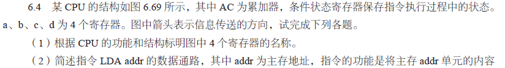
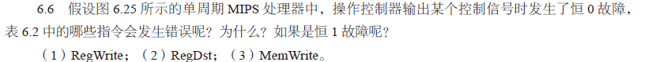
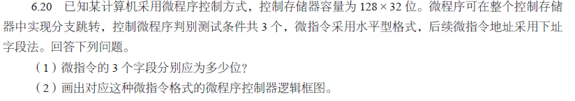
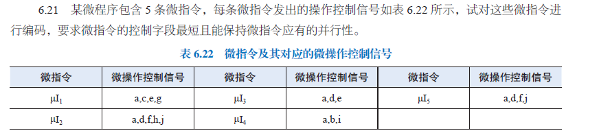
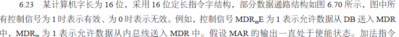
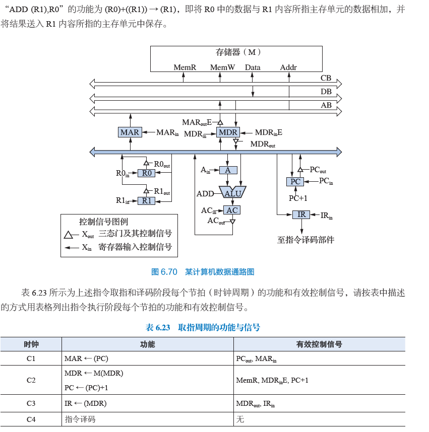
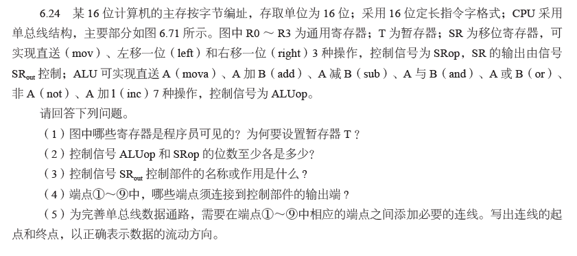
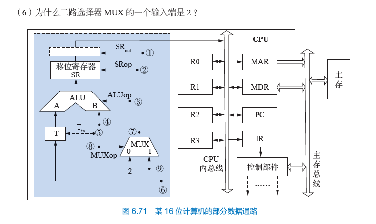

# 宋浩元 37220232203808 6

## 6.2

|  1  |  2  |  3  |  4  |  5  |
| :-: | :-: | :-: | :-: | :-: |
|  B  |  B  |  B  |  D  |  A  |
|  6  |  7  |  8  |  9  | 10  |
|  B  |  D  |  C  |  C  |  C  |

## 6.4

答：
（1）a: DR b: IR c: AR d: PC。
（2）取指数据通路：PC → AR → 主存 → DR → IR；PC → PC + 1。
执行：IR(A) → AR → 主存 → DR → AC。

## 6.6 （1）（3）

答：
（1）恒 0 故障：RegWrite 用于控制寄存器写操作。当它恒为 0 时，所有需要将结果写入寄存器的指令无法执行写回操作。具体包括：lw、addi、add、slt。恒 1 故障：RegWrite 恒为 1 时，所有不需要写回寄存器的指令会错误地执行写操作。具体包括：beq、j。
（3）恒 0 故障：MemWrite 恒为 0 时，唯一需要写内存的指令 sw 无法执行写操作，导致数据未存入内存。恒 1 故障：MemWrite 恒为 1 时，所有不需要写内存的指令，如 lw、add、beq/j 等会错误地执行内存写操作。

## 6.10

答：
（1）时钟周期与频率计算
单总线处理器：
最小时钟周期 \(T_{\text{min\_clk}} = T_{\text{clk\_to\_q}} + \max(T_{\text{alu}}, T_{\text{mem}}) + T_{\text{setup}} = 20 + 150 + 10 = 180 \, \text{ps}\)，最大频率 \(f_{\text{max\_freq}} = 1/(180 \times 10^{-12}) = 5.56 \, \text{GHz}\)。
单周期处理器：
最小时钟周期 \(T_{\text{min\_clk}} = T_{\text{clk\_to\_q}} + 2T_{\text{mem}} + T_{\text{RF\_read}} + T_{\text{alu}} + T_{\text{mux}} + T_{\text{setup}} = 20 + 2 \times 150 + 90 + 90 + 20 + 10 = 530 \, \text{ps}\)，最大频率 \(f_{\text{max\_freq}} = 1/(530 \times 10^{-12}) = 1.89 \, \text{GHz}\)。
多周期处理器：
最小时钟周期 \(T_{\text{min\_clk}} = T_{\text{clk\_to\_q}} + T_{\text{mux}} + \max(T_{\text{alu}}+T_{\text{mux}}, T_{\text{mem}}) + T_{\text{setup}} = 20 + 20 + 150 + 10 = 200 \, \text{ps}\)，最大频率 \(f_{\text{max\_freq}} = 1/(200 \times 10^{-12}) = 5 \, \text{GHz}\)。

（2）CPI 与执行时间计算
单总线处理器：
lw、sw、beq 指令 CPI 为 9，R 型和 I 型指令 CPI 为 7，平均 \(\text{CPI} = 9 \times 0.1 + 9 \times 0.1 + 9 \times 0.1 + 7 \times 0.5 + 7 \times 0.2 = 7.6\)，执行时间 \(T_{\text{cpu}} = 1000 \times 10^8 \times 7.6 \times 180 \times 10^{-12} = 136.8 \, \text{s}\)。
单周期处理器：
所有指令 CPI 为 1，执行时间 \(T_{\text{cpu}} = 1000 \times 10^8 \times 1 \times 530 \times 10^{-12} = 53 \, \text{s}\)。
多周期处理器：
lw（5）、sw（4）、beq（3）、R 型（4）、I 型（4）指令 CPI，平均 \(\text{CPI} = 5 \times 0.1 + 4 \times 0.1 + 3 \times 0.1 + 4 \times 0.5 + 4 \times 0.2 = 4\)，执行时间 \(T_{\text{cpu}} = 1000 \times 10^8 \times 4 \times 200 \times 10^{-12} = 80 \, \text{s}\)。
## 6.20

答：
(1)控制存储器容量为 \(128 \times 32\) 位，因此下址字段需 7 位。判别测试条件共 3 个，故判别测试字段为 3 位。因此操作控制字段位数为总位数减去下址和判别测试字段，即 \(32 - 7 - 3 = 22\) 位。
（2）
## 6.21

答：互斥组处理：信号组 (b,c,d) 和 (e,f,i) 互斥，各用 2 位译码。信号 a、g、h、j 无互斥，直接每位对应。编码结果为总控制字段：\(2 + 2 + 4 = 8\) 位。结构：前 2 位译码 (b/c/d)，中间 2 位译码 (e/f/i)，后 4 位直接控制 (a/g/h/j)，这样实现最短且保持并行性。
## 6.23

答：
C5：将 R1 内容送入 MAR，控制信号 \(\text{R1}_{\text{out}}, \text{MAR}_{\text{in}}\)，实现 \(\text{MAR} \leftarrow (\text{R1})\)，准备内存寻址。
C6：并行执行内存读（\(\text{MDR} \leftarrow \text{M}(\text{MAR})\)，信号 \(\text{MemR}, \text{MDR}_{\text{inE}}\)）和 R0 加载到 A（\(\text{A} \leftarrow (\text{R0})\)，信号 \(\text{R0}_{\text{out}}, \text{A}_{\text{in}}\)），获取操作数。
C7：ALU 加法（\(\text{AC} \leftarrow (\text{MDR}) + (\text{A})\)，信号 \(\text{MDR}_{\text{out}}, \text{Add}, \text{AC}_{\text{in}}\)），计算结果存入 AC。
C8：AC 内容送入 MDR（\(\text{MDR} \leftarrow (\text{AC})\)，信号 \(\text{AC}_{\text{out}}, \text{MDR}_{\text{in}}\)），暂存结果。
C9：MDR 数据写回内存（\(\text{M}(\text{MAR}) \leftarrow (\text{MDR})\)，信号 \(\text{MDR}_{\text{outE}}, \text{MemW}\)），完成存储。
## 6.24

答：
（1）可见寄存器：R0~R3、PC。T 的作用：单总线结构下，T 暂存操作数，避免 ALU 的 A、B 端口数据冲突，确保双操作数指令正常执行。
（2）控制信号位数ALUop：3 位，因为\(2^3 \geq 7\)。SRop：2 位因为\(2^2 \geq 3\)。
（3）SRout功能控制 SR 与总线间的三态门，决定 SR 输出是否接入总线（1 有效时导通，0 时断开）。
（4）控制信号端口控制端口：①、②、③、⑤、⑧（均为控制信号，需连接控制部件输出，控制数据通路操作）。
（5）⑥→⑨，使总线数据进入 MUX。④→⑦：将 MUX 数据送入 ALU 的 B 端口。
（6）MUX 输入 “2” 的原因指令字长 2 字节，顺序寻址需\(\text{PC}+2\)，MUX 输入 2，配合 ALU 实现 PC 自增 2，满足指令寻址。