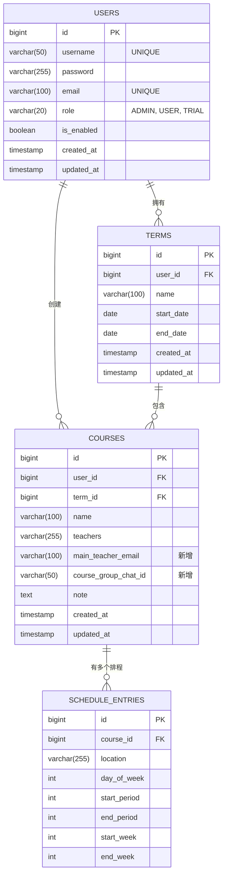

## **个人课表系统 - 项目文档 (v2.0)**

### **一、 项目概述**

- **项目名称**: 个人课表管理系统 (Personal Timetable System)
- **核心目标**: 为用户提供一个私人的、灵活的、支持多学期的课表管理工具，支持手动录入和通过文件批量导入。
- **前端技术栈**: Vue.js (推荐 Vue 3 + Vite)
- **后端技术栈**: Spring Boot (IOC/DI), Spring Web, Spring Security, JPA/MyBatis
- **数据库**: MySQL 8.0+
- **认证方案**: JWT (JSON Web Token)

### **二、 数据库设计 (MySQL)**

数据库设计在原有基础上进行了增强，引入了**修改时间戳**用于数据审计，并在用户表中增加了角色和状态

## **个人课表系统 - 项目文档 (v2.0)**

### **一、 项目概述**

- **项目名称**: 个人课表管理系统 (Personal Timetable System)
- **核心目标**: 为用户提供一个私人的、灵活的、支持多学期的课表管理工具，支持手动录入和通过文件批量导入。
- **前端技术栈**: Vue.js (推荐 Vue 3 + Vite)
- **后端技术栈**: Spring Boot (IOC/DI), Spring Web, Spring Security, JPA/MyBatis
- **数据库**: MySQL 8.0+
- **认证方案**: JWT (JSON Web Token)

### **二、 数据库设计 (MySQL)**

数据库设计在原有基础上进行了增强，引入了**修改时间戳**用于数据审计，并在用户表中增加了**角色**和**状态**字段以实现权限管理。

**实体关系 (ER) 图:**



**数据表结构 (SQL DDL):**

```sql
-- ----------------------------
-- 用户表 (users)
-- ----------------------------
CREATE TABLE `users` (
  `id` BIGINT AUTO_INCREMENT PRIMARY KEY,
  `username` VARCHAR(50) NOT NULL UNIQUE COMMENT '用户名',
  `password` VARCHAR(255) NOT NULL COMMENT '加密后的密码',
  `email` VARCHAR(100) UNIQUE COMMENT '电子邮箱，用于找回密码等',
  `role` VARCHAR(20) NOT NULL DEFAULT 'USER' COMMENT '用户角色: ADMIN (管理员), USER (普通用户), TRIAL (试用用户)',
  `is_enabled` BOOLEAN NOT NULL DEFAULT TRUE COMMENT '账户是否启用: TRUE (1) 为启用, FALSE (0) 为禁用',
  `created_at` TIMESTAMP NOT NULL DEFAULT CURRENT_TIMESTAMP COMMENT '创建时间',
  `updated_at` TIMESTAMP NOT NULL DEFAULT CURRENT_TIMESTAMP ON UPDATE CURRENT_TIMESTAMP COMMENT '最后更新时间'
) COMMENT='用户表';

-- ----------------------------
-- 学期表 (terms)
-- ----------------------------
CREATE TABLE `terms` (
  `id` BIGINT AUTO_INCREMENT PRIMARY KEY,
  `user_id` BIGINT NOT NULL COMMENT '所属用户ID',
  `name` VARCHAR(100) NOT NULL COMMENT '学期名称，如：2024-2025 第一学期',
  `start_date` DATE COMMENT '学期开始日期',
  `end_date` DATE COMMENT '学期结束日期',
  `created_at` TIMESTAMP NOT NULL DEFAULT CURRENT_TIMESTAMP COMMENT '创建时间',
  `updated_at` TIMESTAMP NOT NULL DEFAULT CURRENT_TIMESTAMP ON UPDATE CURRENT_TIMESTAMP COMMENT '最后更新时间',
  FOREIGN KEY (`user_id`) REFERENCES `users`(`id`) ON DELETE CASCADE
) COMMENT='学期表';

-- ----------------------------
-- 课程表 (courses) 
-- ----------------------------
CREATE TABLE `courses` (
    `id` bigint NOT NULL AUTO_INCREMENT,
    `user_id` bigint NOT NULL COMMENT '所属用户ID',
    `term_id` bigint NOT NULL COMMENT '所属学期ID',
    `name` varchar(100) NOT NULL COMMENT '课程名称',
    `teachers` varchar(255) DEFAULT NULL COMMENT '任课教师（多个用逗号分隔）',
    `main_teacher_email` varchar(100) DEFAULT NULL COMMENT '主讲教师邮箱',
    `course_group_chat_id` varchar(50) DEFAULT NULL COMMENT '课程群号 (如QQ群、微信群号)',
    `note` text COMMENT '课程备注',
    `created_at` timestamp NOT NULL DEFAULT CURRENT_TIMESTAMP COMMENT '创建时间',
    `updated_at` timestamp NOT NULL DEFAULT CURRENT_TIMESTAMP ON UPDATE CURRENT_TIMESTAMP COMMENT '最后更新时间',
    `tag` int DEFAULT NULL COMMENT '课程标签：如必修、选修',
    PRIMARY KEY (`id`),
    KEY `user_id` (`user_id`),
    KEY `term_id` (`term_id`),
    CONSTRAINT `courses_ibfk_1` FOREIGN KEY (`user_id`) REFERENCES `users` (`id`) ON DELETE CASCADE,
    CONSTRAINT `courses_ibfk_2` FOREIGN KEY (`term_id`) REFERENCES `terms` (`id`) ON DELETE CASCADE
) ENGINE = InnoDB AUTO_INCREMENT = 57 DEFAULT CHARSET = utf8mb4 COLLATE = utf8mb4_0900_ai_ci COMMENT = '课程主信息表'

-- ----------------------------
-- 课程排程表 (schedule_entries)
-- ----------------------------
CREATE TABLE `schedule_entries` (
  `id` BIGINT AUTO_INCREMENT PRIMARY KEY,
  `course_id` BIGINT NOT NULL COMMENT '关联的课程ID',
  `location` VARCHAR(255) COMMENT '上课地点',
  `day_of_week` INT NOT NULL COMMENT '星期几 (1-7)',
  `start_period` INT NOT NULL COMMENT '开始节次',
  `end_period` INT NOT NULL COMMENT '结束节次',
  `start_week` INT NOT NULL COMMENT '开始周',
  `end_week` INT NOT NULL COMMENT '结束周',
  INDEX `idx_course_id` (`course_id`),
  FOREIGN KEY (`course_id`) REFERENCES `courses`(`id`) ON DELETE CASCADE
) COMMENT='课程具体上课安排表';

```

---

### **三、API 接口文档**

- **根路径**: `/api`

- **认证**: 除登录/注册接口外，所有接口都需要在请求头中携带 `Authorization: Bearer <token>`。

- **数据格式**: 请求和响应主体均为 `application/json`。

- **命名约定**: JSON 字段采用小驼峰命名

- **认证**: 除登录/注册接口外，所有接口都需要在请求头中携带 `Authorization: Bearer <token>`。

- **数据格式**: 请求和响应主体均为 `application/json`。

- **命名约定**: JSON 字段采用小驼峰命名法 (camelCase)。

- **通用响应结构**:

  ```json
  {
    "code": 200,
    "message": "具体消息",
    "data": { ... } // 或 [ ... ] 或 null
  }
  ```

---

#### 1. 用户认证接口 (Auth)

##### **1.1 用户注册**

- **URL**: `POST /api/auth/register`
- **说明**: 创建一个新用户，默认为 `USER` 角色。
- **请求体**:

  ```json
  {
    "username": "newuser",
    "password": "Password123!",
    "email": "newuser@example.com"
  }
  ```

- **成功响应 (201 Created)**:

  ```json
  {
    "code": 201,
    "message": "用户注册成功",
    "data": {
      "userId": 1,
      "username": "newuser"
    }
  }
  ```

##### **1.2 用户登录**

- **URL**: `POST /api/auth/login`
- **说明**: 用户登录，获取 JWT 及用户角色。前端可根据角色控制 UI 展示。
- **请求体**:

  ```json
  {
    "username": "testuser",
    "password": "Password123!"
  }
  ```

- **成功响应 (200 OK)**:

  ```json
  {
    "code": 200,
    "message": "登录成功",
    "data": {
      "token": "eyJhbGciOiJIUzI1NiIsInR5cCI6IkpXVCJ9...",
      "expiresIn": 7200,
      "role": "USER" // 返回用户角色 (ADMIN, USER, or TRIAL)
    }
  }
  ```

- **失败响应 (401 Unauthorized)**:

  ```json
  {
    "code": 401,
    "message": "用户名或密码错误，或账户已被禁用",
    "data": null
  }
  ```

---

#### **2. 学期管理接口 (Terms)**

##### **2.1 创建新学期**

- **URL**: `POST /api/terms`
- **请求体**:

  ```json
  {
    "name": "2025-2026 第二学期",
    "startDate": "2026-02-16",
    "endDate": "2026-07-05"
  }
  ```

- **成功响应 (201 Created)**: (返回创建的实体)

##### **2.2 获取所有学期 (分页)**

- **URL**: `GET /api/terms?page=0&size=10`
- **说明**: 获取当前用户的所有学期列表，支持分页。
- **查询参数**:

  - `page`: 页码 (从 0 开始)
  - `size`: 每页数量

- **成功响应 (200 OK)**:

  ```json
  {
    "code": 200,
    "message": "查询成功",
    "data": {
      "content": [
        {
          "id": 2,
          "name": "2025-2026 第一学期",
          "startDate": "2025-09-01",
          "endDate": "2026-01-18"
        },
        {
          "id": 1,
          "name": "2024-2025 第二学期",
          "startDate": "2025-02-17",
          "endDate": "2025-07-06"
        }
      ],
      "pageable": {
        "pageNumber": 0,
        "pageSize": 10
      },
      "totalPages": 1,
      "totalElements": 2,
      "last": true,
      "first": true
    }
  }
  ```

##### **2.3 更新学期信息**

- **URL**: `PUT /api/terms/{termId}`
- **请求体**:

  ```json
  {
    "name": "2025-2026 第一学期 (已更新)",
    "startDate": "2025-09-01",
    "endDate": "2026-01-20"
  }
  ```

- **成功响应 (200 OK)**: (返回更新后的实体)

##### 2.4 删除学期**2.4 删除学期**

- **URL**: `DELETE /api/terms/{termId}`
- **说明**: 删除学期将级联删除其下的所有课程。
- **成功响应 (200 OK)**:

  ```json
  {
    "code": 200 /* 或 204 */,
    "message": "删除成功",
    "data": null
  }
  ```

---

#### 3. 课程管理接口 (Courses)

##### **3.1 手动添加新课程**

- **URL**: `POST /api/courses`
- **请求体**:

  ```json
  {
    "termId": 1,
    "name": "高等数学",
    "teachers": "张三,李四",
    "mainTeacherEmail": "zhangsan@example.com",
    "courseGroupChatId": "123456789",
    "note": "期末考试占比70%",
    "scheduleEntries": [
      {
        "location": "教学楼A-101",
        "dayOfWeek": 1,
        "startPeriod": 1,
        "endPeriod": 2,
        "startWeek": 1,
        "endWeek": 16
      },
      {
        "location": "教学楼B-203",
        "dayOfWeek": 3,
        "startPeriod": 3,
        "endPeriod": 4,
        "startWeek": 1,
        "endWeek": 8
      }
    ]
  }
  ```

- **成功响应 (201 Created)**: (返回包含排程 ID 的完整课程实体)

##### 3.2 获取指定学期的所有课程 (分页)

- **URL**: \`GET /api/terms/{termId}/courses?page=0&`GET /api/terms/{termId}/courses?page=0&size=20`
- **说明**: 获取一个学期下的所有课程，用于标准的学期视图展示。
- **成功响应 (200 OK)**: (返回分页结构的数据，格式同 `GET /api/terms`)

##### **3.3 高级课程搜索 (筛选与分页)**

- **URL**: `GET /api/courses/search`
- **说明**: 提供一个强大的多条件课程搜索功能。所有参数均为可选。
- **查询参数**:

  - `termId`: 学期 ID
  - `name`: 课程名 (模糊匹配)
  - `teacher`: 教师名 (模糊匹配)
  - `dayOfWeek`: 星期几 (精确匹配)
  - `page`, `size`: 分页参数

- **请求示例**: `GET /api/courses/search?termId=1&teacher=张三&page=0&size=10`
- **成功响应 (200 OK)**: (返回分页结构的数据，格式同 `GET /api/terms`)

##### **3.4 更新课程信息**

- **URL**: `PUT /api/courses/{courseId}`
- **说明**: 完全替换课程信息及其所有排程。
- **请求体**: (结构同创建课程，但不包含 `termId`)
  ```json
  {
    "name": "高等数学 (更新)",
    "teachers": "张三,李四,王五",
    "mainTeacherEmail": "zhangsan.new@example.com",
    "courseGroupChatId": "987654321",
    "note": "期末考试占比80%, 开卷",
    "scheduleEntries": [
      {
        "id": 1,
        "location": "教学楼A-101",
        "dayOfWeek": 1,
        "startPeriod": 1,
        "endPeriod": 2,
        "startWeek": 1,
        "endWeek": 16
      }
    ]
  }
  ```
- **成功响应 (200 OK)**: (返回更新后的完整课程实体)

##### **3.5 删除课程**

- **URL**: `DELETE /api/courses/{courseId}`
- **成功响应 (200 OK)**:

  ```json
  {
    "code": 200 /* 或 204 */,
    "message": "课程删除成功",
    "data": null
  }
  ```

---

#### **4. 管理员接口 (Admin)**

- **访问控制**: 以下接口仅限 `ADMIN` 角色的用户访问。

##### **4.1 获取用户列表 (分页与筛选)**

- **URL**: \`GET /api/admin/users`GET /api/admin/users`
- **查询参数**:

  - `username`: 按用户名筛选 (模糊匹配)
  - `email`: 按邮箱筛选 (模糊匹配)
  - `role`: 按角色筛选
  - `isEnabled`: 按状态筛选 (`true` 或 `false`)
  - `page`, `size`: 分页参数

- **请求示例**: \`GET /api/admin/users?role=USER\&isEnabled`GET /api/admin/users?role=USER&isEnabled=true&page=0&size=20`
- **成功响应 (200 OK)**: (返回分页结构的用户列表，密码字段应被脱敏)

  ```json
  {
    "code": 200,
    "message": "查询成功",
    "data": {
      "content": [
        {
          "id": 2,
          "username": "user_one",
          "email": "user_one@example.com",
          "role": "USER",
          "isEnabled": true,
          "createdAt": "...",
          "updatedAt": "..."
        }
      ],
      "totalPages": 5,
      "totalElements": 48
      // ... 其他分页信息
    }
  }
  ```

##### **4.2 更新用户状态 (启用/禁用)**

- **URL**: `PUT /api/admin/users/{userId}/status`
- **请求体**:

  ```json
  {
    "isEnabled": false
  }
  ```

- **成功响应 (200 OK)**:

  ```json
  {
    "code": 200,
    "message": "用户状态更新成功",
    "data": null
  }
  ```

---

#### 5. 导入接口 (Import)

##### **5.1 通过 Excel 导入课程**

- **URL**: `POST /api/import/excel?termId=1`
- **请求头**: `Content-Type: multipart/form-data`
- **请求体**: `file` -> (Excel 文件)
- **Excel 格式约定**:

  - 表头(第一行)必须包含: `课程名称`, `教师`, \`上`上课地点`, `星期`, `开始节次`, `结束节次`, `开始周`, `结束周`。
  - 后端服务会根据 `课程名称` 和 `教师` 自动合并为同一门课程下的多个排程。

- **成功响应 (200 OK)**:

  ```json
  {
    "code": 200,
    "message": "导入成功",
    "data": {
      "totalRows": 10,
      "importedCourses": 5,
      "failedRows": 0,
      "errors": []
    }
  }
  ```

- **失败响应 (400 Bad Request)**:

  ```json
  {
    "code": 400,
    "message": "导入失败，文件格式错误或数据不合法",
    "data": {
      "totalRows": 10,
      "importedCourses": 0,
      "failedRows": 10,
      "errors": [
        "第 3 行: [星期] 格式错误，必须为1-7的数字",
        "第 5 行: [开始节次] 必须为数字"
      ]
    }
  }
  ```
